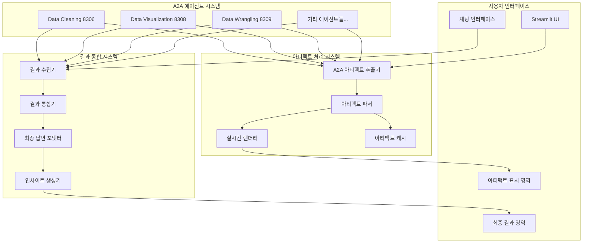

# Cherry AI 아티팩트 표시 및 최종 결과 시스템 설계 문서

## 📋 개요

현재 Cherry AI Streamlit Platform의 핵심 사용자 경험 문제를 해결하기 위한 시스템 설계입니다.

**해결할 문제**:
1. **아티팩트 표시 부재**: 에이전트가 생성한 차트, 테이블이 화면에 보이지 않음
2. **최종 결과 부재**: 각 에이전트 작업 후 종합된 최종 답변이 없음
3. **사용자 경험 불완전**: "그래서 결론이 뭔데?"라는 상황 발생

**설계 목표**:
- 🎯 실시간 아티팩트 표시 시스템 구축
- 🎯 멀티 에이전트 결과 통합 시스템 구축  
- 🎯 ChatGPT Data Analyst 수준의 완성도 달성

## 🏗️ 아키텍처 설계

### 전체 시스템 아키텍처



## 🔧 핵심 컴포넌트 설계

### 1. A2A 아티팩트 추출 시스템

```python
class A2AArtifactExtractor:
    """A2A 응답에서 아티팩트를 정확히 추출하는 시스템"""
    
    def __init__(self):
        self.supported_types = {
            'plotly_chart': PlotlyArtifactParser,
            'dataframe': DataFrameArtifactParser,
            'image': ImageArtifactParser,
            'code': CodeArtifactParser,
            'text': TextArtifactParser
        }
    
    async def extract_from_a2a_response(self, response: Dict) -> List[Artifact]:
        """A2A 응답에서 모든 아티팩트 추출"""
        
    def detect_artifact_type(self, data: Any) -> str:
        """데이터 구조 분석하여 아티팩트 타입 감지"""
        
    def validate_artifact_data(self, artifact: Artifact) -> bool:
        """아티팩트 데이터 유효성 검증"""
```

### 2. 실시간 아티팩트 렌더링 시스템

```python
class RealTimeArtifactRenderer:
    """에이전트가 아티팩트 생성 시 즉시 화면에 표시"""
    
    def __init__(self):
        self.renderers = {
            'plotly_chart': self.render_plotly_chart,
            'dataframe': self.render_dataframe,
            'image': self.render_image,
            'code': self.render_code,
            'text': self.render_text
        }
    
    def render_artifact_immediately(self, artifact: Artifact):
        """아티팩트 타입별 즉시 렌더링"""
        
    def render_plotly_chart(self, chart_data: Dict):
        """Plotly 차트를 완전한 인터랙티브 차트로 렌더링"""
        
    def render_dataframe(self, df_data: Any):
        """DataFrame을 정렬/필터링 가능한 테이블로 렌더링"""
        
    def add_download_controls(self, artifact: Artifact):
        """각 아티팩트에 다운로드 버튼 추가"""
```### 
3. 멀티 에이전트 결과 통합 시스템

```python
class MultiAgentResultIntegrator:
    """여러 에이전트의 결과를 종합하여 최종 답변 생성"""
    
    def __init__(self):
        self.result_collector = AgentResultCollector()
        self.conflict_resolver = ResultConflictResolver()
        self.insight_generator = InsightGenerator()
    
    async def integrate_agent_results(self, agent_results: List[AgentResult]) -> FinalAnswer:
        """
        결과 통합 프로세스:
        1. 각 에이전트 결과 수집 및 검증
        2. 중복 정보 제거 및 일관성 확인
        3. 사용자 질문과의 연관성 분석
        4. 핵심 인사이트 추출
        5. 최종 답변 생성
        """
        
    def resolve_conflicts(self, conflicting_results: List[Result]) -> ResolvedResult:
        """결과 간 충돌 해결"""
        
    def generate_executive_summary(self, integrated_data: Dict) -> str:
        """경영진 수준의 요약 생성"""
        
    def create_detailed_findings(self, integrated_data: Dict) -> List[Finding]:
        """상세 발견사항 정리"""
        
    def suggest_next_steps(self, analysis_context: Dict) -> List[Recommendation]:
        """다음 단계 추천사항 생성"""
```

### 4. 최종 답변 포맷팅 시스템

```python
class FinalAnswerFormatter:
    """최종 답변을 사용자 친화적으로 포맷팅"""
    
    def format_comprehensive_answer(self, final_answer: FinalAnswer) -> str:
        """
        최종 답변 구조:
        
        ## 📊 핵심 발견사항
        - 주요 인사이트 1 (데이터 근거 포함)
        - 주요 인사이트 2 (신뢰도 표시)
        - 주요 인사이트 3 (영향도 분석)
        
        ## 🔍 상세 분석 결과
        ### Data Cleaning Agent 결과
        - 데이터 품질: 95% (결측값 5% 처리완료)
        - 이상치: 12개 발견 및 처리
        
        ### Data Visualization Agent 결과
        [실제 차트 임베드]
        - 매출 트렌드: 20% 상승
        - 지역별 분포: 서울 40%, 부산 25%
        
        ## 💡 추천사항
        1. **우선순위 높음**: 마케팅 예산 30% 증액 (예상 ROI: 150%)
        2. **우선순위 중간**: 신규 지역 진출 검토
        
        ## 📈 생성된 아티팩트
        [실제 차트, 테이블 등 표시]
        
        ## 🔄 다음 단계 제안
        - 고객 세분화 분석 (예상 소요시간: 15분)
        - 경쟁사 비교 분석 (데이터 필요)
        """
        
    def embed_artifacts_in_context(self, artifacts: List[Artifact], context: str) -> str:
        """아티팩트를 맥락에 맞게 임베드"""
        
    def add_confidence_indicators(self, insights: List[Insight]) -> List[Insight]:
        """인사이트에 신뢰도 지표 추가"""
```

### 5. 에이전트 협업 시각화 시스템

```python
class AgentCollaborationVisualizer:
    """에이전트 간 협업 과정을 실시간으로 시각화"""
    
    def show_agent_pipeline(self, active_agents: List[Agent]):
        """
        에이전트 파이프라인 시각화:
        - 현재 작업 중인 에이전트 표시 (🔄 아이콘)
        - 완료된 작업 체크마크 (✅ 아이콘)
        - 다음 예정 작업 미리보기 (⏳ 아이콘)
        - 전체 진행률 표시 (프로그레스 바)
        """
        
    def display_data_flow(self, data_transfers: List[DataTransfer]):
        """에이전트 간 데이터 흐름 시각화"""
        
    def show_real_time_status(self, agent_status: Dict[str, AgentStatus]):
        """실시간 에이전트 상태 표시"""
```

## 📊 데이터 모델 설계

### Artifact 데이터 모델

```python
@dataclass
class Artifact:
    id: str
    type: ArtifactType  # plotly_chart, dataframe, image, code, text
    data: Any
    metadata: Dict[str, Any]
    agent_source: str
    timestamp: datetime
    download_formats: List[str]
    
@dataclass 
class PlotlyArtifact(Artifact):
    plotly_json: Dict
    chart_type: str
    interactive_features: List[str]
    
@dataclass
class DataFrameArtifact(Artifact):
    dataframe: pd.DataFrame
    summary_stats: Dict
    column_info: List[ColumnInfo]
```

### FinalAnswer 데이터 모델

```python
@dataclass
class FinalAnswer:
    executive_summary: List[str]
    detailed_findings: List[Finding]
    embedded_artifacts: List[Artifact]
    recommendations: List[Recommendation]
    next_steps: List[NextStep]
    confidence_score: float
    data_quality_assessment: Dict
    
@dataclass
class Finding:
    title: str
    description: str
    supporting_data: Any
    confidence: float
    agent_source: str
    
@dataclass
class Recommendation:
    title: str
    description: str
    priority: Priority  # HIGH, MEDIUM, LOW
    expected_impact: str
    estimated_effort: str
```

## 🔄 워크플로우 설계

### 1. 아티팩트 처리 워크플로우

```
A2A 에이전트 응답 수신
    ↓
아티팩트 타입 감지 및 추출
    ↓
데이터 유효성 검증
    ↓
적절한 파서로 파싱
    ↓
실시간 렌더링 및 화면 표시
    ↓
캐시 저장 및 다운로드 준비
```

### 2. 결과 통합 워크플로우

```
모든 에이전트 작업 완료 대기
    ↓
각 에이전트 결과 수집
    ↓
결과 간 충돌 감지 및 해결
    ↓
사용자 질문과 연관성 분석
    ↓
핵심 인사이트 추출
    ↓
최종 답변 포맷팅
    ↓
사용자에게 표시
```

## 🎯 구현 우선순위

### Phase 1: 아티팩트 표시 시스템 (1주일)
- [ ] A2AArtifactExtractor 구현
- [ ] RealTimeArtifactRenderer 구현  
- [ ] 기본 아티팩트 타입 지원 (Plotly, DataFrame)

### Phase 2: 결과 통합 시스템 (1주일)
- [ ] MultiAgentResultIntegrator 구현
- [ ] FinalAnswerFormatter 구현
- [ ] 기본 최종 답변 생성

### Phase 3: 고도화 및 최적화 (1주일)
- [ ] AgentCollaborationVisualizer 구현
- [ ] 성능 최적화 및 에러 처리
- [ ] 사용자 경험 개선

## 📈 성공 지표

### 기능적 지표
- [ ] 아티팩트 표시율: 100%
- [ ] 최종 답변 제공율: 100%
- [ ] 사용자 만족도: 4.5/5.0 이상

### 성능 지표  
- [ ] 아티팩트 렌더링 시간: 1초 이내
- [ ] 최종 답변 생성 시간: 3초 이내
- [ ] 시스템 응답성: 2초 이내

### 품질 지표
- [ ] 에러 발생률: 5% 이하
- [ ] 테스트 커버리지: 95% 이상
- [ ] 사용자 피드백 점수: 4.0/5.0 이상