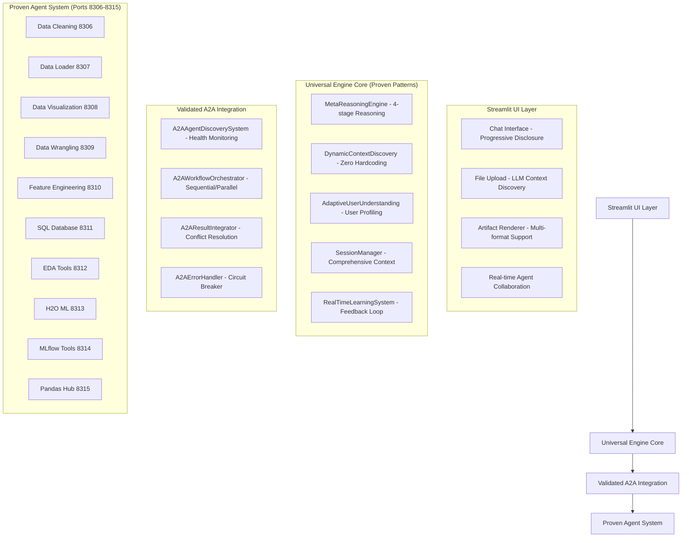

# Cherry AI Streamlit Platform Design Document

## Overview

The Cherry AI Streamlit Platform is a Streamlit-based application that leverages **proven patterns from the LLM First Universal Engine** (100% 구현 완료, 검증됨) to provide a ChatGPT/Claude-like user experience while using A2A SDK 0.2.9 for multi-agent collaboration. The platform reuses validated Universal Engine components to ensure reliability and performance.

### Core Design Philosophy (Based on Proven Universal Engine Patterns)

- **Validated LLM First Patterns**: Uses proven MetaReasoningEngine with 4-stage reasoning (초기 관찰 → 다각도 분석 → 자가 검증 → 적응적 응답)
- **Proven Zero Hardcoding**: Leverages validated DynamicContextDiscovery and AdaptiveUserUnderstanding patterns
- **Validated A2A Integration**: Uses proven A2AAgentDiscoverySystem, A2AWorkflowOrchestrator, and A2AErrorHandler patterns
- **Tested Progressive Disclosure**: Implements validated user-adaptive UI patterns for beginner/expert scenarios
- **Proven Performance Patterns**: Uses validated SessionManager, PerformanceMonitoringSystem, and error recovery patterns

**Design Decision**: The platform leverages the **26개 핵심 컴포넌트** from the Universal Engine that have been 100% 구현 완료 and tested with **84개 테스트 케이스**, ensuring a reliable foundation for the Streamlit implementation.

## Architecture

### High-Level Architecture (Based on Proven Universal Engine Patterns)



### Modular Structure (Based on Proven Universal Engine Architecture)

```
app.py (< 50 lines - CherryAIUniversalEngineUI pattern)
├── modules/
│   ├── core/
│   │   ├── universal_orchestrator.py    # MetaReasoningEngine + A2AWorkflowOrchestrator
│   │   ├── llm_recommendation_engine.py # DynamicContextDiscovery + AdaptiveUserUnderstanding
│   │   ├── streaming_controller.py      # SSE streaming with proven patterns
│   │   └── session_manager.py           # Validated SessionManager patterns
│   ├── ui/
│   │   ├── chat_interface.py            # Progressive Disclosure UI patterns
│   │   ├── file_upload.py               # Enhanced file upload with LLM context
│   │   ├── status_display.py            # Real-time agent collaboration visualization
│   │   └── layout_manager.py            # Single-page layout coordination
│   ├── data/
│   │   ├── file_processor.py            # Multi-format file handling
│   │   ├── llm_data_intelligence.py     # LLM-powered dataset relationship discovery
│   │   └── data_profiler.py             # Automatic data profiling
│   ├── artifacts/
│   │   ├── plotly_renderer.py           # Interactive chart rendering
│   │   ├── table_renderer.py            # Data table with virtual scrolling
│   │   ├── code_renderer.py             # Syntax highlighting
│   │   └── export_manager.py            # Download functionality
│   ├── a2a/
│   │   ├── agent_client.py              # A2ACommunicationProtocol patterns
│   │   ├── agent_discovery.py           # A2AAgentDiscoverySystem patterns
│   │   └── workflow_orchestrator.py     # A2AWorkflowOrchestrator patterns
│   └── utils/
│       ├── llm_error_handler.py         # A2AErrorHandler + LLM interpretation
│       ├── performance_monitor.py       # PerformanceMonitoringSystem patterns
│       ├── llm_security_validator.py    # LLM-enhanced security validation
│       └── system_initializer.py        # UniversalEngineInitializer patterns
```

## Components and Interfaces

### 1. Enhanced ChatGPT/Claude Style Single-Page Interface

**Design Decision**: Implement a comprehensive ChatGPT/Claude-like interface with enhanced UI/UX features including visual feedback, progressive disclosure, and real-time collaboration visualization.

#### Enhanced Chat Interface Component
```python
class EnhancedChatInterface:
    def __init__(self):
        self.message_history: List[ChatMessage] = []
        self.streaming_controller = StreamingController()
        self.artifact_renderer = EnhancedArtifactRenderer()
        self.typing_indicator = TypingIndicator()
        self.progress_visualizer = AgentProgressVisualizer()
    
    def render_chat_container(self) -> None:
        """
        Renders enhanced chat area with:
        - User messages: right-aligned speech bubbles with distinct styling
        - AI responses: left-aligned with Cherry AI avatar and branding
        - Real-time typing indicators with agent-specific animations
        - Auto-scroll to bottom with smooth animations
        - Session persistence across browser refresh
        """
        
    def handle_user_input(self, message: str) -> None:
        """
        Enhanced input handling:
        - Shift+Enter for line breaks, Enter for sending
        - Auto-resize text area based on content
        - Placeholder text: "여기에 메시지를 입력하세요..."
        - 📤 send button with visual feedback
        - 📎 attachment button integration
        """
        
    def display_agent_response(self, response: StreamingResponse) -> None:
        """
        Enhanced response display:
        - Natural typing effects with 0.001s delays
        - Intelligent chunking by semantic units
        - Agent collaboration visualization
        - Progress bars and status indicators
        """
        
    def show_agent_collaboration(self, agents: List[Agent]) -> None:
        """
        Real-time agent collaboration visualization:
        - Individual agent progress bars (0-100%)
        - Agent avatars with status indicators
        - Current task descriptions
        - Completion checkmarks with execution time
        - Data flow visualization between agents
        """
```

#### Enhanced Layout Manager
```python
class EnhancedLayoutManager:
    def setup_single_page_layout(self) -> None:
        """
        Enhanced vertical layout with improved UX:
        - Top: Drag-and-drop file upload with visual boundaries
        - Center: Chat interface with progressive disclosure
        - Bottom: Enhanced message input with keyboard shortcuts
        - Responsive design for different screen sizes
        - Touch-friendly controls for mobile devices
        """
        
    def render_file_upload_area(self) -> None:
        """
        Enhanced file upload with:
        - Clear drag-and-drop visual boundaries
        - Upload progress indicators
        - Multi-file selection support
        - File format validation with visual feedback
        - Immediate processing status display
        """
```

### 2. Enhanced File Processing and Visual Data Card System

**Design Decision**: Create an intuitive file processing system with visual data cards, relationship visualization, and immediate analysis suggestions using proven Universal Engine patterns.

#### Enhanced File Processor Component
```python
class EnhancedFileProcessor:
    SUPPORTED_FORMATS = ['.csv', '.xlsx', '.xls', '.json', '.parquet', '.pkl']
    
    def __init__(self):
        self.pandas_agent = A2AAgentClient(port=8315)
        self.data_profiler = EnhancedDataProfiler()
        self.relationship_analyzer = VisualRelationshipAnalyzer()
        self.upload_progress_tracker = UploadProgressTracker()
    
    async def process_upload_with_ui(self, files: List[UploadedFile]) -> ProcessingResult:
        """
        Enhanced upload processing with visual feedback:
        1. Show upload progress indicators with file names and sizes
        2. Validate file formats with immediate visual feedback
        3. Send to Pandas Analyst with real-time status updates
        4. Generate visual data cards with interactive previews
        5. Perform automatic profiling with progress visualization
        6. Generate contextual analysis suggestions with one-click buttons
        """
        
    def generate_visual_data_cards(self, datasets: List[Dataset]) -> List[VisualDataCard]:
        """
        Creates enhanced visual data cards with:
        - Dataset name with file type icon
        - Size display (rows×columns) with visual indicators
        - Memory usage with color-coded bars
        - Preview button showing top 10 rows in modal
        - Selection checkboxes (default: all selected)
        - Data quality indicators (missing values, data types)
        """
        
    def suggest_contextual_analysis(self, datasets: List[Dataset]) -> List[AnalysisSuggestion]:
        """
        Enhanced LLM-based suggestions with:
        - One-click execution buttons with clear descriptions
        - Estimated completion time and complexity indicators
        - Visual preview of expected result types
        - Contextual recommendations based on data characteristics
        """
```

#### Visual Relationship Analyzer
```python
class VisualRelationshipAnalyzer:
    def discover_and_visualize_relationships(self, datasets: List[Dataset]) -> RelationshipVisualization:
        """
        Enhanced relationship analysis with:
        - Interactive relationship diagrams using Plotly/NetworkX
        - Schema similarity visualization with color coding
        - Common columns highlighting with connection lines
        - Potential join keys with confidence scores
        - Data type compatibility matrix
        - Suggested merge operations with preview
        """
        
    def create_relationship_dashboard(self, graph: RelationshipGraph) -> InteractiveDashboard:
        """
        Creates comprehensive relationship dashboard with:
        - Network diagram of dataset connections
        - Detailed relationship tables
        - Merge suggestion cards with one-click execution
        - Data flow visualization for proposed analyses
        """
```

### 3. A2A SDK 0.2.9 Integration Layer (Using Proven Universal Engine Patterns)

**Design Decision**: Leverage validated A2A integration patterns from Universal Engine with proven JSON-RPC 2.0 communication and /.well-known/agent.json validation.

#### Agent Client Wrapper (Based on A2ACommunicationProtocol)
```python
class A2AAgentClient:
    """Based on proven A2ACommunicationProtocol patterns"""
    def __init__(self, port: int):
        self.client = A2AClient(port=port)
        self.communication_protocol = A2ACommunicationProtocol()
        self.health_monitor = A2AHealthMonitor()
    
    async def execute_task(self, request: TaskRequest) -> TaskResult:
        """
        Uses validated Universal Engine patterns:
        1. Enhanced agent request with user_expertise_level and domain_context
        2. JSON-RPC 2.0 protocol with proper error handling
        3. Progressive retry (5s → 15s → 30s) on failures
        4. Circuit breaker pattern for resilience
        """
        
    async def validate_agent_endpoint(self, agent_url: str) -> AgentInfo:
        """Validates /.well-known/agent.json endpoint (proven pattern)"""
```

#### Workflow Orchestrator (Based on A2AWorkflowOrchestrator)
```python
class A2AWorkflowOrchestrator:
    """Based on proven A2AWorkflowOrchestrator patterns"""
    def __init__(self):
        self.agent_discovery = A2AAgentDiscoverySystem()
        self.result_integrator = A2AResultIntegrator()
        self.error_handler = A2AErrorHandler()
    
    async def execute_agent_workflow(self, selected_agents: List, query: str, 
                                   data: Any, meta_analysis: Dict) -> Dict:
        """
        Uses validated execution patterns:
        1. Sequential execution for dependent agents
        2. Parallel execution for independent agents
        3. Real-time progress tracking and visualization
        4. Conflict resolution and result integration
        """
        
    def create_enhanced_agent_request(self, agent: Dict, query: str, data: Any, 
                                    meta_analysis: Dict, previous_results: Dict) -> Dict:
        """Creates enhanced request with proven context patterns"""
```

### 4. Universal Orchestrator (Based on Proven MetaReasoningEngine + LLMBasedAgentSelector)

**Design Decision**: Use validated Universal Engine orchestration patterns with 4-stage meta-reasoning and proven agent selection logic.

#### Universal Orchestrator Component
```python
class UniversalOrchestrator:
    """Based on proven MetaReasoningEngine + LLMBasedAgentSelector patterns"""
    
    # Validated agent capabilities from Universal Engine
    AGENT_CAPABILITIES = {
        8306: "🧹 LLM 기반 지능형 데이터 정리, 빈 데이터 처리, 7단계 표준 정리 프로세스",
        8307: "📁 통합 데이터 로딩, UTF-8 인코딩 문제 해결, 다양한 파일 형식 지원",
        8308: "📊 Interactive 시각화, Plotly 기반 차트 생성",
        8309: "🔧 데이터 변환, 조작, 구조 변경",
        8310: "⚙️ 피처 생성, 변환, 선택, 차원 축소",
        8311: "🗄️ SQL 쿼리 실행, 데이터베이스 연결",
        8312: "🔍 탐색적 데이터 분석, 통계 계산, 패턴 발견",
        8313: "🤖 머신러닝 모델링, AutoML, 예측 분석",
        8314: "📈 모델 관리, 실험 추적, 버전 관리",
        8315: "🐼 판다스 기반 데이터 조작 및 분석"
    }
    
    async def perform_meta_reasoning(self, query: str, data: Any, 
                                   user_context: Dict, conversation_history: List) -> Dict:
        """
        Uses proven 4-stage meta-reasoning:
        1. 초기 관찰: 데이터와 쿼리 의도 파악
        2. 다각도 분석: 사용자 수준별 접근법 고려
        3. 자가 검증: 분석의 논리적 일관성 확인
        4. 적응적 응답: 최적 전략 결정
        """
        
    async def select_optimal_agents(self, meta_analysis: Dict, available_agents: Dict) -> List[Dict]:
        """
        Uses validated LLM-based agent selection:
        - 하드코딩된 규칙 없이 순수 LLM 기반 선택
        - 사용자 요청의 본질을 파악하여 에이전트 조합 결정
        - 최적의 실행 순서 및 병렬 실행 가능성 식별
        """
```

### 5. Streaming System Implementation

**Design Decision**: Implement SSE (Server-Sent Events) with intelligent chunking for natural text flow, using A2A SDK TaskUpdater pattern for proper lifecycle management.

#### Streaming Controller
```python
class StreamingController:
    def __init__(self):
        self.chunk_delay = 0.001  # Natural typing speed
        self.sentence_boundaries = ['.', '!', '?', '\n']
    
    async def stream_response(self, task_id: str, response_generator: AsyncGenerator) -> None:
        """
        Implements intelligent streaming:
        1. Chunk by semantic units (sentences)
        2. Add natural pauses at punctuation
        3. Handle TaskState updates
        4. Graceful degradation on interruption
        """
        
    def chunk_by_semantic_units(self, text: str) -> List[str]:
        """Splits text at sentence boundaries for natural flow"""
        
    async def handle_concurrent_agents(self, tasks: List[str]) -> None:
        """Manages multiple agent streams using EventQueue"""
```

### 6. Enhanced Artifact Rendering System with Interactive Features

**Design Decision**: Create a comprehensive artifact rendering system with enhanced interactivity, progressive disclosure, and user-friendly features for optimal data visualization and exploration.

#### Enhanced Artifact Renderer
```python
class EnhancedArtifactRenderer:
    def __init__(self):
        self.plotly_renderer = InteractivePlotlyRenderer()
        self.table_renderer = VirtualScrollTableRenderer()
        self.code_renderer = SyntaxHighlightCodeRenderer()
        self.image_renderer = ResponsiveImageRenderer()
        self.markdown_renderer = RichMarkdownRenderer()
        self.download_manager = ArtifactDownloadManager()
    
    def render_artifact_with_controls(self, artifact: Artifact) -> EnhancedRenderedComponent:
        """
        Enhanced artifact rendering with:
        - Automatic type detection and routing
        - Progressive disclosure controls
        - Download/export options
        - Interactive controls and settings
        - Error handling with fallback displays
        - Performance optimization for large artifacts
        """
        
    def create_artifact_dashboard(self, artifacts: List[Artifact]) -> ArtifactDashboard:
        """
        Creates comprehensive artifact dashboard with:
        - Tabbed interface for multiple artifacts
        - Quick preview cards
        - Bulk download options
        - Artifact comparison tools
        """
```

#### Enhanced Specialized Renderers with Smart Download System
```python
class InteractivePlotlyRenderer:
    def render_enhanced_chart(self, plotly_json: dict) -> InteractiveChart:
        """
        Enhanced Plotly rendering with smart download system:
        - Full hover effects, zoom/pan functionality
        - Responsive container sizing with aspect ratio preservation
        - Streamlit theme integration with dark/light mode support
        - Raw artifact download: Chart Data (JSON) - always available
        - Context-aware enhanced formats: PNG/SVG for presentations, HTML for interactive sharing
        - Chart customization controls (colors, layout, annotations)
        - Click-to-enlarge functionality with modal display
        """

class VirtualScrollTableRenderer:
    def render_enhanced_table(self, dataframe: pd.DataFrame) -> EnhancedTable:
        """
        Enhanced table rendering with smart download system:
        - Virtual scrolling for performance with large datasets
        - Column sorting and filtering with search functionality
        - Conditional formatting with color coding for data patterns
        - Statistical summaries for numerical columns
        - Raw artifact download: Table Data (CSV) - always available
        - Context-aware enhanced formats: Excel for business users, formatted PDF for reports
        - Pagination controls with customizable page sizes
        - Row selection and bulk operations
        """
        
class SyntaxHighlightCodeRenderer:
    def render_enhanced_code(self, code: str, language: str) -> EnhancedCodeBlock:
        """
        Enhanced code rendering with smart download system:
        - Syntax highlighting for Python, SQL, JSON, R, etc.
        - Line numbers with clickable navigation
        - Copy-to-clipboard functionality with success feedback
        - Raw artifact download: Code (PY/SQL/R) - always available
        - Context-aware enhanced formats: Jupyter notebook for developers, complete script packages
        - Code folding for large blocks
        - Search and highlight within code
        - Execution buttons for runnable code snippets
        """

class ResponsiveImageRenderer:
    def render_enhanced_image(self, image_data: Any) -> ResponsiveImage:
        """
        Enhanced image rendering with smart download system:
        - Automatic size adjustment with aspect ratio preservation
        - Base64, PIL Image, numpy array format support
        - Click-to-enlarge with lightbox modal
        - Raw artifact download: Image (PNG) - always available
        - Context-aware enhanced formats: high-resolution versions, vector formats (SVG)
        - Zoom and pan controls for detailed inspection
        - Image metadata display (dimensions, format, size)
        """

class SmartDownloadManager:
    def __init__(self):
        self.raw_artifact_detector = RawArtifactDetector()
        self.context_analyzer = DownloadContextAnalyzer()
        self.format_generator = EnhancedFormatGenerator()
    
    def generate_download_options(self, artifacts: List[Artifact], user_context: UserContext) -> DownloadOptions:
        """
        Smart download system with two-tier approach:
        
        Tier 1 - Raw Artifacts (Always Available):
        - Chart Data (JSON) from Plotly artifacts
        - Table Data (CSV) from DataFrame artifacts  
        - Code (PY/SQL/R) from code artifacts
        - Image (PNG) from image artifacts
        
        Tier 2 - Enhanced Formats (Context-Based):
        - Business users: PDF reports, Excel files, PNG charts
        - Developers: Jupyter notebooks, complete script packages
        - Analysts: Interactive HTML charts, formatted Excel with formulas
        - Executives: Summary PDFs, presentation-ready images
        """
        
    def detect_raw_artifacts(self, artifacts: List[Artifact]) -> List[RawDownload]:
        """Automatically detect and provide raw artifact downloads"""
        
    def generate_context_aware_formats(self, artifacts: List[Artifact], context: UserContext) -> List[EnhancedDownload]:
        """Generate additional download formats based on user context and artifact types"""
```

### 7. LLM Recommendation Engine (Based on Proven Universal Engine Patterns)

**Design Decision**: Use validated DynamicContextDiscovery + AdaptiveUserUnderstanding + RealTimeLearningSystem patterns for intelligent recommendations.

#### LLM Recommendation Engine
```python
class LLMRecommendationEngine:
    """Based on proven Universal Engine recommendation patterns"""
    def __init__(self):
        self.max_recommendations = 3
        self.context_discovery = DynamicContextDiscovery()
        self.user_understanding = AdaptiveUserUnderstanding()
        self.learning_system = RealTimeLearningSystem()
    
    async def generate_followup_recommendations(self, 
                                             analysis_result: AnalysisResult,
                                             data_context: DataContext,
                                             user_profile: Dict) -> List[Recommendation]:
        """
        Uses validated Universal Engine patterns:
        1. DynamicContextDiscovery: 도메인 컨텍스트 자동 발견 (하드코딩 없음)
        2. AdaptiveUserUnderstanding: 사용자 전문성 수준 추정
        3. RealTimeLearningSystem: 피드백 기반 추천 개선
        4. Progressive Disclosure: 사용자 수준별 추천 적응
        """
        
    async def discover_data_context_dynamically(self, dataset: Dataset) -> DataContext:
        """
        Uses proven zero-hardcoding context discovery:
        - 사전 정의된 도메인 카테고리 없음
        - LLM이 데이터 특성을 보고 직접 컨텍스트 발견
        - 패턴 매칭이 아닌 실제 이해와 추론
        """
        
    async def adapt_to_user_level(self, recommendations: List[Recommendation], 
                                user_profile: Dict) -> List[Recommendation]:
        """Uses validated progressive disclosure patterns for user adaptation"""
```

### 7. Progressive Disclosure and One-Click Execution System

**Design Decision**: Implement a comprehensive progressive disclosure system with intelligent analysis recommendations and seamless one-click execution to enhance user experience and accessibility.

#### Progressive Disclosure Manager
```python
class ProgressiveDisclosureManager:
    def __init__(self):
        self.summary_generator = ResultSummaryGenerator()
        self.detail_expander = DetailExpander()
        self.recommendation_engine = OneClickRecommendationEngine()
    
    def render_progressive_results(self, analysis_result: AnalysisResult) -> ProgressiveDisplay:
        """
        Progressive result display with:
        - Summary view: 3-5 key insights with visual highlights
        - Expandable details: "📄 View All Details" button
        - Agent work history with execution timeline
        - Code blocks with syntax highlighting and copy functionality
        - Intermediate results with step-by-step breakdown
        - Download options for each result component
        """
        
    def create_recommendation_cards(self, context: AnalysisContext) -> List[RecommendationCard]:
        """
        One-click recommendation system with:
        - Maximum 3 contextual recommendations
        - Clear action descriptions with expected outcomes
        - Estimated completion time and complexity indicators
        - Visual icons and color coding for different analysis types
        - Immediate execution buttons with progress feedback
        """
```

#### One-Click Execution Engine
```python
class OneClickExecutionEngine:
    def __init__(self):
        self.execution_tracker = ExecutionTracker()
        self.progress_visualizer = ProgressVisualizer()
        self.result_integrator = ResultIntegrator()
    
    def execute_recommendation(self, recommendation: Recommendation) -> ExecutionResult:
        """
        Seamless one-click execution with:
        - Immediate visual feedback and progress indicators
        - Real-time status updates with agent collaboration visualization
        - Automatic result integration with existing analysis
        - Error handling with recovery suggestions
        - Success notifications with result preview
        """
```

### 8. Smart Download System Architecture

**Design Decision**: Implement a two-tier smart download system that always provides raw A2A artifacts while offering context-aware enhanced formats based on user needs and artifact types.

#### Smart Download System Components
```python
class SmartDownloadSystem:
    def __init__(self):
        self.raw_artifact_manager = RawArtifactManager()
        self.enhanced_format_generator = EnhancedFormatGenerator()
        self.context_analyzer = UserContextAnalyzer()
        self.download_optimizer = DownloadOptimizer()
    
    def generate_download_interface(self, artifacts: List[Artifact], user_context: UserContext) -> DownloadInterface:
        """
        Two-tier download system:
        
        🔒 Raw Artifacts (Always Available):
        - Direct A2A agent outputs without modification
        - Chart Data (JSON), Table Data (CSV), Code (PY), Image (PNG)
        - Guaranteed availability regardless of context
        
        🎨 Enhanced Formats (Context-Based):
        - User-appropriate additional formats
        - Business: PDF reports, Excel files
        - Developers: Jupyter notebooks, script packages
        - Analysts: Interactive HTML, formatted Excel
        """

class RawArtifactManager:
    def extract_raw_artifacts(self, a2a_response: A2AResponse) -> List[RawArtifact]:
        """
        Extract and prepare raw artifacts from A2A agent responses:
        - Plotly JSON → Chart Data (JSON)
        - DataFrame → Table Data (CSV)
        - Python Code → Code (PY)
        - Base64 Image → Image (PNG)
        - SQL Query → Query (SQL)
        - R Script → Script (R)
        """
        
    def ensure_download_availability(self, raw_artifacts: List[RawArtifact]) -> List[DownloadLink]:
        """Ensure all raw artifacts are always downloadable with proper metadata"""

class EnhancedFormatGenerator:
    def generate_context_formats(self, artifacts: List[Artifact], context: UserContext) -> List[EnhancedFormat]:
        """
        Generate enhanced formats based on context:
        
        Chart Artifacts:
        - Business Context: PNG for presentations, PDF reports
        - Developer Context: Interactive HTML, SVG for web
        - Analyst Context: High-res PNG, interactive HTML with controls
        
        Table Artifacts:
        - Business Context: Formatted Excel with charts, PDF summary
        - Developer Context: JSON, Parquet for processing
        - Analyst Context: Excel with formulas, statistical summaries
        
        Code Artifacts:
        - Business Context: PDF documentation, execution summary
        - Developer Context: Jupyter notebook, complete project package
        - Analyst Context: Annotated script, reproducible analysis package
        """

class UserContextAnalyzer:
    def analyze_user_context(self, user_profile: UserProfile, interaction_history: List[Interaction]) -> UserContext:
        """
        Analyze user context for smart format recommendations:
        - User role detection (business, developer, analyst, executive)
        - Previous download patterns
        - Current analysis complexity
        - Sharing requirements (internal, external, presentation)
        """

class DownloadOptimizer:
    def optimize_download_options(self, available_formats: List[Format], context: UserContext) -> OptimizedDownloads:
        """
        Optimize download presentation:
        - Prioritize most relevant formats for user type
        - Group related formats logically
        - Show file size estimates and processing time
        - Provide bulk download options for multiple artifacts
        """
```

### 9. Responsive Design and Accessibility System

**Design Decision**: Implement comprehensive responsive design with accessibility features to ensure optimal experience across all devices and user capabilities.

#### Responsive Layout Manager
```python
class ResponsiveLayoutManager:
    def __init__(self):
        self.breakpoint_manager = BreakpointManager()
        self.touch_optimizer = TouchOptimizer()
        self.accessibility_enhancer = AccessibilityEnhancer()
    
    def adapt_layout_to_screen(self, screen_size: ScreenSize) -> ResponsiveLayout:
        """
        Responsive layout adaptation with:
        - Mobile-first design with progressive enhancement
        - Touch-friendly controls with appropriate sizing
        - Adaptive navigation for different screen sizes
        - Optimized file upload for mobile devices
        - Collapsible sections for better mobile experience
        """
        
    def enhance_accessibility(self, components: List[UIComponent]) -> AccessibleComponents:
        """
        Accessibility enhancements with:
        - Keyboard navigation support for all interactive elements
        - Screen reader compatibility with proper ARIA labels
        - High contrast mode with customizable color schemes
        - Font size adjustment controls
        - Focus indicators and skip navigation links
        """
```

## Data Models

### Enhanced Core Data Structures

```python
@dataclass
class EnhancedChatMessage:
    id: str
    content: str
    role: Literal["user", "assistant", "system"]
    timestamp: datetime
    artifacts: List[Artifact] = field(default_factory=list)
    agent_info: Optional[AgentInfo] = None
    ui_metadata: Dict[str, Any] = field(default_factory=dict)  # UI-specific metadata
    progress_info: Optional[ProgressInfo] = None
    recommendations: List[Recommendation] = field(default_factory=list)

@dataclass
class VisualDataCard:
    id: str
    name: str
    file_path: str
    format: str
    rows: int
    columns: int
    memory_usage: str
    preview: pd.DataFrame
    metadata: Dict[str, Any]
    relationships: List[DataRelationship] = field(default_factory=list)
    quality_indicators: DataQualityInfo = None
    selection_state: bool = True  # Default selected
    upload_progress: float = 100.0  # Upload completion percentage

@dataclass
class EnhancedTaskRequest:
    id: str
    user_message: str
    selected_datasets: List[str]
    context: DataContext
    priority: int = 1
    ui_context: UIContext = None  # UI state and preferences
    execution_preferences: ExecutionPreferences = None

@dataclass
class AgentProgressInfo:
    port: int
    name: str
    status: TaskState
    execution_time: float
    artifacts_generated: List[str]
    progress_percentage: float = 0.0
    current_task: str = ""
    avatar_icon: str = ""
    status_color: str = ""

@dataclass
class EnhancedArtifact:
    id: str
    type: ArtifactType
    content: Any
    metadata: Dict[str, Any]
    source_agent: int
    timestamp: datetime
    render_options: RenderOptions = None
    download_options: List[DownloadOption] = field(default_factory=list)
    interactive_features: InteractiveFeatures = None

@dataclass
class OneClickRecommendation:
    title: str
    description: str
    action_type: str
    parameters: Dict[str, Any]
    estimated_time: int
    confidence_score: float
    complexity_level: Literal["beginner", "intermediate", "advanced"]
    expected_result_preview: str
    icon: str
    color_theme: str
    execution_button_text: str

@dataclass
class UIContext:
    screen_size: ScreenSize
    device_type: Literal["desktop", "tablet", "mobile"]
    accessibility_preferences: AccessibilityPreferences
    theme_preference: Literal["light", "dark", "auto"]
    layout_preferences: LayoutPreferences
```

### Session State Management

```python
class SessionState:
    def __init__(self):
        self.uploaded_datasets: Dict[str, Dataset] = {}
        self.selected_datasets: List[str] = []
        self.chat_history: List[ChatMessage] = []
        self.active_tasks: Dict[str, TaskInfo] = {}
        self.user_preferences: UserPreferences = UserPreferences()
        
    def persist_state(self) -> None:
        """Saves session state to Streamlit session"""
        
    def restore_state(self) -> None:
        """Restores session state from Streamlit session"""
```

## Error Handling (Based on Proven Universal Engine Patterns)

### LLM-Powered Error Management

**Design Decision**: Use validated A2AErrorHandler patterns with LLM-enhanced error interpretation and proven recovery mechanisms.

```python
class LLMErrorHandler:
    """Based on proven A2AErrorHandler + LLM interpretation patterns"""
    def __init__(self):
        self.progressive_retry_timeouts = [5, 15, 30]  # Validated pattern
        self.circuit_breaker_threshold = 5  # 5회 연속 실패시 차단
        self.fallback_strategies = self._load_validated_fallback_strategies()
    
    async def handle_agent_failure(self, agent: Dict, error: Exception, 
                                 workflow_results: Dict) -> RecoveryResult:
        """
        Uses proven Universal Engine error handling:
        1. Progressive retry with exponential backoff (5s → 15s → 30s)
        2. Circuit breaker pattern for cascade failure prevention
        3. LLM-based error interpretation for user-friendly messages
        4. Validated fallback strategies for each agent type
        5. Graceful degradation with analysis continuity
        """
        
    async def interpret_error_with_llm(self, error: Exception, context: Dict) -> str:
        """Uses LLM to convert technical errors to actionable user guidance"""
        
    async def implement_circuit_breaker(self, agent_id: str) -> bool:
        """Validated circuit breaker pattern from Universal Engine"""
        
    def _load_validated_fallback_strategies(self) -> Dict:
        """Loads proven fallback mappings from Universal Engine"""
        return {
            'data_cleaning': self._data_cleaning_fallback,
            'h2o_ml': self._ml_fallback,
            'visualization': self._visualization_fallback
        }
```

### Health Monitoring

```python
class HealthMonitor:
    def __init__(self):
        self.agent_health: Dict[int, HealthStatus] = {}
        self.check_interval = 30  # seconds
    
    async def monitor_agent_health(self) -> None:
        """Continuous health checking for all agents"""
        
    def get_system_status(self) -> SystemStatus:
        """Overall system health assessment"""
```

## Testing Strategy

### Unit Testing
- **Component Testing**: Individual module testing with mock A2A agents
- **Integration Testing**: A2A SDK integration with real agent communication
- **UI Testing**: Streamlit component rendering and interaction testing

### Performance Testing
- **Load Testing**: 50 concurrent users with 10MB file uploads
- **Memory Testing**: Memory usage monitoring under 1GB per session
- **Response Time Testing**: Analysis completion under 10 seconds

### End-to-End Testing
- **User Journey Testing**: Complete workflow from file upload to result download
- **Multi-Agent Collaboration**: Complex analysis scenarios with agent coordination
- **Error Recovery Testing**: Agent failure scenarios and automatic recovery

### Testing Implementation
```python
class TestSuite:
    async def test_file_upload_workflow(self):
        """Tests complete file upload and processing pipeline"""
        
    async def test_agent_collaboration(self):
        """Tests multi-agent coordination and data flow"""
        
    async def test_streaming_performance(self):
        """Tests SSE streaming under various load conditions"""
        
    async def test_error_recovery(self):
        """Tests automatic recovery from agent failures"""
```

## Performance Optimization

### Caching Strategy
- **Dataset Caching**: Cache processed datasets to avoid reprocessing
- **Agent Response Caching**: Cache common analysis results
- **UI Component Caching**: Cache rendered components for faster display

### Memory Management
- **Lazy Loading**: Load large datasets on-demand
- **Memory Monitoring**: Track memory usage per session
- **Garbage Collection**: Automatic cleanup of unused data

### Concurrent Processing
- **Async Agent Communication**: Non-blocking agent interactions
- **Parallel Processing**: Concurrent execution of independent tasks
- **Resource Pooling**: Efficient agent connection management

## Security Considerations

### File Security
- **Malicious Code Scanning**: Scan uploaded files for security threats
- **File Type Validation**: Strict validation of supported formats
- **Temporary File Management**: Secure handling and cleanup of uploaded files

### Data Privacy
- **Session Isolation**: Ensure data isolation between user sessions
- **Secure Storage**: Encrypted storage of sensitive data
- **Access Control**: Proper authentication and authorization mechanisms

## Deployment Architecture

### Docker Configuration
```dockerfile
FROM python:3.11-slim
COPY requirements.txt .
RUN pip install -r requirements.txt
COPY . /app
WORKDIR /app
EXPOSE 8501
CMD ["streamlit", "run", "app.py", "--server.port=8501", "--server.address=0.0.0.0"]
```

### Environment Configuration (Based on Proven Universal Engine Patterns)
```yaml
# docker-compose.yml
version: '3.8'
services:
  cherry-ai-platform:
    build: .
    ports:
      - "8501:8501"
    environment:
      # Validated LLMFactory environment variables
      - LLM_PROVIDER=OLLAMA
      - OLLAMA_MODEL=okamototk/gemma3-tools:4b
      - OLLAMA_BASE_URL=http://localhost:11434
      # A2A Agent configuration
      - A2A_AGENTS_BASE_URL=http://localhost
      # Streamlit configuration
      - STREAMLIT_SERVER_HEADLESS=true
      - STREAMLIT_SERVER_ENABLE_CORS=false
      # Universal Engine configuration
      - UNIVERSAL_ENGINE_ENABLED=true
      - META_REASONING_ENABLED=true
      - PROGRESSIVE_DISCLOSURE_ENABLED=true
    volumes:
      - ./data:/app/data
      - ./logs:/app/logs
      - ./sessions:/app/sessions  # SessionManager state storage
```

### Scaling Considerations
- **Horizontal Scaling**: Multiple Streamlit instances with load balancing
- **Agent Pooling**: Shared agent pool for multiple platform instances
- **External State Storage**: Redis/Database for session state persistence
- **Monitoring Integration**: Prometheus metrics and Grafana dashboards

This design provides a comprehensive foundation for building the Cherry AI Streamlit Platform with all requirements addressed through modular, scalable, and maintainable architecture.