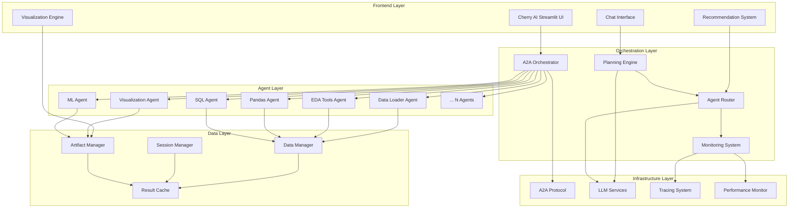

# Design Document

## Overview

CherryAI는 A2A 프로토콜 기반의 차세대 멀티 에이전트 데이터 분석 플랫폼으로, 2025년 현재 최신 AI 기술 트렌드를 반영하여 설계됩니다. 기존 ai.py의 3,000여 줄 모놀리식 구조를 모듈화하여 cherry_ai.py로 재구성하며, ChatGPT Data Analyst의 사용성과 멀티 에이전트 협업의 투명성을 결합한 혁신적인 플랫폼을 구축합니다.

### 2025년 멀티 에이전트 플랫폼 트렌드 분석

**1. Agent Orchestration Patterns**
- **Hierarchical Orchestration**: 중앙 오케스트레이터가 전체 워크플로우를 관리
- **Peer-to-Peer Collaboration**: 에이전트 간 직접 통신 및 협업
- **Dynamic Agent Selection**: 작업 특성에 따른 실시간 에이전트 선택

**2. Transparency & Explainability**
- **Process Visualization**: 에이전트 작업 과정의 실시간 시각화
- **Decision Tracing**: AI 의사결정 과정의 추적 가능성
- **Code Generation Transparency**: 생성된 코드와 실행 결과의 명확한 연결

**3. User Experience Innovation**
- **Conversational Analytics**: 자연어 기반 대화형 분석
- **Proactive Recommendations**: AI 기반 분석 제안 시스템
- **Multi-modal Interaction**: 텍스트, 음성, 시각적 입력 지원

## Architecture

### System Architecture Overview



### Modular Architecture Design

```
cherry_ai.py (Main Application)
├── core/
│   ├── orchestrator/
│   │   ├── a2a_orchestrator.py          # A2A 기반 에이전트 오케스트레이션
│   │   ├── planning_engine.py           # LLM 기반 분석 계획 수립
│   │   └── agent_router.py              # 동적 에이전트 선택 및 라우팅
│   ├── agents/
│   │   ├── agent_manager.py             # 에이전트 생명주기 관리
│   │   ├── agent_monitor.py             # 에이전트 상태 모니터링
│   │   └── agent_communication.py       # A2A 프로토콜 통신
│   ├── data/
│   │   ├── data_processor.py            # 데이터 전처리 및 변환
│   │   ├── session_manager.py           # 세션 기반 데이터 관리
│   │   └── artifact_manager.py          # 분석 결과 아티팩트 관리
│   └── llm/
│       ├── llm_service.py               # LLM 서비스 추상화
│       ├── prompt_manager.py            # 프롬프트 템플릿 관리
│       └── response_parser.py           # LLM 응답 파싱 및 구조화
├── ui/
│   ├── components/
│   │   ├── chat_interface.py            # ChatGPT 스타일 채팅 인터페이스
│   │   ├── agent_dashboard.py           # 에이전트 상태 대시보드
│   │   ├── analysis_viewer.py           # 분석 결과 뷰어
│   │   └── recommendation_panel.py      # 지능적 추천 패널
│   ├── visualization/
│   │   ├── plotly_renderer.py           # Plotly 차트 렌더링
│   │   ├── table_renderer.py            # 데이터 테이블 렌더링
│   │   └── code_renderer.py             # 코드 하이라이팅 및 표시
│   └── styles/
│       ├── theme.py                     # UI 테마 및 스타일링
│       └── responsive.py                # 반응형 레이아웃
├── services/
│   ├── recommendation/
│   │   ├── analysis_recommender.py      # 분석 추천 엔진
│   │   ├── followup_suggester.py        # 후속 분석 제안
│   │   └── context_analyzer.py          # 컨텍스트 기반 분석
│   ├── monitoring/
│   │   ├── performance_monitor.py       # 성능 모니터링
│   │   ├── error_handler.py             # 에러 처리 및 복구
│   │   └── logging_service.py           # 구조화된 로깅
│   └── integration/
│       ├── a2a_client.py                # A2A 클라이언트 래퍼 (실제 에이전트 통신)
│       ├── real_agent_connector.py      # 실제 12개 A2A 에이전트 연결 관리
│       ├── agent_health_checker.py      # 실시간 에이전트 상태 확인
│       ├── langfuse_tracer.py           # Langfuse 추적 통합
│       └── external_apis.py             # 외부 API 통합
└── config/
    ├── agents.json                      # 동적 에이전트 설정 (JSON)
    ├── agents_config.py                 # 에이전트 설정 로더
    ├── ui_config.py                     # UI 설정
    └── system_config.py                 # 시스템 전역 설정
```

## Components and Interfaces

### 1. Core Orchestrator Components

#### A2A Orchestrator
```python
class A2AOrchestrator:
    """A2A 프로토콜 기반 멀티 에이전트 오케스트레이터 - 동적 에이전트 관리"""
    
    def __init__(self, config_path: str = "config/agents.json"):
        # JSON 설정 파일에서 에이전트 정보 동적 로드
        self.config_path = config_path
        self.agents = self.load_agents_config()
        self.agent_loader = AgentConfigLoader(config_path)
    
    def load_agents_config(self) -> Dict[str, AgentConfig]:
        """JSON 설정 파일에서 에이전트 설정 로드"""
        return AgentConfigLoader.load_config(self.config_path)
    
    async def reload_agents_config(self) -> None:
        """런타임 중 에이전트 설정 재로드"""
        self.agents = self.load_agents_config()
        await self.verify_all_agents_online()
    
    async def add_agent_dynamically(self, agent_config: AgentConfig) -> bool:
        """런타임 중 새 에이전트 추가"""
        return await self.agent_loader.add_agent(agent_config)
    
    async def remove_agent_dynamically(self, agent_id: str) -> bool:
        """런타임 중 에이전트 제거"""
        return await self.agent_loader.remove_agent(agent_id)
    
    async def create_analysis_plan(self, user_query: str, data_context: Dict) -> AnalysisPlan
    async def execute_plan(self, plan: AnalysisPlan) -> ExecutionResult
    async def monitor_execution(self, execution_id: str) -> ExecutionStatus
    async def handle_agent_failure(self, agent_id: str, error: Exception) -> RecoveryAction
    async def verify_all_agents_online(self) -> Dict[str, bool]
    async def get_agent_capabilities(self, agent_name: str) -> List[str]
```

#### Planning Engine
```python
class PlanningEngine:
    """LLM 기반 지능형 분석 계획 수립"""
    
    async def analyze_user_intent(self, query: str) -> UserIntent
    async def select_optimal_agents(self, intent: UserIntent, available_agents: List[Agent]) -> List[Agent]
    async def create_execution_sequence(self, agents: List[Agent], data_context: Dict) -> ExecutionSequence
    async def estimate_execution_time(self, sequence: ExecutionSequence) -> TimeEstimate
```

#### Agent Router
```python
class AgentRouter:
    """동적 에이전트 선택 및 라우팅"""
    
    async def route_request(self, request: AnalysisRequest) -> Agent
    async def load_balance_agents(self, agent_type: str) -> Agent
    async def handle_agent_unavailable(self, preferred_agent: str) -> Agent
    async def optimize_agent_selection(self, performance_history: Dict) -> SelectionStrategy
```

### 2. UI Components

#### Chat Interface
```python
class ChatInterface:
    """ChatGPT 스타일 대화형 인터페이스"""
    
    def render_chat_container(self) -> None
    def display_message(self, message: ChatMessage) -> None
    def handle_user_input(self, input_text: str) -> None
    def show_typing_indicator(self, agent_name: str) -> None
    def render_analysis_results(self, results: AnalysisResult) -> None
```

#### Agent Dashboard
```python
class AgentDashboard:
    """에이전트 상태 및 작업 진행 상황 대시보드"""
    
    def render_agent_status_grid(self, agents: List[Agent]) -> None
    def show_execution_timeline(self, execution: ExecutionStatus) -> None
    def display_agent_details(self, agent_id: str) -> None
    def render_performance_metrics(self, metrics: PerformanceMetrics) -> None
```

#### Recommendation Panel
```python
class RecommendationPanel:
    """지능적 분석 추천 패널"""
    
    def generate_initial_recommendations(self, data: DataFrame) -> List[Recommendation]
    def suggest_followup_analysis(self, previous_results: AnalysisResult) -> List[Recommendation]
    def render_recommendation_buttons(self, recommendations: List[Recommendation]) -> None
    def handle_recommendation_click(self, recommendation: Recommendation) -> None
```

### 3. Service Components

#### Analysis Recommender
```python
class AnalysisRecommender:
    """LLM 기반 분석 추천 엔진"""
    
    async def analyze_data_characteristics(self, data: DataFrame) -> DataProfile
    async def generate_recommendations(self, profile: DataProfile) -> List[Recommendation]
    async def rank_recommendations(self, recommendations: List[Recommendation]) -> List[Recommendation]
    async def personalize_recommendations(self, user_context: UserContext) -> List[Recommendation]
```

#### Performance Monitor
```python
class PerformanceMonitor:
    """시스템 성능 모니터링 및 최적화"""
    
    async def monitor_agent_performance(self, agent_id: str) -> PerformanceMetrics
    async def detect_bottlenecks(self, system_metrics: SystemMetrics) -> List[Bottleneck]
    async def optimize_resource_allocation(self, current_load: ResourceLoad) -> OptimizationPlan
    async def predict_system_load(self, historical_data: List[LoadMetric]) -> LoadPrediction
```

## Data Models

### Core Data Structures

```python
@dataclass
class AnalysisPlan:
    """분석 계획 데이터 모델"""
    id: str
    user_query: str
    selected_agents: List[str]
    execution_sequence: List[ExecutionStep]
    estimated_duration: timedelta
    data_requirements: DataRequirements
    expected_outputs: List[OutputType]

@dataclass
class ExecutionStep:
    """실행 단계 데이터 모델"""
    step_id: str
    agent_name: str
    task_description: str
    input_data: Dict[str, Any]
    expected_output: OutputType
    dependencies: List[str]
    timeout: timedelta

@dataclass
class AnalysisResult:
    """분석 결과 데이터 모델"""
    id: str
    plan_id: str
    status: ExecutionStatus
    artifacts: List[Artifact]
    generated_code: List[CodeBlock]
    execution_time: timedelta
    agent_contributions: Dict[str, AgentContribution]
    recommendations: List[Recommendation]

@dataclass
class Recommendation:
    """추천 분석 데이터 모델"""
    id: str
    title: str
    description: str
    priority: int
    estimated_time: timedelta
    required_agents: List[str]
    click_action: str
```

### Agent Communication Models

```python
@dataclass
class A2AMessage:
    """A2A 프로토콜 메시지"""
    message_id: str
    sender_agent: str
    recipient_agent: str
    message_type: MessageType
    payload: Dict[str, Any]
    timestamp: datetime
    correlation_id: str

@dataclass
class AgentConfig:
    """에이전트 설정 데이터 모델"""
    id: str
    name: str
    display_name: str
    port: int
    host: str
    endpoint: str
    capabilities: List[str]
    description: str
    color: str
    category: str
    priority: int
    enabled: bool
    health_check_interval: int
    timeout: int
    retry_count: int

@dataclass
class AgentStatus:
    """에이전트 상태 정보"""
    agent_id: str
    name: str
    status: AgentState
    capabilities: List[str]
    current_load: float
    last_heartbeat: datetime
    performance_metrics: PerformanceMetrics
```

### Dynamic Agent Configuration

#### JSON Configuration Structure
```json
{
  "agents": {
    "data_cleaning": {
      "id": "data_cleaning",
      "name": "🧹 Data Cleaning",
      "display_name": "Data Cleaning Agent",
      "port": 8306,
      "host": "localhost",
      "endpoint": "http://localhost:8306",
      "capabilities": ["missing_value_handling", "outlier_detection", "data_validation"],
      "description": "누락값 처리, 이상치 제거 및 데이터 품질 검증",
      "color": "#FF6B6B",
      "category": "preprocessing",
      "priority": 1,
      "enabled": true,
      "health_check_interval": 30,
      "timeout": 300,
      "retry_count": 3
    },
    "data_visualization": {
      "id": "data_visualization",
      "name": "📊 Data Visualization",
      "display_name": "Data Visualization Agent",
      "port": 8308,
      "host": "localhost",
      "endpoint": "http://localhost:8308",
      "capabilities": ["plotly_charts", "interactive_plots", "dashboard_creation"],
      "description": "고급 시각화 및 대화형 차트 생성",
      "color": "#4ECDC4",
      "category": "visualization",
      "priority": 2,
      "enabled": true,
      "health_check_interval": 30,
      "timeout": 300,
      "retry_count": 3
    },
    "eda_tools": {
      "id": "eda_tools",
      "name": "🔍 EDA Tools",
      "display_name": "Exploratory Data Analysis Agent",
      "port": 8312,
      "host": "localhost",
      "endpoint": "http://localhost:8312",
      "capabilities": ["statistical_analysis", "correlation_analysis", "data_profiling"],
      "description": "자동 EDA 및 통계적 분석",
      "color": "#45B7D1",
      "category": "analysis",
      "priority": 1,
      "enabled": true,
      "health_check_interval": 30,
      "timeout": 300,
      "retry_count": 3
    },
    "data_loader": {
      "id": "data_loader",
      "name": "📁 Data Loader",
      "display_name": "Data Loading Agent",
      "port": 8307,
      "host": "localhost",
      "endpoint": "http://localhost:8307",
      "capabilities": ["file_loading", "database_connection", "data_import"],
      "description": "다양한 데이터 소스 로딩 및 연결",
      "color": "#96CEB4",
      "category": "data_access",
      "priority": 1,
      "enabled": true,
      "health_check_interval": 30,
      "timeout": 300,
      "retry_count": 3
    },
    "data_wrangling": {
      "id": "data_wrangling",
      "name": "🔧 Data Wrangling",
      "display_name": "Data Wrangling Agent",
      "port": 8309,
      "host": "localhost",
      "endpoint": "http://localhost:8309",
      "capabilities": ["data_transformation", "aggregation", "feature_creation"],
      "description": "데이터 변환, 집계 및 조작",
      "color": "#FFEAA7",
      "category": "preprocessing",
      "priority": 2,
      "enabled": true,
      "health_check_interval": 30,
      "timeout": 300,
      "retry_count": 3
    },
    "feature_engineering": {
      "id": "feature_engineering",
      "name": "⚙️ Feature Engineering",
      "display_name": "Feature Engineering Agent",
      "port": 8310,
      "host": "localhost",
      "endpoint": "http://localhost:8310",
      "capabilities": ["feature_creation", "feature_selection", "dimensionality_reduction"],
      "description": "고급 피처 생성 및 선택",
      "color": "#DDA0DD",
      "category": "ml_preprocessing",
      "priority": 3,
      "enabled": true,
      "health_check_interval": 30,
      "timeout": 300,
      "retry_count": 3
    },
    "sql_database": {
      "id": "sql_database",
      "name": "🗄️ SQL Database",
      "display_name": "SQL Database Agent",
      "port": 8311,
      "host": "localhost",
      "endpoint": "http://localhost:8311",
      "capabilities": ["sql_querying", "database_analysis", "query_optimization"],
      "description": "SQL 데이터베이스 분석 및 쿼리",
      "color": "#F39C12",
      "category": "data_access",
      "priority": 2,
      "enabled": true,
      "health_check_interval": 30,
      "timeout": 300,
      "retry_count": 3
    },
    "h2o_ml": {
      "id": "h2o_ml",
      "name": "🤖 H2O ML",
      "display_name": "H2O Machine Learning Agent",
      "port": 8313,
      "host": "localhost",
      "endpoint": "http://localhost:8313",
      "capabilities": ["automl", "model_training", "model_evaluation"],
      "description": "H2O AutoML 기반 머신러닝",
      "color": "#9B59B6",
      "category": "machine_learning",
      "priority": 4,
      "enabled": true,
      "health_check_interval": 30,
      "timeout": 600,
      "retry_count": 2
    },
    "mlflow_tools": {
      "id": "mlflow_tools",
      "name": "📈 MLflow Tools",
      "display_name": "MLflow Management Agent",
      "port": 8314,
      "host": "localhost",
      "endpoint": "http://localhost:8314",
      "capabilities": ["experiment_tracking", "model_registry", "model_deployment"],
      "description": "MLflow 실험 관리 및 모델 추적",
      "color": "#E74C3C",
      "category": "ml_ops",
      "priority": 4,
      "enabled": true,
      "health_check_interval": 30,
      "timeout": 300,
      "retry_count": 3
    },
    "pandas_agent": {
      "id": "pandas_agent",
      "name": "🐼 pandas_agent",
      "display_name": "Pandas Analysis Agent",
      "port": 8210,
      "host": "localhost",
      "endpoint": "http://localhost:8210",
      "capabilities": ["pandas_analysis", "data_calculation", "statistical_operations"],
      "description": "pandas 기반 데이터 분석 전문가",
      "color": "#FF9500",
      "category": "analysis",
      "priority": 1,
      "enabled": true,
      "health_check_interval": 30,
      "timeout": 300,
      "retry_count": 3
    },
    "report_generator": {
      "id": "report_generator",
      "name": "📋 report_generator",
      "display_name": "Report Generation Agent",
      "port": 8316,
      "host": "localhost",
      "endpoint": "http://localhost:8316",
      "capabilities": ["report_generation", "summary_analysis", "documentation"],
      "description": "종합 분석 보고서 생성",
      "color": "#8A2BE2",
      "category": "reporting",
      "priority": 3,
      "enabled": true,
      "health_check_interval": 30,
      "timeout": 300,
      "retry_count": 3
    },
    "orchestrator": {
      "id": "orchestrator",
      "name": "Orchestrator",
      "display_name": "AI DS Team Orchestrator",
      "port": 8100,
      "host": "localhost",
      "endpoint": "http://localhost:8100",
      "capabilities": ["planning", "delegation", "coordination"],
      "description": "AI DS Team을 지휘하는 마에스트로",
      "color": "#FAD02E",
      "category": "orchestration",
      "priority": 0,
      "enabled": true,
      "health_check_interval": 15,
      "timeout": 300,
      "retry_count": 5
    }
  },
  "global_settings": {
    "default_timeout": 300,
    "default_retry_count": 3,
    "health_check_interval": 30,
    "max_concurrent_agents": 5,
    "agent_discovery_enabled": true,
    "auto_failover_enabled": true
  }
}
```

#### Agent Configuration Loader
```python
class AgentConfigLoader:
    """동적 에이전트 설정 로더"""
    
    def __init__(self, config_path: str):
        self.config_path = config_path
        self.config_cache = {}
        self.last_modified = None
    
    @classmethod
    def load_config(cls, config_path: str) -> Dict[str, AgentConfig]:
        """JSON 설정 파일에서 에이전트 설정 로드"""
        with open(config_path, 'r', encoding='utf-8') as f:
            config_data = json.load(f)
        
        agents = {}
        for agent_id, agent_data in config_data['agents'].items():
            agents[agent_id] = AgentConfig(**agent_data)
        
        return agents
    
    async def watch_config_changes(self) -> None:
        """설정 파일 변경 감지 및 자동 재로드"""
        current_modified = os.path.getmtime(self.config_path)
        if self.last_modified != current_modified:
            self.last_modified = current_modified
            await self.reload_config()
    
    async def add_agent(self, agent_config: AgentConfig) -> bool:
        """새 에이전트 설정 추가"""
        try:
            with open(self.config_path, 'r+', encoding='utf-8') as f:
                config_data = json.load(f)
                config_data['agents'][agent_config.id] = asdict(agent_config)
                f.seek(0)
                json.dump(config_data, f, indent=2, ensure_ascii=False)
                f.truncate()
            return True
        except Exception as e:
            logger.error(f"Failed to add agent {agent_config.id}: {e}")
            return False
    
    async def remove_agent(self, agent_id: str) -> bool:
        """에이전트 설정 제거"""
        try:
            with open(self.config_path, 'r+', encoding='utf-8') as f:
                config_data = json.load(f)
                if agent_id in config_data['agents']:
                    del config_data['agents'][agent_id]
                    f.seek(0)
                    json.dump(config_data, f, indent=2, ensure_ascii=False)
                    f.truncate()
                    return True
                return False
        except Exception as e:
            logger.error(f"Failed to remove agent {agent_id}: {e}")
            return False
    
    async def update_agent_status(self, agent_id: str, enabled: bool) -> bool:
        """에이전트 활성화/비활성화 상태 업데이트"""
        try:
            with open(self.config_path, 'r+', encoding='utf-8') as f:
                config_data = json.load(f)
                if agent_id in config_data['agents']:
                    config_data['agents'][agent_id]['enabled'] = enabled
                    f.seek(0)
                    json.dump(config_data, f, indent=2, ensure_ascii=False)
                    f.truncate()
                    return True
                return False
        except Exception as e:
            logger.error(f"Failed to update agent {agent_id} status: {e}")
            return False
```

## Error Handling

### Comprehensive Error Management Strategy

#### 1. Agent-Level Error Handling
```python
class AgentErrorHandler:
    """에이전트 레벨 에러 처리"""
    
    async def handle_agent_timeout(self, agent_id: str) -> RecoveryAction
    async def handle_agent_crash(self, agent_id: str, error: Exception) -> RecoveryAction
    async def handle_communication_failure(self, message: A2AMessage) -> RetryStrategy
    async def escalate_critical_error(self, error: CriticalError) -> EscalationAction
```

#### 2. System-Level Error Recovery
```python
class SystemErrorRecovery:
    """시스템 레벨 에러 복구"""
    
    async def detect_system_anomalies(self, metrics: SystemMetrics) -> List[Anomaly]
    async def implement_circuit_breaker(self, service: str) -> CircuitBreakerState
    async def perform_graceful_degradation(self, failed_components: List[str]) -> DegradationPlan
    async def restore_system_health(self, recovery_plan: RecoveryPlan) -> RestoreResult
```

#### 3. User-Facing Error Communication
```python
class UserErrorCommunicator:
    """사용자 친화적 에러 커뮤니케이션"""
    
    def translate_technical_error(self, error: Exception) -> UserFriendlyMessage
    def suggest_user_actions(self, error_context: ErrorContext) -> List[UserAction]
    def provide_alternative_approaches(self, failed_analysis: AnalysisPlan) -> List[Alternative]
    def collect_user_feedback(self, error_experience: ErrorExperience) -> Feedback
```

## Testing Strategy

### Multi-Level Testing Approach

#### 1. Unit Testing
- **Component Isolation**: 각 모듈의 독립적 테스트
- **Real Agent Integration**: 실제 A2A 에이전트와의 완전한 통합 테스트
- **Edge Case Coverage**: 예외 상황 및 경계값 테스트

#### 2. Integration Testing
- **Real A2A Agent Communication**: 실제 12개 A2A 에이전트와의 완전한 통신 테스트
- **Complete Agent Coverage**: 모든 에이전트(Data Cleaning, Visualization, EDA Tools, Data Loader, Wrangling, Feature Engineering, SQL Database, H2O ML, MLflow Tools, pandas_agent, report_generator, Orchestrator)의 완전한 통합 검증
- **End-to-End Workflows**: 실제 에이전트를 사용한 전체 분석 파이프라인 테스트
- **Performance Testing**: 모든 에이전트 동시 작업 및 대용량 데이터 처리 테스트

#### 3. User Experience Testing
- **Usability Testing**: 실제 사용자 시나리오 기반 테스트
- **Accessibility Testing**: 웹 접근성 표준 준수 테스트
- **Cross-Browser Testing**: 다양한 브라우저 환경 호환성 테스트

#### 4. Domain-Specific Testing
```python
class SemiconductorAnalysisTest:
    """반도체 도메인 특화 테스트"""
    
    def test_ion_implant_analysis(self):
        """이온주입 공정 분석 테스트"""
        # ion_implant_3lot_dataset.csv 기반 테스트
        # query.txt의 도메인 지식 활용 검증
        
    def test_process_anomaly_detection(self):
        """공정 이상 감지 테스트"""
        # TW 값 이상 패턴 감지 검증
        # 전문가 수준의 해석 제공 검증
```

### Automated Testing Pipeline
```yaml
# CI/CD 파이프라인 테스트 단계
test_stages:
  - unit_tests:
      coverage_threshold: 80%
      parallel_execution: true
  - integration_tests:
      agent_simulation: true
      performance_benchmarks: true
  - e2e_tests:
      user_scenarios: 
        - data_upload_and_analysis
        - multi_agent_collaboration
        - recommendation_system
  - domain_tests:
      semiconductor_scenarios: true
      expert_validation: true
```

## Performance Optimization

### Multi-Tier Optimization Strategy

#### 1. Frontend Optimization
- **Lazy Loading**: 컴포넌트 및 데이터의 지연 로딩
- **Virtual Scrolling**: 대용량 데이터 테이블 최적화
- **Caching Strategy**: 분석 결과 및 시각화 캐싱
- **Progressive Enhancement**: 점진적 기능 향상

#### 2. Backend Optimization
- **Async Processing**: 비동기 에이전트 통신 및 처리
- **Connection Pooling**: A2A 연결 풀 관리
- **Resource Management**: 메모리 및 CPU 사용량 최적화
- **Load Balancing**: 에이전트 간 작업 부하 분산

#### 3. Data Processing Optimization
- **Streaming Processing**: 대용량 데이터 스트리밍 처리
- **Incremental Analysis**: 점진적 분석 결과 업데이트
- **Smart Caching**: 지능적 결과 캐싱 전략
- **Compression**: 데이터 전송 압축 최적화

## Security Considerations

### Multi-Layer Security Architecture

#### 1. Data Security
- **Encryption at Rest**: 저장 데이터 암호화
- **Encryption in Transit**: 전송 데이터 암호화
- **Data Anonymization**: 민감 데이터 익명화
- **Access Control**: 역할 기반 데이터 접근 제어

#### 2. Agent Security
- **Agent Authentication**: A2A 에이전트 인증
- **Message Integrity**: 메시지 무결성 검증
- **Secure Communication**: 안전한 에이전트 간 통신
- **Audit Logging**: 에이전트 활동 감사 로그

#### 3. User Security
- **Session Management**: 안전한 세션 관리
- **Input Validation**: 사용자 입력 검증 및 새니타이징
- **CSRF Protection**: Cross-Site Request Forgery 방지
- **Rate Limiting**: API 호출 속도 제한

## Scalability Design

### Horizontal and Vertical Scaling

#### 1. Agent Scaling
```python
class AgentScaler:
    """에이전트 동적 스케일링"""
    
    async def scale_agents_based_on_load(self, current_load: LoadMetrics) -> ScalingAction
    async def provision_new_agent_instances(self, agent_type: str, count: int) -> List[Agent]
    async def decommission_idle_agents(self, idle_threshold: timedelta) -> List[str]
    async def optimize_agent_distribution(self, workload_pattern: WorkloadPattern) -> DistributionPlan
```

#### 2. Data Scaling
- **Distributed Storage**: 분산 데이터 저장소 활용
- **Sharding Strategy**: 데이터 샤딩 전략
- **Replication**: 데이터 복제 및 백업
- **Partitioning**: 시간 기반 데이터 파티셔닝

#### 3. Infrastructure Scaling
- **Container Orchestration**: Kubernetes 기반 컨테이너 관리
- **Auto-scaling**: 자동 스케일링 정책
- **Load Balancing**: 트래픽 분산 및 라우팅
- **Resource Monitoring**: 실시간 리소스 모니터링

이 설계는 2025년 현재의 최신 AI 및 멀티 에이전트 시스템 트렌드를 반영하여, 확장 가능하고 유지보수 가능한 아키텍처를 제공합니다. LLM First 원칙을 준수하면서도 사용자 경험과 시스템 신뢰성을 모두 만족시키는 혁신적인 데이터 분석 플랫폼을 구현할 수 있습니다.