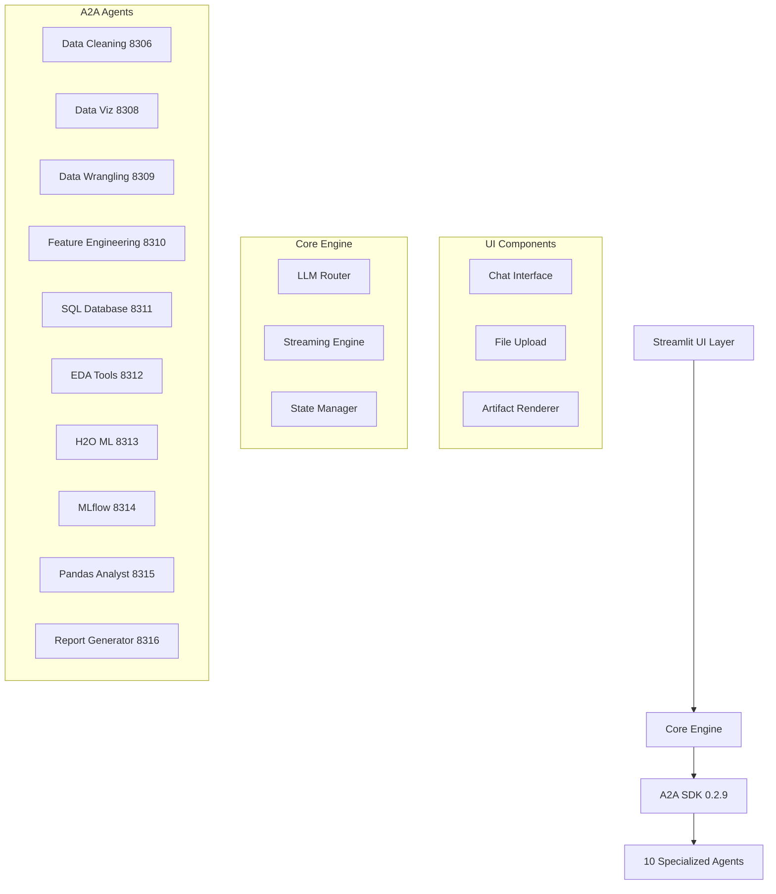

# Design Document - Cherry AI Universal Engine Fix

## Overview

The Cherry AI Universal Engine Fix implements a ChatGPT/Claude-like single-page data science platform built on A2A SDK 0.2.9. The system provides an intuitive chat interface that seamlessly integrates with 10 specialized A2A agents for comprehensive data analysis workflows.

**Core Design Philosophy:**
- **Zero Hardcoding**: All logic driven by LLM reasoning rather than predefined rules
- **Universal Adaptability**: Dynamic adaptation to any data type or analysis requirement
- **Self-Discovering**: Automatic capability detection and optimal agent selection
- **LLM First Universal Engine**: LLM-driven decision making at every layer

## Architecture

### High-Level Architecture



**Design Rationale**: The layered architecture separates concerns while maintaining tight integration. The LLM Router acts as the intelligent orchestrator, making all routing decisions based on context rather than hardcoded rules.

### Module Structure

```
app.py (< 50 lines - entry point only)
modules/
├── core/
│   ├── engine.py          # LLM Universal Engine
│   ├── router.py          # Intelligent Agent Router
│   ├── streaming.py       # SSE Streaming Handler
│   └── state.py           # Session State Manager
├── ui/
│   ├── chat.py            # Chat Interface Components
│   ├── upload.py          # File Upload Handler
│   └── layout.py          # UI Layout Manager
├── data/
│   ├── processor.py       # Data Processing Pipeline
│   ├── analyzer.py        # Data Relationship Discovery
│   └── manager.py         # Multi-Dataset Manager
├── artifacts/
│   ├── renderer.py        # Universal Artifact Renderer
│   ├── plotly_handler.py  # Plotly Chart Renderer
│   └── export.py          # Download/Export Handler
└── utils/
    ├── a2a_client.py      # A2A SDK Integration
    ├── recommendations.py # LLM-based Recommendations
    ├── session_manager.py # SQLite Session Management
    └── helpers.py         # Utility Functions
```

**Design Rationale**: Modular structure enables independent development and testing while maintaining clear separation of responsibilities. Each module has a single, well-defined purpose.

## Components and Interfaces

### 1. LLM Universal Engine (core/engine.py)

**Purpose**: Central orchestration engine that makes all routing and processing decisions using LLM reasoning.

```python
class UniversalEngine:
    def analyze_request(self, user_input: str, context: Dict) -> AnalysisDecision
    def select_agents(self, task_type: str, data_context: Dict) -> List[AgentConfig]
    def generate_recommendations(self, results: Dict) -> List[Recommendation]
```

**Key Design Decisions**:
- All decisions made through LLM prompting rather than rule-based logic
- Context-aware agent selection based on data characteristics and user intent
- Dynamic capability discovery for new agents

### 2. Intelligent Agent Router (core/router.py)

**Purpose**: Routes requests to optimal A2A agents based on LLM analysis of task requirements.

```python
class AgentRouter:
    def route_request(self, request: AnalysisRequest) -> List[AgentTask]
    def handle_agent_failure(self, failed_agent: str, task: AgentTask) -> AgentTask
    def coordinate_multi_agent(self, tasks: List[AgentTask]) -> ExecutionPlan
```

**Agent Integration Strategy**:
- **Data Cleaning (8306)**: Automatic data quality assessment and cleaning
- **Data Visualization (8308)**: Chart generation based on data characteristics
- **Data Wrangling (8309)**: Data transformation and preparation
- **Feature Engineering (8310)**: Automated feature creation and selection
- **SQL Database (8311)**: Database operations and queries
- **EDA Tools (8312)**: Exploratory data analysis workflows
- **H2O ML (8313)**: Machine learning model training and evaluation
- **MLflow (8314)**: Experiment tracking and model management
- **Pandas Analyst (8315)**: Primary data processing and analysis
- **Report Generator (8316)**: Comprehensive report creation

### 3. SSE Streaming Engine (core/streaming.py)

**Purpose**: Provides real-time streaming responses using A2A SDK 0.2.9 SSE capabilities.

```python
class StreamingEngine:
    def stream_response(self, generator: Iterator[str]) -> None
    def create_typing_effect(self, text: str, delay: float = 0.001) -> Iterator[str]
    def handle_concurrent_streams(self, streams: List[Iterator]) -> Iterator[str]
```

**Design Rationale**: Natural typing effects with semantic chunking create human-like interaction while maintaining technical efficiency through SSE streaming.

### 4. Multi-Dataset Manager (data/manager.py)

**Purpose**: Handles multiple dataset relationships and context management.

```python
class DatasetManager:
    def discover_relationships(self, datasets: List[Dataset]) -> RelationshipGraph
    def suggest_merge_operations(self, datasets: List[Dataset]) -> List[MergeOption]
    def maintain_context(self, active_datasets: List[str]) -> DataContext
```

**Design Rationale**: LLM-based relationship discovery eliminates need for predefined schema matching rules, enabling universal adaptability to any data structure.

### 5. Universal Artifact Renderer (artifacts/renderer.py)

**Purpose**: Renders all types of analysis artifacts with appropriate formatting.

```python
class ArtifactRenderer:
    def render_plotly(self, chart_data: Dict) -> st.plotly_chart
    def render_image(self, image_data: Union[str, bytes, PIL.Image]) -> st.image
    def render_table(self, df: pd.DataFrame) -> st.dataframe
    def render_code(self, code: str, language: str) -> st.code
```

**Supported Formats**:
- **Interactive Charts**: Plotly with full interactivity
- **Images**: PNG, JPG, SVG, Base64, PIL Image
- **Tables**: Virtual scrolling for large datasets
- **Code**: Syntax highlighting for Python, SQL, JSON
- **Text**: Markdown with LaTeX math support

## Data Models

### Core Data Structures

```python
@dataclass
class AnalysisRequest:
    user_input: str
    uploaded_files: List[UploadedFile]
    context: Dict[str, Any]
    session_id: str

@dataclass
class AgentTask:
    agent_id: str
    agent_port: int
    task_description: str
    input_data: Dict[str, Any]
    dependencies: List[str]

@dataclass
class AnalysisResult:
    agent_id: str
    artifacts: List[Artifact]
    summary: str
    execution_time: float
    status: ExecutionStatus

@dataclass
class Artifact:
    type: ArtifactType  # PLOTLY, IMAGE, TABLE, CODE, TEXT
    content: Any
    metadata: Dict[str, Any]
    download_options: List[DownloadOption]
```

### Session State Management

```python
class SessionState:
    uploaded_datasets: List[Dataset]
    active_datasets: List[str]
    analysis_history: List[AnalysisResult]
    current_context: Dict[str, Any]
    user_preferences: UserPreferences

class SQLiteSessionManager:
    def save_session(self, session_id: str, state: SessionState) -> None
    def load_session(self, session_id: str) -> SessionState
    def cleanup_expired_sessions(self, max_age_hours: int = 24) -> None
```

**SQLite Schema**:
```sql
-- sessions.db
CREATE TABLE sessions (
    session_id TEXT PRIMARY KEY,
    created_at TIMESTAMP DEFAULT CURRENT_TIMESTAMP,
    last_accessed TIMESTAMP DEFAULT CURRENT_TIMESTAMP,
    state_json TEXT,
    user_preferences TEXT
);

CREATE TABLE datasets (
    id INTEGER PRIMARY KEY AUTOINCREMENT,
    session_id TEXT,
    dataset_name TEXT,
    file_path TEXT,
    metadata_json TEXT,
    FOREIGN KEY (session_id) REFERENCES sessions(session_id)
);

CREATE TABLE artifacts (
    id INTEGER PRIMARY KEY AUTOINCREMENT,
    session_id TEXT,
    artifact_type TEXT,
    content_path TEXT,
    metadata_json TEXT,
    created_at TIMESTAMP DEFAULT CURRENT_TIMESTAMP,
    FOREIGN KEY (session_id) REFERENCES sessions(session_id)
);
```

**Design Rationale**: Immutable data structures with clear type definitions ensure data integrity and enable easy debugging and testing.

## Error Handling

### Multi-Level Error Recovery

1. **Agent-Level Recovery**:
   - Automatic retry for network errors (max 3 attempts)
   - Alternative agent selection within 5 seconds
   - Graceful degradation with partial results

2. **System-Level Recovery**:
   - Health checks every 30 seconds
   - Automatic service restart on critical failures
   - State preservation during recovery

3. **User-Level Error Handling**:
   - Technical errors converted to user-friendly messages
   - Suggested actions for common error scenarios
   - Option to retry with different parameters

```python
class ErrorHandler:
    def handle_agent_failure(self, error: AgentError) -> RecoveryAction
    def convert_technical_error(self, error: Exception) -> UserFriendlyMessage
    def suggest_alternatives(self, failed_task: AgentTask) -> List[Alternative]
```

**Design Rationale**: Multi-level error handling ensures system resilience while maintaining user experience quality.

## Testing Strategy

### Testing Pyramid

1. **Unit Tests** (70%):
   - Individual component functionality
   - LLM prompt validation
   - Data processing accuracy
   - Artifact rendering correctness

2. **Integration Tests** (20%):
   - A2A agent communication
   - Multi-agent coordination
   - End-to-end data workflows
   - Streaming functionality

3. **E2E Tests** (10%):
   - Complete user workflows
   - UI interaction testing
   - Performance under load
   - Error recovery scenarios

### Test Data Strategy

```python
# Test datasets covering various scenarios
test_datasets = {
    "small_clean": "titanic.csv",           # Clean, well-structured data
    "large_messy": "sales_data_dirty.csv",  # Large dataset with quality issues
    "time_series": "stock_prices.csv",      # Temporal data
    "multi_table": ["orders.csv", "customers.csv"],  # Relational data
    "mixed_types": "survey_responses.json"  # Mixed data types
}
```

**Design Rationale**: Comprehensive testing strategy ensures reliability across diverse data scenarios and user workflows.

## Performance Considerations

### Optimization Strategies

1. **Streaming Optimization**:
   - Intelligent chunking by semantic units
   - Asynchronous processing for concurrent agents
   - Memory-efficient artifact handling

2. **Data Processing**:
   - Lazy loading for large datasets
   - Incremental processing where possible
   - Efficient memory management (< 1GB per session)

3. **Caching Strategy**:
   - Agent response caching for repeated queries
   - Dataset metadata caching
   - Artifact rendering cache

```python
class PerformanceOptimizer:
    def optimize_streaming(self, content: str) -> Iterator[str]
    def manage_memory(self, datasets: List[Dataset]) -> None
    def cache_results(self, key: str, result: Any, ttl: int) -> None
```

**Performance Targets**:
- File processing: 10MB files in < 10 seconds
- Concurrent users: 50 users without degradation
- Memory usage: < 1GB per session
- Response time: < 2 seconds for simple queries

## Security and Privacy

### Security Measures

1. **File Upload Security**:
   - Malicious code scanning
   - File type validation
   - Size limits and sandboxing

2. **Data Privacy**:
   - Secure temporary file management
   - Automatic cleanup after session
   - No persistent data storage without consent

3. **Agent Communication**:
   - Secure A2A SDK communication
   - Input sanitization for all agent requests
   - Output validation before rendering

```python
class SecurityManager:
    def scan_uploaded_file(self, file: UploadedFile) -> SecurityReport
    def sanitize_input(self, user_input: str) -> str
    def validate_agent_output(self, output: Dict) -> ValidationResult
```

**Design Rationale**: Security-first approach ensures safe handling of user data while maintaining system functionality.

## Deployment Architecture

### Container Strategy

```dockerfile
# Multi-stage build for optimization
FROM python:3.11-slim as base
# Install dependencies and A2A SDK
FROM base as production
# Copy application code and configure
```

### Docker Compose Configuration

```yaml
version: '3.8'
services:
  cherry-ai:
    build: .
    ports:
      - "8501:8501"
    environment:
      - A2A_AGENTS_CONFIG=/config/agents.json
    volumes:
      - ./config:/config
      - ./data:/app/data
  
  # A2A Agent services (10 agents)
  agent-pandas:
    image: a2a/pandas-analyst:latest
    ports:
      - "8315:8315"
```

**Design Rationale**: Containerized deployment ensures consistent environments and easy scaling while maintaining separation of concerns between UI and agent services.

## Scalability Design

### Horizontal Scaling Strategy

1. **File-Based Session Management**:
   - SQLite database for session persistence
   - File system storage for datasets and artifacts
   - Automatic session cleanup and archiving
   - Compatible with existing SQL Database Agent (8311)

2. **Agent Pool Management**:
   - Dynamic agent scaling based on load
   - Health monitoring and auto-recovery
   - Load distribution across agent instances

3. **Resource Management**:
   - Memory limits per session
   - CPU throttling for heavy computations
   - Automatic cleanup of idle sessions

**Session Storage Structure**:
```
data/
├── sessions.db              # SQLite session database
├── sessions/
│   └── {session_id}/
│       ├── datasets/        # Uploaded data files
│       └── artifacts/       # Generated artifacts
└── temp/                    # Temporary processing files
```

**Design Rationale**: SQLite-based session management provides persistence without external dependencies, integrates naturally with the SQL Database Agent, and supports easy backup/restore operations.