# CherryAI 통합 시스템 설계 문서

## 📋 개요

이 설계 문서는 **검증 완료된 LLM-First Universal Engine 백엔드**와 **ChatGPT 스타일 UI/UX**를 통합한 CherryAI 시스템의 아키텍처를 정의합니다.

### 통합 설계 원칙
- **백엔드 보존**: 검증된 Universal Engine 구조 100% 유지
- **UI 레이어 추가**: 기존 백엔드 위에 새로운 UI 레이어 구축
- **점진적 통합**: 기존 기능을 깨뜨리지 않는 점진적 개선
- **성능 유지**: 검증된 45초 응답 시간 성능 보장

### 현재 검증된 백엔드 구조
```
✅ LLM-First Universal Engine (검증 완료)
├── core/universal_engine/
│   ├── universal_query_processor.py     # 메인 쿼리 처리기
│   ├── meta_reasoning_engine.py         # 4단계 메타 추론
│   ├── dynamic_context_discovery.py     # 동적 컨텍스트 발견
│   ├── adaptive_user_understanding.py   # 적응형 사용자 이해
│   ├── universal_intent_detection.py    # 범용 의도 감지
│   └── a2a_integration/
│       ├── a2a_agent_discovery.py       # A2A 에이전트 발견
│       └── a2a_workflow_orchestrator.py # A2A 워크플로우 조율
├── core/orchestrator/
│   ├── planning_engine.py               # LLM 기반 계획 수립
│   └── execution_engine.py              # 실행 엔진
└── a2a_orchestrator.py                  # A2A 오케스트레이터 (포트 8100)
```

## 🏗️ 통합 아키텍처 설계

### 전체 시스템 아키텍처

```mermaid
graph TB
    subgraph "🎨 New UI Layer (cherry_ai.py)"
        UI[Streamlit ChatGPT-style UI]
        Chat[Chat Interface]
        Stream[SSE Streaming Handler]
        Rec[Recommendation Engine]
        Upload[File Upload Handler]
    end
    
    subgraph "🔗 Integration Layer"
        UIBridge[UI-Backend Bridge]
        StreamBridge[Streaming Bridge]
        LangfuseBridge[Langfuse Integration]
        SessionMgr[Session Manager]
    end
    
    subgraph "✅ Verified Universal Engine Backend"
        UQP[UniversalQueryProcessor]
        MRE[MetaReasoningEngine]
        DCD[DynamicContextDiscovery]
        AUU[AdaptiveUserUnderstanding]
        UID[UniversalIntentDetection]
        
        subgraph "A2A Integration"
            AADS[A2AAgentDiscoverySystem]
            AWO[A2AWorkflowOrchestrator]
        end
    end
    
    subgraph "🤖 A2A Agents (Verified)"
        A1[Data Cleaning - 8306]
        A2[Data Loader - 8307]
        A3[Visualization - 8308]
        A4[Wrangling - 8309]
        A5[Feature Eng - 8310]
        A6[SQL DB - 8311]
        A7[EDA Tools - 8312]
        A8[H2O ML - 8313]
        A9[MLflow - 8314]
        A10[Pandas Agent - 8210]
        A11[Report Gen - 8316]
        Orch[Orchestrator - 8100]
    end
    
    subgraph "📊 Enhanced Services"
        Langfuse[Langfuse v2 Tracing]
        SSE[SSE Streaming]
        E2E[E2E Testing]
        Perf[Performance Monitor]
    end
    
    UI --> UIBridge
    Chat --> StreamBridge
    Stream --> SSE
    Upload --> UIBridge
    
    UIBridge --> UQP
    StreamBridge --> MRE
    LangfuseBridge --> Langfuse
    SessionMgr --> Langfuse
    
    UQP --> MRE
    UQP --> DCD
    UQP --> AUU
    UQP --> UID
    
    MRE --> AADS
    MRE --> AWO
    
    AADS --> Orch
    AWO --> A1
    AWO --> A2
    AWO --> A3
    AWO --> A4
    AWO --> A5
    AWO --> A6
    AWO --> A7
    AWO --> A8
    AWO --> A9
    AWO --> A10
    AWO --> A11
    
    SSE --> StreamBridge
    E2E --> UI
    Perf --> UIBridge
```



### 통합 파일 구조

```
cherry_ai.py (새로운 통합 메인 파일)
├── ui/
│   ├── chatgpt_interface.py             # ChatGPT 스타일 메인 인터페이스
│   ├── streaming_handler.py             # SSE 스트리밍 처리
│   ├── recommendation_panel.py          # 지능형 추천 패널
│   ├── agent_status_display.py          # A2A 에이전트 상태 표시
│   ├── file_upload_handler.py           # 파일 업로드 처리
│   └── result_renderer.py               # 결과 렌더링 (코드, 차트, 테이블)
├── integration/
│   ├── universal_engine_bridge.py       # Universal Engine 연결 브리지
│   ├── a2a_agent_connector.py           # A2A 에이전트 연결 관리
│   ├── langfuse_session_tracer.py       # Langfuse v2 세션 추적
│   ├── streaming_task_updater.py        # 실시간 스트리밍 업데이터
│   └── expert_scenario_handler.py       # 전문가 시나리오 처리
├── services/
│   ├── recommendation_service.py        # 분석 추천 서비스
│   ├── session_service.py               # 세션 관리 서비스
│   ├── performance_service.py           # 성능 모니터링 서비스
│   └── error_handling_service.py        # 에러 처리 서비스
└── config/
    ├── ui_config.py                     # UI 설정
    ├── streaming_config.py              # 스트리밍 설정
    └── langfuse_config.py               # Langfuse 설정

✅ core/ (기존 검증된 백엔드 - 수정 없음)
✅ a2a_ds_servers/ (기존 A2A 에이전트들 - 수정 없음)
✅ a2a_orchestrator.py (기존 오케스트레이터 - 수정 없음)
```

## 🔗 핵심 통합 컴포넌트

### 1. Universal Engine Bridge

```python
class UniversalEngineBridge:
    """검증된 Universal Engine과 새 UI 간의 브리지"""
    
    def __init__(self):
        # 검증된 백엔드 컴포넌트들 초기화 (수정 없음)
        self.universal_processor = UniversalQueryProcessor()
        self.meta_reasoning = MetaReasoningEngine()
        self.context_discovery = DynamicContextDiscovery()
        self.user_understanding = AdaptiveUserUnderstanding()
        self.intent_detection = UniversalIntentDetection()
        
        # A2A 통합 (검증된 구조 유지)
        self.agent_discovery = A2AAgentDiscoverySystem()
        self.workflow_orchestrator = A2AWorkflowOrchestrator()
        
        # 새로운 통합 레이어
        self.streaming_updater = StreamingTaskUpdater()
        self.langfuse_tracer = LangfuseSessionTracer()
    
    async def process_user_query(self, query: str, session_id: str, user_id: str = "2055186") -> AsyncGenerator[str, None]:
        """
        사용자 쿼리를 Universal Engine으로 처리하고 스트리밍 응답 생성
        기존 검증된 로직을 그대로 사용하되 스트리밍 레이어만 추가
        """
        # Langfuse 세션 시작
        trace_id = await self.langfuse_tracer.start_session(
            session_id=f"user_query_{int(time.time())}_{user_id}",
            user_id=user_id,
            query=query
        )
        
        try:
            # 1. 검증된 Universal Engine 처리 (수정 없음)
            yield "🍒 Universal Engine이 요청을 분석하고 있습니다..."
            
            # 기존 검증된 메서드 그대로 사용
            processing_result = await self.universal_processor.process_query(query)
            
            yield f"🧠 메타 추론 엔진이 4단계 분석을 수행합니다..."
            
            # 기존 검증된 메타 추론 (수정 없음)
            meta_result = await self.meta_reasoning.perform_meta_reasoning(
                query, processing_result.context
            )
            
            yield f"🔍 {len(meta_result.get('selected_agents', []))}개 에이전트가 선택되었습니다..."
            
            # 기존 검증된 A2A 워크플로우 (수정 없음)
            workflow_result = await self.workflow_orchestrator.execute_agent_workflow(
                meta_result.get('workflow_config', {})
            )
            
            # 스트리밍으로 결과 전송
            async for chunk in self._stream_workflow_results(workflow_result):
                yield chunk
                
            # Langfuse 세션 완료
            await self.langfuse_tracer.end_session(trace_id, workflow_result)
            
        except Exception as e:
            await self.langfuse_tracer.log_error(trace_id, str(e))
            yield f"❌ 오류가 발생했습니다: {str(e)}"
    
    async def _stream_workflow_results(self, workflow_result: Dict) -> AsyncGenerator[str, None]:
        """워크플로우 결과를 스트리밍으로 전송"""
        for step in workflow_result.get('execution_steps', []):
            yield f"⚡ {step['agent_name']}: {step['description']}"
            await asyncio.sleep(0.001)  # 0.001초 지연
            
            if step.get('result'):
                yield f"✅ {step['agent_name']} 완료: {step['result'][:100]}..."
                await asyncio.sleep(0.001)
```

### 2. ChatGPT Style Interface

```python
class ChatGPTInterface:
    """ChatGPT 스타일 메인 인터페이스"""
    
    def __init__(self):
        self.engine_bridge = UniversalEngineBridge()
        self.recommendation_service = RecommendationService()
        self.session_service = SessionService()
        
    def render_main_interface(self):
        """메인 ChatGPT 스타일 인터페이스 렌더링"""
        st.set_page_config(
            page_title="🍒 CherryAI - Universal Data Analysis Platform",
            page_icon="🍒",
            layout="wide",
            initial_sidebar_state="expanded"
        )
        
        # ChatGPT 스타일 헤더
        st.markdown("""
        <div style="text-align: center; padding: 2rem 0;">
            <h1>🍒 CherryAI</h1>
            <p style="font-size: 1.2rem; color: #666;">
                Universal Data Analysis Platform powered by LLM-First Architecture
            </p>
        </div>
        """, unsafe_allow_html=True)
        
        # 사이드바: 에이전트 상태 및 설정
        self.render_sidebar()
        
        # 메인 채팅 영역
        self.render_chat_area()
        
        # 파일 업로드 영역
        self.render_file_upload_area()
        
        # 추천 분석 패널
        self.render_recommendation_panel()
    
    def render_chat_area(self):
        """ChatGPT 스타일 채팅 영역"""
        # 채팅 히스토리 표시
        if "messages" not in st.session_state:
            st.session_state.messages = []
        
        # 채팅 메시지 표시
        for message in st.session_state.messages:
            with st.chat_message(message["role"]):
                if message["role"] == "assistant" and "streaming" in message:
                    # 스트리밍 메시지 표시
                    self.render_streaming_message(message)
                else:
                    st.markdown(message["content"])
        
        # 사용자 입력
        if prompt := st.chat_input("데이터 분석에 대해 무엇이든 물어보세요..."):
            # 사용자 메시지 추가
            st.session_state.messages.append({"role": "user", "content": prompt})
            
            # 사용자 메시지 표시
            with st.chat_message("user"):
                st.markdown(prompt)
            
            # 어시스턴트 응답 생성 및 스트리밍
            with st.chat_message("assistant"):
                self.handle_user_query(prompt)
    
    async def handle_user_query(self, query: str):
        """사용자 쿼리 처리 및 스트리밍 응답"""
        session_id = st.session_state.get("session_id", str(uuid.uuid4()))
        
        # 스트리밍 컨테이너 생성
        response_container = st.empty()
        full_response = ""
        
        # Universal Engine을 통한 스트리밍 처리
        async for chunk in self.engine_bridge.process_user_query(query, session_id):
            full_response += chunk + "\n"
            response_container.markdown(full_response)
            await asyncio.sleep(0.001)  # 0.001초 지연
        
        # 최종 응답 저장
        st.session_state.messages.append({
            "role": "assistant", 
            "content": full_response,
            "streaming": True
        })
        
        # 후속 추천 생성
        recommendations = await self.recommendation_service.generate_followup_recommendations(
            query, full_response
        )
        self.display_recommendations(recommendations)
    
    def render_sidebar(self):
        """사이드바: 에이전트 상태 및 시스템 정보"""
        with st.sidebar:
            st.markdown("## 🤖 A2A 에이전트 상태")
            
            # 검증된 A2A 에이전트들 상태 표시
            agent_status = self.get_agent_status()
            for agent_id, status in agent_status.items():
                status_icon = "🟢" if status["online"] else "🔴"
                st.markdown(f"{status_icon} **{status['name']}** (:{status['port']})")
                if status["online"]:
                    st.caption(f"응답시간: {status.get('response_time', 'N/A')}ms")
            
            st.markdown("---")
            st.markdown("## ⚙️ 시스템 설정")
            
            # Universal Engine 상태
            st.markdown("### 🧠 Universal Engine")
            st.success("✅ LLM-First Architecture Active")
            st.info(f"🚀 Model: qwen3-4b-fast")
            st.info(f"⏱️ Avg Response: 45s")
            
            # Langfuse 추적 상태
            st.markdown("### 📊 Langfuse Tracing")
            if st.session_state.get("langfuse_enabled", True):
                st.success("✅ Session Tracking Active")
                st.caption(f"User ID: {os.getenv('EMP_NO', '2055186')}")
            else:
                st.warning("⚠️ Tracing Disabled")
```

### 3. Langfuse Session Tracer

```python
class LangfuseSessionTracer:
    """Langfuse v2 세션 기반 추적 시스템"""
    
    def __init__(self):
        self.langfuse = None
        self.current_trace = None
        self.session_spans = {}
        
        # Langfuse v2 초기화
        try:
            from langfuse import Langfuse
            self.langfuse = Langfuse(
                public_key=os.getenv("LANGFUSE_PUBLIC_KEY"),
                secret_key=os.getenv("LANGFUSE_SECRET_KEY"),
                host=os.getenv("LANGFUSE_HOST", "http://localhost:3000")
            )
            self.enabled = True
        except Exception as e:
            logger.warning(f"Langfuse 초기화 실패: {e}")
            self.enabled = False
    
    async def start_session(self, session_id: str, user_id: str, query: str) -> str:
        """새 세션 시작 및 추적 초기화"""
        if not self.enabled:
            return "disabled"
        
        try:
            # 메인 세션 trace 생성
            self.current_trace = self.langfuse.trace(
                name="CherryAI_Analysis_Session",
                session_id=session_id,
                user_id=user_id,
                metadata={
                    "query": query,
                    "timestamp": datetime.now().isoformat(),
                    "system": "CherryAI_Universal_Engine",
                    "version": "v2.0"
                }
            )
            
            # 초기 span 생성
            self.session_spans["query_processing"] = self.current_trace.span(
                name="Universal_Query_Processing",
                input={"user_query": query}
            )
            
            return self.current_trace.id
            
        except Exception as e:
            logger.error(f"Langfuse 세션 시작 실패: {e}")
            return "error"
    
    async def log_agent_execution(self, agent_name: str, input_data: Dict, output_data: Dict, execution_time: float):
        """개별 에이전트 실행 로깅"""
        if not self.enabled or not self.current_trace:
            return
        
        try:
            agent_span = self.current_trace.span(
                name=f"A2A_Agent_{agent_name}",
                input=input_data,
                output=output_data,
                metadata={
                    "agent_type": agent_name,
                    "execution_time": execution_time,
                    "timestamp": datetime.now().isoformat()
                }
            )
            
            # 에이전트별 성능 메트릭 기록
            agent_span.score(
                name="execution_time",
                value=execution_time,
                comment=f"{agent_name} execution performance"
            )
            
        except Exception as e:
            logger.error(f"에이전트 실행 로깅 실패: {e}")
    
    async def log_universal_engine_step(self, step_name: str, input_data: Dict, output_data: Dict):
        """Universal Engine 단계별 로깅"""
        if not self.enabled or not self.current_trace:
            return
        
        try:
            step_span = self.current_trace.span(
                name=f"Universal_Engine_{step_name}",
                input=input_data,
                output=output_data,
                metadata={
                    "engine_component": step_name,
                    "timestamp": datetime.now().isoformat()
                }
            )
            
        except Exception as e:
            logger.error(f"Universal Engine 단계 로깅 실패: {e}")
    
    async def end_session(self, trace_id: str, final_result: Dict):
        """세션 종료 및 최종 결과 기록"""
        if not self.enabled or not self.current_trace:
            return
        
        try:
            # 최종 결과 기록
            self.current_trace.update(
                output=final_result,
                metadata={
                    "session_completed": datetime.now().isoformat(),
                    "total_agents_used": len(final_result.get("agent_contributions", {})),
                    "analysis_quality": final_result.get("quality_score", 0.0)
                }
            )
            
            # 세션 품질 점수 기록
            if "quality_score" in final_result:
                self.current_trace.score(
                    name="analysis_quality",
                    value=final_result["quality_score"],
                    comment="Overall analysis quality assessment"
                )
            
            # 세션 정리
            self.current_trace = None
            self.session_spans.clear()
            
        except Exception as e:
            logger.error(f"세션 종료 로깅 실패: {e}")
```

### 4. Expert Scenario Handler

```python
class ExpertScenarioHandler:
    """전문가 시나리오 (이온주입 + query.txt) 특화 처리"""
    
    def __init__(self, universal_engine_bridge: UniversalEngineBridge):
        self.engine_bridge = universal_engine_bridge
        self.ion_implant_dataset_path = "ion_implant_3lot_dataset.csv"
        self.query_file_path = "query.txt"
    
    async def detect_expert_scenario(self, uploaded_file, user_query: str) -> bool:
        """전문가 시나리오 감지"""
        # 파일명 기반 감지
        if uploaded_file and "ion_implant" in uploaded_file.name.lower():
            return True
        
        # 쿼리 내용 기반 감지 (Universal Engine 활용)
        domain_analysis = await self.engine_bridge.context_discovery.detect_domain(
            data=None, query=user_query
        )
        
        detected_domains = domain_analysis.get("detected_domains", [])
        return any("semiconductor" in domain.lower() or "ion" in domain.lower() 
                  for domain in detected_domains)
    
    async def handle_expert_scenario(self, uploaded_file, user_query: str) -> AsyncGenerator[str, None]:
        """전문가 시나리오 전용 처리"""
        yield "🔬 반도체 전문가 시나리오가 감지되었습니다..."
        
        # 1. 데이터 로드 및 도메인 컨텍스트 설정
        if uploaded_file:
            data = pd.read_csv(uploaded_file)
            yield f"📊 이온주입 데이터 로드 완료: {data.shape[0]}개 LOT, {data.shape[1]}개 컬럼"
        else:
            # 기본 데이터셋 사용
            data = pd.read_csv(self.ion_implant_dataset_path)
            yield f"📊 기본 이온주입 데이터셋 사용: {data.shape[0]}개 LOT"
        
        # 2. query.txt 내용 통합 (1회성)
        if os.path.exists(self.query_file_path):
            with open(self.query_file_path, 'r', encoding='utf-8') as f:
                domain_knowledge = f.read()
            
            # 도메인 지식과 사용자 쿼리 결합
            enhanced_query = f"""
            {domain_knowledge}
            
            사용자 요청: {user_query}
            
            위의 도메인 지식을 바탕으로 전문가 수준의 분석을 수행해주세요.
            """
            yield "📚 반도체 도메인 지식이 통합되었습니다..."
        else:
            enhanced_query = user_query
            yield "⚠️ query.txt 파일을 찾을 수 없어 기본 분석을 진행합니다..."
        
        # 3. Universal Engine을 통한 전문가 수준 분석
        yield "🧠 Universal Engine이 전문가 수준 분석을 시작합니다..."
        
        # 기존 검증된 Universal Engine 로직 활용
        async for chunk in self.engine_bridge.process_user_query(
            enhanced_query, 
            session_id=f"expert_scenario_{int(time.time())}",
            user_id=os.getenv('EMP_NO', '2055186')
        ):
            yield chunk
        
        yield "✅ 전문가 시나리오 분석이 완료되었습니다!"
```

## 🔧 구현 전략

### Phase 1: 기본 통합 (3-5일)
1. **Universal Engine Bridge 구현**: 검증된 백엔드와 새 UI 연결
2. **ChatGPT Interface 기본 구조**: Streamlit 기반 채팅 인터페이스
3. **기본 스트리밍**: SSE 기반 실시간 응답 표시

### Phase 2: 고급 기능 통합 (3-4일)
1. **Langfuse v2 통합**: 세션 기반 추적 시스템
2. **전문가 시나리오**: 이온주입 데이터 + query.txt 처리
3. **추천 시스템**: 지능형 분석 추천 엔진

### Phase 3: E2E 테스트 및 최적화 (2-3일)
1. **Playwright MCP 통합**: 자동화된 E2E 테스트
2. **성능 최적화**: 45초 응답 시간 유지
3. **시스템 관리**: start.sh/stop.sh 스크립트 개선

### Phase 4: 품질 보증 (1-2일)
1. **통합 테스트**: UI와 백엔드 완전 통합 검증
2. **회귀 테스트**: 기존 기능 무결성 확인
3. **사용자 테스트**: 실제 사용 시나리오 검증

## 🎯 성공 기준

### 기술적 성공 기준
- **백엔드 보존**: 검증된 Universal Engine 100% 무결성 유지
- **UI/UX 품질**: ChatGPT 수준의 사용자 경험 제공
- **성능 유지**: 평균 45초 응답 시간 달성
- **기능 완성**: Langfuse v2, SSE 스트리밍, E2E 테스트 100% 구현

### 사용자 경험 기준
- **직관적 인터페이스**: 학습 없이 즉시 사용 가능
- **실시간 피드백**: 0.001초 지연의 부드러운 스트리밍
- **전문가 지원**: 도메인 특화 분석 완벽 지원
- **신뢰성**: 99.9% 시스템 가용성

이 통합 설계를 통해 검증된 백엔드의 안정성과 성능을 유지하면서 최고 수준의 사용자 경험을 제공하는 완전한 CherryAI 시스템을 구축할 수 있습니다.