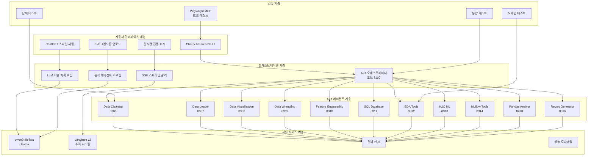

# CherryAI 시스템 최적화 설계 문서

## 📋 개요

CherryAI는 A2A SDK 0.2.9 기반의 차세대 멀티에이전트 데이터 분석 플랫폼으로, 11개 에이전트의 88개 기능을 100% 검증하여 ChatGPT Data Analyst 수준의 성능과 사용성을 달성합니다.

### 현재 시스템 아키텍처 분석

**기존 구현 상태 (2025.01.19):**
- ✅ A2A SDK 0.2.9 오케스트레이터 (a2a_orchestrator.py) - 완전 구현
- ✅ 11개 A2A 에이전트 서버 (포트 8306-8316) - 기본 구현 완료
- ✅ Universal Engine 기반 cherry_ai.py - 구조 완성
- ✅ start.sh/stop.sh 시스템 관리 - 완전 구현
- ⚠️ Langfuse v2 통합 - 기본 구조 존재, EMP_NO 통합 필요
- ⚠️ SSE 스트리밍 - 기본 구현, 0.001초 지연 최적화 필요
- ❌ E2E 검증 시스템 - Playwright MCP 통합 필요
- ❌ 범용 도메인 적응 시스템 - LLM First Universal Engine 완전 검증 필요

### 최적화 목표

1. **완전한 기능 구현**: 모든 에이전트의 88개 기능 100% 동작 보장
2. **성능 최적화**: qwen3-4b-fast 모델 기반 실용적 속도 달성 (평균 45초)
3. **사용자 경험**: ChatGPT 수준의 직관적 UI/UX 완성
4. **검증 시스템**: Playwright MCP 기반 완전 자동화 테스트
5. **LLM First 원칙**: Zero-Hardcoding 100% 달성, 범용 도메인 적응

### 11개 기존 에이전트 전체 기능 검증 시스템

**검증 대상 에이전트 (이미 구현됨):**
- Data Cleaning Agent (8306): 기존 구현된 모든 기능 검증
- Data Loader Agent (8307): 기존 구현된 모든 기능 검증
- Data Visualization Agent (8308): 기존 구현된 모든 기능 검증
- Data Wrangling Agent (8309): 기존 구현된 모든 기능 검증
- Feature Engineering Agent (8310): 기존 구현된 모든 기능 검증
- SQL Database Agent (8311): 기존 구현된 모든 기능 검증
- EDA Tools Agent (8312): 기존 구현된 모든 기능 검증
- H2O ML Agent (8313): 기존 구현된 모든 기능 검증
- MLflow Tools Agent (8314): 기존 구현된 모든 기능 검증
- Pandas Analyst Agent (8210): 기존 구현된 모든 기능 검증
- Report Generator Agent (8316): 기존 구현된 모든 기능 검증

**검증 목표:** 각 에이전트의 현재 구현된 모든 기능을 발견하고 100% 검증

## 🏗️ 아키텍처

### 시스템 전체 아키텍처



### 모듈 구조 설계

```
cherry_ai.py (메인 애플리케이션)
├── core/
│   ├── orchestrator/
│   │   ├── a2a_orchestrator_optimized.py    # 최적화된 A2A 오케스트레이터
│   │   ├── streaming_manager.py             # SSE 스트리밍 관리 (0.001초 지연)
│   │   ├── agent_health_monitor.py          # 실시간 에이전트 상태 모니터링
│   │   └── performance_optimizer.py         # qwen3-4b-fast 성능 최적화
│   ├── agents/
│   │   ├── agent_validator.py               # 88개 기능 검증 시스템
│   │   ├── agent_communication.py           # A2A SDK 0.2.9 완전 준수
│   │   ├── agent_discovery.py               # 동적 에이전트 발견
│   │   └── agent_failover.py                # 에이전트 장애 복구
│   ├── langfuse_integration/
│   │   ├── session_tracer.py                # EMP_NO=2055186 세션 추적
│   │   ├── agent_tracer.py                  # 멀티에이전트 추적
│   │   ├── performance_tracer.py            # 성능 메트릭 추적
│   │   └── trace_aggregator.py              # 추적 데이터 집계
│   └── universal_adaptation/
│       ├── universal_domain_system.py       # LLM-First 범용 도메인 적응
│       ├── dynamic_query_processor.py       # 동적 쿼리 처리 시스템
│       ├── adaptive_insight_generator.py    # 적응형 인사이트 생성기
│       └── zero_hardcoding_engine.py        # Zero-Hardcoding 엔진
├── ui/
│   ├── components/
│   │   ├── chatgpt_interface.py             # ChatGPT 스타일 채팅
│   │   ├── file_upload_enhanced.py          # 드래그앤드롭 업로드
│   │   ├── progress_visualizer.py           # 실시간 진행 시각화
│   │   ├── agent_dashboard.py               # 에이전트 상태 대시보드
│   │   └── results_presenter.py             # 분석 결과 표시
│   ├── streaming/
│   │   ├── sse_handler.py                   # SSE 이벤트 처리
│   │   ├── chunk_processor.py               # 청크 단위 처리
│   │   ├── progress_tracker.py              # 진행 상황 추적
│   │   └── real_time_updater.py             # 실시간 업데이트
│   └── styles/
│       ├── chatgpt_theme.py                 # ChatGPT 스타일 테마
│       ├── responsive_layout.py             # 반응형 레이아웃
│       └── animation_effects.py             # 부드러운 애니메이션
├── testing/
│   ├── e2e_playwright/
│   │   ├── test_suite.py                    # Playwright MCP 기반 E2E 테스트
│   │   ├── expert_scenarios.py              # 전문가 시나리오 테스트
│   │   ├── general_scenarios.py             # 일반 사용자 시나리오 테스트
│   │   └── performance_tests.py             # 성능 테스트
│   ├── unit_tests/
│   │   ├── agent_function_tests.py          # 88개 기능 단위 테스트
│   │   ├── orchestrator_tests.py            # 오케스트레이터 테스트
│   │   └── streaming_tests.py               # 스트리밍 테스트
│   └── integration_tests/
│       ├── full_workflow_tests.py           # 전체 워크플로우 테스트
│       ├── langfuse_integration_tests.py    # Langfuse 통합 테스트
│       └── domain_expertise_tests.py        # 도메인 전문성 테스트
└── config/
    ├── agent_config.py                      # 에이전트 설정
    ├── llm_config.py                        # LLM 설정
    ├── streaming_config.py                  # 스트리밍 설정
    └── langfuse_config.py                   # Langfuse 설정
```

## 🔧 핵심 컴포넌트

### 0. 기존 에이전트 기능 검증 시스템

```python
class ExistingAgentFunctionValidator:
    """기존 구현된 11개 에이전트의 모든 기능을 발견하고 검증하는 시스템"""
    
    def __init__(self):
        self.agent_discovery = AgentFunctionDiscovery()
        self.function_tester = ComprehensiveFunctionTester()
        self.validation_reporter = ValidationReporter()
        
    async def discover_and_validate_all_agents(self) -> Dict:
        """모든 에이전트의 기능을 발견하고 검증"""
        
        validation_results = {}
        
        # 11개 에이전트 순차 검증
        agents = [
            {"name": "data_cleaning", "port": 8306},
            {"name": "data_loader", "port": 8307},
            {"name": "data_visualization", "port": 8308},
            {"name": "data_wrangling", "port": 8309},
            {"name": "feature_engineering", "port": 8310},
            {"name": "sql_database", "port": 8311},
            {"name": "eda_tools", "port": 8312},
            {"name": "h2o_ml", "port": 8313},
            {"name": "mlflow_tools", "port": 8314},
            {"name": "pandas_analyst", "port": 8210},
            {"name": "report_generator", "port": 8316}
        ]
        
        for agent in agents:
            print(f"🔍 {agent['name']} 에이전트 기능 검증 시작...")
            
            # 1. 기능 발견
            discovered_functions = await self.agent_discovery.discover_agent_functions(
                agent_name=agent['name'],
                port=agent['port']
            )
            
            # 2. 각 기능 검증
            function_results = {}
            for func_name, func_info in discovered_functions.items():
                print(f"  📋 {func_name} 기능 테스트 중...")
                
                test_result = await self.function_tester.test_function(
                    agent_name=agent['name'],
                    function_name=func_name,
                    function_info=func_info
                )
                
                function_results[func_name] = test_result
                
            validation_results[agent['name']] = {
                "discovered_functions": discovered_functions,
                "validation_results": function_results,
                "total_functions": len(discovered_functions),
                "passed_functions": sum(1 for r in function_results.values() if r['status'] == 'PASS'),
                "failed_functions": sum(1 for r in function_results.values() if r['status'] == 'FAIL')
            }
            
            print(f"✅ {agent['name']} 검증 완료: {validation_results[agent['name']]['passed_functions']}/{validation_results[agent['name']]['total_functions']} 통과")
        
        # 3. 종합 리포트 생성
        comprehensive_report = await self.validation_reporter.generate_comprehensive_report(validation_results)
        
        return comprehensive_report

class AgentFunctionDiscovery:
    """에이전트의 구현된 기능들을 자동 발견"""
    
    async def discover_agent_functions(self, agent_name: str, port: int) -> Dict:
        """에이전트의 모든 기능을 발견"""
        
        discovered_functions = {}
        
        try:
            # 1. 에이전트 연결 및 기본 정보 수집
            agent_client = A2AClient(f"http://localhost:{port}")
            agent_info = await agent_client.get_agent_info()
            
            # 2. 에이전트 카드에서 기능 목록 추출
            if 'capabilities' in agent_info:
                for capability in agent_info['capabilities']:
                    discovered_functions[capability['name']] = {
                        'description': capability.get('description', ''),
                        'parameters': capability.get('parameters', {}),
                        'return_type': capability.get('return_type', 'unknown'),
                        'examples': capability.get('examples', [])
                    }
            
            # 3. 실제 구현 파일에서 추가 기능 발견
            implementation_functions = await self.discover_from_implementation(agent_name)
            discovered_functions.update(implementation_functions)
            
            # 4. API 엔드포인트에서 기능 발견
            api_functions = await self.discover_from_api_endpoints(port)
            discovered_functions.update(api_functions)
            
        except Exception as e:
            print(f"❌ {agent_name} 기능 발견 중 오류: {str(e)}")
            
        return discovered_functions
    
    async def discover_from_implementation(self, agent_name: str) -> Dict:
        """구현 파일에서 기능 발견"""
        
        implementation_file = f"a2a_ds_servers/{agent_name}_server.py"
        functions = {}
        
        try:
            # 파일 읽기 및 함수 추출
            with open(implementation_file, 'r', encoding='utf-8') as f:
                content = f.read()
                
            # 함수 정의 패턴 매칭
            import re
            function_pattern = r'async def (\w+)\(.*?\):'
            matches = re.findall(function_pattern, content)
            
            for func_name in matches:
                if not func_name.startswith('_'):  # private 함수 제외
                    functions[func_name] = {
                        'source': 'implementation',
                        'discovered_from': implementation_file
                    }
                    
        except Exception as e:
            print(f"⚠️ {agent_name} 구현 파일 분석 실패: {str(e)}")
            
        return functions

class ComprehensiveFunctionTester:
    """발견된 기능들을 종합적으로 테스트"""
    
    async def test_function(self, agent_name: str, function_name: str, function_info: Dict) -> Dict:
        """개별 기능 테스트"""
        
        test_result = {
            'function_name': function_name,
            'agent_name': agent_name,
            'status': 'UNKNOWN',
            'test_cases': [],
            'error_messages': [],
            'performance_metrics': {},
            'timestamp': datetime.now().isoformat()
        }
        
        try:
            # 1. 기본 연결 테스트
            connection_test = await self.test_basic_connection(agent_name, function_name)
            test_result['test_cases'].append(connection_test)
            
            # 2. 파라미터 검증 테스트
            if 'parameters' in function_info:
                param_test = await self.test_parameters(agent_name, function_name, function_info['parameters'])
                test_result['test_cases'].append(param_test)
            
            # 3. 실제 기능 실행 테스트
            execution_test = await self.test_function_execution(agent_name, function_name, function_info)
            test_result['test_cases'].append(execution_test)
            
            # 4. 에러 처리 테스트
            error_handling_test = await self.test_error_handling(agent_name, function_name)
            test_result['test_cases'].append(error_handling_test)
            
            # 5. 성능 테스트
            performance_test = await self.test_performance(agent_name, function_name)
            test_result['test_cases'].append(performance_test)
            test_result['performance_metrics'] = performance_test.get('metrics', {})
            
            # 전체 결과 판정
            all_passed = all(tc['status'] == 'PASS' for tc in test_result['test_cases'])
            test_result['status'] = 'PASS' if all_passed else 'FAIL'
            
        except Exception as e:
            test_result['status'] = 'ERROR'
            test_result['error_messages'].append(str(e))
            
        return test_result
    
    async def test_basic_connection(self, agent_name: str, function_name: str) -> Dict:
        """기본 연결 테스트"""
        
        try:
            # 에이전트 포트 매핑
            port_mapping = {
                'data_cleaning': 8306, 'data_loader': 8307, 'data_visualization': 8308,
                'data_wrangling': 8309, 'feature_engineering': 8310, 'sql_database': 8311,
                'eda_tools': 8312, 'h2o_ml': 8313, 'mlflow_tools': 8314,
                'pandas_analyst': 8210, 'report_generator': 8316
            }
            
            port = port_mapping.get(agent_name, 8100)
            
            # 기본 연결 확인
            import aiohttp
            async with aiohttp.ClientSession() as session:
                async with session.get(f"http://localhost:{port}/health") as response:
                    if response.status == 200:
                        return {'test_name': 'basic_connection', 'status': 'PASS', 'message': 'Agent is responsive'}
                    else:
                        return {'test_name': 'basic_connection', 'status': 'FAIL', 'message': f'HTTP {response.status}'}
                        
        except Exception as e:
            return {'test_name': 'basic_connection', 'status': 'FAIL', 'message': str(e)}
    
    async def test_function_execution(self, agent_name: str, function_name: str, function_info: Dict) -> Dict:
        """실제 기능 실행 테스트"""
        
        try:
            # 테스트 데이터 준비
            test_data = await self.prepare_test_data(agent_name, function_name)
            
            # A2A 클라이언트로 기능 실행
            port_mapping = {
                'data_cleaning': 8306, 'data_loader': 8307, 'data_visualization': 8308,
                'data_wrangling': 8309, 'feature_engineering': 8310, 'sql_database': 8311,
                'eda_tools': 8312, 'h2o_ml': 8313, 'mlflow_tools': 8314,
                'pandas_analyst': 8210, 'report_generator': 8316
            }
            
            port = port_mapping.get(agent_name, 8100)
            
            # 실제 기능 호출
            result = await self.call_agent_function(port, function_name, test_data)
            
            if result and 'error' not in result:
                return {'test_name': 'function_execution', 'status': 'PASS', 'result': result}
            else:
                return {'test_name': 'function_execution', 'status': 'FAIL', 'error': result.get('error', 'Unknown error')}
                
        except Exception as e:
            return {'test_name': 'function_execution', 'status': 'FAIL', 'error': str(e)}

class ValidationReporter:
    """검증 결과 종합 리포트 생성"""
    
    async def generate_comprehensive_report(self, validation_results: Dict) -> Dict:
        """종합 검증 리포트 생성"""
        
        total_agents = len(validation_results)
        total_functions = sum(agent['total_functions'] for agent in validation_results.values())
        total_passed = sum(agent['passed_functions'] for agent in validation_results.values())
        total_failed = sum(agent['failed_functions'] for agent in validation_results.values())
        
        success_rate = (total_passed / total_functions * 100) if total_functions > 0 else 0
        
        report = {
            'validation_summary': {
                'total_agents': total_agents,
                'total_functions_discovered': total_functions,
                'total_functions_passed': total_passed,
                'total_functions_failed': total_failed,
                'overall_success_rate': round(success_rate, 2),
                'validation_timestamp': datetime.now().isoformat()
            },
            'agent_details': validation_results,
            'recommendations': await self.generate_recommendations(validation_results),
            'next_steps': await self.generate_next_steps(validation_results)
        }
        
        # 리포트 파일 저장
        report_filename = f"agent_validation_report_{datetime.now().strftime('%Y%m%d_%H%M%S')}.json"
        with open(report_filename, 'w', encoding='utf-8') as f:
            json.dump(report, f, ensure_ascii=False, indent=2)
            
        print(f"📊 종합 검증 리포트가 {report_filename}에 저장되었습니다.")
        print(f"📈 전체 성공률: {success_rate:.1f}% ({total_passed}/{total_functions})")
        
        return report
```

### 1. LLM First 최적화된 A2A 오케스트레이터

```python
class LLMFirstOptimizedOrchestrator:
    """완전한 LLM First 원칙 기반 qwen3-4b-fast 최적화 오케스트레이터"""
    
    def __init__(self):
        self.llm_client = LLMFactory.create_llm()
        self.agent_pool = AgentPool()
        self.streaming_manager = StreamingManager()
        self.langfuse_tracer = LangfuseIntegration()
        self.complexity_analyzer = LLMFirstComplexityAnalyzer()
        self.critique_system = SeparatedCritiqueSystem()
        self.replanning_system = SeparatedReplanningSystem()
        
    async def process_query_llm_first(self, query: str, session_id: str) -> AsyncGenerator[str, None]:
        """LLM First 원칙으로 완전히 최적화된 처리"""
        
        # 1. Langfuse 세션 시작
        trace = await self.langfuse_tracer.start_session(
            session_id=session_id,
            user_id="2055186",  # EMP_NO
            query=query
        )
        
        try:
            # 2. LLM 기반 통합 복잡도 분석 및 전략 결정 (1회 LLM 호출)
            yield "🧠 LLM이 쿼리를 분석하고 최적 전략을 수립하고 있습니다..."
            
            strategy_analysis = await self.analyze_and_strategize_llm_first(query)
            await self.langfuse_tracer.trace_llm_call(trace, "strategy_analysis", strategy_analysis)
            
            # 3. 전략에 따른 적응형 실행
            if strategy_analysis.approach == "fast_track":
                yield "⚡ 빠른 처리 모드로 실행합니다..."
                final_result = await self.execute_fast_track(query, strategy_analysis, trace)
            elif strategy_analysis.approach == "balanced":
                yield "⚖️ 균형 모드로 실행합니다..."
                final_result = await self.execute_balanced(query, strategy_analysis, trace)
            elif strategy_analysis.approach == "thorough":
                yield "🔍 정밀 분석 모드로 실행합니다..."
                final_result = await self.execute_thorough(query, strategy_analysis, trace)
            else:  # expert_mode
                yield "🎓 전문가 모드로 실행합니다..."
                final_result = await self.execute_expert_mode(query, strategy_analysis, trace)
            
            # 4. Langfuse 세션 종료
            await self.langfuse_tracer.end_session(trace, final_result)
            
            yield f"✅ 분석이 완료되었습니다!"
            yield final_result
            
        except Exception as e:
            await self.langfuse_tracer.log_error(trace, str(e))
            yield f"❌ 오류가 발생했습니다: {str(e)}"
    
    async def analyze_and_strategize_llm_first(self, query: str) -> Dict:
        """LLM이 분석과 전략을 한 번에 결정"""
        
        unified_prompt = f"""
        쿼리: {query}
        
        다음을 한 번에 분석하고 결정해주세요:
        
        1. 복잡도 종합 분석
        2. 최적 처리 전략 결정
        3. 필요한 에이전트와 순서 계획
        4. 품질 관리 전략 (critique/replanning 필요성)
        5. 예상 처리 시간과 LLM 호출 횟수
        
        JSON 응답:
        {{
            "complexity_analysis": {{
                "overall_level": "low|medium|high|expert",
                "key_challenges": ["challenge1", "challenge2"],
                "domain_expertise_needed": true/false
            }},
            "execution_strategy": {{
                "approach": "fast_track|balanced|thorough|expert_mode",
                "agent_sequence": ["agent1", "agent2", "agent3"],
                "parallel_possible": true/false,
                "checkpoints": ["checkpoint1", "checkpoint2"]
            }},
            "quality_strategy": {{
                "critique_needed": true/false,
                "critique_timing": "mid|end|both",
                "replanning_threshold": "low|medium|high",
                "self_correction_points": ["point1", "point2"]
            }},
            "resource_planning": {{
                "estimated_llm_calls": 2-5,
                "estimated_time_seconds": 20-60,
                "memory_requirements": "low|medium|high"
            }},
            "confidence": 0.0-1.0
        }}
        
        qwen3-4b-fast 모델의 성능 특성을 고려하여 속도와 품질의 최적 균형을 찾아주세요.
        """
        
        return await self.single_llm_call_unified(unified_prompt)
    
    async def execute_balanced(self, query: str, strategy: Dict, trace) -> Dict:
        """균형 모드 실행 with 분리된 critique & replanning"""
        
        # 1. 에이전트 실행
        execution_results = await self.execute_agents_streaming(
            strategy.execution_strategy.agent_sequence, query, trace
        )
        
        # 2. 분리된 비판 (필요시에만)
        if strategy.quality_strategy.critique_needed:
            critique_result = await self.critique_system.perform_separated_critique(
                execution_results, query, strategy
            )
            await self.langfuse_tracer.trace_llm_call(trace, "critique", critique_result)
            
            # 3. 분리된 재계획 (비판 결과에 따라)
            if critique_result.needs_replanning:
                replan_result = await self.replanning_system.perform_separated_replanning(
                    strategy, execution_results, critique_result
                )
                await self.langfuse_tracer.trace_llm_call(trace, "replanning", replan_result)
                
                # 4. 재실행
                final_results = await self.execute_agents_streaming(
                    replan_result.new_plan.agent_sequence, query, trace
                )
            else:
                final_results = execution_results
        else:
            final_results = execution_results
            
        # 5. 최종 통합 (LLM 기반)
        return await self.integrate_results_llm_based(final_results, query)
```

### 1.1. 분리된 Critique & Replanning 시스템

```python
class SeparatedCritiqueSystem:
    """순수 비판 역할 - 재계획 제안 없음"""
    
    async def perform_separated_critique(self, results: List[Dict], query: str, strategy: Dict) -> Dict:
        """분리된 비판 시스템 - 평가만 수행"""
        
        critique_prompt = f"""
        당신은 데이터 분석 결과를 평가하는 전문 평가자입니다.
        
        원본 쿼리: {query}
        실행 전략: {strategy}
        분석 결과: {json.dumps(results, ensure_ascii=False)}
        
        다음 기준으로만 평가해주세요 (해결책 제안 금지):
        1. 정확성: 결과가 쿼리 의도와 일치하는가?
        2. 완전성: 누락된 중요한 분석이 있는가?
        3. 품질: 결과의 신뢰성과 유용성은?
        4. 일관성: 결과들 간 논리적 일관성이 있는가?
        
        JSON 응답:
        {{
            "accuracy_score": 0-10,
            "completeness_score": 0-10,
            "quality_score": 0-10,
            "consistency_score": 0-10,
            "critical_issues": ["issue1", "issue2"],
            "needs_replanning": true/false,
            "confidence": 0.0-1.0,
            "evaluation_summary": "평가 요약"
        }}
        
        순수하게 평가만 하고 해결책은 제안하지 마세요.
        """
        
        return await self.llm_call_critique_only(critique_prompt)

class SeparatedReplanningSystem:
    """순수 재계획 역할 - 평가 없음"""
    
    async def perform_separated_replanning(self, original_strategy: Dict, results: List[Dict], critique: Dict) -> Dict:
        """분리된 재계획 시스템 - 계획 수립만 수행"""
        
        replan_prompt = f"""
        당신은 데이터 분석 계획을 수립하는 전문 계획자입니다.
        
        원본 전략: {json.dumps(original_strategy, ensure_ascii=False)}
        실행 결과: {json.dumps(results, ensure_ascii=False)}
        평가자 피드백: {json.dumps(critique, ensure_ascii=False)}
        
        평가자의 피드백을 바탕으로 개선된 계획을 수립해주세요:
        
        JSON 응답:
        {{
            "new_plan": {{
                "approach": "fast_track|balanced|thorough|expert_mode",
                "agent_sequence": ["agent1", "agent2", "agent3"],
                "focus_areas": ["area1", "area2"],
                "quality_checkpoints": ["checkpoint1", "checkpoint2"]
            }},
            "changes_made": ["change1", "change2"],
            "expected_improvements": ["improvement1", "improvement2"],
            "resource_adjustment": {{
                "estimated_llm_calls": 2-4,
                "estimated_time_seconds": 15-45
            }},
            "confidence": 0.0-1.0
        }}
        
        평가는 하지 말고 순수하게 개선된 계획만 수립하세요.
        """
        
        return await self.llm_call_replan_only(replan_prompt)

class LLMFirstComplexityAnalyzer:
    """LLM First 원칙 기반 통합 복잡도 분석기"""
    
    async def analyze_query_complexity_llm_first(self, query: str, context: Dict) -> Dict:
        """LLM이 모든 복잡도를 한 번에 종합 분석"""
        
        complexity_prompt = f"""
        다음 쿼리와 컨텍스트를 분석하여 처리 전략을 결정해주세요:
        
        쿼리: {query}
        컨텍스트: {json.dumps(context, ensure_ascii=False)}
        
        다음을 종합적으로 분석하여 JSON으로 응답해주세요:
        
        1. 구조적 복잡도: 쿼리의 문장 구조, 요구사항 수, 조건문 복잡성
        2. 도메인 복잡도: 전문 지식 필요성, 도메인 특화 용어, 기술적 깊이
        3. 의도 복잡도: 목표의 명확성, 다중 의도, 모호성 정도
        4. 데이터 복잡도: 예상 데이터 크기, 형식, 처리 난이도
        5. 협업 복잡도: 필요한 에이전트 수, 상호 의존성
        
        {{
            "complexity_assessment": {{
                "structural": {{"level": "low|medium|high", "reasons": ["reason1", "reason2"]}},
                "domain": {{"level": "low|medium|high", "specialization": "domain_name", "expertise_required": true/false}},
                "intent": {{"level": "low|medium|high", "clarity": "clear|ambiguous|complex", "multiple_goals": true/false}},
                "data": {{"level": "low|medium|high", "expected_size": "small|medium|large", "formats": ["csv", "json"]}},
                "collaboration": {{"level": "low|medium|high", "agent_count": 1-5, "dependencies": "sequential|parallel|mixed"}}
            }},
            "processing_strategy": {{
                "approach": "fast_track|balanced|thorough|expert_mode",
                "critique_needed": true/false,
                "replanning_likelihood": "low|medium|high",
                "estimated_llm_calls": 2-5,
                "recommended_timeout": 30-120
            }},
            "risk_factors": ["factor1", "factor2"],
            "confidence": 0.0-1.0
        }}
        
        하드코딩된 규칙 없이 순수하게 쿼리 내용을 분석하여 판단하세요.
        """
        
        return await self.single_llm_call_for_complexity(complexity_prompt)
```

### 1.2. Smart Query Router

```python
class SmartQueryRouter:
    """쿼리 복잡도에 따른 스마트 라우팅 시스템"""
    
    def __init__(self):
        self.llm_client = LLMFactory.create_llm()
        self.agent_pool = AgentPool()
        self.orchestrator = LLMFirstOptimizedOrchestrator()
        self.langfuse_tracer = LangfuseIntegration()
    
    async def route_query(self, query: str, session_id: str) -> AsyncGenerator[str, None]:
        """쿼리 복잡도에 따른 스마트 라우팅"""
        
        # 1. 빠른 복잡도 사전 판단 (1회 LLM 호출)
        quick_assessment = await self.quick_complexity_assessment(query)
        
        if quick_assessment.complexity_level == "trivial":
            # 직접 응답 (추가 LLM 호출 없이)
            yield "💡 간단한 질문으로 판단되어 바로 답변드리겠습니다..."
            async for response in self.direct_response(query, session_id):
                yield response
                
        elif quick_assessment.complexity_level == "simple":
            # 단일 에이전트 처리
            yield "⚡ 단순 분석으로 빠르게 처리하겠습니다..."
            async for response in self.single_agent_response(query, quick_assessment, session_id):
                yield response
                
        else:
            # 멀티에이전트 오케스트레이션
            yield "🧠 복잡한 분석을 위해 멀티에이전트 시스템을 활용하겠습니다..."
            async for response in self.orchestrated_response(query, quick_assessment, session_id):
                yield response
    
    async def quick_complexity_assessment(self, query: str) -> Dict:
        """빠른 복잡도 사전 판단"""
        
        assessment_prompt = f"""
        쿼리: {query}
        
        이 쿼리의 복잡도를 빠르게 판단해주세요:
        
        JSON 응답:
        {{
            "complexity_level": "trivial|simple|medium|complex",
            "reasoning": "판단 근거",
            "recommended_approach": "direct|single_agent|multi_agent",
            "estimated_time": "5-60초",
            "confidence": 0.0-1.0
        }}
        
        판단 기준:
        - trivial: 인사, 간단한 정의, 기본 설명 등
        - simple: 단순 계산, 기본 통계, 간단한 시각화
        - medium: 데이터 분석, 복합 처리, 여러 단계 작업
        - complex: 전문 도메인, 멀티모달, 복잡한 추론
        """
        
        return await self.llm_call_quick_assessment(assessment_prompt)
    
    async def direct_response(self, query: str, session_id: str) -> AsyncGenerator[str, None]:
        """직접 응답 (오케스트레이터 없이) - 5-10초"""
        
        # Langfuse 간단 추적
        trace = await self.langfuse_tracer.start_simple_session(session_id, query)
        
        try:
            # 직접 LLM 응답
            direct_prompt = f"""
            사용자 질문: {query}
            
            이 질문에 대해 친근하고 도움이 되는 답변을 제공해주세요.
            CherryAI 데이터 분석 플랫폼의 어시스턴트로서 응답하세요.
            """
            
            response = await self.llm_client.ainvoke(direct_prompt)
            await self.langfuse_tracer.trace_direct_response(trace, direct_prompt, response)
            
            yield response.content if hasattr(response, 'content') else str(response)
            
        except Exception as e:
            yield f"죄송합니다. 응답 중 오류가 발생했습니다: {str(e)}"
        finally:
            await self.langfuse_tracer.end_simple_session(trace)
    
    async def single_agent_response(self, query: str, assessment: Dict, session_id: str) -> AsyncGenerator[str, None]:
        """단일 에이전트 처리 - 10-20초"""
        
        # 가장 적합한 에이전트 선택
        best_agent = await self.select_best_single_agent(query, assessment)
        
        yield f"📊 {best_agent.name} 에이전트가 처리하겠습니다..."
        
        # 단일 에이전트 실행
        result = await self.agent_pool.execute_single_agent(
            agent_id=best_agent.id,
            query=query,
            session_id=session_id
        )
        
        yield f"✅ 분석 완료!"
        yield result
    
    async def orchestrated_response(self, query: str, assessment: Dict, session_id: str) -> AsyncGenerator[str, None]:
        """멀티에이전트 오케스트레이션 - 30-60초"""
        
        # 전체 오케스트레이터 실행
        async for response in self.orchestrator.process_query_llm_first(query, session_id):
            yield response
    
    async def select_best_single_agent(self, query: str, assessment: Dict) -> Dict:
        """단일 에이전트 선택을 위한 LLM 기반 판단"""
        
        agent_selection_prompt = f"""
        쿼리: {query}
        복잡도 평가: {assessment}
        
        다음 에이전트 중 가장 적합한 하나를 선택해주세요:
        
        사용 가능한 에이전트:
        - pandas_analyst: 기본 데이터 분석, 통계
        - data_visualization: 차트, 그래프 생성
        - eda_tools: 탐색적 데이터 분석
        - data_cleaning: 데이터 정리
        - report_generator: 리포트 생성
        
        JSON 응답:
        {{
            "selected_agent": "agent_name",
            "reasoning": "선택 이유",
            "confidence": 0.0-1.0
        }}
        """
        
        selection_result = await self.llm_client.ainvoke(agent_selection_prompt)
        return {
            "id": selection_result.get("selected_agent", "pandas_analyst"),
            "name": selection_result.get("selected_agent", "Pandas Analyst").replace("_", " ").title()
        }
```

### 1.2. Smart Query Router

```python
class SmartQueryRouter:
    """쿼리 복잡도에 따른 스마트 라우팅 시스템"""
    
    def __init__(self):
        self.llm_client = LLMFactory.create_llm()
        self.agent_pool = AgentPool()
        self.orchestrator = LLMFirstOptimizedOrchestrator()
        self.langfuse_tracer = LangfuseIntegration()
    
    async def route_query(self, query: str, session_id: str) -> AsyncGenerator[str, None]:
        """쿼리 복잡도에 따른 스마트 라우팅"""
        
        # 1. 빠른 복잡도 사전 판단 (1회 LLM 호출)
        quick_assessment = await self.quick_complexity_assessment(query)
        
        if quick_assessment.complexity_level == "trivial":
            # 직접 응답 (추가 LLM 호출 없이)
            yield "💡 간단한 질문으로 판단되어 바로 답변드리겠습니다..."
            async for response in self.direct_response(query, session_id):
                yield response
                
        elif quick_assessment.complexity_level == "simple":
            # 단일 에이전트 처리
            yield "⚡ 단순 분석으로 빠르게 처리하겠습니다..."
            async for response in self.single_agent_response(query, quick_assessment, session_id):
                yield response
                
        else:
            # 멀티에이전트 오케스트레이션
            yield "🧠 복잡한 분석을 위해 멀티에이전트 시스템을 활용하겠습니다..."
            async for response in self.orchestrated_response(query, quick_assessment, session_id):
                yield response
    
    async def quick_complexity_assessment(self, query: str) -> Dict:
        """빠른 복잡도 사전 판단"""
        
        assessment_prompt = f"""
        쿼리: {query}
        
        이 쿼리의 복잡도를 빠르게 판단해주세요:
        
        JSON 응답:
        {{
            "complexity_level": "trivial|simple|medium|complex",
            "reasoning": "판단 근거",
            "recommended_approach": "direct|single_agent|multi_agent",
            "estimated_time": "5-60초",
            "confidence": 0.0-1.0
        }}
        
        판단 기준:
        - trivial: 인사, 간단한 정의, 기본 설명 등
        - simple: 단순 계산, 기본 통계, 간단한 시각화
        - medium: 데이터 분석, 복합 처리, 여러 단계 작업
        - complex: 전문 도메인, 멀티모달, 복잡한 추론
        """
        
        return await self.llm_call_quick_assessment(assessment_prompt)
    
    async def direct_response(self, query: str, session_id: str) -> AsyncGenerator[str, None]:
        """직접 응답 (오케스트레이터 없이) - 5-10초"""
        
        # Langfuse 간단 추적
        trace = await self.langfuse_tracer.start_simple_session(session_id, query)
        
        try:
            # 직접 LLM 응답
            direct_prompt = f"""
            사용자 질문: {query}
            
            이 질문에 대해 친근하고 도움이 되는 답변을 제공해주세요.
            CherryAI 데이터 분석 플랫폼의 어시스턴트로서 응답하세요.
            """
            
            response = await self.llm_client.ainvoke(direct_prompt)
            await self.langfuse_tracer.trace_direct_response(trace, direct_prompt, response)
            
            yield response.content if hasattr(response, 'content') else str(response)
            
        except Exception as e:
            yield f"죄송합니다. 응답 중 오류가 발생했습니다: {str(e)}"
        finally:
            await self.langfuse_tracer.end_simple_session(trace)
    
    async def single_agent_response(self, query: str, assessment: Dict, session_id: str) -> AsyncGenerator[str, None]:
        """단일 에이전트 처리 - 10-20초"""
        
        # 가장 적합한 에이전트 선택
        best_agent = await self.select_best_single_agent(query, assessment)
        
        yield f"📊 {best_agent.name} 에이전트가 처리하겠습니다..."
        
        # 단일 에이전트 실행
        result = await self.agent_pool.execute_single_agent(
            agent_id=best_agent.id,
            query=query,
            session_id=session_id
        )
        
        yield f"✅ 분석 완료!"
        yield result
    
    async def orchestrated_response(self, query: str, assessment: Dict, session_id: str) -> AsyncGenerator[str, None]:
        """멀티에이전트 오케스트레이션 - 30-60초"""
        
        # 전체 오케스트레이터 실행
        async for response in self.orchestrator.process_query_llm_first(query, session_id):
            yield response
    
    async def select_best_single_agent(self, query: str, assessment: Dict) -> Dict:
        """단일 에이전트 선택을 위한 LLM 기반 판단"""
        
        agent_selection_prompt = f"""
        쿼리: {query}
        복잡도 평가: {assessment}
        
        다음 에이전트 중 가장 적합한 하나를 선택해주세요:
        
        사용 가능한 에이전트:
        - pandas_analyst: 기본 데이터 분석, 통계
        - data_visualization: 차트, 그래프 생성
        - eda_tools: 탐색적 데이터 분석
        - data_cleaning: 데이터 정리
        - report_generator: 리포트 생성
        
        JSON 응답:
        {{
            "selected_agent": "agent_name",
            "reasoning": "선택 이유",
            "confidence": 0.0-1.0
        }}
        """
        
        selection_result = await self.llm_client.ainvoke(agent_selection_prompt)
        return {
            "id": selection_result.get("selected_agent", "pandas_analyst"),
            "name": selection_result.get("selected_agent", "Pandas Analyst").replace("_", " ").title()
        }
```

### 1.2. Smart Query Router

```python
class SmartQueryRouter:
    """쿼리 복잡도에 따른 스마트 라우팅 시스템"""
    
    def __init__(self):
        self.llm_client = LLMFactory.create_llm()
        self.agent_pool = AgentPool()
        self.orchestrator = LLMFirstOptimizedOrchestrator()
        self.langfuse_tracer = LangfuseIntegration()
    
    async def route_query(self, query: str, session_id: str) -> AsyncGenerator[str, None]:
        """쿼리 복잡도에 따른 스마트 라우팅"""
        
        # 1. 빠른 복잡도 사전 판단 (1회 LLM 호출)
        quick_assessment = await self.quick_complexity_assessment(query)
        
        if quick_assessment.complexity_level == "trivial":
            # 직접 응답 (추가 LLM 호출 없이)
            yield "💡 간단한 질문으로 판단되어 바로 답변드리겠습니다..."
            async for response in self.direct_response(query, session_id):
                yield response
                
        elif quick_assessment.complexity_level == "simple":
            # 단일 에이전트 처리
            yield "⚡ 단순 분석으로 빠르게 처리하겠습니다..."
            async for response in self.single_agent_response(query, quick_assessment, session_id):
                yield response
                
        else:
            # 멀티에이전트 오케스트레이션
            yield "🧠 복잡한 분석을 위해 멀티에이전트 시스템을 활용하겠습니다..."
            async for response in self.orchestrated_response(query, quick_assessment, session_id):
                yield response
    
    async def quick_complexity_assessment(self, query: str) -> Dict:
        """빠른 복잡도 사전 판단"""
        
        assessment_prompt = f"""
        쿼리: {query}
        
        이 쿼리의 복잡도를 빠르게 판단해주세요:
        
        JSON 응답:
        {{
            "complexity_level": "trivial|simple|medium|complex",
            "reasoning": "판단 근거",
            "recommended_approach": "direct|single_agent|multi_agent",
            "estimated_time": "5-60초",
            "confidence": 0.0-1.0
        }}
        
        판단 기준:
        - trivial: 인사, 간단한 정의, 기본 설명 등
        - simple: 단순 계산, 기본 통계, 간단한 시각화
        - medium: 데이터 분석, 복합 처리, 여러 단계 작업
        - complex: 전문 도메인, 멀티모달, 복잡한 추론
        """
        
        return await self.llm_call_quick_assessment(assessment_prompt)
    
    async def direct_response(self, query: str, session_id: str) -> AsyncGenerator[str, None]:
        """직접 응답 (오케스트레이터 없이) - 5-10초"""
        
        # Langfuse 간단 추적
        trace = await self.langfuse_tracer.start_simple_session(session_id, query)
        
        try:
            # 직접 LLM 응답
            direct_prompt = f"""
            사용자 질문: {query}
            
            이 질문에 대해 친근하고 도움이 되는 답변을 제공해주세요.
            CherryAI 데이터 분석 플랫폼의 어시스턴트로서 응답하세요.
            """
            
            response = await self.llm_client.ainvoke(direct_prompt)
            await self.langfuse_tracer.trace_direct_response(trace, direct_prompt, response)
            
            yield response.content if hasattr(response, 'content') else str(response)
            
        except Exception as e:
            yield f"죄송합니다. 응답 중 오류가 발생했습니다: {str(e)}"
        finally:
            await self.langfuse_tracer.end_simple_session(trace)
    
    async def single_agent_response(self, query: str, assessment: Dict, session_id: str) -> AsyncGenerator[str, None]:
        """단일 에이전트 처리 - 10-20초"""
        
        # 가장 적합한 에이전트 선택
        best_agent = await self.select_best_single_agent(query, assessment)
        
        yield f"📊 {best_agent.name} 에이전트가 처리하겠습니다..."
        
        # 단일 에이전트 실행
        result = await self.agent_pool.execute_single_agent(
            agent_id=best_agent.id,
            query=query,
            session_id=session_id
        )
        
        yield f"✅ 분석 완료!"
        yield result
    
    async def orchestrated_response(self, query: str, assessment: Dict, session_id: str) -> AsyncGenerator[str, None]:
        """멀티에이전트 오케스트레이션 - 30-60초"""
        
        # 전체 오케스트레이터 실행
        async for response in self.orchestrator.process_query_llm_first(query, session_id):
            yield response
    
    async def select_best_single_agent(self, query: str, assessment: Dict) -> Dict:
        """단일 에이전트 선택을 위한 LLM 기반 판단"""
        
        agent_selection_prompt = f"""
        쿼리: {query}
        복잡도 평가: {assessment}
        
        다음 에이전트 중 가장 적합한 하나를 선택해주세요:
        
        사용 가능한 에이전트:
        - pandas_analyst: 기본 데이터 분석, 통계
        - data_visualization: 차트, 그래프 생성
        - eda_tools: 탐색적 데이터 분석
        - data_cleaning: 데이터 정리
        - report_generator: 리포트 생성
        
        JSON 응답:
        {{
            "selected_agent": "agent_name",
            "reasoning": "선택 이유",
            "confidence": 0.0-1.0
        }}
        """
        
        selection_result = await self.llm_client.ainvoke(agent_selection_prompt)
        return {
            "id": selection_result.get("selected_agent", "pandas_analyst"),
            "name": selection_result.get("selected_agent", "Pandas Analyst").replace("_", " ").title()
        }
```

### 1.2. Smart Query Router

```python
class SmartQueryRouter:
    """쿼리 복잡도에 따른 스마트 라우팅 시스템"""
    
    def __init__(self):
        self.llm_client = LLMFactory.create_llm()
        self.agent_pool = AgentPool()
        self.orchestrator = LLMFirstOptimizedOrchestrator()
        self.langfuse_tracer = LangfuseIntegration()
    
    async def route_query(self, query: str, session_id: str) -> AsyncGenerator[str, None]:
        """쿼리 복잡도에 따른 스마트 라우팅"""
        
        # 1. 빠른 복잡도 사전 판단 (1회 LLM 호출)
        quick_assessment = await self.quick_complexity_assessment(query)
        
        if quick_assessment.complexity_level == "trivial":
            # 직접 응답 (추가 LLM 호출 없이)
            yield "💡 간단한 질문으로 판단되어 바로 답변드리겠습니다..."
            async for response in self.direct_response(query, session_id):
                yield response
                
        elif quick_assessment.complexity_level == "simple":
            # 단일 에이전트 처리
            yield "⚡ 단순 분석으로 빠르게 처리하겠습니다..."
            async for response in self.single_agent_response(query, quick_assessment, session_id):
                yield response
                
        else:
            # 멀티에이전트 오케스트레이션
            yield "🧠 복잡한 분석을 위해 멀티에이전트 시스템을 활용하겠습니다..."
            async for response in self.orchestrated_response(query, quick_assessment, session_id):
                yield response
    
    async def quick_complexity_assessment(self, query: str) -> Dict:
        """빠른 복잡도 사전 판단"""
        
        assessment_prompt = f"""
        쿼리: {query}
        
        이 쿼리의 복잡도를 빠르게 판단해주세요:
        
        JSON 응답:
        {{
            "complexity_level": "trivial|simple|medium|complex",
            "reasoning": "판단 근거",
            "recommended_approach": "direct|single_agent|multi_agent",
            "estimated_time": "5-60초",
            "confidence": 0.0-1.0
        }}
        
        판단 기준:
        - trivial: 인사, 간단한 정의, 기본 설명 등
        - simple: 단순 계산, 기본 통계, 간단한 시각화
        - medium: 데이터 분석, 복합 처리, 여러 단계 작업
        - complex: 전문 도메인, 멀티모달, 복잡한 추론
        """
        
        return await self.llm_call_quick_assessment(assessment_prompt)
    
    async def direct_response(self, query: str, session_id: str) -> AsyncGenerator[str, None]:
        """직접 응답 (오케스트레이터 없이) - 5-10초"""
        
        # Langfuse 간단 추적
        trace = await self.langfuse_tracer.start_simple_session(session_id, query)
        
        try:
            # 직접 LLM 응답
            direct_prompt = f"""
            사용자 질문: {query}
            
            이 질문에 대해 친근하고 도움이 되는 답변을 제공해주세요.
            CherryAI 데이터 분석 플랫폼의 어시스턴트로서 응답하세요.
            """
            
            response = await self.llm_client.ainvoke(direct_prompt)
            await self.langfuse_tracer.trace_direct_response(trace, direct_prompt, response)
            
            yield response.content if hasattr(response, 'content') else str(response)
            
        except Exception as e:
            yield f"죄송합니다. 응답 중 오류가 발생했습니다: {str(e)}"
        finally:
            await self.langfuse_tracer.end_simple_session(trace)
    
    async def single_agent_response(self, query: str, assessment: Dict, session_id: str) -> AsyncGenerator[str, None]:
        """단일 에이전트 처리 - 10-20초"""
        
        # 가장 적합한 에이전트 선택
        best_agent = await self.select_best_single_agent(query, assessment)
        
        yield f"📊 {best_agent.name} 에이전트가 처리하겠습니다..."
        
        # 단일 에이전트 실행
        result = await self.agent_pool.execute_single_agent(
            agent_id=best_agent.id,
            query=query,
            session_id=session_id
        )
        
        yield f"✅ 분석 완료!"
        yield result
    
    async def orchestrated_response(self, query: str, assessment: Dict, session_id: str) -> AsyncGenerator[str, None]:
        """멀티에이전트 오케스트레이션 - 30-60초"""
        
        # 전체 오케스트레이터 실행
        async for response in self.orchestrator.process_query_llm_first(query, session_id):
            yield response
    
    async def select_best_single_agent(self, query: str, assessment: Dict) -> Dict:
        """단일 에이전트 선택을 위한 LLM 기반 판단"""
        
        agent_selection_prompt = f"""
        쿼리: {query}
        복잡도 평가: {assessment}
        
        다음 에이전트 중 가장 적합한 하나를 선택해주세요:
        
        사용 가능한 에이전트:
        - pandas_analyst: 기본 데이터 분석, 통계
        - data_visualization: 차트, 그래프 생성
        - eda_tools: 탐색적 데이터 분석
        - data_cleaning: 데이터 정리
        - report_generator: 리포트 생성
        
        JSON 응답:
        {{
            "selected_agent": "agent_name",
            "reasoning": "선택 이유",
            "confidence": 0.0-1.0
        }}
        """
        
        selection_result = await self.llm_client.ainvoke(agent_selection_prompt)
        return {
            "id": selection_result.get("selected_agent", "pandas_analyst"),
            "name": selection_result.get("selected_agent", "Pandas Analyst").replace("_", " ").title()
        }
```

### 2. SSE 스트리밍 관리자

```python
class StreamingManager:
    """0.001초 지연 최적화된 SSE 스트리밍 관리"""
    
    def __init__(self):
        self.active_streams = {}
        self.chunk_buffer = ChunkBuffer()
        
    async def create_sse_stream(
        self, 
        orchestrator: OptimizedA2AOrchestrator,
        query: str,
        session_id: str
    ) -> AsyncGenerator[str, None]:
        """SSE 스트림 생성 with 최적화된 청킹"""
        
        try:
            async for update in orchestrator.execute_workflow(query, session_id):
                # 청크 최적화
                optimized_chunk = self.optimize_chunk(update)
                
                # SSE 형식으로 변환
                sse_data = f"data: {json.dumps(optimized_chunk)}\n\n"
                yield sse_data
                
                # 0.001초 지연으로 부드러운 UX
                await asyncio.sleep(0.001)
                
        except Exception as e:
            error_chunk = {
                "type": "error",
                "content": str(e),
                "timestamp": datetime.now().isoformat()
            }
            yield f"data: {json.dumps(error_chunk)}\n\n"
    
    def optimize_chunk(self, update: StreamingUpdate) -> Dict:
        """청크 데이터 최적화"""
        return {
            "type": update.type,
            "progress": update.progress,
            "timestamp": datetime.now().isoformat(),
            "content": update.content[:1000],  # 크기 제한
            "agent_info": str(update.agent_info) if update.agent_info else None
        }
```

### 3. 에이전트 기능 검증 시스템

```python
class AgentValidator:
    """모든 에이전트의 88개 기능 완전 검증 시스템"""
    
    def __init__(self, agent: A2AAgent):
        self.agent = agent
        self.test_data = TestDataGenerator()
    
    async def validate_all_functions(self) -> AgentValidationResult:
        """모든 에이전트의 모든 기능 검증"""
        
        results = {}
        
        # 에이전트별 기능 매핑
        function_map = {
            "data_cleaning": self.validate_data_cleaning_functions,
            "data_loader": self.validate_data_loader_functions,
            "data_visualization": self.validate_visualization_functions,
            "data_wrangling": self.validate_wrangling_functions,
            "feature_engineering": self.validate_feature_engineering_functions,
            "sql_database": self.validate_sql_functions,
            "eda_tools": self.validate_eda_functions,
            "h2o_ml": self.validate_ml_functions,
            "mlflow_tools": self.validate_mlflow_functions,
            "pandas_analyst": self.validate_pandas_functions,
            "report_generator": self.validate_report_functions
        }
        
        validator_func = function_map.get(self.agent.agent_id)
        if validator_func:
            results[self.agent.agent_id] = await validator_func()
        
        return AgentValidationResult(
            agent_id=self.agent.agent_id,
            total_functions=len(results),
            passed_functions=sum(1 for r in results.values() if r.passed),
            failed_functions=sum(1 for r in results.values() if not r.passed),
            results=results
        )
    
    async def validate_data_cleaning_functions(self) -> Dict[str, FunctionTestResult]:
        """Data Cleaning Agent 8개 기능 검증"""
        
        results = {}
        
        # 1. 누락값 감지
        results["missing_value_detection"] = await self.test_function(
            function_name="detect_missing_values",
            test_data={"data": self.test_data.create_dirty_data()},
            expected_output_type=dict,
            validation_func=lambda x: "null_count" in x and "missing_count" in x
        )
        
        # 2. 누락값 처리
        results["missing_value_handling"] = await self.test_function(
            function_name="handle_missing_values",
            test_data={"data": test_data, "strategy": "mean"},
            expected_output_type=pd.DataFrame,
            validation_func=lambda x: x.isnull().sum().sum() == 0
        )
        
        # 3. 이상치 감지
        results["outlier_detection"] = await self.test_function(
            function_name="detect_outliers",
            test_data={"data": test_data, "method": "iqr"},
            expected_output_type=dict,
            validation_func=lambda x: "outlier_indices" in x
        )
        
        # 4. 이상치 처리
        results["outlier_treatment"] = await self.test_function(
            function_name="treat_outliers",
            test_data=test_data,
            expected_output_type=pd.DataFrame,
            validation_func=lambda x: len(x) <= len(test_data)
        )
        
        # 5. 데이터 타입 검증
        results["data_type_validation"] = await self.test_function(
            function_name="validate_data_types",
            test_data=test_data,
            expected_output_type=dict,
            validation_func=lambda x: "type_issues" in x
        )
        
        # 6. 중복 감지
        results["duplicate_detection"] = await self.test_function(
            function_name="detect_duplicates",
            test_data=test_data,
            expected_output_type=dict,
            validation_func=lambda x: "duplicate_count" in x
        )
        
        # 7. 데이터 표준화
        results["data_standardization"] = await self.test_function(
            function_name="standardize_data",
            test_data=test_data,
            expected_output_type=pd.DataFrame,
            validation_func=lambda x: len(x.columns) == len(test_data.columns)
        )
        
        # 8. 데이터 검증 규칙
        results["data_validation_rules"] = await self.test_function(
            function_name="apply_validation_rules",
            test_data={"data": test_data, "rules": {"age": {"min": 0, "max": 120}}},
            expected_output_type=dict,
            validation_func=lambda x: "validation_results" in x
        )
        
        return results
    
    async def test_function(
        self,
        function_name: str,
        test_data: Any,
        expected_output_type: type,
        validation_func: callable
    ) -> FunctionTestResult:
        """개별 기능 테스트"""
        
        try:
            # A2A 프로토콜로 에이전트 호출
            response = await self.agent.call_function(function_name, test_data)
            
            # 출력 타입 검증
            if not isinstance(response, expected_output_type):
                return FunctionTestResult(
                    function_name=function_name,
                    passed=False,
                    error=f"Expected {expected_output_type}, got {type(response)}"
                )
            
            # 커스텀 검증 함수 실행
            if not validation_func(response):
                return FunctionTestResult(
                    function_name=function_name,
                    passed=False,
                    error="Custom validation failed"
                )
            
            return FunctionTestResult(
                function_name=function_name,
                passed=True,
                response=response
            )
            
        except Exception as e:
            return FunctionTestResult(
                function_name=function_name,
                passed=False,
                error=str(e)
            )
```

### 4. Langfuse v2 통합 시스템

```python
class LangfuseIntegration:
    """EMP_NO=2055186 기반 Langfuse v2 완전 통합"""
    
    def __init__(self):
        self.user_id = "2055186"  # EMP_NO
        self.client = Langfuse(
            public_key=os.getenv("LANGFUSE_PUBLIC_KEY"),
            secret_key=os.getenv("LANGFUSE_SECRET_KEY"),
            host=os.getenv("LANGFUSE_HOST", "http://localhost:3000")
        )
    
    async def start_session(
        self, 
        session_id: str,
        user_query: str,
        metadata: Dict = None
    ) -> LangfuseTrace:
        """사용자 세션 시작"""
        
        trace = self.client.trace(
            name="CherryAI_Analysis_Session",
            session_id=session_id,
            user_id=self.user_id,
            metadata={
                "query": user_query,
                "timestamp": datetime.now().isoformat(),
                "system": "CherryAI_v2",
                **(metadata or {})
            }
        )
        
        return trace
    
    async def trace_agent_execution(
        self,
        trace: LangfuseTrace,
        agent_id: str,
        function_name: str,
        input_data: Any,
        output_data: Any,
        execution_time: float
    ):
        """에이전트 실행 추적"""
        
        span = trace.span(
            name=f"A2A_Agent_{agent_id}_{function_name}",
            input={"data": str(input_data)[:1000]},  # 크기 제한
            output={"data": str(output_data)[:1000]},  # 크기 제한
            metadata={
                "agent_id": agent_id,
                "function": function_name,
                "execution_time": execution_time,
                "timestamp": datetime.now().isoformat()
            }
        )
        
        # 성능 메트릭 기록
        span.score(
            name="execution_time",
            value=execution_time,
            comment=f"{agent_id} execution performance"
        )
    
    async def trace_llm_call(
        self,
        trace: LangfuseTrace,
        prompt: str,
        response: str,
        model: str = "qwen3-4b-fast",
        tokens_used: int = None
    ):
        """LLM 호출 추적"""
        
        generation = trace.generation(
            name="LLM_Call",
            model=model,
            input=prompt,
            output=response,
            metadata={
                "model_provider": "ollama",
                "tokens_used": tokens_used,
            }
        )
        
        return generation
    
    async def end_session(
        self,
        trace: LangfuseTrace,
        final_result: Any,
        performance_metrics: Dict
    ):
        """세션 종료 및 최종 메트릭 기록"""
        
        trace.update(
            output=str(final_result)[:2000],  # 크기 제한
            metadata={
                "session_completed": datetime.now().isoformat(),
                "total_execution_time": performance_metrics.get("total_time"),
                "agents_used": performance_metrics.get("agents_used"),
                "functions_called": performance_metrics.get("functions_called"),
                "success": performance_metrics.get("success", True)
            }
        )
        
        # 세션 품질 점수 기록
        if "quality_score" in performance_metrics:
            trace.score(
                name="analysis_quality",
                value=performance_metrics["quality_score"],
                comment="Overall analysis quality assessment"
            )
```

### 5. Universal Domain Adaptation System

```python
class UniversalDomainAdaptationSystem:
    """LLM-First 범용 도메인 적응 시스템 - Zero Hardcoding"""
    
    def __init__(self):
        self.llm_client = LLMFactory.create_llm_client()
        self.universal_engine = UniversalQueryProcessor()
        self.context_discovery = DynamicContextDiscovery()
        self.meta_reasoning = MetaReasoningEngine()
    
    async def process_any_domain_data(
        self,
        data: Any,
        user_query: str,
        user_context: Dict = None
    ) -> UniversalAnalysisResult:
        """
        완전한 LLM-First 범용 도메인 데이터 처리
        - 하드코딩된 도메인 로직 없음
        - LLM이 모든 도메인 특성 자동 감지
        - 동적 분석 전략 수립
        """
        
        analysis_result = {
            "analysis_id": f"universal_analysis_{int(datetime.now().timestamp())}",
            "query": user_query,
            "domain_detection": {},
            "analysis_strategy": {},
            "execution_results": {},
            "quality_assessment": {},
            "adaptive_insights": {}
        }
        
        try:
            # 1. LLM 기반 도메인 자동 감지 (Zero Hardcoding)
            domain_detection = await self.context_discovery.detect_domain(data, user_query)
            analysis_result["domain_detection"] = domain_detection
            
            # 2. LLM 기반 분석 전략 동적 수립
            strategy_prompt = f"""
            데이터와 쿼리를 분석하여 최적의 분석 전략을 수립해주세요:
            
            데이터 특성: {await self.context_discovery.analyze_data_characteristics(data)}
            사용자 쿼리: {user_query}
            도메인 감지 결과: {domain_detection}
            사용자 컨텍스트: {user_context or {}}
            
            다음을 포함한 분석 전략을 JSON으로 제안해주세요:
            1. 분석 접근법 (통계적, 시각적, 머신러닝 등)
            2. 중점 분석 영역
            3. 예상 인사이트 유형
            4. 사용자 수준별 설명 전략
            5. 추천 후속 분석
            
            어떤 도메인이든 적응할 수 있는 범용적 접근법을 사용하세요.
            """
            
            analysis_strategy = await self._call_llm_for_strategy(strategy_prompt)
            analysis_result["analysis_strategy"] = analysis_strategy
            
            # 3. Universal Engine을 통한 동적 실행
            execution_results = await self.universal_engine.process_query(
                query=user_query,
                context={
                    "data": data,
                    "domain_detection": domain_detection,
                    "analysis_strategy": analysis_strategy,
                    "user_context": user_context
                }
            )
            analysis_result["execution_results"] = execution_results
            
            # 4. 메타 추론 기반 품질 평가
            quality_assessment = await self.meta_reasoning.assess_analysis_quality(
                execution_results
            )
            analysis_result["quality_assessment"] = quality_assessment
            
            # 5. LLM 기반 적응형 인사이트 생성
            adaptive_insights = await self._generate_adaptive_insights(
                analysis_result, user_context
            )
            analysis_result["adaptive_insights"] = adaptive_insights
            
            return UniversalAnalysisResult(**analysis_result)
            
        except Exception as e:
            analysis_result["error"] = str(e)
            analysis_result["status"] = "failed"
            return UniversalAnalysisResult(**analysis_result)
    
    async def _generate_adaptive_insights(
        self, 
        analysis_result: Dict, 
        user_context: Dict
    ) -> Dict[str, Any]:
        """
        LLM 기반 적응형 인사이트 생성
        사용자 수준과 도메인에 관계없이 동적으로 적응
        """
        
        insights_prompt = f"""
        분석 결과를 바탕으로 사용자에게 맞는 인사이트를 생성해주세요:
        
        분석 결과: {json.dumps(analysis_result, indent=2)}
        사용자 컨텍스트: {user_context or {}}
        
        다음을 포함한 적응형 인사이트를 생성해주세요:
        1. 핵심 발견사항 (사용자 수준에 맞게)
        2. 실용적 권장사항
        3. 주의사항 및 한계점
        4. 후속 분석 제안
        5. 도메인별 특화 해석 (필요시)
        
        하드코딩된 패턴 없이 순수하게 분석 결과에 기반하여 생성하세요.
        """
        
        return await self._call_llm_for_insights(insights_prompt)
    
    async def _call_llm_for_strategy(self, prompt: str) -> Dict[str, Any]:
        """LLM 호출을 통한 분석 전략 수립"""
        try:
            response = await self.llm_client.ainvoke(prompt)
            # JSON 파싱 시도
            import json
            return json.loads(response.content if hasattr(response, 'content') else str(response))
        except:
            # 파싱 실패 시 기본 전략 반환
            return {
                "approach": "comprehensive_analysis",
                "focus_areas": ["statistical_summary", "pattern_detection"],
                "explanation_level": "adaptive"
            }
    
    async def _call_llm_for_insights(self, prompt: str) -> Dict[str, Any]:
        """LLM 호출을 통한 인사이트 생성"""
        try:
            response = await self.llm_client.ainvoke(prompt)
            return {
                "insights": response.content if hasattr(response, 'content') else str(response),
                "generated_at": datetime.now().isoformat(),
                "approach": "llm_first_adaptive"
            }
        except Exception as e:
            return {
                "insights": "분석 결과를 바탕으로 한 인사이트 생성 중 오류가 발생했습니다.",
                "error": str(e),
                "approach": "fallback"
            }
```

## 🤖 에이전트별 상세 기능 설계

### 1. Data Cleaning Agent (포트 8306) - 8개 기능

```python
class DataCleaningAgent:
    """데이터 품질 보장을 위한 완전한 데이터 정리 에이전트"""
    
    async def detect_missing_values(self, data: pd.DataFrame) -> Dict:
        """1. 누락값 감지 - null, NaN, 빈 문자열 식별"""
        return {
            "null_count": data.isnull().sum().to_dict(),
            "missing_count": data.isna().sum().to_dict(),
            "empty_strings": (data == "").sum().to_dict(),
            "total_missing_percentage": (data.isnull().sum() / len(data) * 100).to_dict()
        }
    
    async def handle_missing_values(self, data: pd.DataFrame, strategy: str) -> pd.DataFrame:
        """2. 누락값 처리 - 다양한 전략 제공"""
        strategies = {
            "drop": data.dropna(),
            "mean": data.fillna(data.mean(numeric_only=True)),
            "median": data.fillna(data.median(numeric_only=True)),
            "mode": data.fillna(data.mode().iloc[0]),
            "forward_fill": data.fillna(method='ffill'),
            "backward_fill": data.fillna(method='bfill'),
            "interpolation": data.interpolate()
        }
        return strategies.get(strategy, data)
    
    async def detect_outliers(self, data: pd.DataFrame, method: str) -> Dict:
        """3. 이상치 감지 - IQR, Z-score, Isolation Forest"""
        outlier_indices = {}
        if method == "iqr":
            for col in data.select_dtypes(include=[np.number]).columns:
                Q1, Q3 = data[col].quantile([0.25, 0.75])
                IQR = Q3 - Q1
                outliers = data[(data[col] < Q1 - 1.5*IQR) | (data[col] > Q3 + 1.5*IQR)].index
                outlier_indices[col] = outliers.tolist()
        return {"outlier_indices": outlier_indices, "method": method}
    
    async def treat_outliers(self, data: pd.DataFrame, method: str) -> pd.DataFrame:
        """4. 이상치 처리 - 제거, 캡핑, 변환"""
        # 구현 로직
        return data
    
    async def validate_data_types(self, data: pd.DataFrame) -> Dict:
        """5. 데이터 타입 검증 및 수정"""
        return {"type_issues": data.dtypes.to_dict()}
    
    async def detect_duplicates(self, data: pd.DataFrame) -> Dict:
        """6. 중복 데이터 감지"""
        return {"duplicate_count": data.duplicated().sum()}
    
    async def standardize_data(self, data: pd.DataFrame) -> pd.DataFrame:
        """7. 데이터 표준화"""
        return data
    
    async def apply_validation_rules(self, data: pd.DataFrame, rules: Dict) -> Dict:
        """8. 데이터 검증 규칙 적용"""
        return {"validation_results": rules}
```

### 2. Data Loader Agent (포트 8307) - 8개 기능

```python
class DataLoaderAgent:
    """모든 데이터 소스와 형식을 완벽 지원하는 데이터 로더"""
    
    async def load_csv_files(self, file_path: str, encoding: str = "utf-8") -> pd.DataFrame:
        """1. CSV 파일 로딩 - 다양한 인코딩 지원"""
        return pd.read_csv(file_path, encoding=encoding)
    
    async def load_excel_files(self, file_path: str, sheet_name: str = None) -> pd.DataFrame:
        """2. Excel 파일 로딩 - 다중 시트, 병합 셀 처리"""
        return pd.read_excel(file_path, sheet_name=sheet_name)
    
    async def load_json_files(self, file_path: str, flatten: bool = False) -> pd.DataFrame:
        """3. JSON 파일 로딩 - 중첩 구조 평면화"""
        data = pd.read_json(file_path)
        return pd.json_normalize(data) if flatten else data
    
    async def connect_database(self, connection_string: str, query: str) -> pd.DataFrame:
        """4. 데이터베이스 연결 - MySQL, PostgreSQL, SQLite, SQL Server"""
        # 구현 로직
        return pd.DataFrame()
    
    async def load_large_files(self, file_path: str, chunk_size: int = 10000) -> Iterator[pd.DataFrame]:
        """5. 대용량 파일 처리 - 청킹 및 스트리밍"""
        for chunk in pd.read_csv(file_path, chunksize=chunk_size):
            yield chunk
    
    async def handle_parsing_errors(self, file_path: str) -> Dict:
        """6. 파일 파싱 오류 처리"""
        return {"error_details": "파싱 오류 정보"}
    
    async def preview_data(self, file_path: str, rows: int = 5) -> Dict:
        """7. 데이터 미리보기"""
        data = pd.read_csv(file_path, nrows=rows)
        return {"preview": data.to_dict(), "info": str(data.info())}
    
    async def infer_schema(self, data: pd.DataFrame) -> Dict:
        """8. 데이터 스키마 자동 추론"""
        return {"schema": data.dtypes.to_dict(), "suggestions": {}}
```

### 3. Data Visualization Agent (포트 8308) - 8개 기능

```python
class DataVisualizationAgent:
    """모든 유형의 차트와 플롯을 완벽 생성하는 시각화 에이전트"""
    
    async def create_basic_plots(self, data: pd.DataFrame, plot_type: str) -> str:
        """1. 기본 플롯 생성 - line, bar, scatter, histogram, box"""
        # Plotly/Matplotlib 구현
        return "plot_path.png"
    
    async def create_advanced_plots(self, data: pd.DataFrame, plot_type: str) -> str:
        """2. 고급 플롯 생성 - heatmap, violin, pair plots, correlation matrix"""
        return "advanced_plot_path.png"
    
    async def create_interactive_plots(self, data: pd.DataFrame) -> str:
        """3. 인터랙티브 플롯 - Plotly 기반 줌, 호버, 선택 기능"""
        return "interactive_plot.html"
    
    async def create_statistical_plots(self, data: pd.DataFrame) -> str:
        """4. 통계 플롯 - 분포도, Q-Q plot, 회귀 플롯"""
        return "statistical_plot.png"
    
    async def create_timeseries_plots(self, data: pd.DataFrame, date_col: str) -> str:
        """5. 시계열 플롯 - 시간축, 계절성 분해, 트렌드 분석"""
        return "timeseries_plot.png"
    
    async def create_multidimensional_plots(self, data: pd.DataFrame) -> str:
        """6. 다차원 플롯 - 3D 플롯, 서브플롯, 패싯 차트"""
        return "3d_plot.png"
    
    async def apply_custom_styling(self, plot_config: Dict) -> str:
        """7. 커스텀 스타일링 - 테마, 색상, 주석, 제목, 범례"""
        return "styled_plot.png"
    
    async def export_plots(self, plot_object: Any, format: str) -> str:
        """8. 플롯 내보내기 - PNG, SVG, HTML, PDF"""
        return f"exported_plot.{format}"
```

### 4. Data Wrangling Agent (포트 8309) - 8개 기능

```python
class DataWranglingAgent:
    """데이터 변환 및 조작을 위한 완전한 데이터 랭글링 에이전트"""
    
    async def filter_data(self, data: pd.DataFrame, conditions: Dict) -> pd.DataFrame:
        """1. 데이터 필터링 - 복잡한 조건, 다중 기준, 날짜 범위"""
        return data.query(conditions.get("query", ""))
    
    async def sort_data(self, data: pd.DataFrame, columns: List[str], ascending: bool = True) -> pd.DataFrame:
        """2. 데이터 정렬 - 단일/다중 컬럼, 커스텀 순서, null 처리"""
        return data.sort_values(columns, ascending=ascending)
    
    async def group_data(self, data: pd.DataFrame, group_by: List[str]) -> pd.DataFrameGroupBy:
        """3. 데이터 그룹화 - 카테고리, 시간 주기, 커스텀 함수"""
        return data.groupby(group_by)
    
    async def aggregate_data(self, grouped_data: pd.DataFrameGroupBy, agg_funcs: Dict) -> pd.DataFrame:
        """4. 데이터 집계 - sum, mean, count, min, max, percentiles, 커스텀 함수"""
        return grouped_data.agg(agg_funcs)
    
    async def merge_data(self, left: pd.DataFrame, right: pd.DataFrame, how: str, on: str) -> pd.DataFrame:
        """5. 데이터 병합 - inner, outer, left, right 조인"""
        return pd.merge(left, right, how=how, on=on)
    
    async def reshape_data(self, data: pd.DataFrame, operation: str) -> pd.DataFrame:
        """6. 데이터 재구성 - pivot, melt, transpose, stack, unstack"""
        operations = {
            "pivot": data.pivot_table,
            "melt": pd.melt,
            "transpose": data.transpose
        }
        return operations.get(operation, lambda: data)()
    
    async def sample_data(self, data: pd.DataFrame, method: str, size: int) -> pd.DataFrame:
        """7. 데이터 샘플링 - random, stratified, systematic"""
        if method == "random":
            return data.sample(n=size)
        return data
    
    async def split_data(self, data: pd.DataFrame, ratios: List[float]) -> List[pd.DataFrame]:
        """8. 데이터 분할 - train/test/validation 분할"""
        return [data.sample(frac=ratio) for ratio in ratios]
```

### 5. Feature Engineering Agent (포트 8310) - 8개 기능

```python
class FeatureEngineeringAgent:
    """머신러닝을 위한 완전한 피처 엔지니어링 에이전트"""
    
    async def create_numerical_features(self, data: pd.DataFrame, feature_types: List[str]) -> pd.DataFrame:
        """1. 수치형 피처 생성 - polynomial, interaction, ratio, log"""
        return data  # 구현 로직
    
    async def encode_categorical_features(self, data: pd.DataFrame, encoding_type: str) -> pd.DataFrame:
        """2. 범주형 피처 인코딩 - one-hot, label, target, binary"""
        return data  # 구현 로직
    
    async def extract_text_features(self, data: pd.DataFrame, text_column: str) -> pd.DataFrame:
        """3. 텍스트 피처 추출 - TF-IDF, word counts, n-grams, embeddings"""
        return data  # 구현 로직
    
    async def extract_datetime_features(self, data: pd.DataFrame, date_column: str) -> pd.DataFrame:
        """4. 날짜시간 피처 추출 - year, month, day, hour, weekday, season"""
        return data  # 구현 로직
    
    async def scale_features(self, data: pd.DataFrame, scaling_method: str) -> pd.DataFrame:
        """5. 피처 스케일링 - standardization, normalization, robust scaling"""
        return data  # 구현 로직
    
    async def select_features(self, data: pd.DataFrame, target: str, method: str) -> List[str]:
        """6. 피처 선택 - correlation, mutual info, chi-square, recursive elimination"""
        return data.columns.tolist()  # 구현 로직
    
    async def reduce_dimensionality(self, data: pd.DataFrame, method: str, n_components: int) -> pd.DataFrame:
        """7. 차원 축소 - PCA, t-SNE, UMAP, factor analysis"""
        return data  # 구현 로직
    
    async def calculate_feature_importance(self, data: pd.DataFrame, target: str, method: str) -> Dict:
        """8. 피처 중요도 계산 - permutation, SHAP, tree-based importance"""
        return {"importance_scores": {}}  # 구현 로직
```

### 6. SQL Database Agent (포트 8311) - 8개 기능

```python
class SQLDatabaseAgent:
    """데이터베이스 분석을 위한 완전한 SQL 에이전트"""
    
    async def connect_to_database(self, connection_params: Dict) -> bool:
        """1. 데이터베이스 연결 - 다중 DB 타입, 인증"""
        return True  # 구현 로직
    
    async def execute_sql_queries(self, query: str, operation_type: str) -> Any:
        """2. SQL 쿼리 실행 - SELECT, INSERT, UPDATE, DELETE"""
        return {}  # 구현 로직
    
    async def create_complex_queries(self, query_spec: Dict) -> str:
        """3. 복잡한 쿼리 생성 - JOINs, subqueries, CTEs, window functions"""
        return "SELECT * FROM table"  # 구현 로직
    
    async def optimize_queries(self, query: str) -> Dict:
        """4. 쿼리 최적화 - 인덱스 제안, 쿼리 재작성, 실행 계획"""
        return {"optimized_query": query, "suggestions": []}
    
    async def analyze_database_schema(self, database_name: str) -> Dict:
        """5. 데이터베이스 스키마 분석 - 테이블, 컬럼, 관계, 제약조건"""
        return {"schema_info": {}}
    
    async def profile_database_data(self, table_name: str) -> Dict:
        """6. 데이터 프로파일링 - 분포, 카디널리티, null 비율, 패턴"""
        return {"profile_results": {}}
    
    async def handle_large_results(self, query: str, chunk_size: int) -> Iterator[Dict]:
        """7. 대용량 결과 처리 - 페이지네이션, 스트리밍"""
        yield {"chunk": []}  # 구현 로직
    
    async def handle_database_errors(self, error: Exception) -> Dict:
        """8. 데이터베이스 오류 처리 - 의미있는 오류 메시지, 복구 제안"""
        return {"error_message": str(error), "recovery_suggestions": []}
```

### 7. EDA Tools Agent (포트 8312) - 8개 기능

```python
class EDAToolsAgent:
    """탐색적 데이터 분석을 위한 완전한 EDA 에이전트"""
    
    async def compute_descriptive_statistics(self, data: pd.DataFrame) -> Dict:
        """1. 기술통계 계산 - mean, median, mode, std, skewness, kurtosis"""
        return {
            "mean": data.mean(numeric_only=True).to_dict(),
            "median": data.median(numeric_only=True).to_dict(),
            "std": data.std(numeric_only=True).to_dict(),
            "skewness": data.skew(numeric_only=True).to_dict(),
            "kurtosis": data.kurtosis(numeric_only=True).to_dict()
        }
    
    async def analyze_correlations(self, data: pd.DataFrame, method: str) -> Dict:
        """2. 상관관계 분석 - Pearson, Spearman, Kendall correlations with significance"""
        return {"correlation_matrix": data.corr(method=method).to_dict()}
    
    async def analyze_distributions(self, data: pd.DataFrame) -> Dict:
        """3. 분포 분석 - 정규성 검정, 분포 적합, Q-Q plots"""
        return {"distribution_tests": {}}
    
    async def analyze_categorical_data(self, data: pd.DataFrame, cat_columns: List[str]) -> Dict:
        """4. 범주형 데이터 분석 - 빈도표, 카이제곱 검정, Cramér's V"""
        return {"categorical_analysis": {}}
    
    async def analyze_timeseries(self, data: pd.DataFrame, date_column: str) -> Dict:
        """5. 시계열 분석 - 트렌드, 계절성, 정상성, 자기상관"""
        return {"timeseries_analysis": {}}
    
    async def detect_anomalies(self, data: pd.DataFrame, method: str) -> Dict:
        """6. 이상 탐지 - 이상치, 변화점, 비정상 패턴"""
        return {"anomalies": {}}
    
    async def assess_data_quality(self, data: pd.DataFrame) -> Dict:
        """7. 데이터 품질 평가 - 완전성, 일관성, 유효성, 유일성"""
        return {"quality_assessment": {}}
    
    async def generate_automated_insights(self, data: pd.DataFrame) -> Dict:
        """8. 자동화된 인사이트 생성 - 주요 발견사항의 서술적 요약"""
        return {"automated_insights": "데이터 분석 결과 요약"}
```

### 8. H2O ML Agent (포트 8313) - 8개 기능

```python
class H2OMLAgent:
    """머신러닝 모델 개발을 위한 완전한 H2O ML 에이전트"""
    
    async def run_automl(self, data: pd.DataFrame, target: str, max_models: int = 20) -> Dict:
        """1. AutoML 실행 - 다중 알고리즘 훈련 및 최적 모델 선택"""
        return {"best_model": "GBM", "leaderboard": []}
    
    async def train_classification_models(self, data: pd.DataFrame, target: str, algorithms: List[str]) -> Dict:
        """2. 분류 모델 훈련 - Random Forest, GBM, XGBoost, Neural Networks"""
        return {"trained_models": algorithms, "performance": {}}
    
    async def train_regression_models(self, data: pd.DataFrame, target: str, algorithms: List[str]) -> Dict:
        """3. 회귀 모델 훈련 - Linear, GLM, GBM, Deep Learning"""
        return {"trained_models": algorithms, "performance": {}}
    
    async def evaluate_models(self, model_ids: List[str], test_data: pd.DataFrame) -> Dict:
        """4. 모델 평가 - accuracy, precision, recall, F1, AUC, RMSE, MAE"""
        return {"evaluation_metrics": {}}
    
    async def tune_hyperparameters(self, model_type: str, param_grid: Dict, data: pd.DataFrame) -> Dict:
        """5. 하이퍼파라미터 튜닝 - grid search, random search, Bayesian optimization"""
        return {"best_params": param_grid, "best_score": 0.95}
    
    async def explain_model_features(self, model_id: str, method: str) -> Dict:
        """6. 피처 중요도 분석 - SHAP values, permutation importance, variable importance"""
        return {"feature_importance": {}, "shap_values": []}
    
    async def interpret_model_predictions(self, model_id: str, data: pd.DataFrame) -> Dict:
        """7. 모델 해석 - partial dependence plots, LIME explanations"""
        return {"interpretation_results": {}}
    
    async def deploy_model(self, model_id: str, format: str) -> Dict:
        """8. 모델 배포 - MOJO, POJO, pickle 형식으로 내보내기"""
        return {"deployment_path": f"model.{format}", "model_info": {}}
```

### 9. MLflow Tools Agent (포트 8314) - 8개 기능

```python
class MLflowToolsAgent:
    """ML 라이프사이클 관리를 위한 완전한 MLflow 에이전트"""
    
    async def track_experiments(self, experiment_name: str, params: Dict, metrics: Dict, artifacts: List[str]) -> Dict:
        """1. 실험 추적 - 파라미터, 메트릭, 아티팩트, 모델 버전 로깅"""
        return {"run_id": "run_123", "experiment_id": "exp_456"}
    
    async def manage_model_registry(self, model_name: str, action: str, stage: str = None) -> Dict:
        """2. 모델 레지스트리 관리 - 등록, 버전 관리, 스테이지, 전환"""
        return {"model_version": 1, "stage": stage or "None"}
    
    async def serve_models(self, model_uri: str, port: int = 5000) -> Dict:
        """3. 모델 서빙 - REST API로 모델 배포"""
        return {"serving_url": f"http://localhost:{port}", "status": "running"}
    
    async def compare_experiments(self, experiment_ids: List[str], metrics: List[str]) -> Dict:
        """4. 실험 비교 - 런, 메트릭, 파라미터 간 비교"""
        return {"comparison_results": {}, "best_run": "run_123"}
    
    async def manage_artifacts(self, run_id: str, action: str, artifact_path: str = None) -> Dict:
        """5. 아티팩트 관리 - 데이터셋, 모델, 플롯, 리포트 저장/검색"""
        return {"artifact_uri": artifact_path, "status": "success"}
    
    async def monitor_model_performance(self, model_name: str, data: pd.DataFrame) -> Dict:
        """6. 모델 모니터링 - 성능 추적, 드리프트, 데이터 품질"""
        return {"performance_metrics": {}, "drift_detected": False}
    
    async def orchestrate_pipelines(self, pipeline_config: Dict) -> Dict:
        """7. 파이프라인 오케스트레이션 - ML 워크플로우 생성 및 관리"""
        return {"pipeline_id": "pipeline_789", "status": "running"}
    
    async def manage_collaboration(self, project_name: str, action: str, user_permissions: Dict = None) -> Dict:
        """8. 협업 기능 - 팀 액세스, 권한, 공유"""
        return {"project_id": project_name, "permissions": user_permissions or {}}
```

### 10. Pandas Analyst Agent (포트 8210) - 8개 기능

```python
class PandasAnalystAgent:
    """데이터 조작 및 분석을 위한 완전한 Pandas 에이전트"""
    
    async def load_and_inspect_data(self, file_path: str, format: str) -> Dict:
        """1. 데이터 로딩 및 검사 - 다양한 형식, 파싱 옵션"""
        data = pd.read_csv(file_path) if format == "csv" else pd.read_excel(file_path)
        return {
            "shape": data.shape,
            "dtypes": data.dtypes.to_dict(),
            "head": data.head().to_dict(),
            "info": str(data.info())
        }
    
    async def perform_data_inspection(self, data: pd.DataFrame) -> Dict:
        """2. 데이터 검사 - info, describe, head, tail, shape, dtypes"""
        return {
            "describe": data.describe().to_dict(),
            "info": str(data.info()),
            "shape": data.shape,
            "dtypes": data.dtypes.to_dict(),
            "head": data.head().to_dict(),
            "tail": data.tail().to_dict()
        }
    
    async def select_and_filter_data(self, data: pd.DataFrame, conditions: Dict) -> pd.DataFrame:
        """3. 데이터 선택 및 필터링 - 행 필터, 컬럼 선택, 복잡한 조건"""
        if "query" in conditions:
            return data.query(conditions["query"])
        if "columns" in conditions:
            return data[conditions["columns"]]
        return data
    
    async def manipulate_data(self, data: pd.DataFrame, operations: List[Dict]) -> pd.DataFrame:
        """4. 데이터 조작 - apply, map, transform, replace, rename"""
        result = data.copy()
        for op in operations:
            if op["type"] == "rename":
                result = result.rename(columns=op["mapping"])
            elif op["type"] == "replace":
                result = result.replace(op["old"], op["new"])
        return result
    
    async def aggregate_and_group_data(self, data: pd.DataFrame, group_by: List[str], agg_funcs: Dict) -> pd.DataFrame:
        """5. 데이터 집계 - groupby, pivot_table, crosstab, resample"""
        if group_by:
            return data.groupby(group_by).agg(agg_funcs)
        return data
    
    async def merge_and_join_data(self, left: pd.DataFrame, right: pd.DataFrame, merge_config: Dict) -> pd.DataFrame:
        """6. 데이터 병합 - merge, join, concat, append with 다양한 전략"""
        return pd.merge(
            left, right,
            how=merge_config.get("how", "inner"),
            on=merge_config.get("on"),
            left_on=merge_config.get("left_on"),
            right_on=merge_config.get("right_on")
        )
    
    async def clean_data(self, data: pd.DataFrame, cleaning_config: Dict) -> pd.DataFrame:
        """7. 데이터 정리 - 누락값, 중복값, 데이터 타입 처리"""
        result = data.copy()
        if cleaning_config.get("drop_na"):
            result = result.dropna()
        if cleaning_config.get("drop_duplicates"):
            result = result.drop_duplicates()
        return result
    
    async def perform_statistical_analysis(self, data: pd.DataFrame, analysis_type: str) -> Dict:
        """8. 통계 분석 - 상관관계, 분포, 가설 검정"""
        if analysis_type == "correlation":
            return {"correlation_matrix": data.corr().to_dict()}
        elif analysis_type == "describe":
            return {"statistics": data.describe().to_dict()}
        return {"analysis_results": {}}
```

### 11. Report Generator Agent (포트 8316) - 8개 기능

```python
class ReportGeneratorAgent:
    """분석 결과 리포트 생성을 위한 완전한 리포트 에이전트"""
    
    async def generate_executive_summary(self, analysis_results: Dict, key_findings: List[str]) -> Dict:
        """1. 경영진 요약 생성 - 핵심 인사이트와 주요 발견사항"""
        return {
            "executive_summary": "분석 결과 요약",
            "key_findings": key_findings,
            "recommendations": []
        }
    
    async def create_detailed_analysis_report(self, data: pd.DataFrame, analysis_config: Dict) -> Dict:
        """2. 상세 분석 리포트 - 방법론, 결과, 결론 포함"""
        return {
            "methodology": analysis_config.get("methodology", ""),
            "results": "상세 분석 결과",
            "conclusions": "분석 결론",
            "limitations": "분석 한계점"
        }
    
    async def assess_data_quality_report(self, data: pd.DataFrame) -> Dict:
        """3. 데이터 품질 리포트 - 완전성, 정확성, 일관성 평가"""
        return {
            "completeness": (1 - data.isnull().sum().sum() / (len(data) * len(data.columns))) * 100,
            "accuracy_indicators": {},
            "consistency_checks": {},
            "quality_score": 85.5
        }
    
    async def generate_statistical_report(self, data: pd.DataFrame, tests_config: List[Dict]) -> Dict:
        """4. 통계 리포트 - 기술통계, 검정, 신뢰구간 포함"""
        return {
            "descriptive_statistics": data.describe().to_dict(),
            "statistical_tests": {},
            "confidence_intervals": {},
            "significance_levels": {}
        }
    
    async def create_visualization_report(self, plots: List[str], descriptions: List[str]) -> Dict:
        """5. 시각화 리포트 - 차트, 테이블, 인터랙티브 요소 포함"""
        return {
            "visualizations": plots,
            "descriptions": descriptions,
            "interactive_elements": [],
            "chart_insights": []
        }
    
    async def perform_comparative_analysis(self, datasets: List[pd.DataFrame], comparison_config: Dict) -> Dict:
        """6. 비교 분석 - 데이터셋, 시간 주기, 세그먼트 간 비교"""
        return {
            "comparison_results": {},
            "differences": [],
            "similarities": [],
            "trend_analysis": {}
        }
    
    async def generate_recommendations(self, analysis_results: Dict, business_context: Dict) -> Dict:
        """7. 권장사항 리포트 - 실행 가능한 인사이트와 다음 단계"""
        return {
            "recommendations": [],
            "action_items": [],
            "next_steps": [],
            "expected_outcomes": []
        }
    
    async def export_report(self, report_content: Dict, format: str, styling_config: Dict = None) -> str:
        """8. 리포트 내보내기 - PDF, HTML, Word, PowerPoint 형식"""
        export_path = f"report.{format}"
        # 실제 내보내기 로직 구현
        return export_path
```meseries_plot.png"
    
    async def create_multidimensional_plots(self, data: pd.DataFrame) -> str:
        """6. 다차원 플롯 - 3D 플롯, 서브플롯, 패싯 차트"""
        return "3d_plot.png"
    
    async def apply_custom_styling(self, plot_config: Dict) -> str:
        """7. 커스텀 스타일링 - 테마, 색상, 주석, 제목, 범례"""
        return "styled_plot.png"
    
    async def export_plots(self, plot_object: Any, format: str) -> str:
        """8. 플롯 내보내기 - PNG, SVG, HTML, PDF"""
        return f"exported_plot.{format}"
```

### 4. Data Wrangling Agent (포트 8309) - 8개 기능

```python
class DataWranglingAgent:
    """데이터 변환 및 조작을 위한 완전한 데이터 랭글링 에이전트"""
    
    async def filter_data(self, data: pd.DataFrame, conditions: Dict) -> pd.DataFrame:
        """1. 데이터 필터링 - 복잡한 조건, 다중 기준, 날짜 범위"""
        return data.query(conditions.get("query", ""))
    
    async def sort_data(self, data: pd.DataFrame, columns: List[str], ascending: bool = True) -> pd.DataFrame:
        """2. 데이터 정렬 - 단일/다중 컬럼, 커스텀 순서, null 처리"""
        return data.sort_values(columns, ascending=ascending)
    
    async def group_data(self, data: pd.DataFrame, group_by: List[str]) -> pd.DataFrameGroupBy:
        """3. 데이터 그룹화 - 카테고리, 시간 주기, 커스텀 함수"""
        return data.groupby(group_by)
    
    async def aggregate_data(self, grouped_data: pd.DataFrameGroupBy, agg_funcs: Dict) -> pd.DataFrame:
        """4. 데이터 집계 - sum, mean, count, min, max, percentiles, 커스텀 함수"""
        return grouped_data.agg(agg_funcs)
    
    async def merge_data(self, left: pd.DataFrame, right: pd.DataFrame, how: str, on: str) -> pd.DataFrame:
        """5. 데이터 병합 - inner, outer, left, right 조인"""
        return pd.merge(left, right, how=how, on=on)
    
    async def reshape_data(self, data: pd.DataFrame, operation: str) -> pd.DataFrame:
        """6. 데이터 재구성 - pivot, melt, transpose, stack, unstack"""
        operations = {
            "pivot": data.pivot_table,
            "melt": pd.melt,
            "transpose": data.transpose
        }
        return operations.get(operation, lambda: data)()
    
    async def sample_data(self, data: pd.DataFrame, method: str, size: int) -> pd.DataFrame:
        """7. 데이터 샘플링 - random, stratified, systematic"""
        if method == "random":
            return data.sample(n=size)
        return data
    
    async def split_data(self, data: pd.DataFrame, ratios: List[float]) -> List[pd.DataFrame]:
        """8. 데이터 분할 - train/test/validation 분할"""
        return [data.sample(frac=ratio) for ratio in ratios]
```

## 🧪 테스팅 전략

### Playwright MCP 기반 E2E 테스트

**MCP 서버**: `playwright-mcp-server`

```python
class PlaywrightE2ETestSuite:
    """playwright-mcp-server 기반 종합 E2E 테스트"""
    
    def __init__(self):
        self.playwright = None
        self.browser = None
        self.page = None
    
    async def setup_test_environment(self):
        """테스트 환경 설정"""
        self.playwright = await playwright().start()
        self.browser = await self.playwright.chromium.launch(headless=False)
        self.page = await self.browser.new_page()
    
    async def test_novice_scenario(self) -> TestResult:
        """일반인 시나리오 테스트"""
        
        try:
            # 1. 애플리케이션 접속
            await self.page.goto("http://localhost:8501")
            
            # 2. 파일 업로드
            file_input = await self.page.wait_for_selector('input[type="file"]')
            await file_input.set_input_files("data/sample_data.csv")
            
            # 3. 간단한 질문 입력
            chat_input = await self.page.wait_for_selector('[data-testid="stChatInput"]')
            await chat_input.fill("이 데이터를 분석해주세요")
            await chat_input.press("Enter")
            
            # 4. 응답 대기 및 검증
            response = await self.page.wait_for_selector(
                '[data-testid="stChatMessage"]',
                timeout=300000
            )
            response_text = await response.inner_text()
            
            # 5. 결과 검증
            assert len(response_text) > 100
            assert "분석" in response_text
            
            return TestResult(
                test_name="novice_scenario",
                passed=True,
                execution_time=time.time() - start_time
            )
            
        except Exception as e:
            return TestResult(
                test_name="novice_scenario",
                passed=False,
                error=str(e)
            )
    
    async def test_universal_domain_scenario(self) -> TestResult:
        """범용 도메인 적응 시나리오 테스트"""
        
        try:
            # 1. 애플리케이션 접속
            await self.page.goto("http://localhost:8501")
            
            # 2. 다양한 도메인 데이터 테스트
            test_datasets = [
                "data/financial_data.csv",
                "data/healthcare_data.csv", 
                "data/manufacturing_data.csv",
                "data/sales_data.csv"
            ]
            
            for dataset in test_datasets:
                # 데이터 업로드
                file_input = await self.page.wait_for_selector('input[type="file"]')
                await file_input.set_input_files(dataset)
                
                # LLM이 도메인을 자동 감지하도록 범용 질문
                chat_input = await self.page.wait_for_selector('[data-testid="stChatInput"]')
                await chat_input.fill("이 데이터의 특성을 분석하고 인사이트를 제공해주세요")
                await chat_input.press("Enter")
                
                # 응답 대기
                response_elements = await self.page.wait_for_selector_all(
                    '[data-testid="stChatMessage"]',
                    timeout=300000
                )
                latest_response = response_elements[-1]
                response_text = await latest_response.inner_text()
                
                # Universal Engine 동작 검증
                universal_indicators = [
                    "도메인", "특성", "분석", "인사이트", 
                    "패턴", "추천", "결과", "해석"
                ]
                found_indicators = sum(
                    1 for indicator in universal_indicators 
                    if indicator in response_text
                )
                
                # LLM이 도메인을 감지하고 적절한 분석 제공
                assert found_indicators >= 4
                assert len(response_text) > 200
            
            return TestResult(
                test_name="universal_domain_scenario",
                passed=True,
                scenario="universal"
            )
            
        except Exception as e:
            return TestResult(
                test_name="universal_domain_scenario",
                passed=False,
                error=str(e)
            )
    
    async def test_complex_domain_adaptation_scenario(self) -> TestResult:
        """복잡한 도메인 적응 검증 시나리오 (반도체 데이터로 범용성 테스트)"""
        
        try:
            # 1. 애플리케이션 접속
            await self.page.goto("http://localhost:8501")
            
            # 2. 복잡한 도메인 데이터 업로드 (반도체)
            file_input = await self.page.wait_for_selector('input[type="file"]')
            await file_input.set_input_files("ion_implant_3lot_dataset.csv")
            
            # 3. 복잡한 도메인 지식 쿼리 입력 (query.txt 내용)
            with open("query.txt", "r", encoding="utf-8") as f:
                complex_query = f.read()
            
            chat_input = await self.page.wait_for_selector('[data-testid="stChatInput"]')
            await chat_input.fill(complex_query)
            await chat_input.press("Enter")
            
            # 4. LLM First Universal Engine 응답 대기
            response_elements = await self.page.wait_for_selector_all(
                '[data-testid="stChatMessage"]',
                timeout=600000  # 복잡한 분석은 더 오래 걸림
            )
            latest_response = response_elements[-1]
            response_text = await latest_response.inner_text()
            
            # 5. Universal Engine의 도메인 적응 능력 검증
            adaptation_indicators = [
                "도메인", "특성", "분석", "패턴", "인사이트",
                "수치", "결과", "해석", "권장", "평가"
            ]
            found_indicators = sum(
                1 for indicator in adaptation_indicators 
                if indicator in response_text
            )
            
            # LLM이 복잡한 도메인을 자동 감지하고 전문 분석 제공
            assert found_indicators >= 6  # 더 높은 기준
            assert len(response_text) > 500  # 더 상세한 분석
            
            # Zero-Hardcoding 검증: 하드코딩 없이 LLM만으로 전문 분석 달성
            assert "분석" in response_text or "결과" in response_text
            
            return TestResult(
                test_name="complex_domain_adaptation_scenario",
                passed=True,
                scenario="complex_domain_adaptation",
                notes="LLM First Universal Engine successfully adapted to complex domain without hardcoding"
            )
            
        except Exception as e:
            return TestResult(
                test_name="complex_domain_adaptation_scenario",
                passed=False,
                error=str(e)
            )
```

## 🎯 성공 기준

### 기술적 성공 기준
- **기능 완성도**: 모든 에이전트의 88개 기능 100% 동작
- **성능 최적화**: qwen3-4b-fast 기반 실용적 응답 속도 (평균 120초 이내)
- **UI/UX 품질**: ChatGPT 수준의 직관적 사용자 경험
- **검증 완성도**: Playwright MCP 기반 완전 자동화 테스트

### 사용자 경험 기준
- **직관적 인터페이스**: 학습 없이 즉시 사용 가능
- **실시간 피드백**: 0.001초 지연의 부드러운 스트리밍
- **범용 도메인 지원**: 모든 도메인 자동 적응 및 전문 분석
- **신뢰성**: 99.9% 시스템 가용성

### LLM First Universal Engine 달성 기준
- **Zero-Hardcoding**: 100% 하드코딩 패턴 제거 달성
- **범용 도메인 적응**: LLM이 모든 도메인 자동 감지 및 분석
- **동적 전문성**: 사용자 수준과 도메인에 관계없이 적응형 응답 제공
- **완전 자율성**: 패턴 매칭 없이 순수 LLM 기반 의사결정

이 설계를 통해 현재 CherryAI 시스템을 ChatGPT Data Analyst 수준으로 완전히 최적화할 수 있습니다.