# 🧪 LLM-First Universal Engine & A2A Agents 완전 검증 테스트 설계 문서

## 📋 개요

이 설계 문서는 LLM-First Universal Engine의 100% 구현 검증과 모든 A2A Agent의 개별 기능 완전 검증, 그리고 Playwright MCP를 활용한 E2E 테스트를 포함한 종합적인 검증 테스트 시스템의 상세 아키텍처와 구현 방안을 정의합니다.

### 핵심 설계 원칙
- **완전성 검증**: 모든 컴포넌트와 기능의 100% 검증
- **자동화 우선**: 수동 테스트 최소화, 자동화된 검증 시스템
- **실시간 모니터링**: 지속적인 품질 보증 및 성능 추적
- **사용자 중심**: 실제 사용자 시나리오 기반 E2E 테스트

## 🏗️ 전체 검증 시스템 아키텍처

### 1. 검증 시스템 구조 다이어그램

```mermaid
graph TD
    A[Comprehensive Verification System] --> B[Universal Engine Verification]
    A --> C[A2A Agents Individual Testing]
    A --> D[Playwright MCP E2E Testing]
    A --> E[Integration System Testing]
    A --> F[Performance & Monitoring]
    
    B --> B1[Component Verification]
    B --> B2[Zero-Hardcoding Validation]
    B --> B3[Meta-Reasoning Testing]
    B --> B4[Scenario Handler Testing]
    
    C --> C1[Agent Discovery & Health]
    C --> C2[Individual Function Testing]
    C --> C3[A2A Protocol Compliance]
    C --> C4[Inter-Agent Communication]
    
    D --> D1[Playwright MCP Setup]
    D --> D2[UI Interaction Testing]
    D --> D3[User Journey Scenarios]
    D --> D4[Cross-Browser Testing]
    
    E --> E1[System Integration Tests]
    E --> E2[Load & Stress Testing]
    E --> E3[Error Recovery Testing]
    E --> E4[Security Testing]
    
    F --> F1[Real-time Monitoring]
    F --> F2[Performance Metrics]
    F --> F3[Automated Reporting]
    F --> F4[Trend Analysis]
```



### 2. 핵심 검증 컴포넌트 설계

#### 2.1 Universal Engine Verification System
```python
class UniversalEngineVerificationSystem:
    """
    LLM-First Universal Engine 100% 구현 검증 시스템
    모든 26개 컴포넌트의 완전한 기능 검증
    """
    
    def __init__(self):
        self.component_verifier = ComponentVerifier()
        self.hardcoding_validator = HardcodingValidator()
        self.meta_reasoning_tester = MetaReasoningTester()
        self.scenario_tester = ScenarioTester()
        
        # 검증 대상 컴포넌트 정의
        self.UNIVERSAL_ENGINE_COMPONENTS = {
            "core_processors": [
                "UniversalQueryProcessor",
                "MetaReasoningEngine", 
                "DynamicContextDiscovery",
                "AdaptiveUserUnderstanding",
                "UniversalIntentDetection"
            ],
            "reasoning_systems": [
                "ChainOfThoughtSelfConsistency",
                "ZeroShotAdaptiveReasoning",
                "DynamicKnowledgeOrchestrator",
                "AdaptiveResponseGenerator",
                "RealTimeLearningSystem"
            ],
            "a2a_integration": [
                "A2AAgentDiscoverySystem",
                "LLMBasedAgentSelector",
                "A2AWorkflowOrchestrator",
                "A2ACommunicationProtocol",
                "A2AResultIntegrator",
                "A2AErrorHandler"
            ],
            "scenario_handlers": [
                "BeginnerScenarioHandler",
                "ExpertScenarioHandler", 
                "AmbiguousQueryHandler"
            ],
            "ui_integration": [
                "CherryAIUniversalEngineUI",
                "EnhancedChatInterface",
                "EnhancedFileUpload",
                "RealtimeAnalysisProgress",
                "ProgressiveDisclosureInterface"
            ],
            "system_management": [
                "SessionManagementSystem",
                "SystemInitializer"
            ]
        }
```

#### 2.2 A2A Agents Individual Testing System
```python
class A2AAgentsIndividualTestingSystem:
    """
    모든 A2A Agent의 개별 기능 100% 검증 시스템
    각 에이전트의 모든 메서드와 기능을 완전히 테스트
    """
    
    def __init__(self):
        self.agent_discoverer = A2AAgentDiscoverer()
        self.function_tester = AgentFunctionTester()
        self.protocol_validator = A2AProtocolValidator()
        self.health_monitor = AgentHealthMonitor()
        
        # A2A 에이전트 정의 (포트 8306-8315)
        self.A2A_AGENTS = {
            "data_cleaning": {
                "port": 8306,
                "endpoint": "http://localhost:8306",
                "expected_functions": [
                    "clean_data", "handle_missing_values", "remove_duplicates",
                    "standardize_formats", "validate_data_quality"
                ]
            },
            "data_loader": {
                "port": 8307,
                "endpoint": "http://localhost:8307", 
                "expected_functions": [
                    "load_csv", "load_excel", "load_json", "load_parquet",
                    "handle_encoding", "detect_delimiter"
                ]
            },
            "data_visualization": {
                "port": 8308,
                "endpoint": "http://localhost:8308",
                "expected_functions": [
                    "create_plotly_chart", "create_matplotlib_plot", 
                    "generate_dashboard", "create_interactive_viz"
                ]
            }
        }
```

#### 2.3 Playwright MCP E2E Testing System
```python
class PlaywrightMCPE2ETestingSystem:
    """
    Playwright MCP를 활용한 종단간 테스트 시스템
    실제 사용자 시나리오 기반 완전한 E2E 검증
    """
    
    def __init__(self):
        self.mcp_client = MCPClient()
        self.playwright_tools = PlaywrightMCPTools()
        self.scenario_executor = E2EScenarioExecutor()
        
        # E2E 테스트 시나리오 정의
        self.E2E_TEST_SCENARIOS = {
            "beginner_data_upload_analysis": {
                "name": "초보자 데이터 업로드 및 분석",
                "user_type": "beginner",
                "steps": [
                    {
                        "action": "navigate_to_cherryai",
                        "url": "http://localhost:8501",
                        "expected": "Cherry AI 메인 페이지 로드"
                    },
                    {
                        "action": "upload_file",
                        "file": "test_data/beginner_sample.csv",
                        "expected": "파일 업로드 성공"
                    },
                    {
                        "action": "verify_domain_detection",
                        "expected": "자동 도메인 감지 메시지 표시"
                    }
                ]
            }
        }
    
    async def setup_playwright_mcp(self) -> Dict[str, Any]:
        """
        Playwright MCP 설정 및 초기화
        """
        mcp_config = {
            "mcpServers": {
                "playwright": {
                    "command": "uvx",
                    "args": ["playwright-mcp-server@latest"],
                    "env": {
                        "PLAYWRIGHT_BROWSERS_PATH": "/opt/playwright",
                        "FASTMCP_LOG_LEVEL": "INFO"
                    },
                    "disabled": False,
                    "autoApprove": [
                        "playwright_navigate",
                        "playwright_click", 
                        "playwright_fill",
                        "playwright_screenshot"
                    ]
                }
            }
        }
        
        return mcp_config
```

## 🎯 검증 실행 계획

### Phase 1: Universal Engine 검증 (1주)
- 26개 컴포넌트 개별 검증
- Zero-hardcoding 아키텍처 확인
- DeepSeek-R1 메타 추론 테스트
- 시나리오 핸들러 검증

### Phase 2: A2A Agents 개별 테스트 (1주)
- 10개 에이전트 가용성 확인
- 각 에이전트 기능 100% 테스트
- A2A 프로토콜 준수 검증
- 성능 및 안정성 테스트

### Phase 3: Playwright MCP E2E 테스트 (1주)
- MCP 설정 및 브라우저 초기화
- 사용자 시나리오 기반 E2E 테스트
- 크로스 브라우저 호환성 테스트
- 접근성 및 반응형 디자인 검증

### Phase 4: 통합 시스템 검증 (1주)
- 부하 및 스트레스 테스트
- 오류 복구 및 복원력 테스트
- 보안 및 데이터 무결성 검증
- 성능 벤치마크 및 최적화

### Phase 5: 자동화 및 모니터링 (1주)
- CI/CD 파이프라인 통합
- 실시간 모니터링 시스템 구축
- 자동화된 회귀 테스트 설정
- 종합 리포트 및 대시보드 구축

## 📊 성공 기준 및 메트릭

### 완전성 검증 기준
- **Universal Engine**: 100% 컴포넌트 동작
- **A2A Agents**: 100% 기능 검증
- **E2E Tests**: 90% 이상 시나리오 성공
- **Integration**: 95% 이상 통합 테스트 통과

### 성능 기준
- **응답 시간**: 95%의 요청이 5초 이내
- **동시 사용자**: 100명 이상 지원
- **가용성**: 99.9% 이상
- **오류율**: 1% 미만

이 종합적인 검증 테스트 시스템을 통해 LLM-First Universal Engine과 모든 A2A Agent의 완전한 기능 검증과 Playwright MCP를 활용한 E2E 테스트를 수행하여 시스템의 완전성과 신뢰성을 보장합니다.