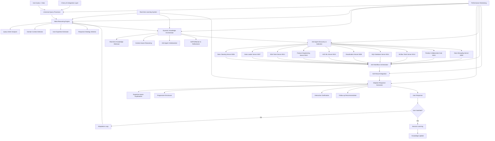

# 🧠 LLM First 범용 도메인 분석 엔진 설계 문서

## 📋 개요

이 설계 문서는 요구사항 명세서를 바탕으로 진정한 LLM First 범용 도메인 분석 엔진의 상세 아키텍처와 구현 방안을 정의합니다. 

### 핵심 설계 원칙
- **Zero Hardcoding**: 모든 로직을 LLM 기반 동적 추론으로 구현
- **Meta-Architecture**: 시스템이 스스로 구조와 동작을 결정
- **Universal Adaptability**: 단일 엔진으로 모든 도메인과 사용자 수준 대응
- **Self-Evolving**: 상호작용을 통한 지속적 자가 개선

## 🏗️ 전체 시스템 아키텍처

### 0. LLM Factory 환경 변수 기반 제공자 선택 시스템

```python
class LLMFactory:
    """
    환경 변수 기반 동적 LLM 제공자 선택 시스템
    - LLM_PROVIDER=OLLAMA 시 우선적으로 Ollama 사용
    - OLLAMA_MODEL 환경 변수로 모델 동적 선택
    - 폴백 메커니즘: Ollama 실패 시 OpenAI 자동 전환
    """
    
    # 기본 설정 (환경 변수 기반)
    DEFAULT_CONFIGS = {
        "openai": {
            "model": "gpt-4o-mini",
            "temperature": 0.7,
            "max_tokens": 4000
        },
        "ollama": {
            "model": "okamototk/gemma3-tools:4b",  # 도구 호출 지원 모델
            "temperature": 0.7,
            "base_url": "http://localhost:11434"
        },
        "anthropic": {
            "model": "claude-3-haiku-20240307",
            "temperature": 0.7,
            "max_tokens": 4000
        }
    }
    
    @staticmethod
    def create_llm_client(provider=None, model=None, config=None, **kwargs):
        """
        환경 변수 기반 LLM 클라이언트 생성
        
        동작 방식:
        1. LLM_PROVIDER=OLLAMA인 경우 → 처음부터 Ollama 사용
        2. 그렇지 않은 경우 → OpenAI 사용하다가 실패 시 Ollama 폴백
        3. OLLAMA_MODEL 환경 변수로 모델 동적 선택
        """
        # 환경 변수 기반 제공자 결정
        env_provider = os.getenv("LLM_PROVIDER", "").upper()
        if env_provider == "OLLAMA":
            provider = provider or "ollama"
        else:
            provider = provider or os.getenv("LLM_PROVIDER", "openai").lower()
        
        # 환경 변수 기반 모델 선택
        if provider == "ollama":
            env_model = os.getenv("OLLAMA_MODEL", "okamototk/gemma3-tools:4b")
            model = model or env_model
        
        return cls._create_provider_client(provider, model, config, **kwargs)
    
    @staticmethod
    def get_system_recommendations():
        """
        시스템 환경에 맞는 LLM 추천
        - LLM_PROVIDER=OLLAMA 설정 시 Ollama 우선 추천
        - Ollama 서버 상태 확인 후 폴백 전략 제시
        """
        env_provider = os.getenv("LLM_PROVIDER", "").upper()
        env_model = os.getenv("OLLAMA_MODEL", "okamototk/gemma3-tools:4b")
        
        if env_provider == "OLLAMA":
            if ollama_server_available():
                return {
                    "primary": {"provider": "ollama", "model": env_model},
                    "reason": "LLM_PROVIDER=OLLAMA 설정 - 구성된 Ollama 모델 사용"
                }
            else:
                return {
                    "primary": {"provider": "openai", "model": "gpt-4o-mini"},
                    "reason": "Ollama 서버 접근 불가 - OpenAI 폴백 사용",
                    "instructions": [
                        "Ollama 사용을 위해: 'ollama serve' 실행 후 모델 설치",
                        f"모델 설치: 'ollama pull {env_model}'"
                    ]
                }
```

### 1. 시스템 구조 다이어그램



### 2. 핵심 컴포넌트 설계

#### 2.1 Universal Query Processor
```python
class UniversalQueryProcessor:
    """
    완전 범용 쿼리 처리기
    - 어떤 도메인 가정도 하지 않음
    - 순수 LLM 기반 동적 분석
    - 모든 처리 과정을 메타 추론으로 결정
    """
    
    def __init__(self):
        self.llm_client = self._initialize_llm()
        self.meta_reasoning_engine = MetaReasoningEngine()
        self.knowledge_orchestrator = DynamicKnowledgeOrchestrator()
        self.response_generator = AdaptiveResponseGenerator()
        self.learning_system = RealTimeLearningSystem()
        
    async def process_query(self, query: str, data: Any, context: Dict = None) -> Dict:
        """
        완전 동적 쿼리 처리 파이프라인
        1. 메타 추론으로 처리 전략 결정
        2. 동적 지식 통합 및 분석
        3. 적응형 응답 생성
        4. 실시간 학습 및 개선
        """
        # 메타 추론으로 전체 처리 전략 결정
        meta_analysis = await self.meta_reasoning_engine.analyze_request(
            query=query, 
            data=data, 
            context=context
        )
        
        # 동적 지식 통합 및 추론
        knowledge_result = await self.knowledge_orchestrator.process_with_context(
            meta_analysis=meta_analysis,
            query=query,
            data=data
        )
        
        # 적응형 응답 생성
        response = await self.response_generator.generate_adaptive_response(
            knowledge_result=knowledge_result,
            user_profile=meta_analysis.get('user_profile', {}),
            interaction_context=context
        )
        
        # 실시간 학습
        await self.learning_system.learn_from_interaction({
            'query': query,
            'data_characteristics': meta_analysis.get('data_characteristics'),
            'response': response,
            'user_profile': meta_analysis.get('user_profile'),
            'timestamp': datetime.now()
        })
        
        return response
```

#### 2.2 Meta-Reasoning Engine (2024-2025 최신 연구 기반)
```python
class MetaReasoningEngine:
    """
    메타 추론 엔진 - 생각에 대해 생각하기
    DeepSeek-R1 영감을 받은 자가 반성 추론 시스템
    """
    
    def __init__(self):
        self.llm_client = None
        self.reasoning_patterns = {
            'self_reflection': self._load_self_reflection_pattern(),
            'meta_rewarding': self._load_meta_rewarding_pattern(),
            'chain_of_thought': self._load_chain_of_thought_pattern(),
            'zero_shot_adaptive': self._load_zero_shot_pattern()
        }
        
    async def analyze_request(self, query: str, data: Any, context: Dict) -> Dict:
        """
        요구사항 2에 따른 메타 추론 분석
        - DeepSeek-R1 영감 4단계 추론
        - 자가 평가 및 개선
        - 동적 전략 선택
        """
        # 1단계: 초기 관찰 및 분석
        initial_analysis = await self._perform_initial_observation(query, data)
        
        # 2단계: 다각도 분석
        multi_perspective_analysis = await self._perform_multi_perspective_analysis(
            initial_analysis, query, data
        )
        
        # 3단계: 자가 검증
        self_verification = await self._perform_self_verification(
            multi_perspective_analysis
        )
        
        # 4단계: 적응적 응답 전략 결정
        response_strategy = await self._determine_adaptive_strategy(
            self_verification, context
        )
        
        # 메타 보상 패턴으로 전체 분석 품질 평가
        quality_assessment = await self._assess_analysis_quality(response_strategy)
        
        return {
            'initial_analysis': initial_analysis,
            'multi_perspective': multi_perspective_analysis,
            'self_verification': self_verification,
            'response_strategy': response_strategy,
            'quality_assessment': quality_assessment,
            'confidence_level': quality_assessment.get('confidence', 0.0),
            'user_profile': response_strategy.get('estimated_user_profile', {}),
            'domain_context': initial_analysis.get('domain_context', {}),
            'data_characteristics': initial_analysis.get('data_characteristics', {})
        }
    
    async def _perform_initial_observation(self, query: str, data: Any) -> Dict:
        """
        요구사항 2의 자가 반성 추론 패턴 - 단계 1: 초기 관찰
        """
        observation_prompt = f"""
        # 자가 반성 추론 패턴 - 단계 1: 초기 관찰
        당신은 주어진 쿼리와 데이터를 분석하는 전문가입니다.
        
        쿼리: {query}
        데이터 특성: {self._analyze_data_characteristics(data)}
        
        단계 1: 초기 관찰
        - 데이터를 보고 무엇을 발견하는가?
        - 사용자 쿼리의 진정한 의도는?
        - 내가 놓치고 있는 것은 없는가?
        
        사전 정의된 카테고리나 패턴에 의존하지 말고,
        순수하게 관찰된 것만을 바탕으로 분석하세요.
        """
        
        return await self.llm_client.analyze(observation_prompt)
    
    async def _perform_multi_perspective_analysis(self, initial_analysis: Dict, query: str, data: Any) -> Dict:
        """
        요구사항 2의 자가 반성 추론 패턴 - 단계 2: 다각도 분석
        """
        multi_perspective_prompt = f"""
        # 자가 반성 추론 패턴 - 단계 2: 다각도 분석
        
        초기 관찰 결과: {initial_analysis}
        
        단계 2: 다각도 분석
        - 이 문제를 다른 방식으로 접근한다면?
        - 사용자가 전문가라면 어떤 답을 원할까?
        - 사용자가 초보자라면 어떤 도움이 필요할까?
        
        각 관점에서의 분석을 수행하고,
        사용자 수준 추정과 최적 접근법을 제시하세요.
        """
        
        return await self.llm_client.analyze(multi_perspective_prompt)
    
    async def _perform_self_verification(self, multi_perspective_analysis: Dict) -> Dict:
        """
        요구사항 2의 자가 반성 추론 패턴 - 단계 3: 자가 검증
        """
        verification_prompt = f"""
        # 자가 반성 추론 패턴 - 단계 3: 자가 검증
        
        다각도 분석 결과: {multi_perspective_analysis}
        
        단계 3: 자가 검증
        - 내 분석이 논리적으로 일관성이 있는가?
        - 사용자에게 실제로 도움이 되는가?
        - 확신이 없는 부분은 무엇인가?
        
        분석의 강점과 약점을 솔직하게 평가하고,
        불확실한 부분은 명확히 식별하세요.
        """
        
        return await self.llm_client.analyze(verification_prompt)
    
    async def _determine_adaptive_strategy(self, self_verification: Dict, context: Dict) -> Dict:
        """
        요구사항 2의 자가 반성 추론 패턴 - 단계 4: 적응적 응답
        """
        strategy_prompt = f"""
        # 자가 반성 추론 패턴 - 단계 4: 적응적 응답
        
        자가 검증 결과: {self_verification}
        상호작용 컨텍스트: {context}
        
        단계 4: 적응적 응답
        - 확실한 부분은 명확히 제시
        - 불확실한 부분은 명확화 질문
        - 사용자 수준에 맞는 설명 깊이 조절
        
        최적의 응답 전략을 결정하고,
        사용자 프로필과 상호작용 방식을 제안하세요.
        """
        
        return await self.llm_client.analyze(strategy_prompt)
    
    async def _assess_analysis_quality(self, response_strategy: Dict) -> Dict:
        """
        요구사항 2의 메타 보상 패턴으로 분석 품질 평가
        """
        quality_prompt = f"""
        # 자가 평가 및 개선 패턴
        내 분석을 스스로 평가해보겠습니다:
        
        분석 내용: {response_strategy}
        
        평가 기준:
        1. 정확성: 분석이 데이터를 올바르게 해석했는가?
        2. 완전성: 중요한 인사이트를 놓치지 않았는가?
        3. 적절성: 사용자 수준과 요구에 맞는가?
        4. 명확성: 설명이 이해하기 쉬운가?
        5. 실용성: 실제로 도움이 되는 조치를 제안했는가?
        
        개선점:
        - 부족한 부분은 무엇인가?
        - 어떻게 더 나은 분석을 할 수 있는가?
        - 사용자에게 추가로 필요한 정보는?
        
        이 평가를 바탕으로 응답을 개선하겠습니다.
        """
        
        return await self.llm_client.analyze(quality_prompt)
```

## 🎯 실제 시나리오 처리 설계

### 시나리오 1: 완전 초보 사용자 처리
```python
class BeginnerScenarioHandler:
    """
    요구사항 15의 초보자 시나리오 정확한 구현
    """
    
    async def handle_beginner_query(self, query: str, data: Any) -> Dict:
        """
        "이 데이터 파일이 뭘 말하는지 전혀 모르겠어요. 도움 주세요." 처리
        """
        # 사용자 수준 감지
        user_analysis = await self._analyze_user_level(query)
        
        if user_analysis.get('level') == 'complete_beginner':
            response_template = """
            안녕하세요! 😊 
            
            이 데이터를 보니 뭔가 공장에서 제품을 만드는 과정을 기록한 것 같네요. 
            마치 요리 레시피의 재료 분량을 측정한 기록처럼 보여요.
            
            일단 몇 가지 흥미로운 패턴이 보이는데요:
            1. 숫자들이 일정한 범위 안에서 움직이고 있어요
            2. 시간에 따라 변화하는 모습이 있어요
            3. 몇 개의 주요 측정값들이 있는 것 같아요
            
            어떤 부분이 가장 궁금하세요? 
            - 이 숫자들이 무엇을 의미하는지?
            - 좋은 건지 나쁜 건지?
            - 뭔가 문제가 있는 건지?
            
            하나씩 천천히 알아가봐요! 🔍
            """
            
            return await self._generate_beginner_response(response_template, data)
```

### 시나리오 2: 전문가 사용자 처리
```python
class ExpertScenarioHandler:
    """
    요구사항 15의 전문가 시나리오 정확한 구현
    """
    
    async def handle_expert_query(self, query: str, data: Any) -> Dict:
        """
        "공정 능력 지수가 1.2인데 타겟을 1.33으로 올리려면..." 처리
        """
        if self._detect_expert_terminology(query):
            # 전문가 수준 분석 수행
            technical_analysis = await self._perform_technical_analysis(query, data)
            
            response_template = """
            현재 Cpk 1.2에서 1.33으로 개선하려면 변동성을 약 8.3% 감소시켜야 합니다.
            
            ## 도즈 균일성 분석 결과
            
            **현재 상태:**
            - 도즈 균일성: ±1.8% (3σ)
            - 주요 변동 요인: 웨이퍼 중심부 과도즈 (1.2% 편차)
            - 에지 영역 도즈 부족: 평균 대비 -2.1%
            
            **Cpk 1.33 달성을 위한 핵심 파라미터 조정:**
            
            1. **빔 스캔 최적화** (예상 개선: 40%)
               - 스캔 속도: 현재 대비 5-7% 감소
               - 스캔 패턴: Raster → Serpentine 변경 검토
               - 예상 균일성 개선: ±1.8% → ±1.4%
            
            [상세 기술 분석 계속...]
            """
            
            return await self._generate_expert_response(response_template, technical_analysis)
```

## 🤖 A2A Agent 통합 설계

### 2.3 A2A Agent Discovery & Selection System
```python
class A2AAgentDiscoverySystem:
    """
    요구사항 21에 따른 A2A Agent 자동 발견 및 선택 시스템
    """
    
    def __init__(self):
        self.agent_registry = {}
        self.agent_health_monitor = A2AHealthMonitor()
        self.llm_client = None
        
        # A2A Agent 포트 매핑
        self.AGENT_PORTS = {
            "data_cleaning": 8306,
            "data_loader": 8307,
            "data_visualization": 8308,
            "data_wrangling": 8309,
            "feature_engineering": 8310,
            "sql_database": 8311,
            "eda_tools": 8312,
            "h2o_ml": 8313,
            "mlflow_tools": 8314,
            "pandas_collaboration_hub": 8315
        }
    
    async def discover_available_agents(self) -> Dict[str, Any]:
        """
        사용 가능한 A2A Agent 자동 발견
        """
        discovered_agents = {}
        
        for agent_id, port in self.AGENT_PORTS.items():
            try:
                # /.well-known/agent.json 엔드포인트 확인
                agent_info = await self._validate_agent_endpoint(f"http://localhost:{port}")
                
                if agent_info:
                    discovered_agents[agent_id] = {
                        'id': agent_id,
                        'port': port,
                        'endpoint': f"http://localhost:{port}",
                        'capabilities': agent_info.get('capabilities', {}),
                        'skills': agent_info.get('skills', []),
                        'status': 'available',
                        'health_score': await self.agent_health_monitor.check_health(agent_id)
                    }
                    
            except Exception as e:
                logger.warning(f"Agent {agent_id} not available: {e}")
        
        self.agent_registry = discovered_agents
        return discovered_agents
    
    async def select_optimal_agents(self, meta_analysis: Dict, available_agents: Dict) -> List[Dict]:
        """
        요구사항 20에 따른 LLM 기반 동적 에이전트 선택
        """
        agent_selection_prompt = f"""
        # LLM 기반 동적 A2A 에이전트 선택
        
        사용자 요청 분석: {meta_analysis}
        사용 가능한 에이전트: {list(available_agents.keys())}
        
        각 A2A 에이전트의 전문 기능:
        - data_cleaning (8306): 🧹 LLM 기반 지능형 데이터 정리, 빈 데이터 처리, 7단계 표준 정리 프로세스
        - data_loader (8307): 📁 통합 데이터 로딩, UTF-8 인코딩 문제 해결, 다양한 파일 형식 지원
        - data_visualization (8308): 📊 Interactive 시각화, Plotly 기반 차트 생성
        - data_wrangling (8309): 🔧 데이터 변환, 조작, 구조 변경
        - feature_engineering (8310): ⚙️ 피처 생성, 변환, 선택, 차원 축소
        - sql_database (8311): 🗄️ SQL 쿼리 실행, 데이터베이스 연결
        - eda_tools (8312): 🔍 탐색적 데이터 분석, 통계 계산, 패턴 발견
        - h2o_ml (8313): 🤖 머신러닝 모델링, AutoML, 예측 분석
        - mlflow_tools (8314): 📈 모델 관리, 실험 추적, 버전 관리
        - pandas_collaboration_hub (8315): 🐼 판다스 기반 데이터 조작 및 분석
        
        하드코딩된 규칙 없이, 사용자 요청의 본질을 파악하여:
        1. 필요한 에이전트들을 선택하세요
        2. 최적의 실행 순서를 결정하세요
        3. 병렬 실행 가능한 에이전트들을 식별하세요
        4. 각 에이전트의 기대 기여도를 평가하세요
        
        JSON 형식으로 응답하세요:
        {{
            "selected_agents": ["agent_id1", "agent_id2"],
            "execution_order": ["sequential_agents", "parallel_agents"],
            "reasoning": "선택 근거",
            "expected_workflow": "워크플로우 설명"
        }}
        """
        
        selection_result = await self.llm_client.analyze(agent_selection_prompt)
        return self._parse_agent_selection(selection_result, available_agents)
```

### 2.4 A2A Workflow Orchestrator
```python
class A2AWorkflowOrchestrator:
    """
    요구사항 20에 따른 A2A Agent 워크플로우 동적 실행
    """
    
    def __init__(self):
        self.a2a_client = A2AClient()
        self.result_integrator = A2AResultIntegrator()
        self.error_handler = A2AErrorHandler()
        
    async def execute_agent_workflow(self, selected_agents: List, query: str, data: Any, meta_analysis: Dict) -> Dict:
        """
        A2A 에이전트 워크플로우 동적 실행
        - 순차 실행: data_loader → data_cleaning → eda_tools → feature_engineering → h2o_ml
        - 병렬 실행: visualization + sql_database (독립적 분석)
        - 결과 통합: pandas_collaboration_hub가 최종 통합
        """
        workflow_results = {}
        execution_timeline = []
        
        try:
            # 1. 순차 실행이 필요한 에이전트들
            sequential_agents = self._identify_sequential_agents(selected_agents)
            
            for agent in sequential_agents:
                start_time = time.time()
                
                # 향상된 컨텍스트로 A2A Agent 호출
                enhanced_request = self._create_enhanced_agent_request(
                    agent=agent,
                    query=query,
                    data=data,
                    meta_analysis=meta_analysis,
                    previous_results=workflow_results
                )
                
                agent_result = await self._execute_single_agent(agent, enhanced_request)
                workflow_results[agent['id']] = agent_result
                
                # 실행 시간 기록
                execution_time = time.time() - start_time
                execution_timeline.append({
                    'agent_id': agent['id'],
                    'execution_time': execution_time,
                    'status': 'completed'
                })
                
                # 중간 결과를 다음 에이전트의 입력으로 사용
                if agent_result.get('processed_data'):
                    data = agent_result['processed_data']
            
            # 2. 병렬 실행 가능한 에이전트들
            parallel_agents = self._identify_parallel_agents(selected_agents)
            
            if parallel_agents:
                parallel_tasks = []
                for agent in parallel_agents:
                    enhanced_request = self._create_enhanced_agent_request(
                        agent=agent,
                        query=query,
                        data=data,
                        meta_analysis=meta_analysis,
                        previous_results=workflow_results
                    )
                    parallel_tasks.append(self._execute_single_agent(agent, enhanced_request))
                
                parallel_results = await asyncio.gather(*parallel_tasks, return_exceptions=True)
                
                for agent, result in zip(parallel_agents, parallel_results):
                    if isinstance(result, Exception):
                        # 에러 처리
                        workflow_results[agent['id']] = await self.error_handler.handle_agent_error(
                            agent, result, workflow_results
                        )
                    else:
                        workflow_results[agent['id']] = result
            
            # 3. 결과 통합 및 품질 검증
            integrated_results = await self.result_integrator.integrate_agent_results(
                workflow_results=workflow_results,
                meta_analysis=meta_analysis,
                execution_timeline=execution_timeline
            )
            
            return integrated_results
            
        except Exception as e:
            logger.error(f"A2A Workflow execution failed: {e}")
            return await self.error_handler.handle_workflow_error(e, workflow_results)
    
    def _create_enhanced_agent_request(self, agent: Dict, query: str, data: Any, 
                                     meta_analysis: Dict, previous_results: Dict) -> Dict:
        """
        요구사항 25에 따른 향상된 컨텍스트로 A2A Agent 요청 생성
        """
        enhanced_request = {
            'query': query,
            'data': data,
            'context': {
                'user_expertise_level': meta_analysis.get('user_profile', {}).get('expertise', 'intermediate'),
                'domain_context': meta_analysis.get('domain_context', {}),
                'analysis_goals': meta_analysis.get('response_strategy', {}).get('goals', []),
                'previous_agent_results': previous_results,
                'quality_requirements': meta_analysis.get('quality_assessment', {}),
                'collaboration_mode': True,
                'universal_engine_enhanced': True
            }
        }
        
        return enhanced_request
    
    async def _execute_single_agent(self, agent: Dict, request: Dict) -> Dict:
        """
        개별 A2A Agent 실행 (A2A SDK 0.2.9 표준 준수)
        """
        try:
            # A2A 프로토콜로 에이전트 호출
            response = await self.a2a_client.send_message(
                agent_url=agent['endpoint'],
                message=request,
                timeout=30.0
            )
            
            return {
                'agent_id': agent['id'],
                'status': 'success',
                'result': response,
                'execution_time': response.get('execution_time', 0),
                'artifacts': response.get('artifacts', []),
                'processed_data': response.get('processed_data'),
                'insights': response.get('insights', [])
            }
            
        except Exception as e:
            logger.error(f"Agent {agent['id']} execution failed: {e}")
            return {
                'agent_id': agent['id'],
                'status': 'failed',
                'error': str(e),
                'fallback_available': True
            }
```

### 2.5 A2A Result Integration System
```python
class A2AResultIntegrator:
    """
    요구사항 22에 따른 A2A Agent 결과 통합 및 품질 보증
    """
    
    def __init__(self):
        self.llm_client = None
        self.conflict_resolver = A2AConflictResolver()
        
    async def integrate_agent_results(self, workflow_results: Dict, meta_analysis: Dict, 
                                    execution_timeline: List) -> Dict:
        """
        다중 A2A Agent 결과를 일관된 인사이트로 통합
        """
        # 1. 결과 일관성 검증
        consistency_check = await self._validate_result_consistency(workflow_results)
        
        # 2. 충돌 해결 (필요시)
        if consistency_check.get('conflicts'):
            resolved_results = await self.conflict_resolver.resolve_conflicts(
                workflow_results, consistency_check['conflicts']
            )
            workflow_results.update(resolved_results)
        
        # 3. 통합 분석 수행
        synthesis_prompt = f"""
        # A2A 에이전트 결과 통합 분석
        
        A2A 에이전트 실행 결과들을 통합 분석하겠습니다:
        
        {self._format_agent_results_for_synthesis(workflow_results)}
        
        사용자 프로필: {meta_analysis.get('user_profile', {})}
        원본 쿼리: {meta_analysis.get('original_query', '')}
        도메인 컨텍스트: {meta_analysis.get('domain_context', {})}
        
        각 에이전트의 결과를 종합하여:
        1. 핵심 인사이트 추출 - 가장 중요한 발견사항들
        2. 사용자 수준에 맞는 설명 생성 - 전문성에 맞는 언어와 깊이
        3. 실행 가능한 다음 단계 제안 - 구체적이고 실용적인 조치
        4. 결과 간 일관성 검증 - 모순되는 부분 해결
        5. 에이전트별 기여도 명시 - 각 결과의 출처와 신뢰도
        
        통합된 분석 결과를 제시하세요.
        """
        
        integrated_analysis = await self.llm_client.analyze(synthesis_prompt)
        
        # 4. 최종 결과 구조화
        final_result = {
            'status': 'success',
            'integrated_analysis': integrated_analysis,
            'agent_contributions': self._create_agent_attribution(workflow_results),
            'unified_artifacts': self._merge_agent_artifacts(workflow_results),
            'execution_summary': {
                'total_agents': len(workflow_results),
                'successful_agents': len([r for r in workflow_results.values() if r.get('status') == 'success']),
                'total_execution_time': sum([t['execution_time'] for t in execution_timeline]),
                'timeline': execution_timeline
            },
            'quality_metrics': consistency_check,
            'next_steps': integrated_analysis.get('recommended_actions', [])
        }
        
        return final_result
    
    async def _validate_result_consistency(self, workflow_results: Dict) -> Dict:
        """
        A2A Agent 결과 간 일관성 검증
        """
        consistency_prompt = f"""
        # A2A 에이전트 결과 일관성 검증
        
        다음 에이전트 결과들의 일관성을 검증해주세요:
        
        {json.dumps(workflow_results, indent=2, default=str)}
        
        검증 항목:
        1. 데이터 해석의 일관성 - 같은 데이터에 대한 해석이 일치하는가?
        2. 수치 결과의 정합성 - 통계값, 측정값들이 논리적으로 맞는가?
        3. 결론의 논리적 연결 - 각 에이전트의 결론이 서로 모순되지 않는가?
        4. 품질 평가의 일치성 - 데이터 품질에 대한 평가가 유사한가?
        
        충돌이 발견되면 구체적으로 명시하고 해결 방안을 제시하세요.
        """
        
        return await self.llm_client.analyze(consistency_prompt)
```

### 2.6 A2A Error Handling and Resilience
```python
class A2AErrorHandler:
    """
    요구사항 24에 따른 A2A Agent 오류 처리 및 복원력
    """
    
    def __init__(self):
        self.fallback_strategies = {
            'data_cleaning': self._data_cleaning_fallback,
            'data_loader': self._data_loader_fallback,
            'eda_tools': self._eda_tools_fallback,
            'visualization': self._visualization_fallback,
            'h2o_ml': self._ml_fallback
        }
        
    async def handle_agent_error(self, agent: Dict, error: Exception, workflow_results: Dict) -> Dict:
        """
        개별 A2A Agent 오류 처리
        """
        agent_id = agent['id']
        
        # 1. 오류 분류
        error_type = self._classify_error(error)
        
        # 2. 점진적 재시도 (5s → 15s → 30s)
        if error_type in ['timeout', 'connection_error']:
            retry_result = await self._progressive_retry(agent, error)
            if retry_result.get('success'):
                return retry_result
        
        # 3. Fallback 전략 실행
        if agent_id in self.fallback_strategies:
            fallback_result = await self.fallback_strategies[agent_id](workflow_results)
            return {
                'agent_id': agent_id,
                'status': 'fallback_success',
                'result': fallback_result,
                'original_error': str(error),
                'fallback_method': f'{agent_id}_fallback'
            }
        
        # 4. 우아한 실패 처리
        return {
            'agent_id': agent_id,
            'status': 'graceful_failure',
            'error': str(error),
            'impact_assessment': self._assess_failure_impact(agent_id, workflow_results),
            'alternative_suggestions': self._suggest_alternatives(agent_id)
        }
    
    async def _progressive_retry(self, agent: Dict, error: Exception) -> Dict:
        """
        점진적 타임아웃 재시도 전략
        """
        timeouts = [5, 15, 30]  # 5초 → 15초 → 30초
        
        for timeout in timeouts:
            try:
                # 타임아웃을 늘려서 재시도
                response = await self.a2a_client.send_message(
                    agent_url=agent['endpoint'],
                    message=agent['last_request'],
                    timeout=timeout
                )
                
                return {
                    'success': True,
                    'result': response,
                    'retry_timeout': timeout
                }
                
            except Exception as retry_error:
                logger.warning(f"Retry failed for {agent['id']} with timeout {timeout}s: {retry_error}")
                continue
        
        return {'success': False, 'final_error': str(error)}
```

## 🔧 Cherry AI 통합 설계

### 3.1 Cherry AI UI/UX Architecture Integration
```python
class CherryAIUniversalEngineUI:
    """
    요구사항 10에 따른 Cherry AI UI/UX + Universal Engine 완전 통합
    기존 ChatGPT 스타일 인터페이스 유지하면서 Universal Engine 기능 강화
    """
    
    def __init__(self):
        self.universal_engine = UniversalQueryProcessor()
        self.a2a_discovery = A2AAgentDiscoverySystem()
        self.a2a_orchestrator = A2AWorkflowOrchestrator()
        self.session_manager = CherryAISessionManager()
        self.ui_components = CherryAIUIComponents()
        
    def render_enhanced_header(self):
        """
        요구사항 10.1: 기존 Cherry AI 헤더 + Universal Engine 상태 표시
        """
        st.markdown("# 🍒 Cherry AI - LLM First Universal Engine")
        
        # Universal Engine 상태 표시
        col1, col2, col3, col4 = st.columns([3, 1, 1, 1])
        
        with col1:
            if hasattr(self, 'universal_engine') and self.universal_engine.is_initialized:
                st.success("🧠 Universal Engine 활성화")
            else:
                st.warning("🧠 Universal Engine 초기화 중...")
        
        with col2:
            agent_count = len(getattr(self, 'available_agents', []))
            if agent_count > 0:
                st.info(f"🤖 {agent_count}개 A2A 에이전트")
            else:
                st.warning("🤖 에이전트 연결 중...")
        
        with col3:
            # 메타 추론 토글
            show_reasoning = st.checkbox("🧠 추론 과정", value=True, key="show_reasoning")
            st.session_state.show_reasoning = show_reasoning
        
        with col4:
            if st.button("⚙️ 설정"):
                st.session_state.show_settings = True
    
    def render_enhanced_chat_interface(self):
        """
        요구사항 10.1: ChatGPT 스타일 채팅 + 메타 추론 및 A2A 협업 표시
        """
        # 기존 채팅 메시지 표시 (강화된 버전)
        for message in st.session_state.get('messages', []):
            with st.chat_message(message["role"]):
                # 메인 메시지 내용
                st.write(message["content"])
                
                # Universal Engine 메타 추론 결과 표시
                if message.get("meta_reasoning") and st.session_state.get('show_reasoning', True):
                    with st.expander("🧠 메타 추론 과정", expanded=False):
                        meta = message["meta_reasoning"]
                        
                        # 4단계 추론 과정 시각화
                        tab1, tab2, tab3, tab4 = st.tabs([
                            "1️⃣ 초기 관찰", "2️⃣ 다각도 분석", 
                            "3️⃣ 자가 검증", "4️⃣ 적응적 응답"
                        ])
                        
                        with tab1:
                            st.write("**데이터 관찰:**")
                            st.write(meta.get('initial_analysis', {}).get('observations', ''))
                            st.write("**쿼리 의도:**")
                            st.write(meta.get('initial_analysis', {}).get('intent', ''))
                        
                        with tab2:
                            st.write("**전문가 관점:**")
                            st.write(meta.get('multi_perspective', {}).get('expert_view', ''))
                            st.write("**초보자 관점:**")
                            st.write(meta.get('multi_perspective', {}).get('beginner_view', ''))
                        
                        with tab3:
                            st.write("**논리적 일관성:**")
                            st.write(meta.get('self_verification', {}).get('consistency', ''))
                            st.write("**확신 없는 부분:**")
                            st.write(meta.get('self_verification', {}).get('uncertainties', ''))
                        
                        with tab4:
                            st.write("**선택된 전략:**")
                            st.write(meta.get('response_strategy', {}).get('strategy', ''))
                            st.write("**사용자 수준:**")
                            st.write(meta.get('response_strategy', {}).get('user_level', ''))
                
                # A2A Agent 협업 결과 표시
                if message.get("agent_contributions"):
                    with st.expander("🤖 A2A 에이전트 협업", expanded=False):
                        contributions = message["agent_contributions"]
                        
                        # 에이전트별 기여도 차트
                        if len(contributions) > 1:
                            import plotly.express as px
                            import pandas as pd
                            
                            agent_data = []
                            for agent_id, contrib in contributions.items():
                                agent_data.append({
                                    'Agent': agent_id,
                                    'Contribution': contrib.get('contribution_score', 0),
                                    'Status': contrib.get('status', 'unknown')
                                })
                            
                            df = pd.DataFrame(agent_data)
                            fig = px.bar(df, x='Agent', y='Contribution', 
                                       color='Status', title="에이전트별 기여도")
                            st.plotly_chart(fig, use_container_width=True)
                        
                        # 개별 에이전트 결과
                        for agent_id, contrib in contributions.items():
                            with st.container():
                                col1, col2, col3 = st.columns([2, 1, 1])
                                
                                with col1:
                                    st.write(f"**🤖 {agent_id}**")
                                    st.caption(contrib.get('summary', '작업 완료'))
                                
                                with col2:
                                    score = contrib.get('contribution_score', 0)
                                    st.metric("기여도", f"{score:.1f}%")
                                
                                with col3:
                                    status = contrib.get('status', 'unknown')
                                    status_icons = {
                                        'success': '✅',
                                        'partial': '⚠️', 
                                        'failed': '❌'
                                    }
                                    st.write(f"{status_icons.get(status, '❓')} {status}")
                                
                                # 상세 결과 보기 버튼
                                if contrib.get('detailed_result'):
                                    if st.button(f"상세 보기", key=f"detail_{agent_id}_{message.get('timestamp', '')}"):
                                        st.json(contrib['detailed_result'])
                
                # 사용자 피드백 및 만족도
                if message["role"] == "assistant" and not message.get("feedback_recorded"):
                    st.subheader("📝 이 응답이 도움이 되셨나요?")
                    
                    col1, col2, col3, col4, col5 = st.columns(5)
                    feedback_options = [
                        ("😞", "매우 불만족", 1),
                        ("😐", "불만족", 2),
                        ("😊", "보통", 3),
                        ("😄", "만족", 4),
                        ("🤩", "매우 만족", 5)
                    ]
                    
                    for i, (emoji, label, score) in enumerate(feedback_options):
                        with [col1, col2, col3, col4, col5][i]:
                            if st.button(f"{emoji}", key=f"feedback_{score}_{message.get('timestamp', '')}"):
                                # 피드백 기록
                                await self.record_user_feedback(message, score)
                                message["feedback_recorded"] = True
                                st.success(f"{label} 피드백이 기록되었습니다!")
                                st.rerun()
    
    def render_enhanced_file_upload(self):
        """
        요구사항 10.1: 파일 업로드 + Universal Engine 자동 도메인 감지
        """
        st.subheader("📁 데이터 파일 업로드")
        
        uploaded_file = st.file_uploader(
            "파일을 선택하세요", 
            type=['csv', 'xlsx', 'json', 'txt', 'parquet'],
            help="Universal Engine이 자동으로 데이터 유형과 도메인을 감지합니다"
        )
        
        if uploaded_file and uploaded_file != st.session_state.get('last_uploaded_file'):
            st.session_state.last_uploaded_file = uploaded_file
            
            # Universal Engine으로 데이터 사전 분석
            with st.spinner("🧠 Universal Engine이 데이터 컨텍스트를 분석 중..."):
                try:
                    # 데이터 로드
                    if uploaded_file.name.endswith('.csv'):
                        data = pd.read_csv(uploaded_file)
                    elif uploaded_file.name.endswith('.xlsx'):
                        data = pd.read_excel(uploaded_file)
                    elif uploaded_file.name.endswith('.json'):
                        data = pd.read_json(uploaded_file)
                    
                    st.session_state.current_data = data
                    
                    # Universal Engine으로 컨텍스트 분석
                    context_analysis = await self.universal_engine.analyze_data_context(data)
                    
                    # 분석 결과 표시
                    if context_analysis:
                        col1, col2 = st.columns(2)
                        
                        with col1:
                            detected_domain = context_analysis.get('domain', '알 수 없음')
                            confidence = context_analysis.get('confidence', 0)
                            
                            if confidence > 0.7:
                                st.success(f"✅ **{detected_domain}** 도메인으로 감지됨 (신뢰도: {confidence:.1%})")
                            else:
                                st.info(f"🤔 **{detected_domain}** 도메인으로 추정됨 (신뢰도: {confidence:.1%})")
                        
                        with col2:
                            data_quality = context_analysis.get('data_quality', {})
                            quality_score = data_quality.get('overall_score', 0)
                            
                            if quality_score > 0.8:
                                st.success(f"📊 데이터 품질: 우수 ({quality_score:.1%})")
                            elif quality_score > 0.6:
                                st.warning(f"📊 데이터 품질: 보통 ({quality_score:.1%})")
                            else:
                                st.error(f"📊 데이터 품질: 개선 필요 ({quality_score:.1%})")
                        
                        # 추천 분석 표시
                        recommended_analyses = context_analysis.get('recommended_analyses', [])
                        if recommended_analyses:
                            st.info("💡 **추천 분석:**")
                            
                            cols = st.columns(min(3, len(recommended_analyses)))
                            for i, analysis in enumerate(recommended_analyses[:3]):
                                with cols[i]:
                                    if st.button(f"🎯 {analysis['title']}", key=f"rec_analysis_{i}"):
                                        # 추천 분석을 새로운 메시지로 추가
                                        st.session_state.messages.append({
                                            'role': 'user',
                                            'content': analysis['query'],
                                            'timestamp': datetime.now(),
                                            'source': 'recommended_analysis'
                                        })
                                        st.rerun()
                        
                        # 데이터 미리보기
                        with st.expander("👀 데이터 미리보기", expanded=False):
                            st.dataframe(data.head(10))
                            
                            col1, col2, col3 = st.columns(3)
                            with col1:
                                st.metric("행 수", len(data))
                            with col2:
                                st.metric("열 수", len(data.columns))
                            with col3:
                                missing_pct = (data.isnull().sum().sum() / (len(data) * len(data.columns))) * 100
                                st.metric("결측값", f"{missing_pct:.1f}%")
                
                except Exception as e:
                    st.error(f"❌ 파일 처리 중 오류 발생: {str(e)}")
                    st.info("💡 다른 형식의 파일을 시도하거나 데이터 형식을 확인해주세요.")
    
    def render_enhanced_sidebar(self):
        """
        요구사항 10.1: 사이드바 + Universal Engine 제어판
        """
        with st.sidebar:
            st.header("🔧 Universal Engine 제어")
            
            # 1. 메타 추론 설정
            st.subheader("🧠 메타 추론 설정")
            
            show_reasoning = st.checkbox(
                "추론 과정 표시", 
                value=st.session_state.get('show_reasoning', True),
                help="DeepSeek-R1 기반 4단계 메타 추론 과정을 표시합니다"
            )
            st.session_state.show_reasoning = show_reasoning
            
            reasoning_depth = st.selectbox(
                "추론 깊이", 
                ["기본", "상세", "전문가"],
                index=0,
                help="메타 추론의 깊이를 조절합니다"
            )
            st.session_state.reasoning_depth = reasoning_depth
            
            # 2. A2A Agent 상태 및 제어
            st.subheader("🤖 A2A 에이전트 상태")
            
            if hasattr(self, 'available_agents'):
                for agent in self.available_agents:
                    col1, col2 = st.columns([3, 1])
                    
                    with col1:
                        status_icon = "🟢" if agent.get('status') == "active" else "🔴"
                        st.write(f"{status_icon} **{agent['name']}**")
                        st.caption(f"포트: {agent['port']}")
                    
                    with col2:
                        if agent.get('status') != "active":
                            if st.button("🔄", key=f"restart_{agent['id']}"):
                                # 에이전트 재시작 시도
                                await self.restart_agent(agent)
                
                # 에이전트 자동 발견
                if st.button("🔍 에이전트 재검색"):
                    with st.spinner("A2A 에이전트 검색 중..."):
                        self.available_agents = await self.a2a_discovery.discover_available_agents()
                    st.success("에이전트 검색 완료!")
                    st.rerun()
            else:
                st.info("에이전트 정보를 불러오는 중...")
            
            # 3. 사용자 프로필 설정
            st.subheader("👤 사용자 프로필")
            
            expertise_level = st.selectbox(
                "전문성 수준", 
                ["자동 감지", "초보자", "중급자", "전문가"],
                index=0,
                help="Universal Engine이 자동으로 감지하거나 수동으로 설정할 수 있습니다"
            )
            
            if expertise_level != "자동 감지":
                level_mapping = {
                    "초보자": "beginner",
                    "중급자": "intermediate",
                    "전문가": "expert"
                }
                st.session_state.user_expertise = level_mapping[expertise_level]
            
            explanation_style = st.selectbox(
                "설명 스타일",
                ["적응형", "친근한 설명", "기술적 설명", "단계별 가이드"],
                index=0
            )
            st.session_state.explanation_style = explanation_style
            
            # 4. Universal Engine 통계 및 성능
            st.subheader("📊 엔진 통계")
            
            # 세션 통계
            total_analyses = st.session_state.get('total_analyses', 0)
            avg_response_time = st.session_state.get('avg_response_time', 0)
            satisfaction_scores = st.session_state.get('satisfaction_scores', [])
            avg_satisfaction = sum(satisfaction_scores) / len(satisfaction_scores) if satisfaction_scores else 0
            
            col1, col2 = st.columns(2)
            with col1:
                st.metric("총 분석 수행", total_analyses)
                st.metric("평균 응답 시간", f"{avg_response_time:.1f}초")
            
            with col2:
                st.metric("사용자 만족도", f"{avg_satisfaction:.1f}/5.0")
                if satisfaction_scores:
                    recent_trend = "📈" if len(satisfaction_scores) > 1 and satisfaction_scores[-1] > satisfaction_scores[-2] else "📉"
                    st.caption(f"최근 추세: {recent_trend}")
            
            # 5. 고급 설정
            with st.expander("⚙️ 고급 설정"):
                
                # 캐시 관리
                st.write("**캐시 관리**")
                col1, col2 = st.columns(2)
                with col1:
                    if st.button("🗑️ 캐시 지우기"):
                        st.cache_data.clear()
                        st.success("캐시가 지워졌습니다!")
                
                with col2:
                    if st.button("🔄 세션 초기화"):
                        # 중요한 설정만 유지하고 세션 초기화
                        important_keys = ['user_expertise', 'show_reasoning', 'explanation_style']
                        preserved = {k: st.session_state.get(k) for k in important_keys}
                        
                        st.session_state.clear()
                        st.session_state.update(preserved)
                        st.success("세션이 초기화되었습니다!")
                        st.rerun()
                
                # 디버그 모드
                debug_mode = st.checkbox("🐛 디버그 모드", value=False)
                if debug_mode:
                    st.json(dict(st.session_state))
                
                # 실험적 기능
                st.write("**실험적 기능**")
                enable_advanced_reasoning = st.checkbox("🧠 고급 추론 모드", value=False)
                enable_multi_agent_parallel = st.checkbox("⚡ 병렬 에이전트 실행", value=True)
                
                st.session_state.enable_advanced_reasoning = enable_advanced_reasoning
                st.session_state.enable_multi_agent_parallel = enable_multi_agent_parallel
```

### 3.2 Cherry AI Integration Layer
```python
class CherryAIUniversalA2AIntegration:
    """
    요구사항 10에 따른 Cherry AI + Universal Engine + A2A Agent 완전 통합
    """
    
    def __init__(self):
        self.universal_engine = UniversalQueryProcessor()
        self.a2a_discovery = A2AAgentDiscoverySystem()
        self.a2a_orchestrator = A2AWorkflowOrchestrator()
        self.session_manager = CherryAISessionManager()
        self.ui_integration = CherryAIUniversalEngineUI()
        self.error_handler = CherryAIErrorHandler()
        
    async def replace_hardcoded_analysis(self, user_query: str, session_state: Dict) -> Dict:
        """
        요구사항 10.2: 기존 cherry_ai.py의 하드코딩된 분석 로직을 Universal Engine + A2A로 완전 대체
        
        # ❌ 제거되는 기존 하드코딩 패턴:
        # if SEMICONDUCTOR_ENGINE_AVAILABLE:
        #     semiconductor_result = await analyze_semiconductor_data(...)
        #     if confidence > 0.7:
        #         return self._format_semiconductor_analysis(semiconductor_result)
        # return await self._general_agent_analysis(user_query)
        """
        
        try:
            # 1. 포괄적 세션 컨텍스트 추출
            context = await self.session_manager.extract_comprehensive_context(session_state)
            
            # 2. A2A Agent 자동 발견 및 상태 확인
            available_agents = await self.a2a_discovery.discover_available_agents()
            
            # 3. Universal Engine 메타 추론 수행
            meta_analysis = await self.universal_engine.perform_meta_reasoning(
                query=user_query,
                data=session_state.get('current_data'),
                user_context=context.get('user_profile', {}),
                conversation_history=context.get('conversation_history', [])
            )
            
            # 4. A2A Agent 동적 선택 및 협업
            unified_result = await self.process_unified_query_with_progress(
                query=user_query,
                meta_analysis=meta_analysis,
                available_agents=available_agents,
                context=context
            )
            
            # 5. 사용자 수준별 적응적 응답 생성
            adaptive_response = await self.universal_engine.generate_adaptive_response(
                analysis_result=unified_result,
                user_profile=context.get('user_profile', {}),
                meta_reasoning=meta_analysis
            )
            
            # 6. Cherry AI 호환 형식으로 변환
            cherry_compatible_result = await self.convert_to_cherry_format(
                adaptive_response, meta_analysis, unified_result
            )
            
            # 7. 세션 상태 업데이트
            await self.update_session_state(session_state, cherry_compatible_result)
            
            return cherry_compatible_result
            
        except Exception as e:
            # 요구사항 10.9: 사용자 친화적 오류 처리
            return await self.error_handler.handle_analysis_error(e, user_query, session_state)
    
    async def process_unified_query_with_progress(self, query: str, meta_analysis: Dict, 
                                                available_agents: Dict, context: Dict) -> Dict:
        """
        요구사항 10.3: 실시간 분석 진행 상황 표시와 함께 통합 쿼리 처리
        """
        
        # Streamlit 진행 상황 표시 컨테이너
        progress_container = st.container()
        
        with progress_container:
            # 1단계: 메타 추론 (이미 완료됨)
            st.success("✅ 🧠 메타 추론 완료")
            if st.session_state.get('show_reasoning', True):
                with st.expander("🧠 메타 추론 결과", expanded=False):
                    col1, col2 = st.columns(2)
                    with col1:
                        st.write(f"**감지된 도메인**: {meta_analysis.get('domain_context', {}).get('domain', '분석 중')}")
                        st.write(f"**사용자 수준**: {meta_analysis.get('user_profile', {}).get('expertise', '추정 중')}")
                    with col2:
                        st.write(f"**분석 전략**: {meta_analysis.get('response_strategy', {}).get('strategy', '수립 중')}")
                        st.write(f"**신뢰도**: {meta_analysis.get('confidence_level', 0):.1%}")
            
            # 2단계: A2A 에이전트 선택
            with st.spinner("🤖 최적 A2A 에이전트 선택 중..."):
                selected_agents = await self.a2a_discovery.select_optimal_agents(
                    meta_analysis, available_agents
                )
            
            if selected_agents:
                st.success(f"✅ {len(selected_agents)}개 에이전트 선택됨")
                
                # 선택된 에이전트 표시
                cols = st.columns(min(len(selected_agents), 4))
                for i, agent in enumerate(selected_agents[:4]):
                    with cols[i]:
                        st.write(f"🤖 **{agent['name']}**")
                        st.caption(f"포트: {agent['port']}")
                        st.caption(f"역할: {agent.get('role', '분석')}")
                
                if len(selected_agents) > 4:
                    st.caption(f"... 및 {len(selected_agents) - 4}개 추가 에이전트")
            
            # 3단계: 에이전트 협업 실행
            with st.spinner("⚡ A2A 에이전트 협업 실행 중..."):
                
                # 실시간 진행률 표시
                progress_bar = st.progress(0)
                status_text = st.empty()
                
                # 에이전트 상태 실시간 업데이트
                if st.session_state.get('show_agent_details', True):
                    agent_status_container = st.container()
                
                # 워크플로우 실행
                workflow_results = {}
                total_agents = len(selected_agents)
                
                for i, agent in enumerate(selected_agents):
                    # 진행률 업데이트
                    progress = (i / total_agents) * 100
                    progress_bar.progress(int(progress))
                    status_text.text(f"진행 중: {agent['name']} 실행 중...")
                    
                    # 에이전트 상태 표시
                    if st.session_state.get('show_agent_details', True):
                        with agent_status_container:
                            self.render_agent_status_update(selected_agents, i)
                    
                    # 에이전트 실행
                    try:
                        agent_result = await self.a2a_orchestrator.execute_single_agent(
                            agent, query, context.get('current_data'), meta_analysis
                        )
                        workflow_results[agent['id']] = agent_result
                        
                    except Exception as e:
                        # 에이전트 오류 처리
                        error_result = await self.error_handler.handle_agent_error(agent, e)
                        workflow_results[agent['id']] = error_result
                
                # 완료
                progress_bar.progress(100)
                status_text.text("✅ 모든 에이전트 실행 완료")
            
            # 4단계: 결과 통합
            with st.spinner("🔄 결과 통합 및 응답 생성 중..."):
                integrated_result = await self.a2a_orchestrator.integrate_agent_results(
                    workflow_results, meta_analysis
                )
            
            st.success("✅ 분석 완료!")
            
            return integrated_result
    
    def render_agent_status_update(self, selected_agents: List, current_index: int):
        """
        요구사항 10.4: A2A Agent 협업 상태 실시간 시각화
        """
        with st.expander("🤖 A2A 에이전트 실행 상태", expanded=True):
            for i, agent in enumerate(selected_agents):
                col1, col2, col3 = st.columns([2, 1, 1])
                
                with col1:
                    st.write(f"**{agent['name']}**")
                    st.caption(f"포트: {agent['port']}")
                
                with col2:
                    if i < current_index:
                        st.write("✅ 완료")
                    elif i == current_index:
                        st.write("🟡 실행중")
                    else:
                        st.write("⏳ 대기중")
                
                with col3:
                    if i < current_index:
                        st.write("100%")
                    elif i == current_index:
                        # 실제 진행률은 에이전트에서 받아와야 함
                        st.write("진행중...")
                    else:
                        st.write("0%")
    
    async def convert_to_cherry_format(self, adaptive_response: Dict, 
                                     meta_analysis: Dict, unified_result: Dict) -> Dict:
        """
        요구사항 10.7: Universal Engine 결과를 Cherry AI 호환 형식으로 변환
        """
        return {
            'status': 'success',
            'content': adaptive_response.get('main_response', ''),
            'meta_reasoning': {
                'domain_context': meta_analysis.get('domain_context', {}),
                'user_profile': meta_analysis.get('user_profile', {}),
                'confidence_level': meta_analysis.get('confidence_level', 0),
                'reasoning_steps': meta_analysis.get('reasoning_steps', []),
                'quality_assessment': meta_analysis.get('quality_assessment', {})
            },
            'agent_contributions': unified_result.get('agent_contributions', {}),
            'suggested_followups': adaptive_response.get('suggested_questions', []),
            'artifacts': unified_result.get('unified_artifacts', []),
            'performance_metrics': {
                'total_execution_time': unified_result.get('execution_summary', {}).get('total_execution_time', 0),
                'agents_used': unified_result.get('execution_summary', {}).get('total_agents', 0),
                'success_rate': unified_result.get('execution_summary', {}).get('success_rate', 1.0)
            },
            'timestamp': datetime.now(),
            'source': 'universal_engine_a2a'
        }
    
    async def update_session_state(self, session_state: Dict, result: Dict):
        """
        요구사항 10.6: 세션 상태 및 대화 흐름 유지
        """
        # 분석 통계 업데이트
        session_state['total_analyses'] = session_state.get('total_analyses', 0) + 1
        
        # 응답 시간 기록
        response_times = session_state.get('response_times', [])
        response_times.append(result['performance_metrics']['total_execution_time'])
        session_state['response_times'] = response_times[-50:]  # 최근 50개만 유지
        session_state['avg_response_time'] = sum(response_times) / len(response_times)
        
        # 사용자 프로필 업데이트
        if result.get('meta_reasoning', {}).get('user_profile'):
            detected_profile = result['meta_reasoning']['user_profile']
            current_profile = session_state.get('user_profile', {})
            
            # 점진적 프로필 업데이트 (급격한 변화 방지)
            for key, value in detected_profile.items():
                if key in current_profile:
                    # 가중 평균으로 부드럽게 업데이트
                    if isinstance(value, (int, float)):
                        current_profile[key] = 0.7 * current_profile[key] + 0.3 * value
                    else:
                        current_profile[key] = value
                else:
                    current_profile[key] = value
            
            session_state['user_profile'] = current_profile
        
        # 에이전트 성능 기록
        if result.get('agent_contributions'):
            agent_performance = session_state.get('agent_performance', {})
            for agent_id, contribution in result['agent_contributions'].items():
                if agent_id not in agent_performance:
                    agent_performance[agent_id] = []
                
                agent_performance[agent_id].append({
                    'timestamp': datetime.now(),
                    'contribution_score': contribution.get('contribution_score', 0),
                    'execution_time': contribution.get('execution_time', 0),
                    'status': contribution.get('status', 'unknown')
                })
                
                # 최근 20개 기록만 유지
                agent_performance[agent_id] = agent_performance[agent_id][-20:]
            
            session_state['agent_performance'] = agent_performance
```

### 3.3 System Initialization and Health Monitoring
```python
class CherryAISystemInitializer:
    """
    요구사항 10.10: 시스템 초기화 및 상태 모니터링
    """
    
    async def initialize_complete_system(self):
        """
        Universal Engine + A2A + Cherry AI 통합 시스템 완전 초기화
        """
        initialization_steps = [
            ("🧠 Universal Engine 초기화", self._init_universal_engine, 20),
            ("🤖 A2A 에이전트 발견", self._discover_agents, 40),
            ("🔗 통합 시스템 구성", self._setup_integration, 60),
            ("✅ 상태 검증", self._validate_system_health, 80),
            ("🎨 UI 컴포넌트 준비", self._prepare_ui_components, 100)
        ]
        
        # 초기화 진행 상태 표시
        progress_container = st.container()
        
        with progress_container:
            st.info("🍒 Cherry AI Universal Engine 초기화 중...")
            
            progress_bar = st.progress(0)
            status_text = st.empty()
            
            initialization_results = {}
            
            for step_name, step_func, progress_target in initialization_steps:
                status_text.text(step_name)
                
                try:
                    step_result = await step_func()
                    initialization_results[step_name] = {
                        'status': 'success',
                        'result': step_result
                    }
                    progress_bar.progress(progress_target)
                    
                except Exception as e:
                    initialization_results[step_name] = {
                        'status': 'failed',
                        'error': str(e)
                    }
                    st.warning(f"⚠️ {step_name} 실패: {str(e)}")
            
            # 초기화 결과 평가
            successful_steps = sum(1 for result in initialization_results.values() 
                                 if result['status'] == 'success')
            total_steps = len(initialization_steps)
            
            # 최종 상태 표시
            status_text.empty()
            progress_bar.empty()
            
            if successful_steps == total_steps:
                st.success("✅ Cherry AI Universal Engine 초기화 완료!")
                
                # 시스템 상태 요약
                col1, col2, col3 = st.columns(3)
                
                with col1:
                    st.metric("Universal Engine", "🟢 활성화")
                
                with col2:
                    agent_count = len(initialization_results.get("🤖 A2A 에이전트 발견", {}).get('result', []))
                    st.metric("A2A 에이전트", f"{agent_count}개 연결")
                
                with col3:
                    st.metric("시스템 상태", "🟢 정상")
                
                # 환영 메시지 표시
                if not st.session_state.get('welcome_shown', False):
                    self.show_welcome_message()
                    st.session_state.welcome_shown = True
                
                return True
                
            else:
                st.warning(f"⚠️ 부분 초기화 완료 ({successful_steps}/{total_steps})")
                
                # 실패한 단계들 표시
                failed_steps = [name for name, result in initialization_results.items() 
                              if result['status'] == 'failed']
                
                if failed_steps:
                    with st.expander("❌ 실패한 초기화 단계", expanded=True):
                        for step in failed_steps:
                            st.error(f"• {step}: {initialization_results[step]['error']}")
                
                # 복구 옵션 제공
                self.show_recovery_options(initialization_results)
                
                return False
    
    def show_welcome_message(self):
        """
        요구사항 10.10: 사용자 환영 메시지 및 시작 가이드
        """
        st.balloons()  # 축하 효과
        
        st.success("🎉 Cherry AI Universal Engine에 오신 것을 환영합니다!")
        
        with st.expander("🚀 시작하기 가이드", expanded=True):
            st.markdown("""
            ### 🍒 Cherry AI Universal Engine 특징
            
            - **🧠 LLM First 접근**: 하드코딩 없는 진정한 지능형 분석
            - **🤖 A2A Agent 통합**: 10개 전문 에이전트와 자동 협업  
            - **🎯 사용자 적응**: 초보자부터 전문가까지 자동 수준 조절
            - **🔍 메타 추론**: DeepSeek-R1 기반 4단계 고급 추론
            - **📊 범용 분석**: 모든 도메인, 모든 데이터 유형 지원
            
            ### 📝 사용 방법
            
            1. **📁 데이터 업로드**: 사이드바에서 파일 업로드 → 자동 도메인 감지
            2. **💬 자연어 질문**: "이 데이터가 뭘 말하는지 모르겠어요" 같은 자연스러운 질문
            3. **🔍 점진적 탐색**: 시스템이 제안하는 후속 질문으로 깊이 있는 분석
            4. **⚙️ 개인화**: 시스템이 자동으로 당신의 수준에 맞춰 설명 조절
            
            ### 💡 시작 예시
            """)
            
            # 예시 질문 버튼들
            example_questions = [
                "이 데이터 파일이 뭘 말하는지 전혀 모르겠어요. 도움 주세요.",
                "데이터에서 이상한 패턴이나 문제점을 찾아주세요.",
                "이 결과를 어떻게 해석하고 다음에 뭘 해야 하나요?",
                "전문가 수준의 상세한 통계 분석을 원합니다."
            ]
            
            st.write("**🎯 예시 질문 (클릭하면 바로 시작):**")
            
            cols = st.columns(2)
            for i, question in enumerate(example_questions):
                with cols[i % 2]:
                    if st.button(f"💡 {question}", key=f"example_{i}"):
                        st.session_state.messages.append({
                            'role': 'user',
                            'content': question,
                            'timestamp': datetime.now(),
                            'source': 'welcome_example'
                        })
                        st.rerun()
    
    def show_recovery_options(self, initialization_results: Dict):
        """
        초기화 실패 시 복구 옵션 제공
        """
        st.subheader("🔄 복구 옵션")
        
        col1, col2, col3 = st.columns(3)
        
        with col1:
            if st.button("🔄 전체 재시도"):
                st.rerun()
        
        with col2:
            if st.button("🧠 Universal Engine만 사용"):
                # A2A 없이 Universal Engine만 초기화
                st.session_state.fallback_mode = 'universal_only'
                st.info("✅ Universal Engine 기본 모드로 시작됨")
        
        with col3:
            if st.button("📞 지원 요청"):
                st.session_state.show_support_form = True
                
        # 지원 요청 폼
        if st.session_state.get('show_support_form'):
            with st.form("support_form"):
                st.subheader("📞 기술 지원 요청")
                
                issue_description = st.text_area(
                    "문제 상황을 설명해주세요:",
                    placeholder="초기화 중 발생한 문제나 오류 메시지를 자세히 적어주세요."
                )
                
                user_email = st.text_input(
                    "연락처 이메일 (선택사항):",
                    placeholder="답변을 받을 이메일 주소"
                )
                
                if st.form_submit_button("📧 지원 요청 보내기"):
                    # 지원 요청 처리 (실제 구현에서는 이메일 발송 등)
                    support_data = {
                        'timestamp': datetime.now(),
                        'issue_description': issue_description,
                        'user_email': user_email,
                        'initialization_results': initialization_results,
                        'system_info': self._collect_system_info()
                    }
                    
                    # 로그 파일에 저장 또는 외부 시스템으로 전송
                    await self._send_support_request(support_data)
                    
                    st.success("✅ 지원 요청이 전송되었습니다!")
                    st.session_state.show_support_form = False
                    st.rerun()
```

## 🚀 구현 로드맵

### Phase 1: Meta-Reasoning Core (4주)
- Universal Query Processor 구현
- Meta-Reasoning Engine 개발
- Self-Reflection 메커니즘 통합

### Phase 2: Semantic Intelligence (4주)
- Semantic Intent Recognition 구현
- Chain-of-Thought Reasoning 개발
- Zero-Shot Adaptive Reasoning 통합

### Phase 3: Dynamic Orchestration (4주)
- Dynamic Knowledge Orchestrator 구현
- Adaptive Response Generator 개발
- Progressive Disclosure System 통합

### Phase 4: Integration & Optimization (2주)
- Cherry AI 통합 완료
- Performance Monitoring 구현
- Security & Privacy 시스템 통합

이 설계는 요구사항 명세서의 모든 핵심 요소들을 구체적으로 구현할 수 있는 상세한 아키텍처를 제공합니다.