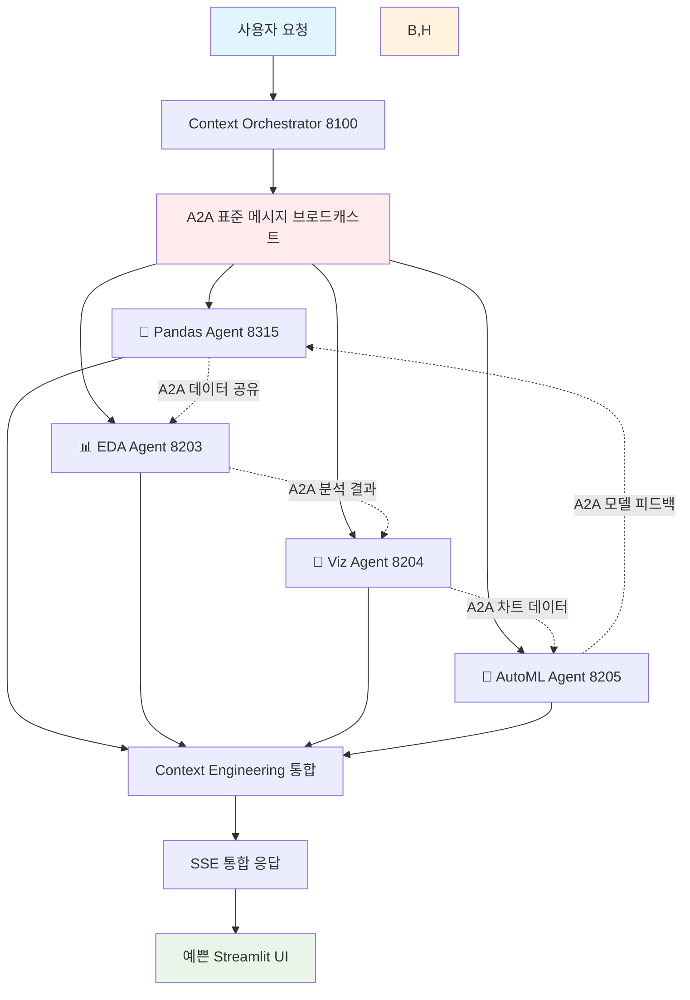

# A2A 기반 Context Engineering 멀티에이전트 협업 플랫폼

## 🎯 핵심 설계 철학

**"A2A 표준 프로토콜 기반 멀티에이전트 협업 + Context Engineering으로 지능형 데이터 분석 생태계 구축"**

### 🔧 A2A 멀티에이전트 협업 기반
- **A2A SDK 0.2.9 표준화**: 모든 에이전트가 동일한 A2A 프로토콜 사용으로 완벽한 표준화
- **에이전트 간 상호운용성**: A2A 표준을 통한 원활한 데이터 교환 및 협업
- **모듈형 에이전트 생태계**: 독립적 개발/배포 가능한 전문 에이전트들의 협업
- **실시간 A2A 통신**: SSE 기반 에이전트 간 실시간 데이터 스트리밍

### 🧠 Context Engineering 지능화  
- **6개 데이터 레이어**: INSTRUCTIONS, MEMORY, HISTORY, INPUT, TOOLS, OUTPUT의 상호연결
- **Data-Centric 접근**: LLM보다는 데이터와 컨텍스트 흐름이 핵심
- **All Connected**: 모든 레이어가 유기적으로 연결된 지능형 컨텍스트 구축

### 🐼 Pandas Agent 중심 통합
- **핵심 데이터 분석 허브**: 자연어 기반 데이터프레임 분석의 중심 역할
- **멀티 데이터프레임 처리**: 여러 데이터셋 간 관계 자동 발견 및 협업 분석
- **한국어 완전 지원**: 한국어 자연어 처리를 통한 직관적 데이터 분석

### ⚙️ 유연한 사용자 선택권
- **LLM Provider 선택**: GPT-4o (클라우드) / Gemma3 (로컬) 사용자 환경변수 선택
- **UI/UX 개인화**: 예쁘고 직관적인 Streamlit 기반 실시간 인터페이스
- **워크플로우 커스터마이징**: 사용자별 맞춤형 에이전트 조합 및 분석 스타일

### 📊 완전한 추적 및 모니터링
- **Langfuse v2 통합**: 에이전트 협업 과정까지 완전 추적
- **SSE 실시간 스트리밍**: A2A SDK의 Server-Sent Events로 실시간 응답

---

## 🤝 A2A 멀티에이전트 협업 아키텍처

### A2A 표준 기반 에이전트 협업 플로우


### A2A 프로토콜 표준화 장점
```python
# 모든 에이전트가 동일한 A2A 표준 준수
from a2a.server.apps import A2AStarletteApplication
from a2a.server.request_handlers.default_request_handler import DefaultRequestHandler
from a2a.server.agent_execution import AgentExecutor
from a2a.types import AgentCard, AgentSkill, TaskState

class StandardA2AAgent(AgentExecutor):
    """표준화된 A2A 에이전트 베이스"""
    
    def agent_card(self) -> AgentCard:
        return AgentCard(
            name=self.agent_name,
            description=self.agent_description,
            skills=[AgentSkill(name=skill) for skill in self.skills]
        )
    
    async def execute(self, context: RequestContext):
        # A2A 표준 실행 프로토콜
        return await self.process_a2a_request(context)
    
    async def stream(self, context: RequestContext):
        # A2A SSE 표준 스트리밍
        async for chunk in self.process_a2a_streaming(context):
            yield chunk
```

---

## 📊 Context Engineering: 6 Data Layers (A2A 에이전트 협업 기반)

### A2A 에이전트들이 공유하는 데이터 중심 아키텍처
```
┌─────────────────────────────────────────────────────────────┐
│           🤝 A2A 멀티에이전트 CONTEXT ENGINEERING            │
│              All Agents Connected via A2A Protocol          │
├─────────────────────────────────────────────────────────────┤
│ 1️⃣ INSTRUCTIONS │ → A2A 에이전트 페르소나 & 협업 룰        │
│ 2️⃣ MEMORY        │ → A2A 에이전트 간 공유 지식 은행         │  
│ 3️⃣ HISTORY       │ → A2A 협업 이력 + RAG                  │
│ 4️⃣ INPUT         │ → A2A 표준 메시지 처리                  │
│ 5️⃣ TOOLS         │ → A2A 에이전트 생태계                   │
│ 6️⃣ OUTPUT        │ → A2A SSE 협업 결과 통합                │
└─────────────────────────────────────────────────────────────┘
```

### Layer 1: 🎭 INSTRUCTIONS (A2A 에이전트 페르소나 & 협업 룰)
```
A2A Agent Persona Manager (포트 8600)
├── 🐼 Pandas Agent: "친근한 데이터 분석 팀 리더"
├── 🤖 AutoML Agent: "신중한 머신러닝 전문가" 
├── 🎨 Visualization Agent: "창의적인 데이터 스토리텔러"
├── 🧹 Data Quality Agent: "꼼꼼한 데이터 검증자"
└── 📝 Code Generation Agent: "체계적인 코드 아키텍트"

A2A Collaboration Rules Engine (포트 8601)
├── 에이전트 간 협업 프로토콜 관리
├── A2A 메시지 라우팅 규칙
├── 협업 우선순위 및 의존성 관리  
└── 충돌 해결 및 조정 메커니즘
```

### Layer 2: 🧠 MEMORY (A2A 에이전트 간 공유 지식 은행)
```
A2A Shared Knowledge Bank (포트 8602)
├── 에이전트별 전문 지식 공유
├── 협업 성공/실패 패턴 학습
├── 사용자별 에이전트 조합 선호도
├── A2A 메시지 효율성 최적화 학습
└── 크로스 에이전트 인사이트 축적

A2A Memory Synchronization (포트 8603)
├── 에이전트 간 실시간 지식 동기화
├── 분산 메모리 일관성 보장
├── A2A 메시지 기반 지식 업데이트
└── 협업 컨텍스트 영속성 관리
```

### Layer 3: 📚 HISTORY (A2A 협업 이력 + RAG)
```
A2A Collaboration History RAG (포트 8604)
├── 에이전트 간 과거 협업 패턴 분석
├── 성공적인 A2A 워크플로우 추천
├── 협업 효율성 메트릭 추적
├── 에이전트 조합 최적화 제안
└── A2A 메시지 시퀀스 학습

A2A Session Context Manager (포트 8605)
├── 멀티 에이전트 세션 상태 관리
├── A2A 메시지 체인 추적
├── 협업 컨텍스트 연속성 보장
└── 분산 세션 복구 메커니즘
```

### Layer 4: 📥 INPUT (A2A 표준 메시지 처리)
```
A2A Message Router (포트 8100)
├── 사용자 요청 → A2A 표준 메시지 변환
├── 멀티 에이전트 협업 전략 수립
├── A2A 메시지 브로드캐스트 및 라우팅
├── 에이전트별 맞춤형 컨텍스트 주입
└── 협업 우선순위 기반 스케줄링
```

### Layer 5: 🔧 TOOLS (A2A 에이전트 생태계)
```
🐼 Core Pandas Agent (포트 8315) - 협업 허브
├── 자연어 기반 데이터프레임 분석
├── 다른 A2A 에이전트들과의 데이터 공유
├── 멀티 데이터프레임 관계 발견 및 협업
├── 한국어 자연어 처리 (사용자 선택: GPT-4o/Gemma3)
└── A2A SSE 기반 실시간 결과 스트리밍

📊 A2A Specialized Agents (8200-8399)
├── 📥 Data Ingestion Agent (8201) - 멀티소스 데이터 로딩
├── 🧹 Data Quality Agent (8202) - 품질 보증 & 전처리
├── 📊 Advanced EDA Agent (8203) - 고급 통계 분석  
├── 🎨 Visualization Agent (8204) - 지능형 차트 생성
├── 🤖 AutoML Agent (8205) - 자동 머신러닝
├── 📝 Code Generation Agent (8206) - Jupyter 노트북 자동 생성
└── 🔍 NLP Analytics Agent (8207) - 자연어→코드 변환

🔍 A2A Agentic RAG Tools (8400-8499)  
├── 📖 Documentation RAG (8401) - 기술 문서 검색
├── 📊 Dataset RAG (8402) - 유사 데이터셋 추천
├── 🧪 Experiment RAG (8403) - 실험 이력 검색
└── 🎯 Best Practice RAG (8404) - 모범 사례 추천

🔗 MCP (Model Context Protocol) 통합 도구 (3000-3099)
├── 🌐 Playwright Browser Automation (3000) - 웹 브라우저 자동화
├── 📁 File System Manager (3001) - 파일 시스템 조작
├── 🗄️ Database Connector (3002) - 다양한 DB 연결
├── 🌍 API Gateway (3003) - 외부 API 호출
├── 📈 Advanced Data Analyzer (3004) - 고급 데이터 분석
├── 📊 Chart Generator (3005) - 고급 시각화
└── 🤖 LLM Gateway (3006) - 다중 LLM 모델 통합
```

### Layer 6: 📤 OUTPUT (A2A SSE 협업 결과 통합)
```
A2A Collaboration Response Manager (포트 8500)
├── 멀티 에이전트 결과 통합 및 조율
├── A2A SSE 기반 실시간 협업 스트리밍
├── 에이전트별 기여도 추적 및 표시
├── 충돌 해결 및 일관성 보장
└── 예쁜 UI를 위한 결과 포맷팅

A2A Intelligent Follow-up Engine (포트 8501)
├── 협업 기반 자동 후속 제안
├── 에이전트 조합 최적화 추천
├── A2A 워크플로우 확장 제안
└── 다음 협업 단계 자동 기획
```

---

## 🔄 A2A 멀티에이전트 협업 플로우

### 실제 협업 시나리오: "매출 데이터 종합 분석"
```python
# A2A 표준 기반 멀티에이전트 협업 예시
사용자: "매출 데이터를 종합적으로 분석하고 예측 모델까지 만들어줘"

# 1️⃣ A2A Message Router가 협업 전략 수립
협업_계획 = {
    "주도_에이전트": "Pandas Agent (8315)",
    "협업_에이전트들": [
        "Data Quality Agent (8202)",  # 데이터 품질 검증
        "Advanced EDA Agent (8203)",   # 고급 통계 분석  
        "Visualization Agent (8204)",  # 차트 생성
        "AutoML Agent (8205)"          # 예측 모델 구축
    ],
    "A2A_메시지_플로우": "순차적 + 병렬 하이브리드"
}

# 2️⃣ Pandas Agent가 협업 허브 역할 수행
async def pandas_led_collaboration():
    # 데이터 로딩 및 초기 분석
    initial_analysis = await pandas_agent.analyze_data(raw_data)
    
    # A2A 메시지로 다른 에이전트들에게 작업 분배
    tasks = await send_a2a_messages([
        {"agent": "data_quality", "task": "validate_and_clean", "data": initial_analysis},
        {"agent": "eda", "task": "advanced_statistics", "data": initial_analysis},
        {"agent": "visualization", "task": "create_charts", "data": initial_analysis}
    ])
    
    # 병렬 처리 결과 수집
    results = await gather_a2a_responses(tasks)
    
    # 통합 분석 후 AutoML에게 최종 작업 요청
    final_task = await send_a2a_message({
        "agent": "automl", 
        "task": "build_prediction_model",
        "data": merge_results(results)
    })
    
    # A2A SSE로 통합 결과 실시간 스트리밍
    async for result_chunk in stream_collaboration_result():
        yield result_chunk
```

### A2A 에이전트 간 실시간 데이터 교환
```python
# A2A 표준 메시지 프로토콜로 에이전트 간 상호운용성 보장
class A2ADataExchange:
    """A2A 표준을 통한 에이전트 간 원활한 데이터 교환"""
    
    async def pandas_to_eda_collaboration(self):
        # Pandas Agent → EDA Agent A2A 메시지
        a2a_message = {
            "messageId": generate_uuid(),
            "role": "user", 
            "parts": [TextPart(text=json.dumps({
                "data_summary": pandas_result,
                "analysis_request": "고급 통계 분석 수행",
                "context": context_info
            }))]
        }
        
        # A2A 표준 프로토콜로 EDA Agent 호출
        eda_response = await a2a_client.send_message(
            url="http://localhost:8203",
            message=a2a_message
        )
        
        return eda_response
    
    async def multi_agent_parallel_collaboration(self):
        # 여러 에이전트와 동시 A2A 협업
        parallel_tasks = [
            self.send_a2a_message("8202", quality_task),   # Data Quality
            self.send_a2a_message("8204", viz_task),       # Visualization  
            self.send_a2a_message("8205", ml_task)         # AutoML
        ]
        
        # A2A 응답 병렬 수집
        responses = await asyncio.gather(*parallel_tasks)
        
        # 결과 통합
        return self.merge_a2a_responses(responses)
```

---

## 🎨 예쁜 실시간 UI (A2A 협업 시각화)

### Streamlit 기반 A2A 멀티에이전트 협업 대시보드
```python
# 예쁘고 직관적인 A2A 협업 시각화
import streamlit as st

def render_beautiful_a2a_collaboration():
    st.title("🤝 A2A 멀티에이전트 협업 대시보드")
    
    # 상단: 전체 협업 상태
    col1, col2, col3, col4 = st.columns(4)
    with col1:
        st.metric("🐼 Pandas Agent", "활성", "주도 역할")
    with col2: 
        st.metric("📊 EDA Agent", "협업 중", "통계 분석")
    with col3:
        st.metric("🎨 Viz Agent", "대기", "차트 준비 중")
    with col4:
        st.metric("🤖 AutoML Agent", "준비", "모델 대기")
    
    # 중앙: A2A 메시지 플로우 시각화
    st.subheader("🔄 실시간 A2A 협업 플로우")
    
    # 실시간 협업 타임라인
    with st.container():
        for message in st.session_state.a2a_messages:
            with st.chat_message(f"agent_{message['from']}"):
                st.write(f"**{message['agent_name']}** → **{message['to_agent']}**")
                st.code(message['content'], language='json')
                st.caption(f"A2A Protocol • {message['timestamp']}")
    
    # 하단: 통합 결과 실시간 스트리밍
    st.subheader("📊 협업 결과 (실시간 SSE)")
    result_container = st.empty()
    
    # A2A SSE 스트리밍 수신 및 예쁜 렌더링
    async for collaboration_result in receive_a2a_sse_stream():
        with result_container.container():
            # 에이전트별 기여 시각화
            agent_contributions = collaboration_result.get("agent_contributions", {})
            
            for agent_name, contribution in agent_contributions.items():
                with st.expander(f"{get_agent_emoji(agent_name)} {agent_name} 기여"):
                    st.markdown(contribution["summary"])
                    if contribution.get("chart"):
                        st.plotly_chart(contribution["chart"])
                    if contribution.get("code"):
                        st.code(contribution["code"], language="python")
            
            # 통합 인사이트 하이라이트
            if collaboration_result.get("final_insight"):
                st.success("🎯 **협업 완료!** " + collaboration_result["final_insight"])

def get_agent_emoji(agent_name):
    emoji_map = {
        "Pandas Agent": "🐼",
        "EDA Agent": "📊", 
        "Visualization Agent": "🎨",
        "AutoML Agent": "🤖",
        "Data Quality Agent": "🧹"
    }
    return emoji_map.get(agent_name, "🤖")
```

### 사용자 선택 인터페이스 (LLM Provider)
```python
# 사용자가 직접 선택할 수 있는 예쁜 설정 UI
def render_user_preference_settings():
    st.sidebar.title("⚙️ 사용자 설정")
    
    # LLM Provider 선택
    st.sidebar.subheader("🧠 LLM Provider 선택")
    llm_provider = st.sidebar.radio(
        "분석에 사용할 LLM을 선택하세요:",
        ["GPT-4o (클라우드)", "Gemma3 (로컬)"],
        help="GPT-4o: 강력한 분석 성능 (인터넷 필요)\nGemma3: 빠른 로컬 처리 (오프라인 가능)"
    )
    
    # 환경변수 업데이트
    if llm_provider.startswith("GPT-4o"):
        os.environ["LLM_PROVIDER"] = "openai"
        os.environ["OPENAI_MODEL"] = "gpt-4o"
        st.sidebar.success("🌐 GPT-4o 클라우드 모드 활성화")
    else:
        os.environ["LLM_PROVIDER"] = "ollama" 
        os.environ["OLLAMA_MODEL"] = "gemma3:27b"
        st.sidebar.success("🏠 Gemma3 로컬 모드 활성화")
    
    # Pandas Agent 중심 워크플로우 설정
    st.sidebar.subheader("🐼 Pandas Agent 설정")
    pandas_style = st.sidebar.selectbox(
        "분석 스타일 선택:",
        ["비즈니스 친화적", "기술적 상세", "시각적 중심", "통계적 엄밀"]
    )
    
    # UI 테마 선택
    st.sidebar.subheader("🎨 UI 테마")
    ui_theme = st.sidebar.selectbox(
        "대시보드 테마:",
        ["모던 다크", "클린 라이트", "데이터 사이언스", "비즈니스 프로"]
    )
    
    return {
        "llm_provider": llm_provider,
        "pandas_style": pandas_style, 
        "ui_theme": ui_theme
    }
```

---

## 🏗️ 3-Layer 물리적 아키텍처 (A2A 표준 기반)

### Layer 1: A2A Context Engineering Hub (8100-8199)
```
🧠 A2A Context Orchestrator (포트 8100)
├── A2A 표준 메시지 라우팅 및 협업 조율
├── 멀티에이전트 Context Engineering 통합 관리
├── GPT-4o/Gemma3 사용자 선택 기반 지능형 처리
├── A2A SSE 기반 실시간 협업 스트리밍
├── Pandas Agent 중심 협업 허브 운영
└── Langfuse v2 멀티에이전트 협업 추적
```

### Layer 2: A2A Agent Ecosystem (8200-8699)
```
🤝 A2A 표준 기반 에이전트 생태계
├── 🎭 INSTRUCTIONS (8600-8601) - A2A 에이전트 페르소나 & 협업 룰
├── 🧠 MEMORY (8602-8603) - A2A 에이전트 간 공유 지식 은행
├── 📚 HISTORY (8604-8605) - A2A 협업 이력 + RAG
├── 📥 INPUT (8100) - A2A 표준 메시지 처리
├── 🔧 TOOLS (8200-8499) - A2A 에이전트 생태계
└── 📤 OUTPUT (8500-8501) - A2A SSE 협업 결과 통합

🐼 Pandas Agent Hub (포트 8315) - 협업 중심
├── A2A 표준 기반 자연어 데이터 분석  
├── 멀티에이전트 협업 허브 역할
├── 사용자 선택 LLM (GPT-4o/Gemma3) 기반 처리
├── A2A 메시지로 다른 에이전트들과 실시간 협업
└── 한국어 자연어 처리 및 예쁜 결과 포맷팅
```

### Layer 3: A2A Infrastructure & Analytics (8700-8799)
```
🔧 A2A 협업 인프라스트럭처
├── 📊 A2A Collaboration Monitor (8701) - 에이전트 간 협업 성능 추적
├── 🔐 A2A Security Gateway (8702) - A2A 메시지 보안 및 인증
├── 🗄️ A2A Data Lake (8703) - 모든 협업 데이터 중앙 저장
├── 🔍 A2A Analytics Engine (8704) - 협업 패턴 분석 및 최적화
└── 🎨 A2A UI Controller (8705) - 예쁜 실시간 UI 렌더링 관리
```

---

## 🎯 A2A 멀티에이전트 협업의 핵심 가치

### 🔧 A2A 표준화의 힘
- ✅ **완벽한 호환성**: 모든 에이전트가 A2A SDK 0.2.9 표준 준수
- ✅ **모듈형 확장**: 새로운 에이전트를 언제든 A2A 생태계에 추가
- ✅ **표준 메시지**: 에이전트 간 일관된 통신 프로토콜
- ✅ **프로토콜 안정성**: 검증된 A2A 표준으로 안정적 운영

### 🤝 상호운용성 극대화  
- ✅ **원활한 데이터 교환**: A2A 메시지 기반 실시간 데이터 공유
- ✅ **협업 시너지**: 에이전트별 전문성을 조합한 강력한 협업
- ✅ **동적 조합**: 작업에 따른 최적 에이전트 조합 자동 선택
- ✅ **충돌 해결**: A2A 프로토콜 기반 협업 충돌 자동 조정

### 🐼 Pandas Agent 중심의 협업 허브
- ✅ **협업 주도**: 자연어 요청을 A2A 협업으로 변환하는 허브 역할
- ✅ **멀티 데이터프레임**: 여러 데이터셋을 다른 에이전트들과 협업 분석
- ✅ **한국어 지원**: 한국어 자연어 처리로 직관적 협업 요청
- ✅ **결과 통합**: 다른 에이전트들의 분석 결과를 통합하여 최종 인사이트 제공

### ⚙️ 사용자 선택의 유연성
- ✅ **LLM Provider 선택**: GPT-4o (강력함) ↔ Gemma3 (로컬) 자유 선택
- ✅ **분석 스타일**: 비즈니스 친화적 ↔ 기술적 상세 등 개인 맞춤
- ✅ **UI 테마**: 모던 다크, 클린 라이트 등 예쁜 인터페이스 선택
- ✅ **협업 전략**: 순차적/병렬 등 에이전트 협업 방식 커스터마이징

### 🎨 예쁜 실시간 사용자 경험
- ✅ **협업 시각화**: A2A 에이전트 간 실시간 협업 과정 예쁘게 표시
- ✅ **SSE 스트리밍**: 에이전트별 기여를 실시간으로 예쁘게 렌더링
- ✅ **인터랙티브 UI**: 사용자가 협업 과정에 실시간 개입 가능
- ✅ **결과 통합**: 멀티 에이전트 협업 결과를 일관되고 예쁘게 표시

---

## 🚀 A2A 멀티에이전트 협업 구현 로드맵

### Phase 1: A2A 표준 기반 협업 (Week 1-2)
```
🔧 A2A 표준화 강화
├── ✅ 모든 에이전트 A2A SDK 0.2.9 준수 검증
├── ✅ A2A 표준 메시지 프로토콜 통일  
├── ✅ 에이전트 간 상호운용성 테스트
├── 🔄 Pandas Agent 협업 허브 강화
└── 🔄 사용자 LLM Provider 선택 UI

📊 기대 효과: 완벽한 A2A 표준 기반 멀티에이전트 협업 달성
```

### Phase 2: Context Engineering 통합 (Week 3-4)
```
🧠 6 Data Layers + A2A 협업 융합
├── 🔄 A2A 에이전트 페르소나 시스템 (INSTRUCTIONS)
├── 🔄 A2A 에이전트 간 공유 지식 은행 (MEMORY)
├── 🔄 A2A 협업 이력 RAG (HISTORY)
├── 🔄 협업 성능 최적화
└── 🔄 예쁜 협업 대시보드 UI

📊 기대 효과: Context-Aware A2A 멀티에이전트 협업
```

### Phase 3: 사용자 경험 최적화 (Week 5-6)
```
🎨 예쁜 UI + 사용자 선택권 강화
├── 🔄 실시간 A2A 협업 시각화
├── 🔄 사용자 LLM Provider 설정 (GPT-4o/Gemma3)
├── 🔄 Pandas Agent 중심 직관적 인터페이스
├── 🔄 협업 과정 실시간 모니터링
└── 🔄 SSE 기반 예쁜 실시간 렌더링

📊 기대 효과: "마법 같은" 사용자 경험 + 완전한 선택권
```

### Phase 4: 고도화 및 확장 (Week 7-8)
```
🚀 A2A 생태계 완성
├── 🔄 새로운 A2A 에이전트 쉬운 추가
├── 🔄 협업 패턴 자동 학습 및 최적화
├── 🔄 사용자별 맞춤 에이전트 조합
├── 🔄 A2A 협업 성능 지속 개선
└── 🔄 엔터프라이즈급 확장성 달성

📊 기대 효과: 업계 최고 수준의 A2A 멀티에이전트 협업 플랫폼
```

---

## 🎯 최종 비전: A2A 기반 지능형 협업 생태계

이 **A2A 기반 Context Engineering 멀티에이전트 협업 플랫폼**으로 달성하고자 하는 것:

### 🤝 **완벽한 A2A 표준 협업**
- 모든 에이전트가 A2A SDK 표준 준수로 완벽한 상호운용성
- Pandas Agent 중심의 자연스러운 협업 허브 
- 사용자 선택 기반 유연한 LLM Provider (GPT-4o/Gemma3)

### 🧠 **Context-Aware 지능형 협업**  
- 6개 데이터 레이어로 에이전트들이 컨텍스트를 공유하며 협업
- 과거 협업 이력을 학습하여 더 효율적인 협업 패턴 진화
- 사용자가 원하는 것을 미리 아는 예측적 협업

### 🎨 **예쁘고 직관적인 사용자 경험**
- 실시간 A2A 협업 과정을 예쁘게 시각화
- 사용자가 모든 설정을 자유롭게 선택할 수 있는 유연한 인터페이스  
- SSE 기반 실시간 스트리밍으로 협업 결과를 즉시 확인

**결과**: 사용자가 **"이 정도면 마법이야!"**라고 할 만큼 놀라운 A2A 멀티에이전트 데이터 분석 협업 경험을 제공하는 차세대 플랫폼! 🎉✨ 