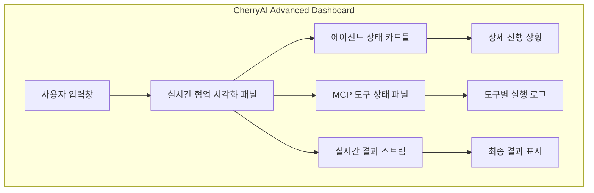

# 🎨 CherryAI Advanced UI/UX Design - Cursor 벤치마킹

## 🎯 **Cursor UI/UX 분석 및 CherryAI 적용**

### **📱 Cursor의 핵심 UI/UX 패턴**

#### **1. 🔽 접힌 상태 요약 (Collapsible Summary)**
```
▼ Pandas Agent 데이터 분석 중... ⏱️ 15.3s
▼ MCP Visualization Tool 차트 생성... ⏱️ 8.7s  
▼ Knowledge Bank 패턴 학습... ⏱️ 12.1s
```

#### **2. 🔍 클릭 시 디테일 전개 (Expandable Details)**
```
▽ Pandas Agent 데이터 분석 중... ✅ 완료 (15.3s)
  ├── 📊 데이터 로드 완료 (2.1s)
  ├── 🧹 데이터 정제 수행 (5.2s)
  ├── 📈 통계 분석 실행 (4.8s)
  ├── 🔍 이상치 탐지 (2.1s)
  └── 📋 결과 요약 생성 (1.1s)
```

#### **3. 🌊 실시간 스트리밍 표시**
```
🤖 A2A Orchestrator 사고 중...
💭 사용자 요청 분석 중... (3.2s)
💭 최적 에이전트 조합 선택... (1.8s)
💭 워크플로우 계획 수립... (2.1s)
```

---

## 🚀 **CherryAI Advanced UI/UX 설계**

### **1. 🎭 실시간 에이전트 협업 시각화**

#### **A. 메인 대시보드 레이아웃**


#### **B. 에이전트 협업 카드 UI**
```html
<!-- 접힌 상태 -->
<div class="agent-card collapsed">
  <div class="agent-header">
    <span class="agent-icon">🐼</span>
    <span class="agent-name">Pandas Agent</span>
    <span class="status thinking">💭 분석 중...</span>
    <span class="elapsed-time">⏱️ 12.5s</span>
    <button class="expand-btn">▼</button>
  </div>
</div>

<!-- 펼친 상태 -->
<div class="agent-card expanded">
  <div class="agent-header">
    <span class="agent-icon">🐼</span>
    <span class="agent-name">Pandas Agent</span>
    <span class="status completed">✅ 완료</span>
    <span class="elapsed-time">⏱️ 15.3s</span>
    <button class="expand-btn">▲</button>
  </div>
  
  <div class="agent-details">
    <div class="step completed">
      <span class="step-icon">📊</span>
      <span class="step-name">데이터 로드</span>
      <span class="step-time">2.1s</span>
      <span class="step-status">✅</span>
    </div>
    
    <div class="step completed">
      <span class="step-icon">🧹</span>
      <span class="step-name">데이터 정제</span>
      <span class="step-time">5.2s</span>
      <span class="step-status">✅</span>
    </div>
    
    <div class="step in-progress">
      <span class="step-icon">📈</span>
      <span class="step-name">통계 분석</span>
      <span class="step-time">4.8s</span>
      <span class="step-status">🔄</span>
    </div>
  </div>
  
  <div class="agent-output">
    <div class="code-stream">
      <pre><code class="language-python">
# 실시간 코드 스트리밍
import pandas as pd
df = pd.read_csv('data.csv')
print(f"데이터셋 크기: {df.shape}")
# 현재 실행 중인 라인이 하이라이트됨
df.describe()  ← 현재 실행 중
      </code></pre>
    </div>
  </div>
</div>
```

### **2. 🔧 MCP 도구 실시간 모니터링**

#### **A. MCP 도구 상태 패널**
```javascript
// React 컴포넌트 예시
const MCPToolPanel = () => {
  return (
    <div className="mcp-tools-panel">
      <h3>🔧 MCP Tools 활동 상황</h3>
      
      <div className="tool-grid">
        <ToolCard 
          icon="🌐" 
          name="Playwright Browser" 
          status="active"
          action="웹 스크래핑 중..."
          progress={65}
          details={[
            "페이지 로딩 완료",
            "요소 검색 중...",
            "데이터 추출 진행"
          ]}
        />
        
        <ToolCard 
          icon="📁" 
          name="File Manager" 
          status="completed"
          action="파일 업로드 완료"
          progress={100}
          details={[
            "파일 검증 완료",
            "메타데이터 추출",
            "저장소 업로드"
          ]}
        />
        
        <ToolCard 
          icon="🗄️" 
          name="Database Connector" 
          status="waiting"
          action="대기 중..."
          progress={0}
          details={[]}
        />
      </div>
    </div>
  );
};
```

### **3. 🌊 실시간 사고 과정 시각화**

#### **A. LLM 사고 과정 스트리밍**
```javascript
const ThoughtStream = ({ thoughts }) => {
  return (
    <div className="thought-stream">
      {thoughts.map((thought, index) => (
        <div key={index} className={`thought-bubble ${thought.status}`}>
          <div className="thought-header">
            <span className="thought-icon">💭</span>
            <span className="thought-text">{thought.text}</span>
            <span className="thought-duration">
              {thought.status === 'thinking' ? 
                `⏱️ ${thought.elapsed}s` : 
                `✅ ${thought.duration}s`
              }
            </span>
          </div>
          
          {thought.details && (
            <div className="thought-details">
              {thought.details.map(detail => (
                <div className="thought-detail">{detail}</div>
              ))}
            </div>
          )}
        </div>
      ))}
    </div>
  );
};

// 사용 예시
<ThoughtStream thoughts={[
  {
    text: "사용자 요청 분석 중...",
    status: "completed",
    duration: 3.2,
    details: [
      "자연어 처리 완료",
      "의도 분석 완료", 
      "컨텍스트 추출 완료"
    ]
  },
  {
    text: "최적 에이전트 조합 결정...",
    status: "thinking",
    elapsed: 1.8
  }
]} />
```

### **4. 📊 실시간 협업 네트워크 시각화**

#### **A. 에이전트 간 데이터 흐름 시각화**
```javascript
// D3.js 기반 협업 네트워크 시각화
const CollaborationNetwork = () => {
  const [nodes, setNodes] = useState([
    { id: 'user', type: 'user', label: '사용자', status: 'active' },
    { id: 'orchestrator', type: 'orchestrator', label: 'Orchestrator', status: 'active' },
    { id: 'pandas', type: 'agent', label: 'Pandas Agent', status: 'working' },
    { id: 'viz', type: 'agent', label: 'Viz Agent', status: 'waiting' },
    { id: 'knowledge', type: 'knowledge', label: 'Knowledge Bank', status: 'learning' }
  ]);
  
  const [edges, setEdges] = useState([
    { source: 'user', target: 'orchestrator', type: 'request', active: true },
    { source: 'orchestrator', target: 'pandas', type: 'task', active: true },
    { source: 'pandas', target: 'knowledge', type: 'learning', active: true }
  ]);
  
  return (
    <div className="collaboration-network">
      <svg width="800" height="400">
        {/* D3.js 기반 실시간 네트워크 시각화 */}
        {edges.map(edge => (
          <line 
            key={`${edge.source}-${edge.target}`}
            className={`edge ${edge.type} ${edge.active ? 'active' : ''}`}
            x1={getNodePosition(edge.source).x}
            y1={getNodePosition(edge.source).y}
            x2={getNodePosition(edge.target).x}
            y2={getNodePosition(edge.target).y}
          />
        ))}
        
        {nodes.map(node => (
          <g key={node.id} className={`node ${node.type} ${node.status}`}>
            <circle 
              cx={getNodePosition(node.id).x} 
              cy={getNodePosition(node.id).y} 
              r="30"
            />
            <text 
              x={getNodePosition(node.id).x} 
              y={getNodePosition(node.id).y}
              textAnchor="middle"
            >
              {node.label}
            </text>
          </g>
        ))}
      </svg>
    </div>
  );
};
```

### **5. 🎨 CSS 스타일링 (Cursor 스타일 벤치마킹)**

#### **A. 테마 및 색상 시스템**
```css
/* CherryAI Dark Theme (Cursor 스타일) */
:root {
  --bg-primary: #1a1a1a;
  --bg-secondary: #2d2d2d;
  --bg-tertiary: #3a3a3a;
  
  --text-primary: #ffffff;
  --text-secondary: #b3b3b3;
  --text-muted: #666666;
  
  --accent-blue: #007acc;
  --accent-green: #28a745;
  --accent-orange: #fd7e14;
  --accent-red: #dc3545;
  
  --border-color: #404040;
  --shadow: 0 4px 12px rgba(0, 0, 0, 0.15);
}

/* 에이전트 카드 스타일 */
.agent-card {
  background: var(--bg-secondary);
  border: 1px solid var(--border-color);
  border-radius: 8px;
  margin: 12px 0;
  overflow: hidden;
  transition: all 0.3s ease;
  box-shadow: var(--shadow);
}

.agent-card:hover {
  border-color: var(--accent-blue);
  transform: translateY(-2px);
}

.agent-header {
  display: flex;
  align-items: center;
  padding: 16px;
  cursor: pointer;
  background: linear-gradient(135deg, var(--bg-secondary), var(--bg-tertiary));
}

.agent-icon {
  font-size: 24px;
  margin-right: 12px;
}

.agent-name {
  font-weight: 600;
  color: var(--text-primary);
  flex: 1;
}

.status {
  padding: 4px 12px;
  border-radius: 20px;
  font-size: 14px;
  font-weight: 500;
}

.status.thinking {
  background: var(--accent-orange);
  color: white;
  animation: pulse 2s infinite;
}

.status.completed {
  background: var(--accent-green);
  color: white;
}

.status.failed {
  background: var(--accent-red);
  color: white;
}

@keyframes pulse {
  0%, 100% { opacity: 1; }
  50% { opacity: 0.7; }
}

/* 실시간 코드 스트리밍 */
.code-stream {
  background: #0d1117;
  border-radius: 6px;
  padding: 16px;
  margin: 12px 0;
  position: relative;
  overflow: hidden;
}

.code-stream::before {
  content: '';
  position: absolute;
  top: 0;
  left: 0;
  right: 0;
  height: 2px;
  background: linear-gradient(90deg, var(--accent-blue), var(--accent-green));
  animation: progress 3s ease-in-out infinite;
}

@keyframes progress {
  0% { transform: translateX(-100%); }
  100% { transform: translateX(100%); }
}

/* 실시간 타이핑 효과 */
.typing-cursor {
  display: inline-block;
  width: 2px;
  height: 1.2em;
  background: var(--accent-blue);
  animation: blink 1s infinite;
}

@keyframes blink {
  0%, 50% { opacity: 1; }
  51%, 100% { opacity: 0; }
}
```

### **6. ⚡ 실시간 업데이트 시스템**

#### **A. WebSocket 기반 실시간 통신**
```javascript
// 실시간 상태 업데이트 시스템
class CherryAIRealtimeUpdates {
  constructor() {
    this.ws = new WebSocket('ws://localhost:8100/ws');
    this.subscribers = new Map();
  }
  
  subscribe(agentId, callback) {
    if (!this.subscribers.has(agentId)) {
      this.subscribers.set(agentId, []);
    }
    this.subscribers.get(agentId).push(callback);
  }
  
  handleMessage(event) {
    const data = JSON.parse(event.data);
    
    switch (data.type) {
      case 'agent_status_update':
        this.updateAgentStatus(data);
        break;
        
      case 'mcp_tool_update':
        this.updateMCPToolStatus(data);
        break;
        
      case 'thought_stream':
        this.updateThoughtStream(data);
        break;
        
      case 'code_execution':
        this.streamCodeExecution(data);
        break;
        
      case 'collaboration_update':
        this.updateCollaborationNetwork(data);
        break;
    }
  }
  
  updateAgentStatus(data) {
    const callbacks = this.subscribers.get(data.agent_id) || [];
    callbacks.forEach(callback => callback(data));
    
    // UI 업데이트
    const agentCard = document.querySelector(`[data-agent-id="${data.agent_id}"]`);
    if (agentCard) {
      agentCard.querySelector('.status').textContent = data.status;
      agentCard.querySelector('.elapsed-time').textContent = `⏱️ ${data.elapsed_time}s`;
    }
  }
  
  streamCodeExecution(data) {
    const codeElement = document.querySelector(`[data-execution-id="${data.execution_id}"] code`);
    if (codeElement) {
      // 실시간 코드 스트리밍 효과
      this.typewriterEffect(codeElement, data.code_chunk);
    }
  }
  
  typewriterEffect(element, text) {
    let i = 0;
    const timer = setInterval(() => {
      element.textContent += text[i];
      i++;
      if (i >= text.length) {
        clearInterval(timer);
      }
    }, 50); // 타이핑 속도 조절
  }
}
```

### **7. 📱 반응형 모바일 최적화**

#### **A. 모바일 친화적 에이전트 카드**
```css
/* 모바일 반응형 디자인 */
@media (max-width: 768px) {
  .agent-card {
    margin: 8px 0;
  }
  
  .agent-header {
    padding: 12px;
    flex-wrap: wrap;
  }
  
  .agent-name {
    font-size: 14px;
  }
  
  .elapsed-time {
    font-size: 12px;
    margin-top: 4px;
    width: 100%;
  }
  
  .collaboration-network {
    transform: scale(0.7);
    transform-origin: top left;
  }
}

/* 터치 친화적 버튼 */
.expand-btn {
  min-width: 44px;
  min-height: 44px;
  border: none;
  background: transparent;
  color: var(--text-secondary);
  cursor: pointer;
  border-radius: 50%;
  transition: all 0.2s ease;
}

.expand-btn:hover {
  background: var(--bg-tertiary);
  color: var(--text-primary);
}
```

---

## 🎯 **구현 우선순위**

### **Phase 1: 핵심 UI 컴포넌트 (2주)**
- ✅ 에이전트 상태 카드
- ✅ 실시간 사고 과정 시각화
- ✅ 기본 스트리밍 UI

### **Phase 2: 고급 시각화 (3주)**
- ✅ 협업 네트워크 그래프
- ✅ MCP 도구 모니터링 패널
- ✅ 실시간 코드 스트리밍

### **Phase 3: 인터랙션 강화 (2주)**
- ✅ 터치/클릭 인터랙션
- ✅ 키보드 단축키
- ✅ 접근성 개선

### **Phase 4: 성능 최적화 (1주)**
- ✅ 가상화 스크롤링
- ✅ 메모리 최적화
- ✅ 렌더링 최적화

---

## 🚀 **예상 효과**

### **사용자 경험**
- **몰입도**: Cursor 수준의 시각적 피드백
- **이해도**: 복잡한 에이전트 협업을 직관적으로 이해
- **제어감**: 실시간 진행 상황을 명확히 파악

### **기술적 우위**
- **업계 최초**: A2A + MCP 실시간 시각화
- **차별화**: Cursor 스타일의 멀티 에이전트 UI
- **확장성**: 새로운 에이전트/도구 쉽게 추가 가능 