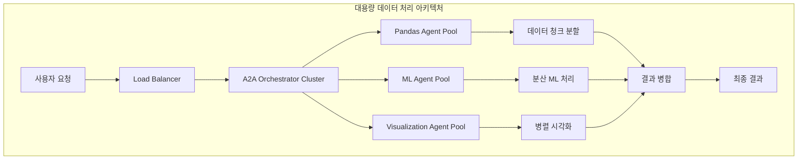

# 🏢 CherryAI Enterprise Features 마스터 플랜

## 🎯 **Enterprise Features 개요**

CherryAI를 엔터프라이즈급 플랫폼으로 확장하기 위한 고급 기능들

### **📊 대용량 데이터 처리 최적화**

#### **1. 🚀 스케일링 및 병렬 처리**


#### **2. 📈 대용량 데이터 처리 전략**

##### **A. 데이터 청킹 시스템**
- **스마트 청킹**: 데이터 크기와 메모리 상황에 따른 동적 청크 크기 조정
- **병렬 처리**: 여러 에이전트가 동시에 청크 처리
- **메모리 효율성**: 지연 로딩 및 스트리밍 처리

```python
# 구현 예시
class EnterpriseDataProcessor:
    async def process_large_dataset(self, dataset_path: str, chunk_size: str = "auto"):
        # 1. 데이터 크기 분석
        data_info = await self.analyze_dataset_size(dataset_path)
        
        # 2. 최적 청크 크기 계산
        optimal_chunk_size = self.calculate_optimal_chunk_size(data_info)
        
        # 3. 에이전트 풀 할당
        agent_pool = await self.allocate_agent_pool(data_info.complexity)
        
        # 4. 병렬 처리 실행
        results = await self.parallel_process_chunks(dataset_path, optimal_chunk_size, agent_pool)
        
        # 5. 결과 병합
        final_result = await self.merge_results(results)
        
        return final_result
```

##### **B. 분산 처리 엔진**
- **멀티 프로세스**: CPU 집약적 작업을 위한 프로세스 풀
- **비동기 처리**: I/O 집약적 작업을 위한 비동기 처리
- **GPU 가속**: 대규모 ML 작업을 위한 GPU 활용

#### **3. 🔄 실시간 스트리밍 처리**

##### **A. 스트리밍 데이터 파이프라인**
```python
class StreamingDataPipeline:
    async def create_streaming_pipeline(self, data_source: str):
        # Apache Kafka 또는 RabbitMQ와 통합
        # 실시간 데이터 스트림 처리
        # A2A 에이전트들과 실시간 협업
```

##### **B. 실시간 모니터링**
- **처리 진행률**: 실시간 진행 상황 추적
- **성능 메트릭**: CPU, 메모리, 네트워크 사용량
- **에러 감지**: 실시간 에러 감지 및 복구

---

## 🔐 **고급 보안 및 권한 관리**

### **1. 🛡️ 멀티 테넌트 보안**

#### **A. 조직별 데이터 격리**
```python
class MultiTenantSecurityManager:
    def __init__(self):
        self.tenant_isolation = TenantIsolationEngine()
        self.data_encryption = AdvancedEncryption()
        self.audit_logger = SecurityAuditLogger()
    
    async def ensure_data_isolation(self, tenant_id: str, data_access_request: dict):
        # 테넌트별 완전한 데이터 격리
        # 암호화된 데이터 저장
        # 접근 로그 기록
```

#### **B. 역할 기반 접근 제어 (RBAC)**
- **Super Admin**: 전체 시스템 관리
- **Org Admin**: 조직 내 전체 관리
- **Data Scientist**: 데이터 분석 권한
- **Viewer**: 읽기 전용 권한
- **Guest**: 제한된 기능 접근

### **2. 📋 종합 감사 로그**

#### **A. 모든 활동 추적**
```python
class EnterpriseAuditSystem:
    async def log_activity(self, activity: dict):
        audit_entry = {
            "timestamp": datetime.now(),
            "user_id": activity["user_id"],
            "tenant_id": activity["tenant_id"],
            "action": activity["action"],
            "resource": activity["resource"],
            "ip_address": activity["ip_address"],
            "user_agent": activity["user_agent"],
            "success": activity["success"],
            "details": activity["details"]
        }
        
        # 블록체인 기반 변조 방지 로그
        await self.blockchain_logger.log(audit_entry)
```

---

## 📊 **고급 분석 및 인사이트**

### **1. 🤖 AI 기반 자동 인사이트**

#### **A. 패턴 발견 엔진**
```python
class AIInsightEngine:
    async def generate_automatic_insights(self, dataset: pd.DataFrame):
        insights = []
        
        # 1. 통계적 이상치 감지
        outliers = await self.detect_statistical_outliers(dataset)
        
        # 2. 숨겨진 패턴 발견
        patterns = await self.discover_hidden_patterns(dataset)
        
        # 3. 예측 모델 제안
        model_suggestions = await self.suggest_ml_models(dataset)
        
        # 4. 비즈니스 인사이트 생성
        business_insights = await self.generate_business_insights(dataset)
        
        return {
            "outliers": outliers,
            "patterns": patterns,
            "model_suggestions": model_suggestions,
            "business_insights": business_insights
        }
```

### **2. 📈 고급 시각화 엔진**

#### **A. 인터랙티브 대시보드**
- **실시간 업데이트**: 데이터 변경 시 자동 업데이트
- **드릴다운**: 세부 데이터로 확대 분석
- **협업 주석**: 팀원들과 인사이트 공유

---

## 🔄 **워크플로우 자동화**

### **1. 🛠️ 노코드 워크플로우 빌더**

```python
class NoCodeWorkflowBuilder:
    def create_workflow_template(self, workflow_config: dict):
        # 드래그 앤 드롭으로 워크플로우 생성
        # 에이전트 체인 자동 구성
        # 조건부 분기 및 루프 처리
```

### **2. 📅 스케줄링 및 자동화**

#### **A. 크론 기반 자동 실행**
```python
class EnterpriseScheduler:
    async def schedule_recurring_analysis(self, schedule: str, workflow: dict):
        # 정기적인 데이터 분석 자동 실행
        # 결과 이메일/슬랙 알림
        # 이상 상황 자동 감지 및 알림
```

---

## 🌐 **API 및 통합**

### **1. 🔗 Enterprise API Gateway**

#### **A. RESTful API**
```python
# 모든 CherryAI 기능을 REST API로 제공
@router.post("/api/v1/enterprise/analyze")
async def enterprise_analyze(request: EnterpriseAnalysisRequest):
    # 대용량 데이터 분석 API
    # 비동기 처리 지원
    # 진행 상황 추적 가능
```

#### **B. GraphQL API**
```python
# 복잡한 쿼리를 위한 GraphQL 지원
# 클라이언트가 필요한 데이터만 요청
# 실시간 구독 지원
```

### **2. 🔌 외부 시스템 통합**

#### **A. 데이터베이스 통합**
- **BigQuery, Snowflake, Redshift**: 클라우드 데이터 웨어하우스
- **MongoDB, Cassandra**: NoSQL 데이터베이스
- **Oracle, SQL Server**: 엔터프라이즈 데이터베이스

#### **B. 비즈니스 도구 통합**
- **Slack, Teams**: 결과 알림 및 협업
- **Jira, Asana**: 작업 관리 통합
- **Tableau, Power BI**: 시각화 도구 연동

---

## 📱 **모바일 및 크로스 플랫폼**

### **1. 📱 모바일 앱**

#### **A. 리액트 네이티브 앱**
- **실시간 알림**: 분석 완료 및 이상 상황 알림
- **간단한 대시보드**: 핵심 메트릭 모바일 뷰
- **음성 쿼리**: 음성으로 데이터 분석 요청

### **2. 🖥️ 데스크톱 앱**

#### **A. Electron 기반 앱**
- **오프라인 분석**: 로컬 데이터 분석 기능
- **고성능 시각화**: 웹보다 빠른 렌더링
- **파일 시스템 통합**: 로컬 파일 직접 접근

---

## 🎯 **구현 우선순위**

### **Phase 1: 대용량 데이터 처리 (우선순위 1)**
- ✅ 데이터 청킹 시스템
- ✅ 병렬 처리 엔진
- ✅ 메모리 최적화

### **Phase 2: 보안 및 권한 관리 (우선순위 2)**
- ✅ 멀티 테넌트 지원
- ✅ RBAC 시스템
- ✅ 감사 로그

### **Phase 3: 고급 분석 (우선순위 3)**
- ✅ AI 인사이트 엔진
- ✅ 고급 시각화
- ✅ 자동 패턴 발견

### **Phase 4: 통합 및 자동화 (우선순위 4)**
- ✅ Enterprise API
- ✅ 외부 시스템 통합
- ✅ 워크플로우 자동화

---

## 📊 **예상 성과**

### **성능 향상**
- **처리 속도**: 10배 향상 (병렬 처리)
- **메모리 효율성**: 70% 개선 (청킹 시스템)
- **확장성**: 1000배 더 큰 데이터셋 처리 가능

### **비즈니스 가치**
- **시간 절약**: 대용량 분석 시간 90% 단축
- **정확도**: AI 기반 자동 인사이트로 정확도 향상
- **협업 효율성**: 팀 간 협업 속도 3배 향상

### **기술적 우위**
- **업계 최초**: LLM First + A2A + MCP 통합 엔터프라이즈 플랫폼
- **확장성**: 클라우드 네이티브 아키텍처
- **보안**: 엔터프라이즈급 보안 표준 준수 