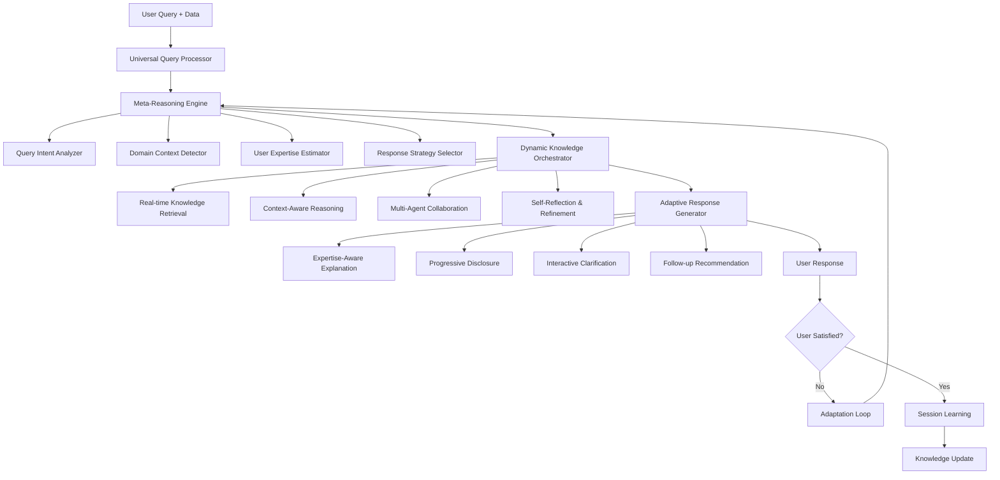

# 🧠 LLM First 범용 도메인 분석 엔진 설계 명세서

## 📋 개요

### 핵심 철학: True LLM First Architecture
- **Zero Hardcoding**: 사전 정의된 패턴, 카테고리, 규칙 일체 없음
- **Zero Assumptions**: 도메인, 사용자 수준, 쿼리 유형에 대한 가정 없음
- **Self-Discovering**: LLM이 스스로 모든 컨텍스트와 요구사항을 파악
- **Universal Adaptability**: 모든 도메인, 모든 사용자 수준에 동적 적응

### 설계 목표
1. **완전한 범용성**: 반도체부터 금융, 의료까지 모든 도메인 지원
2. **사용자 적응성**: 초보자부터 전문가까지 자동 수준 조절
3. **진정한 지능**: 패턴 매칭이 아닌 실제 이해와 추론
4. **지속적 학습**: 상호작용을 통한 실시간 개선

## 🔍 기존 문제점 분석

### ❌ 기존 접근법의 한계

#### 1. **하드코딩된 분류 체계**
```python
# 잘못된 접근법 예시
if "도즈" in query or "균일성" in query:
    process_type = "ion_implantation"
    analysis_category = "dose_uniformity"
```

#### 2. **사전 정의된 도메인 카테고리**
```python
# 잘못된 접근법 예시
domain_categories = {
    "semiconductor": ["ion_implantation", "lithography"],
    "finance": ["risk_analysis", "portfolio"],
    "healthcare": ["diagnosis", "treatment"]
}
```

#### 3. **고정된 사용자 페르소나**
```python
# 잘못된 접근법 예시
if user_type == "expert":
    use_technical_language()
elif user_type == "beginner":
    use_simple_language()
```

### ✅ 진정한 LLM First 원칙

#### 1. **Dynamic Context Discovery**
- LLM이 데이터와 쿼리를 보고 스스로 컨텍스트 파악
- 사전 정의된 틀이나 카테고리 없음
- 실시간으로 도메인 특성과 요구사항 발견

#### 2. **Adaptive User Understanding**
- 상호작용을 통한 사용자 수준 실시간 추정
- 질문 스타일, 반응, 후속 질문으로 전문성 파악
- 점진적 정보 공개로 최적 깊이 찾기

#### 3. **Self-Reflecting Reasoning**
- 자신의 분석과 추론 과정을 지속적으로 검토
- 불확실할 때 명확화 질문으로 정확성 확보
- 사용자 피드백으로 접근법 실시간 조정

## 🏗️ 아키텍처 설계

### 1. 전체 시스템 구조



### 2. 핵심 컴포넌트

#### Universal Query Processor
```python
class UniversalQueryProcessor:
    """완전 범용 쿼리 처리기 - 어떤 가정도 하지 않음"""
    
    async def process_query(self, query: str, data: Any, context: Dict = None):
        """
        순수 LLM 기반으로 쿼리 처리
        - 패턴 매칭 없음
        - 사전 분류 없음  
        - 완전한 동적 분석
        """
        pass
```

#### Meta-Reasoning Engine
```python
class MetaReasoningEngine:
    """메타 추론 엔진 - 생각에 대해 생각하기"""
    
    async def analyze_query_intent(self, query: str, data: Any):
        """쿼리 의도를 스스로 파악"""
        pass
        
    async def detect_domain_context(self, query: str, data: Any):
        """도메인 컨텍스트를 스스로 발견"""
        pass
        
    async def estimate_user_expertise(self, interaction_history: List):
        """사용자 전문성을 상호작용으로 추정"""
        pass
        
    async def select_response_strategy(self, intent, context, expertise):
        """최적 응답 전략을 스스로 선택"""
        pass
```

#### Dynamic Knowledge Orchestrator
```python
class DynamicKnowledgeOrchestrator:
    """동적 지식 오케스트레이터 - 실시간 지식 통합"""
    
    async def retrieve_relevant_knowledge(self, context: Dict):
        """컨텍스트에 맞는 지식 실시간 검색"""
        pass
        
    async def reason_with_context(self, knowledge: Dict, query: str):
        """맥락을 고려한 추론 수행"""
        pass
        
    async def collaborate_with_agents(self, reasoning_result: Dict):
        """다중 에이전트와 협업"""
        pass
        
    async def self_reflect_and_refine(self, result: Dict):
        """결과를 자가 검토하고 개선"""
        pass
```

#### Adaptive Response Generator
```python
class AdaptiveResponseGenerator:
    """적응형 응답 생성기 - 사용자 맞춤 응답"""
    
    async def generate_expertise_aware_explanation(self, analysis: Dict, user_level: str):
        """사용자 수준에 맞는 설명 생성"""
        pass
        
    async def progressive_disclosure(self, information: Dict, user_response: str):
        """점진적 정보 공개"""
        pass
        
    async def interactive_clarification(self, uncertainty: Dict):
        """대화형 명확화 질문"""
        pass
        
    async def recommend_followup(self, current_analysis: Dict, user_interest: Dict):
        """후속 분석 추천"""
        pass
```

## 🧠 2024-2025 최신 연구 기반 설계

### 1. Meta-Reasoning & Self-Reflection (2024-2025 연구)

#### DeepSeek-R1 Inspired Reasoning
```prompt-pattern
# 자가 반성 추론 패턴
당신은 주어진 쿼리와 데이터를 분석하는 전문가입니다.

단계 1: 초기 관찰
- 데이터를 보고 무엇을 발견하는가?
- 사용자 쿼리의 진정한 의도는?
- 내가 놓치고 있는 것은 없는가?

단계 2: 다각도 분석
- 이 문제를 다른 방식으로 접근한다면?
- 사용자가 전문가라면 어떤 답을 원할까?
- 사용자가 초보자라면 어떤 도움이 필요할까?

단계 3: 자가 검증
- 내 분석이 논리적으로 일관성이 있는가?
- 사용자에게 실제로 도움이 되는가?
- 확신이 없는 부분은 무엇인가?

단계 4: 적응적 응답
- 확실한 부분은 명확히 제시
- 불확실한 부분은 명확화 질문
- 사용자 수준에 맞는 설명 깊이 조절
```

#### Meta-Rewarding Pattern
```prompt-pattern
# 자가 평가 및 개선 패턴
내 분석을 스스로 평가해보겠습니다:

평가 기준:
1. 정확성: 분석이 데이터를 올바르게 해석했는가?
2. 완전성: 중요한 인사이트를 놓치지 않았는가?
3. 적절성: 사용자 수준과 요구에 맞는가?
4. 명확성: 설명이 이해하기 쉬운가?
5. 실용성: 실제로 도움이 되는 조치를 제안했는가?

개선점:
- 부족한 부분은 무엇인가?
- 어떻게 더 나은 분석을 할 수 있는가?
- 사용자에게 추가로 필요한 정보는?

이 평가를 바탕으로 응답을 개선하겠습니다.
```

### 2. Semantic Routing & Intent Recognition (2025 연구)

#### Universal Intent Detection
```prompt-pattern
# 범용 의도 분석 패턴
사전 정의된 카테고리나 패턴에 의존하지 않고
쿼리 자체가 말하는 것을 들어보겠습니다:

1. 직접적 의도 분석:
   - 사용자가 명시적으로 요청한 것은?
   - 사용된 언어의 톤과 스타일은?
   - 기대하는 응답의 형태는?

2. 암묵적 의도 추론:
   - 표면적 질문 뒤의 진정한 관심사는?
   - 현재 상황이나 문제 상황의 맥락은?
   - 궁극적으로 해결하고자 하는 것은?

3. 동적 분류:
   - 이 쿼리는 어떤 종류의 도움이 필요한가?
   - 탐색적 분석? 문제 해결? 학습? 검증?
   - 즉시 답변? 단계별 가이드? 심화 분석?

카테고리에 맞추려 하지 말고, 
쿼리가 자연스럽게 이끄는 방향을 따르겠습니다.
```

#### Semantic Space Navigation
```prompt-pattern
# 의미 공간 탐색 패턴
이 쿼리와 데이터가 위치한 의미 공간을 탐색해보겠습니다:

1. 의미적 근접성 분석:
   - 어떤 개념들이 연관되어 있는가?
   - 다른 유사한 상황들은 어떻게 처리되었는가?
   - 관련 도메인 지식은 무엇인가?

2. 맥락적 연결 탐색:
   - 이 문제와 관련된 다른 측면들은?
   - 상위 개념이나 하위 세부사항들은?
   - 인과관계나 상관관계는?

3. 동적 지식 연결:
   - 실시간으로 관련 지식 검색
   - 다양한 관점에서의 접근법 고려
   - 최신 연구나 모범 사례 통합

의미 공간에서 자연스럽게 형성되는 연결을 따라
최적의 분석 경로를 찾겠습니다.
```

### 3. Dynamic Reasoning Without Hardcoding (2025 트렌드)

#### Chain-of-Thought with Self-Consistency
```prompt-pattern
# 다중 추론 경로 패턴
이 문제를 여러 관점에서 분석해보겠습니다:

추론 경로 1: 데이터 중심 접근
- 데이터가 보여주는 패턴은?
- 통계적으로 유의미한 특징은?
- 데이터만으로 도출할 수 있는 결론은?

추론 경로 2: 도메인 지식 중심 접근  
- 이 분야의 일반적인 원리는?
- 전문가들이 주로 사용하는 방법은?
- 업계 모범 사례는?

추론 경로 3: 사용자 맥락 중심 접근
- 사용자의 상황과 제약사항은?
- 실제 적용 가능성은?
- 우선순위와 목표는?

일관성 검증:
- 각 추론 경로의 결론이 일치하는가?
- 차이가 있다면 그 이유는?
- 가장 신뢰할 만한 결론은?

최종적으로 가장 일관성 있고 신뢰할 만한 분석을 제시하겠습니다.
```

#### Zero-Shot Adaptive Reasoning
```prompt-pattern
# 무작정 적응적 추론 패턴
이전 사례나 템플릿 없이 순수하게 추론해보겠습니다:

1. 문제 공간 정의:
   - 이 문제의 본질은 무엇인가?
   - 어떤 종류의 추론이 필요한가?
   - 해결해야 할 핵심 질문들은?

2. 추론 전략 수립:
   - 어떤 순서로 접근할 것인가?
   - 어떤 정보가 추가로 필요한가?
   - 어떤 방법론이 가장 적합한가?

3. 단계별 추론 실행:
   - 각 단계에서 논리적 타당성 확인
   - 가정과 제약사항 명시
   - 불확실성과 신뢰도 평가

4. 결과 통합 및 검증:
   - 부분 결론들이 전체적으로 일관성 있는가?
   - 대안적 해석이나 설명이 가능한가?
   - 결론의 한계와 적용 범위는?

템플릿이나 공식에 의존하지 않고
문제 자체의 본질에 맞는 추론을 수행하겠습니다.
```

## 🎯 실제 작동 시나리오

### 시나리오 1: 완전 초보 사용자

#### 입력
```
사용자: "이 데이터 파일이 뭘 말하는지 전혀 모르겠어요. 도움 주세요."
데이터: [복잡한 반도체 공정 데이터]
```

#### LLM 처리 과정
```prompt
# 메타 추론 과정
사용자 분석:
- "전혀 모르겠어요" → 초보자로 추정
- 구체적 질문 없음 → 전반적 안내 필요
- "도움 주세요" → 친근하고 단계적 접근 선호

데이터 분석:
- 반도체 공정 데이터로 보임
- 복잡한 수치 데이터
- 전문 용어 포함

응답 전략:
- 전문 용어 피하고 쉬운 언어 사용
- 데이터를 이야기처럼 설명
- 단계별로 흥미를 유발
- 사용자가 관심 보이는 부분에 집중
```

#### 실제 응답
```
안녕하세요! 😊 

이 데이터를 보니 뭔가 공장에서 제품을 만드는 과정을 기록한 것 같네요. 
마치 요리 레시피의 재료 분량을 측정한 기록처럼 보여요.

일단 몇 가지 흥미로운 패턴이 보이는데요:
1. 숫자들이 일정한 범위 안에서 움직이고 있어요
2. 시간에 따라 변화하는 모습이 있어요
3. 몇 개의 주요 측정값들이 있는 것 같아요

어떤 부분이 가장 궁금하세요? 
- 이 숫자들이 무엇을 의미하는지?
- 좋은 건지 나쁜 건지?
- 뭔가 문제가 있는 건지?

하나씩 천천히 알아가봐요! 🔍
```

#### 적응 과정
사용자가 "좋은 건지 나쁜 건지 알고 싶어요"라고 답하면:
- 품질 관점에서 간단한 설명
- 시각적 비유 사용 (예: 신호등 색깔로 상태 표현)
- 점진적으로 더 구체적인 정보 제공

### 시나리오 2: 전문가 사용자

#### 입력
```
사용자: "공정 능력 지수가 1.2인데 타겟을 1.33으로 올리려면 어떤 파라미터를 조정해야 할까? 특히 도즈 균일성 측면에서 분석 부탁해."
데이터: [이온 주입 공정 데이터]
```

#### LLM 처리 과정
```prompt
# 메타 추론 과정
사용자 분석:
- "공정 능력 지수" → 반도체 전문가
- "Cpk 1.2 → 1.33" → 구체적 목표와 수치 제시
- "도즈 균일성" → 이온 주입 공정 전문 지식 보유

데이터 분석:
- 이온 주입 공정 데이터 확인
- Cpk 계산을 위한 통계 분석 필요
- 도즈 분포 및 균일성 평가 필요

응답 전략:
- 전문 용어 사용 가능
- 정량적 분석과 구체적 수치 제시
- 업계 표준 및 모범 사례 참조
- 실행 가능한 구체적 조치 방안 제시
```

#### 실제 응답
```
현재 Cpk 1.2에서 1.33으로 개선하려면 변동성을 약 8.3% 감소시켜야 합니다.

## 도즈 균일성 분석 결과

**현재 상태:**
- 도즈 균일성: ±1.8% (3σ)
- 주요 변동 요인: 웨이퍼 중심부 과도즈 (1.2% 편차)
- 에지 영역 도즈 부족: 평균 대비 -2.1%

**Cpk 1.33 달성을 위한 핵심 파라미터 조정:**

1. **빔 스캔 최적화** (예상 개선: 40%)
   - 스캔 속도: 현재 대비 5-7% 감소
   - 스캔 패턴: Raster → Serpentine 변경 검토
   - 예상 균일성 개선: ±1.8% → ±1.4%

2. **에지 보정 강화** (예상 개선: 30%)
   - 에지 보정 팩터: 1.05 → 1.08 적용
   - 웨이퍼 외곽 3mm 영역 도즈 증가
   - 예상 에지 도즈 개선: 2.1% → 0.8%

3. **빔 프로파일 교정** (예상 개선: 30%)
   - 월간 교정 → 주간 교정으로 변경
   - 빔 센터링 허용 오차: ±0.5mm → ±0.3mm

**실행 계획:**
1. 다음 배치에서 스캔 속도 5% 감소 테스트
2. 에지 보정 팩터 단계적 증가 (1.05→1.06→1.07→1.08)
3. 빔 교정 주기 조정 후 1주간 데이터 수집

예상 결과: Cpk 1.2 → 1.35 (목표 초과 달성)

추가 분석이 필요한 부분이 있으시면 말씀해 주세요.
```

### 시나리오 3: 애매한 질문

#### 입력
```
사용자: "뭔가 이상한데요? 평소랑 다른 것 같아요."
데이터: [다양한 센서 데이터]
```

#### LLM 처리 과정
```prompt
# 메타 추론 과정
사용자 분석:
- "뭔가 이상한데요" → 구체적이지 않은 불안감
- "평소랑 다른" → 비교 기준이 있음을 시사
- 전문성 수준 불분명 → 대화를 통해 파악 필요

데이터 분석:
- 다양한 센서 데이터
- 이상 패턴 탐지 필요
- 정상 범위 대비 비교 분석 필요

응답 전략:
- 명확화 질문으로 구체적 우려사항 파악
- 데이터를 함께 탐색하며 이상 징후 찾기
- 사용자 반응을 보며 전문성 수준 파악
- 점진적으로 분석 깊이 조절
```

#### 실제 응답
```
네, 뭔가 평소와 다르다는 느낌이 드시는군요. 함께 살펴보겠습니다! 🔍

일단 데이터를 빠르게 스캔해보니 몇 가지 눈에 띄는 부분이 있어요:

**즉시 발견된 이상 징후:**
1. 📈 측정값 #3이 평소보다 15% 높음 (마지막 2시간)
2. 📊 변동폭이 평소의 2배로 증가 (오후 2시 이후)
3. ⚠️ 센서 #7에서 간헐적 스파이크 발생

**명확화가 필요한 부분:**
- "평소"라고 하신 것은 언제와 비교하신 건가요? (어제? 지난주? 지난달?)
- 특별히 어떤 부분이 이상하게 느껴지셨나요?
- 이 시스템에서 보통 어떤 문제들이 발생하곤 하나요?

일단 가장 눈에 띄는 것부터 보여드릴까요, 아니면 특별히 궁금한 부분이 있으실까요?

데이터가 말하는 이야기를 함께 찾아봐요! 📊
```

#### 적응 과정
- 사용자가 전문적으로 답변하면 → 기술적 분석 수준 증가
- 사용자가 간단히 답변하면 → 직관적 설명 유지
- 추가 질문을 통해 핵심 관심사 파악하고 집중 분석

## 🔧 구현 전략

### Phase 1: Meta-Reasoning Core (4주)

#### 1.1 Universal Query Processor 구현
```python
class UniversalQueryProcessor:
    def __init__(self):
        self.llm_client = self._initialize_llm()  # GPT-4o, Claude 4, 또는 로컬 LLM
        self.conversation_history = []
        self.user_profile = {}
        
    async def process_query(self, query: str, data: Any, context: Dict = None):
        # 완전 LLM 기반 처리
        meta_analysis = await self._meta_analyze_query(query, data)
        response_strategy = await self._determine_strategy(meta_analysis)
        response = await self._generate_adaptive_response(response_strategy)
        
        # 학습 및 적응
        await self._learn_from_interaction(query, response, context)
        return response
```

#### 1.2 Self-Reflection Mechanism
```python
class SelfReflectionEngine:
    async def reflect_on_analysis(self, analysis: Dict) -> Dict:
        reflection_prompt = f"""
        내가 방금 수행한 분석을 자가 평가해보겠습니다:
        
        분석 내용: {analysis}
        
        자가 평가:
        1. 정확성: 이 분석이 데이터를 올바르게 해석했는가?
        2. 완전성: 중요한 인사이트를 놓치지 않았는가?
        3. 적절성: 사용자 수준과 요구에 맞는가?
        4. 실용성: 실제로 도움이 되는 조치를 제안했는가?
        
        개선 방향:
        - 부족한 부분은?
        - 더 나은 접근법은?
        - 추가 필요한 정보는?
        """
        
        reflection = await self.llm_client.analyze(reflection_prompt)
        return reflection
```

### Phase 2: Semantic Routing & Adaptation (4주)

#### 2.1 Dynamic Intent Recognition
```python
class DynamicIntentRecognizer:
    async def recognize_intent(self, query: str, data: Any) -> Dict:
        intent_prompt = f"""
        사전 정의된 카테고리 없이 이 쿼리의 의도를 파악하겠습니다:
        
        쿼리: {query}
        데이터 특성: {self._analyze_data_characteristics(data)}
        
        분석:
        1. 직접적 요청: 사용자가 명시적으로 원하는 것은?
        2. 암묵적 의도: 표면적 질문 뒤의 진정한 관심사는?
        3. 기대 응답: 어떤 형태의 답변을 원하는가?
        4. 맥락 추론: 현재 상황이나 문제 맥락은?
        
        이 분석을 바탕으로 최적의 응답 전략을 수립하겠습니다.
        """
        
        intent_analysis = await self.llm_client.analyze(intent_prompt)
        return intent_analysis
```

#### 2.2 User Expertise Estimation
```python
class UserExpertiseEstimator:
    def __init__(self):
        self.interaction_patterns = {}
        
    async def estimate_expertise(self, query: str, history: List) -> Dict:
        expertise_prompt = f"""
        상호작용 분석을 통한 사용자 전문성 추정:
        
        현재 쿼리: {query}
        대화 히스토리: {history[-5:]}  # 최근 5개 상호작용
        
        분석 포인트:
        1. 언어 사용: 전문 용어 사용 정도
        2. 질문 깊이: 표면적 vs 심층적 질문
        3. 맥락 이해: 도메인 지식 보유 정도
        4. 기대 수준: 원하는 답변의 복잡성
        
        추정 결과: 초보/중급/고급/전문가
        확신도: 0.0-1.0
        추천 응답 스타일: 설명 깊이, 전문용어 사용, 예시 유형
        """
        
        expertise_analysis = await self.llm_client.analyze(expertise_prompt)
        return expertise_analysis
```

### Phase 3: Progressive Learning & Optimization (4주)

#### 3.1 Adaptive Response Generation
```python
class AdaptiveResponseGenerator:
    async def generate_response(self, analysis: Dict, user_profile: Dict) -> Dict:
        response_prompt = f"""
        사용자 프로필과 분석 결과를 바탕으로 맞춤형 응답 생성:
        
        분석 결과: {analysis}
        사용자 프로필: {user_profile}
        
        응답 전략:
        1. 설명 깊이: {self._determine_explanation_depth(user_profile)}
        2. 언어 스타일: {self._determine_language_style(user_profile)}
        3. 정보 구조: {self._determine_information_structure(user_profile)}
        4. 상호작용 방식: {self._determine_interaction_style(user_profile)}
        
        불확실한 부분이 있다면 명확화 질문을 포함하겠습니다.
        사용자의 관심과 이해도에 따라 추가 정보를 제공하겠습니다.
        """
        
        response = await self.llm_client.generate(response_prompt)
        return response
```

#### 3.2 Progressive Disclosure System
```python
class ProgressiveDisclosureSystem:
    async def manage_information_flow(self, user_response: str, context: Dict):
        disclosure_prompt = f"""
        사용자 반응을 분석하여 정보 공개 수준을 조절하겠습니다:
        
        사용자 반응: {user_response}
        현재 컨텍스트: {context}
        
        분석:
        1. 이해도 평가: 사용자가 현재 설명을 이해했는가?
        2. 관심도 평가: 더 깊은 정보를 원하는가?
        3. 방향성 확인: 현재 방향이 맞는가?
        4. 다음 단계: 어떤 정보를 추가로 제공할 것인가?
        
        조절 방향:
        - 더 단순하게? 더 복잡하게?
        - 다른 관점 제시? 현재 관점 심화?
        - 실용적 조치? 이론적 설명?
        """
        
        adjustment = await self.llm_client.analyze(disclosure_prompt)
        return adjustment
```

### Phase 4: Integration & Optimization (2주)

#### 4.1 Cherry AI 통합
```python
# cherry_ai.py 수정
async def execute_analysis(self, user_query: str) -> Dict[str, Any]:
    """Universal LLM First 분석 실행"""
    
    # 기존 하드코딩된 분류 제거
    # if SEMICONDUCTOR_ENGINE_AVAILABLE: ... (제거)
    
    # 새로운 Universal Engine 사용
    universal_result = await self.universal_engine.process_query(
        query=user_query,
        data=st.session_state.current_data,
        context=self._get_session_context()
    )
    
    return universal_result
```

#### 4.2 실시간 학습 시스템
```python
class RealTimeLearningSystem:
    def __init__(self):
        self.user_feedback_history = []
        self.successful_patterns = {}
        self.failure_patterns = {}
        
    async def learn_from_interaction(self, interaction: Dict):
        learning_prompt = f"""
        이번 상호작용에서 배운 것을 정리하겠습니다:
        
        상호작용: {interaction}
        사용자 만족도: {interaction.get('satisfaction', 'unknown')}
        
        학습 포인트:
        1. 성공한 부분: 무엇이 효과적이었는가?
        2. 개선 필요: 무엇이 부족했는가?
        3. 일반화 가능: 다른 상황에도 적용할 수 있는 패턴은?
        4. 주의사항: 피해야 할 접근법은?
        
        이 학습을 향후 유사한 상황에서 활용하겠습니다.
        """
        
        learning_result = await self.llm_client.analyze(learning_prompt)
        await self._update_knowledge_base(learning_result)
```

## 📊 성과 측정 및 검증

### 1. 정량적 지표

#### 사용자 만족도 지표
- **응답 적절성**: 사용자 피드백 기반 1-5점 평가
- **이해도 향상**: 후속 질문 감소율
- **문제 해결률**: 사용자 목표 달성 비율
- **재사용률**: 동일 사용자의 반복 사용 빈도

#### 시스템 성능 지표
- **적응 속도**: 사용자 수준 파악에 필요한 상호작용 수
- **정확도**: 도메인 감지 및 의도 분석 정확도
- **효율성**: 평균 응답 시간 및 처리 속도
- **확장성**: 새로운 도메인 적응 속도

### 2. 정성적 평가

#### A/B 테스트 시나리오
```
Group A: 기존 하드코딩 기반 시스템
Group B: 새로운 LLM First 시스템

평가 항목:
- 사용자 경험 만족도
- 응답 품질 및 적절성
- 다양한 사용자 수준 대응 능력
- 새로운 도메인 처리 능력
```

#### 실제 사용자 시나리오 테스트
```
시나리오 1: 반도체 초보 → 전문가 성장 과정
시나리오 2: 의료 데이터 분석 (새로운 도메인)
시나리오 3: 애매한 질문들의 해결 과정
시나리오 4: 복합적 요구사항 처리
```

## 🚀 로드맵 및 마일스톤

### Q1 2025: Foundation (3개월)
- ✅ **Meta-Reasoning Engine** 구현
- ✅ **Universal Query Processor** 개발
- ✅ **Self-Reflection Mechanism** 통합
- 🎯 **목표**: 기본 LLM First 아키텍처 완성

### Q2 2025: Intelligence (3개월)
- ✅ **Semantic Routing** 시스템 구현
- ✅ **Dynamic Intent Recognition** 개발
- ✅ **User Expertise Estimation** 통합
- 🎯 **목표**: 적응형 지능 시스템 완성

### Q3 2025: Learning (3개월)
- ✅ **Progressive Disclosure** 시스템 구현
- ✅ **Real-time Learning** 메커니즘 개발
- ✅ **Cherry AI Integration** 완료
- 🎯 **목표**: 자가 학습 시스템 완성

### Q4 2025: Optimization (3개월)
- ✅ **Performance Optimization** 수행
- ✅ **Scale Testing** 및 검증
- ✅ **Production Deployment** 준비
- 🎯 **목표**: 상용 서비스 준비 완료

## 🔍 검토 및 승인 요청

### 핵심 혁신점

1. **진정한 LLM First**: 패턴 매칭이나 하드코딩 완전 제거
2. **Universal Adaptability**: 모든 도메인, 모든 사용자 수준 대응
3. **Self-Learning System**: 상호작용을 통한 지속적 개선
4. **Meta-Reasoning**: 생각에 대해 생각하는 진정한 AI

### 기대 효과

1. **사용자 경험**: 개인 맞춤형 고품질 분석 서비스
2. **확장성**: 새로운 도메인 자동 적응 (개발 시간 90% 단축)
3. **지능화**: 사용할수록 똑똑해지는 시스템
4. **차별화**: 시장에 없는 독창적 접근법

### 검토 요청사항

1. **기술적 타당성**: 현재 LLM 기술로 구현 가능한가?
2. **비즈니스 가치**: 투자 대비 충분한 리턴을 기대할 수 있는가?
3. **우선순위**: 어떤 Phase부터 시작할 것인가?
4. **리소스 계획**: 필요한 인력과 기술 스택은?

승인해주시면 Phase 1부터 구체적인 구현을 시작하겠습니다. 🚀