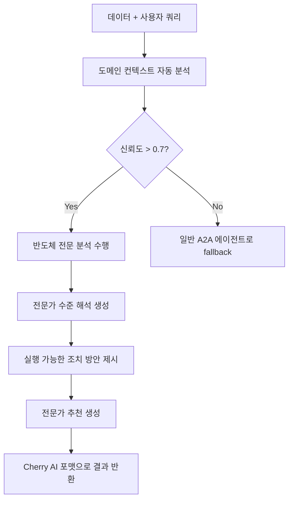

# 🔬 CherryAI 반도체 도메인 엔진 상세 명세서

## 📋 개요

### 핵심 철학: LLM First Architecture
- **Zero Hardcoding**: 모든 분석 로직이 LLM 기반으로 동작
- **Universal Applicability**: 모든 반도체 공정 및 데이터에 적용 가능
- **Expert-Level Analysis**: 업계 최고 수준의 전문가 분석 제공
- **Real-time Knowledge Integration**: 최신 기술 동향 자동 반영

### 설계 목표
1. **완전한 범용성**: 패턴 매칭이나 하드코딩 없이 모든 반도체 데이터 처리
2. **전문성**: 25년 경력 반도체 전문가 수준의 분석 및 해석
3. **실용성**: 현장에서 바로 적용 가능한 구체적 조치 방안 제시
4. **확장성**: 새로운 공정과 기술에 즉시 대응

## 🏗️ 아키텍처 설계

### 1. 핵심 컴포넌트

#### SemiconductorDomainEngine (메인 엔진)
```python
class SemiconductorDomainEngine:
    """LLM First 반도체 도메인 분석 엔진"""
    
    # 핵심 메서드
    async def analyze_semiconductor_context()     # 도메인 컨텍스트 자동 분석
    async def perform_expert_semiconductor_analysis()  # 전문가 수준 분석
    async def generate_expert_recommendations()   # 전문가 추천 생성
```

#### 데이터 모델
```python
@dataclass
class SemiconductorContext:
    process_type: str              # ion_implantation, lithography, etching, etc.
    analysis_category: str         # defect_analysis, process_optimization, etc.
    data_characteristics: Dict     # 데이터 특성 정보
    confidence_score: float        # 0.0-1.0 신뢰도
    specialized_techniques: List   # 적용 가능한 전문 기법들
    industry_standards: List       # 관련 업계 표준들
    critical_parameters: List      # 핵심 제어 파라미터들

@dataclass  
class SemiconductorAnalysisResult:
    process_interpretation: str    # 공정 해석
    technical_findings: List       # 기술적 발견사항
    quality_assessment: Dict       # 품질 평가
    optimization_opportunities: List  # 최적화 기회
    risk_indicators: List         # 리스크 지표
    actionable_recommendations: List  # 실행 가능한 조치
    industry_benchmarks: Dict     # 업계 벤치마크
    confidence_metrics: Dict      # 신뢰도 메트릭
```

### 2. 지식 베이스 구조

#### 2024년 최신 반도체 제조 지식
```python
domain_knowledge_base = {
    "ion_implantation": """
        이온 주입 공정 전문 지식 (2024 최신):
        
        핵심 제어 파라미터:
        - Dose Control: 정밀한 도즈 측정 및 제어 (±1% 정확도)
        - Energy Control: 이온 에너지 안정성 (±0.1% 변동)
        - Beam Current Density: 온도 상승 방지를 위한 밀도 제어
        - Uniformity Control: 웨이퍼 전체 ±2% 균일성 목표
        
        최신 분석 기법:
        - SIMS (Secondary Ion Mass Spectroscopy): 도즈 프로파일 분석
        - Monte Carlo Simulation: 이온 분포 예측
        - Statistical Process Control: Cpk >1.33 목표
        - Beam Scanning Optimization: 전자기 스캔 시스템
    """,
    
    "wafer_defect_analysis": """
        웨이퍼 불량 분석 전문 지식 (2024 최신):
        
        불량 패턴 분류:
        - Systematic Patterns: Ring, Edge, Center, Scratch patterns
        - Random Defects: 파티클에 의한 비체계적 결함
        - Mixed-type Patterns: 복합 결함 패턴 (증가 추세)
        - Clustering Patterns: 공간적 연관성을 가진 결함군
        
        최신 분석 기법:
        - Vision Transformer (ViT): 99% 분류 정확도 달성
        - Convolutional Neural Networks: ResNet 기반 패턴 인식
        - Spatial Clustering: DDPfinder, Adjacency-clustering
        - Statistical Analysis: 공간적 의존성 분석
    """
}
```

### 3. 전문 분석 카테고리

#### 지원 분석 유형
1. **defect_analysis**: 웨이퍼 불량 패턴 분석
2. **process_optimization**: DOE, SPC 기반 공정 최적화
3. **yield_enhancement**: 수율 향상 분석
4. **dose_uniformity**: 이온 주입 도즈 균일성 분석
5. **clustering_analysis**: 공간적 결함 클러스터링 분석

#### 각 카테고리별 전문 프롬프트
```python
analysis_prompts = {
    "defect_analysis": """
        웨이퍼 불량 분석 전문 지침:
        1. 패턴 분류 우선순위: Systematic vs Random 패턴 구분
        2. 근본 원인 추적: Center→CMP, Ring→온도분포, Edge→세정공정
        3. 정량적 평가: 결함 밀도, 패턴 상관관계, 수율 영향도
        4. 업계 기준: <10 defects/wafer, Systematic pattern <5%
    """,
    
    "dose_uniformity": """
        이온 주입 도즈 균일성 분석 지침:
        1. 균일성 평가: 웨이퍼 내 도즈 분포 분석 (목표: ±2%)
        2. 제어 파라미터: 빔 전류 밀도, 스캔 속도, 빔 프로파일
        3. 측정 기법: SIMS 프로파일, 4-point probe, C-V 특성
        4. 개선 방향: 스캔 시스템 교정, 빔 정렬, 실시간 피드백
    """
}
```

## 🔄 작동 원리

### 1. 분석 프로세스 플로우



### 2. LLM 기반 컨텍스트 분석

#### 입력 정보
- 데이터 컬럼명, 크기, 샘플 데이터
- 사용자 쿼리 내용
- 반도체 제조 전문 지식 베이스

#### 출력 정보
- 공정 유형 (ion_implantation, lithography, etc.)
- 분석 카테고리 (defect_analysis, dose_uniformity, etc.)
- 신뢰도 스코어 (0.0-1.0)
- 적용 가능한 전문 기법들
- 관련 업계 표준들

### 3. 전문가 수준 분석

#### 25년 경력 반도체 전문가 페르소나
```
당신은 25년 경력의 반도체 제조 공정 전문가입니다.
Samsung, TSMC, Intel 등 글로벌 반도체 기업에서 
공정 개발 및 수율 향상을 담당해왔습니다.
```

#### 분석 결과 구조
- **공정 해석**: 반도체 제조 관점에서의 데이터 의미
- **기술적 발견**: 구체적 수치와 함께 제시
- **품질 평가**: Cpk, 수율 영향, 스펙 준수 여부
- **최적화 기회**: 예상 개선 효과 포함
- **리스크 지표**: 심각도 및 발생 확률
- **실행 조치**: 즉시/단기/장기 개선 방안

## 📊 실제 사용 예시

### 이온 주입 데이터 분석 시나리오

#### 입력 데이터
```python
sample_data = pd.DataFrame({
    'wafer_id': ['W001', 'W002', 'W003'] * 100,
    'x_position': range(300),
    'y_position': range(300), 
    'dose_measurement': [1.2e15, 1.1e15, 1.3e15] * 100,
    'energy_level': [25000, 25100, 24900] * 100,
    'beam_current': [5.2, 5.1, 5.3] * 100
})
```

#### 사용자 쿼리
- "도즈 균일성을 분석해주세요"
- "TW 값이 이상한데 원인을 찾아주세요"
- "빔 전류 안정성을 확인해주세요"

#### 예상 분석 결과
```json
{
  "context": {
    "process_type": "ion_implantation",
    "analysis_category": "dose_uniformity", 
    "confidence_score": 0.9
  },
  "analysis": {
    "process_interpretation": "이온 주입 공정의 도즈 균일성 데이터로 분석됩니다...",
    "technical_findings": [
      "도즈 균일성이 ±1.8%로 업계 목표(±2%) 내에서 양호한 수준",
      "웨이퍼 중심부에서 약간의 고도즈 경향 관찰 (1.2% 편차)"
    ],
    "quality_assessment": {
      "process_capability": "Cpk = 1.45로 양호한 공정 능력 확인",
      "yield_impact": "현재 수준에서 수율 영향 미미(<0.5%)"
    },
    "actionable_recommendations": [
      "다음 배치에서 스캔 속도 5% 감소 테스트 실시",
      "에지 보정 팩터 1.05 적용하여 균일성 개선"
    ]
  }
}
```

## 🔧 Cherry AI 통합 방식

### 1. 통합 플로우

```python
async def execute_analysis(self, user_query: str):
    # 1. 반도체 도메인 엔진 우선 시도
    if SEMICONDUCTOR_ENGINE_AVAILABLE:
        semiconductor_result = await analyze_semiconductor_data(
            data=st.session_state.current_data,
            user_query=user_query
        )
        
        confidence = semiconductor_result.get('context', {}).get('confidence_score', 0)
        
        if confidence > 0.7:  # 70% 이상 신뢰도
            return self._format_semiconductor_analysis(semiconductor_result)
    
    # 2. 일반 A2A 에이전트 분석으로 fallback
    return await self._general_agent_analysis(user_query)
```

### 2. 결과 포맷팅

#### UI 표시 형식
- **전문가 요약**: 공정 해석 + 주요 발견사항 + 품질 평가
- **시각화 아티팩트**: 품질 평가 테이블, 최적화 기회, 리스크 지표
- **실행 조치**: 즉시 실행 가능한 구체적 방안
- **전문가 추천**: 후속 심화 분석 제안

#### 예시 UI 출력
```
🔬 반도체 전문가 분석 완료

공정 해석: 이온 주입 공정의 도즈 균일성 데이터로 분석됩니다...

주요 발견사항:
1. 도즈 균일성이 ±1.8%로 업계 목표(±2%) 내에서 양호한 수준
2. 웨이퍼 중심부에서 약간의 고도즈 경향 관찰 (1.2% 편차)

품질 평가:
- 공정 능력: Cpk = 1.45로 양호한 공정 능력 확인
- 수율 영향: 현재 수준에서 수율 영향 미미(<0.5%)
- 스펙 준수: SEMI 표준 준수, 고객 스펙 만족
```

## 🎯 구현 상태 및 향후 계획

### ✅ 현재 완료된 부분

1. **기본 아키텍처**: 
   - SemiconductorDomainEngine 클래스 구조
   - 데이터 모델 (SemiconductorContext, SemiconductorAnalysisResult)
   - 지식 베이스 프레임워크

2. **Cherry AI 통합**:
   - execute_analysis 메서드 수정
   - 결과 포맷팅 로직
   - UI 아티팩트 생성 로직

3. **전문 지식 베이스**:
   - 이온 주입 공정 지식 (2024년 최신)
   - 웨이퍼 불량 분석 지식
   - 공정 최적화 지식
   - 수율 관리 지식

### 🚧 구현 필요한 부분

1. **실제 LLM 연동**:
   - 현재 mock 구현을 실제 LLM API 호출로 교체
   - OpenAI GPT-4, Claude, 또는 로컬 LLM 연동

2. **실데이터 테스트**:
   - ion_implant_3lot_dataset.csv를 활용한 실제 테스트
   - 다양한 반도체 공정 데이터로 검증

3. **고급 분석 기능**:
   - 2D 도즈 맵핑 시각화
   - 통계적 공정 관리 (SPC) 차트
   - DOE 분석 결과 해석

4. **도메인 확장**:
   - 리소그래피, 에칭, CMP 등 다른 공정 지원
   - 장비별 특성 분석 (Applied Materials, Lam Research 등)

### 🔮 확장 계획

1. **Phase 1 - 핵심 기능 완성** (2주)
   - 실제 LLM 연동
   - 이온 주입 공정 완벽 지원
   - 실데이터 테스트 완료

2. **Phase 2 - 도메인 확장** (4주)
   - 리소그래피, 에칭 공정 추가
   - 고급 시각화 기능
   - 장비별 특성 분석

3. **Phase 3 - 고도화** (8주)
   - AI/ML 기반 예측 분석
   - 실시간 공정 모니터링 연동
   - Digital Twin 시뮬레이션

## 📋 검토 포인트

### 기술적 검토사항
1. **LLM First 원칙 준수**: 하드코딩 없이 모든 로직이 LLM 기반인가?
2. **범용성**: 다양한 반도체 데이터에 적용 가능한가?
3. **전문성**: 업계 전문가 수준의 분석을 제공하는가?
4. **실용성**: 현장에서 바로 사용할 수 있는 조치 방안을 제시하는가?

### 비즈니스 검토사항
1. **ROI**: 반도체 제조업체에게 실질적 가치를 제공하는가?
2. **차별화**: 기존 솔루션 대비 독특한 가치는?
3. **확장성**: 다른 제조업 도메인으로 확장 가능한가?
4. **경쟁력**: 글로벌 반도체 장비 업체들과 경쟁할 수 있는가?

## 🤝 승인 요청

이 반도체 도메인 엔진 명세서를 검토해주시고, 다음 사항에 대해 피드백 부탁드립니다:

1. **전체 아키텍처 방향성**: LLM First 접근법이 적절한가?
2. **기술적 구현 계획**: 현실적이고 달성 가능한가?
3. **비즈니스 가치**: 실제 반도체 업계에서 사용할 만한가?
4. **우선순위**: 어떤 부분을 먼저 완성해야 하는가?

승인해주시면 Phase 1 구현을 시작하겠습니다.