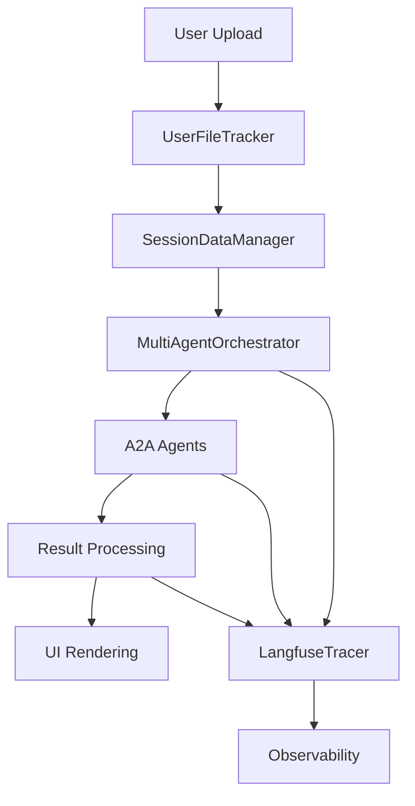

# 🔧 CherryAI v2.0 API 참조 문서

**개발자를 위한 완전한 기술 문서**

## 📋 목차

- [시스템 아키텍처](#-시스템-아키텍처)
- [A2A Protocol API](#-a2a-protocol-api)
- [Core Components](#-core-components)
- [Data Management](#-data-management)
- [Agent System](#-agent-system)
- [UI Components](#-ui-components)
- [Configuration](#-configuration)
- [Error Handling](#-error-handling)
- [Testing](#-testing)

## 🏗️ 시스템 아키텍처

### 전체 구조

```python
CherryAI_v2/
├── core/                    # 핵심 시스템 컴포넌트
│   ├── user_file_tracker.py     # Phase 1: 파일 추적 시스템
│   ├── session_data_manager.py  # 세션 데이터 관리
│   ├── multi_agent_orchestrator.py # Phase 3: 멀티 에이전트 오케스트레이터
│   ├── enhanced_langfuse_tracer.py # Phase 4: 관찰성 시스템
│   └── ...
├── a2a_ds_servers/         # A2A 프로토콜 서버들
├── ui/                     # Streamlit UI 컴포넌트
└── tests/                  # 테스트 시스템
```

### 데이터 플로우



## 🤖 A2A Protocol API

### Agent Card 구조

모든 A2A 에이전트는 표준 Agent Card를 제공합니다:

```json
{
  "agent_id": "orchestrator",
  "agent_name": "Data Science Orchestrator",
  "agent_description": "Central coordination for multi-agent data analysis",
  "version": "2.0.0",
  "skills": [
    "task_planning",
    "agent_coordination", 
    "workflow_management"
  ],
  "supported_formats": ["text", "data"],
  "endpoints": {
    "execute": "/.well-known/agent.json",
    "health": "/health"
  }
}
```

### A2A 메시지 구조

#### 요청 메시지
```python
from a2a.types import A2AMessage, TextPart

message = A2AMessage(
    message_id="msg_123",
    role="user",
    parts=[
        TextPart(text="Analyze this dataset and provide insights")
    ],
    metadata={
        "session_id": "session_abc",
        "user_context": {"emp_no": "EMP001"},
        "file_paths": ["/data/sample.csv"]
    }
)
```

#### 응답 메시지
```python
from a2a.types import A2AMessage, TextPart, DataPart

response = A2AMessage(
    message_id="msg_124",
    role="assistant", 
    parts=[
        TextPart(text="Analysis completed. Key findings:"),
        DataPart(
            data=analysis_results,
            content_type="application/json"
        )
    ],
    metadata={
        "processing_time": 15.2,
        "agent_used": ["eda_tools", "visualization"],
        "confidence": 0.95
    }
)
```

### A2A 서버 포트 구성

| 서버 | 포트 | 엔드포인트 | 기능 |
|------|------|------------|------|
| **Orchestrator** | 8100 | `/execute` | 중앙 조정 |
| **Pandas Analyst** | 8200 | `/execute` | 데이터 분석 |
| **EDA Tools** | 8203 | `/execute` | 탐색적 분석 |
| **Data Visualization** | 8202 | `/execute` | 시각화 |
| **SQL Analyst** | 8002 | `/execute` | SQL 분석 |

### A2A 클라이언트 사용법

```python
from a2a.client import A2AClient
import asyncio

async def call_agent():
    client = A2AClient("http://localhost:8200")
    
    # Agent Card 확인
    agent_card = await client.get_agent_card()
    print(f"Agent: {agent_card.agent_name}")
    
    # 분석 요청
    response = await client.execute(
        message="Analyze sales data and find trends",
        context={
            "session_id": "session_123",
            "file_path": "/data/sales.csv"
        }
    )
    
    return response

# 사용
result = asyncio.run(call_agent())
```

## 🔧 Core Components

### 1. UserFileTracker (Phase 1)

사용자 파일의 전체 생명주기를 추적하고 관리합니다.

#### 클래스 구조
```python
from core.user_file_tracker import UserFileTracker

class UserFileTracker:
    def __init__(self):
        self.registered_files = {}
        self.session_files = {}
        self.access_history = []
    
    def register_uploaded_file(
        self, 
        session_id: str,
        file_path: str,
        original_name: str,
        data: Optional[pd.DataFrame] = None,
        user_context: Optional[str] = None
    ) -> str:
        """파일 등록 및 추적 시작"""
        pass
    
    def get_file_for_a2a_request(
        self,
        user_request: str,
        session_id: str,
        agent_name: str,
        context: Optional[Dict] = None
    ) -> Tuple[str, str]:
        """A2A 요청에 최적화된 파일 선택"""
        pass
```

#### 사용 예시
```python
from core.user_file_tracker import get_user_file_tracker

# 싱글톤 인스턴스 가져오기
tracker = get_user_file_tracker()

# 파일 등록
file_id = tracker.register_uploaded_file(
    session_id="session_123",
    file_path="/tmp/uploaded_sales.csv",
    original_name="sales_data.csv",
    data=dataframe,
    user_context="Q3 sales performance data"
)

# A2A 요청용 파일 선택
file_path, reason = tracker.get_file_for_a2a_request(
    user_request="Show me monthly sales trends",
    session_id="session_123", 
    agent_name="pandas_analyst"
)

print(f"Selected file: {file_path}")
print(f"Reason: {reason}")
```

### 2. SessionDataManager

세션별 데이터 상태를 관리합니다.

#### API
```python
from core.session_data_manager import SessionDataManager

class SessionDataManager:
    def get_current_data(self, session_id: str) -> Optional[pd.DataFrame]:
        """현재 세션의 활성 데이터 반환"""
        pass
    
    def update_data_state(
        self, 
        session_id: str, 
        new_data: pd.DataFrame,
        source: str = "user_upload"
    ) -> bool:
        """데이터 상태 업데이트"""
        pass
    
    def get_data_lineage(self, session_id: str) -> List[Dict]:
        """데이터 변환 이력 조회"""
        pass
```

### 3. MultiAgentOrchestrator (Phase 3)

여러 A2A 에이전트를 조정하고 관리합니다.

#### 핵심 메서드
```python
from core.multi_agent_orchestrator import MultiAgentOrchestrator

class MultiAgentOrchestrator:
    async def orchestrate_analysis(
        self,
        user_query: str,
        data: pd.DataFrame,
        session_id: str,
        context: Optional[Dict] = None
    ) -> OrchestrationResult:
        """멀티 에이전트 분석 조정"""
        pass
    
    def register_agent(
        self,
        agent_name: str,
        capabilities: List[str],
        server_url: str,
        priority: int = 0
    ) -> bool:
        """새 에이전트 등록"""
        pass
    
    async def get_agent_status(self) -> Dict[str, AgentStatus]:
        """모든 에이전트 상태 확인"""
        pass
```

#### 사용 예시
```python
from core.multi_agent_orchestrator import get_multi_agent_orchestrator

# 오케스트레이터 가져오기
orchestrator = get_multi_agent_orchestrator()

# 분석 실행
result = await orchestrator.orchestrate_analysis(
    user_query="Analyze customer segmentation and create visualizations",
    data=customer_data,
    session_id="session_123",
    context={
        "priority": "high",
        "output_format": "interactive"
    }
)

# 결과 확인
print(f"Analysis completed: {result.success}")
print(f"Agents used: {result.agents_used}")
print(f"Insights: {result.insights}")
```

### 4. EnhancedLangfuseTracer (Phase 4)

완전한 관찰성과 추적 기능을 제공합니다.

#### 트레이싱 API
```python
from core.enhanced_langfuse_tracer import EnhancedLangfuseTracer

class EnhancedLangfuseTracer:
    def start_span(
        self,
        name: str,
        level: TraceLevel,
        input_data: Optional[Dict] = None,
        metadata: Optional[Dict] = None
    ) -> str:
        """새 스팬 시작"""
        pass
    
    def end_span(
        self,
        span_id: str,
        output_data: Optional[Dict] = None,
        success: bool = True
    ) -> None:
        """스팬 종료"""
        pass
    
    def log_agent_interaction(
        self,
        agent_name: str,
        request_data: Dict,
        response_data: Dict,
        duration_ms: float
    ) -> None:
        """에이전트 상호작용 로깅"""
        pass
```

#### 사용 예시
```python
from core.enhanced_langfuse_tracer import get_enhanced_tracer
from core.trace_context import TraceContext

tracer = get_enhanced_tracer()

# 컨텍스트 매니저 사용
with TraceContext("Data Analysis Workflow", user_id="EMP001") as trace_id:
    # 분석 단계 추적
    span_id = tracer.start_span(
        "Data Preprocessing",
        TraceLevel.COMPONENT,
        input_data={"rows": len(data), "columns": len(data.columns)}
    )
    
    # 분석 수행
    processed_data = preprocess_data(data)
    
    # 스팬 종료
    tracer.end_span(
        span_id,
        output_data={"processed_rows": len(processed_data)},
        success=True
    )
```

## 💾 Data Management

### 파일 처리 시스템

#### 지원 형식
```python
SUPPORTED_FORMATS = {
    "csv": {
        "extensions": [".csv"],
        "max_size": "100MB",
        "encoding": "auto-detect",
        "delimiter": "auto-detect"
    },
    "excel": {
        "extensions": [".xlsx", ".xls"],
        "max_size": "100MB", 
        "sheets": "multiple"
    },
    "json": {
        "extensions": [".json"],
        "max_size": "50MB",
        "structure": "nested"
    }
}
```

#### 파일 업로드 API
```python
from ui.file_upload_manager import FileUploadManager

class FileUploadManager:
    def process_uploaded_file(
        self,
        uploaded_file,
        session_id: str,
        file_type: Optional[str] = None
    ) -> Tuple[pd.DataFrame, Dict]:
        """업로드된 파일 처리"""
        pass
    
    def validate_file_format(self, file) -> Tuple[bool, str]:
        """파일 형식 유효성 검사"""
        pass
    
    def get_file_metadata(self, file_path: str) -> Dict:
        """파일 메타데이터 추출"""
        pass
```

### 데이터 변환 파이프라인

```python
from core.data_pipeline import DataPipeline

class DataPipeline:
    def __init__(self):
        self.transformations = []
        self.validators = []
    
    def add_transformation(
        self, 
        transform_func: Callable,
        name: str,
        description: str
    ) -> None:
        """변환 함수 추가"""
        pass
    
    def execute_pipeline(
        self, 
        data: pd.DataFrame,
        session_id: str
    ) -> Tuple[pd.DataFrame, List[Dict]]:
        """파이프라인 실행"""
        pass
```

## 🎯 Agent System

### 에이전트 인터페이스

모든 A2A 에이전트는 표준 인터페이스를 구현합니다:

```python
from abc import ABC, abstractmethod
from a2a.server import AgentExecutor

class BaseA2AAgent(AgentExecutor):
    @abstractmethod
    async def execute(self, request_context) -> Dict:
        """A2A 요청 처리"""
        pass
    
    @abstractmethod
    async def cancel(self, task_id: str) -> bool:
        """작업 취소"""
        pass
    
    def get_capabilities(self) -> List[str]:
        """에이전트 역량 반환"""
        pass
    
    def get_health_status(self) -> Dict:
        """헬스 상태 반환"""
        pass
```

### 커스텀 에이전트 구현

```python
from a2a_ds_servers.base.base_a2a_agent import BaseA2AAgent

class CustomAnalysisAgent(BaseA2AAgent):
    def __init__(self):
        super().__init__(
            agent_name="Custom Analysis Agent",
            agent_description="Domain-specific analysis agent",
            skills=["custom_analysis", "domain_insights"]
        )
    
    async def execute(self, request_context) -> Dict:
        # A2A 요청 파싱
        message = request_context.message
        user_query = message.parts[0].text
        
        # 도메인별 분석 수행
        results = await self.perform_custom_analysis(user_query)
        
        # 결과 반환
        return {
            "success": True,
            "results": results,
            "agent_info": self.get_agent_info()
        }
    
    async def perform_custom_analysis(self, query: str) -> Dict:
        """커스텀 분석 로직"""
        # 구현할 분석 로직
        pass
```

### 에이전트 등록

```python
# 서버 시작 시 에이전트 등록
from core.multi_agent_orchestrator import get_multi_agent_orchestrator

orchestrator = get_multi_agent_orchestrator()

# 커스텀 에이전트 등록
orchestrator.register_agent(
    agent_name="custom_analysis",
    capabilities=["domain_analysis", "specialized_insights"],
    server_url="http://localhost:9000",
    priority=5
)
```

## 🎨 UI Components

### Streamlit 컴포넌트 시스템

#### 기본 컴포넌트
```python
from ui.components import StreamlitComponent

class StreamlitComponent:
    def __init__(self, component_id: str):
        self.component_id = component_id
        self.state = {}
    
    def render(self, **kwargs) -> Any:
        """컴포넌트 렌더링"""
        pass
    
    def update_state(self, new_state: Dict) -> None:
        """상태 업데이트"""
        pass
```

#### 파일 업로드 컴포넌트
```python
from ui.file_upload_component import FileUploadComponent

class FileUploadComponent(StreamlitComponent):
    def render(self, 
               accepted_types: List[str] = None,
               max_size: int = 100
              ) -> Optional[pd.DataFrame]:
        """파일 업로드 UI 렌더링"""
        
        uploaded_file = st.file_uploader(
            "데이터 파일 업로드",
            type=accepted_types or ['csv', 'xlsx', 'json'],
            help=f"최대 {max_size}MB 파일 지원"
        )
        
        if uploaded_file:
            return self.process_file(uploaded_file)
        return None
```

#### 결과 렌더링 컴포넌트
```python
from ui.result_renderer import ResultRenderer

class ResultRenderer:
    def render_analysis_result(
        self,
        result: Dict,
        session_id: str,
        interactive: bool = True
    ) -> None:
        """분석 결과 렌더링"""
        
        # 코드 표시
        if 'generated_code' in result:
            with st.expander("🔍 생성된 코드"):
                st.code(result['generated_code'], language='python')
        
        # 시각화 표시
        if 'visualizations' in result:
            for viz in result['visualizations']:
                st.plotly_chart(viz, use_container_width=True)
        
        # 인사이트 표시
        if 'insights' in result:
            st.info(f"💡 주요 인사이트: {result['insights']}")
```

### 실시간 스트리밍

```python
from ui.streaming_handler import StreamingHandler

class StreamingHandler:
    def __init__(self):
        self.stream_container = st.empty()
        self.progress_bar = st.progress(0)
    
    async def handle_stream(self, stream_generator):
        """실시간 스트림 처리"""
        async for chunk in stream_generator:
            if chunk.type == "progress":
                self.progress_bar.progress(chunk.value)
            elif chunk.type == "partial_result":
                self.stream_container.write(chunk.content)
            elif chunk.type == "final_result":
                self.render_final_result(chunk.content)
```

## ⚙️ Configuration

### 환경 설정

#### .env 파일 구조
```env
# Core API Keys
OPENAI_API_KEY=sk-your-openai-key
LANGFUSE_PUBLIC_KEY=pk-your-public-key
LANGFUSE_SECRET_KEY=sk-your-secret-key
LANGFUSE_HOST=https://your-langfuse-host

# User Configuration  
EMP_NO=EMP001

# LLM Settings
LLM_PROVIDER=OPENAI
LLM_MODEL=gpt-4o-mini
LLM_TEMPERATURE=0.7
LLM_MAX_TOKENS=2000

# A2A Server Configuration
A2A_ORCHESTRATOR_PORT=8100
A2A_PANDAS_ANALYST_PORT=8200
A2A_EDA_TOOLS_PORT=8203
A2A_DATA_VIZ_PORT=8202

# System Settings
STREAMLIT_SERVER_PORT=8501
LOGGING_LEVEL=INFO
DEBUG_MODE=false
```

#### 설정 클래스
```python
from core.config import CherryAIConfig

class CherryAIConfig:
    def __init__(self):
        self.load_from_env()
    
    def load_from_env(self) -> None:
        """환경 변수에서 설정 로드"""
        self.openai_api_key = os.getenv("OPENAI_API_KEY")
        self.langfuse_public_key = os.getenv("LANGFUSE_PUBLIC_KEY")
        # ... 기타 설정
    
    def validate_config(self) -> Tuple[bool, List[str]]:
        """설정 유효성 검사"""
        errors = []
        if not self.openai_api_key:
            errors.append("OPENAI_API_KEY is required")
        # ... 기타 검증
        return len(errors) == 0, errors
```

### 동적 설정

```python
from core.dynamic_config import DynamicConfigManager

class DynamicConfigManager:
    def update_agent_config(
        self,
        agent_name: str,
        new_config: Dict
    ) -> bool:
        """에이전트 설정 동적 업데이트"""
        pass
    
    def get_current_config(self) -> Dict:
        """현재 시스템 설정 반환"""
        pass
    
    def reload_config(self) -> bool:
        """설정 다시 로드"""
        pass
```

## 🚨 Error Handling

### 에러 계층 구조

```python
class CherryAIError(Exception):
    """기본 CherryAI 예외"""
    def __init__(self, message: str, error_code: str = None):
        self.message = message
        self.error_code = error_code
        super().__init__(message)

class FileProcessingError(CherryAIError):
    """파일 처리 관련 에러"""
    pass

class A2AAgentError(CherryAIError):
    """A2A 에이전트 관련 에러"""
    pass

class DataAnalysisError(CherryAIError):
    """데이터 분석 관련 에러"""
    pass
```

### 에러 핸들러

```python
from core.error_handler import ErrorHandler

class ErrorHandler:
    def __init__(self):
        self.error_callbacks = {}
    
    def handle_error(
        self,
        error: Exception,
        context: Dict
    ) -> Tuple[bool, str]:
        """에러 처리 및 복구 시도"""
        
        if isinstance(error, FileProcessingError):
            return self.handle_file_error(error, context)
        elif isinstance(error, A2AAgentError):
            return self.handle_agent_error(error, context)
        else:
            return self.handle_generic_error(error, context)
    
    def handle_file_error(self, error, context) -> Tuple[bool, str]:
        """파일 처리 에러 핸들링"""
        # 자동 복구 시도
        # 대안 제안
        pass
```

### 재시도 메커니즘

```python
from core.retry_handler import RetryHandler

class RetryHandler:
    def __init__(self, max_retries: int = 3):
        self.max_retries = max_retries
    
    async def retry_with_backoff(
        self,
        func: Callable,
        *args,
        **kwargs
    ) -> Any:
        """지수 백오프를 사용한 재시도"""
        
        for attempt in range(self.max_retries):
            try:
                return await func(*args, **kwargs)
            except Exception as e:
                if attempt == self.max_retries - 1:
                    raise e
                
                wait_time = 2 ** attempt
                await asyncio.sleep(wait_time)
```

## 🧪 Testing

### 테스트 구조

```python
# 단위 테스트
class TestUserFileTracker(unittest.TestCase):
    def setUp(self):
        self.tracker = UserFileTracker()
        self.test_session_id = "test_session_123"
    
    def test_file_registration(self):
        """파일 등록 테스트"""
        file_id = self.tracker.register_uploaded_file(
            session_id=self.test_session_id,
            file_path="/test/sample.csv",
            original_name="sample.csv"
        )
        self.assertIsNotNone(file_id)
    
    def test_a2a_file_selection(self):
        """A2A 파일 선택 테스트"""
        # 테스트 구현
        pass

# 통합 테스트
class TestA2AIntegration(unittest.TestCase):
    async def test_end_to_end_analysis(self):
        """전체 분석 파이프라인 테스트"""
        # E2E 테스트 구현
        pass
```

### 모킹 및 픽스처

```python
import pytest
from unittest.mock import Mock, AsyncMock

@pytest.fixture
def mock_langfuse_client():
    """Langfuse 클라이언트 목 객체"""
    mock_client = Mock()
    mock_client.trace = AsyncMock()
    return mock_client

@pytest.fixture
def sample_dataframe():
    """테스트용 샘플 데이터프레임"""
    return pd.DataFrame({
        'date': pd.date_range('2024-01-01', periods=100),
        'value': np.random.randn(100),
        'category': np.random.choice(['A', 'B', 'C'], 100)
    })
```

### 성능 테스트

```python
import time
import pytest

@pytest.mark.performance
class TestPerformance:
    def test_large_dataset_processing(self):
        """대용량 데이터셋 처리 성능 테스트"""
        large_df = pd.DataFrame(np.random.randn(100000, 10))
        
        start_time = time.time()
        result = process_large_dataset(large_df)
        processing_time = time.time() - start_time
        
        assert processing_time < 30.0  # 30초 이내
        assert result is not None
    
    @pytest.mark.asyncio
    async def test_concurrent_requests(self):
        """동시 요청 처리 성능 테스트"""
        tasks = []
        for i in range(10):
            task = asyncio.create_task(
                make_analysis_request(f"test_query_{i}")
            )
            tasks.append(task)
        
        results = await asyncio.gather(*tasks)
        assert all(r.success for r in results)
```

## 📊 모니터링 및 메트릭

### 시스템 메트릭

```python
from core.metrics_collector import MetricsCollector

class MetricsCollector:
    def collect_system_metrics(self) -> Dict:
        """시스템 메트릭 수집"""
        return {
            "cpu_usage": psutil.cpu_percent(),
            "memory_usage": psutil.virtual_memory().percent,
            "disk_usage": psutil.disk_usage('/').percent,
            "active_sessions": len(self.get_active_sessions()),
            "agent_health": self.check_agent_health()
        }
    
    def collect_performance_metrics(self) -> Dict:
        """성능 메트릭 수집"""
        return {
            "avg_response_time": self.calculate_avg_response_time(),
            "request_count": self.get_request_count(),
            "error_rate": self.calculate_error_rate(),
            "throughput": self.calculate_throughput()
        }
```

### Langfuse 메트릭

```python
from core.langfuse_metrics import LangfuseMetrics

class LangfuseMetrics:
    def get_trace_statistics(self, time_range: str) -> Dict:
        """트레이스 통계 조회"""
        pass
    
    def get_agent_performance(self) -> Dict:
        """에이전트별 성능 메트릭"""
        pass
    
    def get_user_activity(self) -> Dict:
        """사용자 활동 메트릭"""
        pass
```

## 🔌 확장성

### 플러그인 시스템

```python
from core.plugin_manager import PluginManager

class PluginManager:
    def __init__(self):
        self.plugins = {}
    
    def register_plugin(
        self,
        plugin_name: str,
        plugin_class: type,
        config: Dict = None
    ) -> bool:
        """플러그인 등록"""
        pass
    
    def load_plugin(self, plugin_name: str) -> Any:
        """플러그인 로드"""
        pass
    
    def unload_plugin(self, plugin_name: str) -> bool:
        """플러그인 언로드"""
        pass
```

### 커스텀 분석 모듈

```python
from core.analysis_modules import AnalysisModule

class CustomAnalysisModule(AnalysisModule):
    def __init__(self):
        super().__init__(
            module_name="custom_analysis",
            description="Domain-specific analysis module"
        )
    
    def analyze(self, data: pd.DataFrame, params: Dict) -> Dict:
        """커스텀 분석 수행"""
        # 분석 로직 구현
        pass
    
    def get_supported_data_types(self) -> List[str]:
        """지원하는 데이터 타입 반환"""
        return ["tabular", "time_series", "categorical"]
```

---

## 📝 버전 정보

### API 버전
- **CherryAI Core**: v2.0.0
- **A2A Protocol**: v0.2.9
- **Langfuse Integration**: v2.x
- **Streamlit UI**: v1.46+

### 호환성 매트릭스

| Component | Minimum Version | Recommended | Latest Tested |
|-----------|----------------|-------------|---------------|
| Python | 3.12.0 | 3.12.10 | 3.12.10 |
| NumPy | 2.0.0 | 2.1.3 | 2.1.3 |
| Pandas | 2.2.0 | 2.3.0 | 2.3.0 |
| Streamlit | 1.40.0 | 1.46.0 | 1.46.0 |
| A2A SDK | 0.2.9 | 0.2.9 | 0.2.9 |

---

**🍒 CherryAI v2.0 API Reference** - *Building powerful data science applications with AI*

*For questions or contributions, please refer to our [GitHub repository](https://github.com/your-repo/cherryai)* 