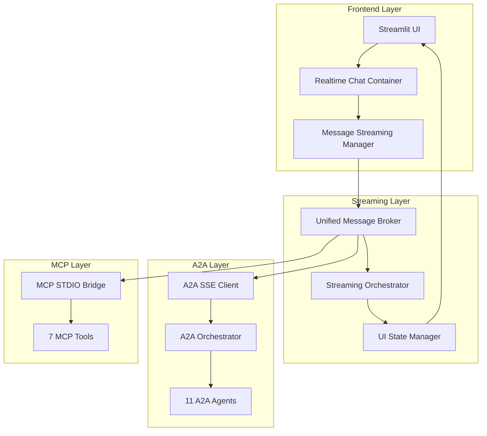

# CherryAI 실시간 스트리밍 아키텍처 설계서

## 📋 문서 개요

**버전**: 1.0  
**작성일**: 2025년 1월 27일  
**목적**: CherryAI 플랫폼의 실시간 스트리밍 아키텍처 구현 가이드  
**대상**: 개발팀, 검증팀, 아키텍처 리뷰어  

---

## 🎯 핵심 목표

### 1. **LLM First 철학 준수**
- LLM의 능력을 최대한 끌어내는 범용적 멀티에이전트 플랫폼
- Rule 기반 하드코딩 및 패턴 매칭 완전 제거
- A2A SDK 0.2.9 표준 완전 준수

### 2. **실시간 사용자 경험**
- ChatGPT/Claude 수준의 반응형 UI/UX
- A2A 에이전트와 MCP 도구의 실시간 결과 스트리밍
- SSE 기반 비동기 통신 표준화

### 3. **확장 가능한 아키텍처**
- 11개 A2A 에이전트 + 7개 MCP 도구 효율적 관리
- 모듈화된 구조로 유지보수성 확보
- 성능 최적화 및 에러 핸들링

---

## 🏗️ 전체 시스템 아키텍처



---

## 🔧 Phase 1: Streamlit UI/UX 즉시 개선

### **현재 문제점**
1. **컨테이너 중복**: 3개의 겹친 컨테이너로 인한 공간 낭비
2. **과도한 빈 공간**: 유의미한 정보 대비 과도한 여백
3. **스트리밍 부재**: A2A/MCP 결과가 실시간으로 표시되지 않음

### **해결 방안**

#### A. 컨테이너 통합 및 공간 최적화

```python
# ui/components/unified_chat_interface.py

class UnifiedChatInterface:
    def __init__(self):
        self.message_container = st.empty()
        self.input_container = st.container()
        
    def render(self):
        """단일 컨테이너 기반 통합 채팅 인터페이스"""
        
        # 헤더 최소화 (기존 대비 60% 공간 절약)
        st.markdown("""
        <div class="cherry-header" style="
            padding: 0.5rem 0;
            margin-bottom: 1rem;
            border-bottom: 1px solid #e0e0e0;
        ">
            <h3 style="margin: 0;">🍒 CherryAI</h3>
        </div>
        """, unsafe_allow_html=True)
        
        # 통합 채팅 영역
        with self.message_container.container():
            self._render_messages()
            
        # 하단 고정 입력창
        with self.input_container:
            self._render_input_area()
```

#### B. 실시간 메시지 스트리밍

```python
# ui/streaming/realtime_chat_container.py

class RealtimeChatContainer:
    def __init__(self):
        self.messages = []
        self.active_streams = {}
        
    def add_streaming_message(self, source: str, agent_type: str):
        """실시간 스트리밍 메시지 컨테이너 추가"""
        
        message_id = f"{source}_{agent_type}_{int(time.time())}"
        placeholder = st.empty()
        
        self.active_streams[message_id] = {
            'placeholder': placeholder,
            'content': "",
            'metadata': {
                'source': source,  # 'a2a' or 'mcp'
                'agent_type': agent_type,
                'status': 'streaming'
            }
        }
        
        return message_id
    
    def update_streaming_message(self, message_id: str, chunk: str):
        """스트리밍 메시지 실시간 업데이트"""
        
        if message_id in self.active_streams:
            stream_data = self.active_streams[message_id]
            stream_data['content'] += chunk
            
            # 실시간 렌더링
            stream_data['placeholder'].markdown(f"""
            <div class="streaming-message">
                <div class="message-header">
                    <span class="agent-badge">{stream_data['metadata']['agent_type']}</span>
                    <span class="status-indicator">🔄 분석 중...</span>
                </div>
                <div class="message-content">
                    {stream_data['content']}
                </div>
            </div>
            """, unsafe_allow_html=True)
```

---

## 🌊 Phase 2: A2A SDK 0.2.9 SSE 스트리밍 구현

### **A2A 표준 SSE 아키텍처**

#### A. A2A SSE 클라이언트

```python
# core/streaming/a2a_sse_client.py

import asyncio
import aiohttp
from typing import AsyncGenerator, Dict, Any
from a2a.types import RequestContext, TaskState
from a2a.client import A2AClient

class A2ASSEClient:
    """A2A SDK 0.2.9 표준 SSE 클라이언트"""
    
    def __init__(self, base_url: str, agents: Dict[str, str]):
        self.base_url = base_url
        self.agents = agents  # {'pandas': 'http://localhost:8001', ...}
        self.active_connections = {}
        
    async def stream_agent_response(
        self, 
        agent_name: str, 
        query: str, 
        session_id: str
    ) -> AsyncGenerator[Dict[str, Any], None]:
        """A2A 에이전트로부터 실시간 스트리밍 수신"""
        
        agent_url = self.agents[agent_name]
        sse_endpoint = f"{agent_url}/stream/{session_id}"
        
        async with aiohttp.ClientSession() as session:
            async with session.get(
                sse_endpoint,
                headers={
                    'Accept': 'text/event-stream',
                    'Cache-Control': 'no-cache'
                }
            ) as response:
                
                async for line in response.content:
                    if line:
                        event_data = self._parse_sse_event(line.decode())
                        if event_data:
                            yield {
                                'source': 'a2a',
                                'agent': agent_name,
                                'type': event_data.get('event', 'message'),
                                'data': event_data.get('data', ''),
                                'final': event_data.get('final', False)
                            }
    
    def _parse_sse_event(self, line: str) -> Dict[str, Any]:
        """A2A 표준 SSE 이벤트 파싱"""
        
        if line.startswith('data: '):
            try:
                return json.loads(line[6:])  # 'data: ' 제거
            except json.JSONDecodeError:
                return {'data': line[6:]}
        return None
```

#### B. A2A 서버 측 SSE 구현

```python
# a2a_ds_servers/base/streaming_server.py

from fastapi import FastAPI
from fastapi.responses import StreamingResponse
from a2a.server import A2AFastAPIApplication
from a2a.server.tasks.task_updater import TaskUpdater
from a2a.types import RequestContext, TaskState

class A2AStreamingServer:
    """A2A SDK 0.2.9 표준 스트리밍 서버"""
    
    def __init__(self, agent_executor):
        self.app = A2AFastAPIApplication()
        self.agent_executor = agent_executor
        
    async def stream_response(
        self, 
        context: RequestContext,
        task_updater: TaskUpdater
    ) -> StreamingResponse:
        """A2A 표준 스트리밍 응답"""
        
        async def event_generator():
            try:
                # 작업 시작 알림
                yield self._create_sse_event(
                    event_type="start",
                    data={"message": "분석을 시작합니다...", "final": False}
                )
                
                # 에이전트 실행 및 중간 결과 스트리밍
                async for chunk in self.agent_executor.stream(context):
                    yield self._create_sse_event(
                        event_type="progress", 
                        data={
                            "content": chunk.content,
                            "metadata": chunk.metadata,
                            "final": False
                        }
                    )
                    
                    # TaskUpdater로 상태 업데이트
                    await task_updater.update_status(
                        TaskState.working,
                        message=f"처리 중: {chunk.content[:50]}..."
                    )
                
                # 완료 이벤트
                yield self._create_sse_event(
                    event_type="complete",
                    data={"message": "분석이 완료되었습니다.", "final": True}
                )
                
                await task_updater.update_status(TaskState.completed)
                
            except Exception as e:
                # 에러 이벤트
                yield self._create_sse_event(
                    event_type="error",
                    data={"error": str(e), "final": True}
                )
                await task_updater.update_status(TaskState.failed, str(e))
        
        return StreamingResponse(
            event_generator(), 
            media_type="text/event-stream"
        )
    
    def _create_sse_event(self, event_type: str, data: Dict) -> str:
        """A2A 표준 SSE 이벤트 생성"""
        
        return f"event: {event_type}\ndata: {json.dumps(data)}\n\n"
```

---

## 🔌 Phase 3: MCP STDIO → SSE 표준화

### **MCP 통합 브리지 시스템**

#### A. MCP STDIO 브리지

```python
# core/streaming/mcp_stdio_bridge.py

import asyncio
import subprocess
import json
from typing import AsyncGenerator, Dict, Any

class MCPSTDIOBridge:
    """MCP STDIO를 SSE로 변환하는 브리지"""
    
    def __init__(self, mcp_tools: Dict[str, str]):
        self.mcp_tools = mcp_tools  # {'pandas': '/path/to/mcp-pandas', ...}
        self.active_processes = {}
        
    async def stream_mcp_tool(
        self, 
        tool_name: str, 
        command: str, 
        session_id: str
    ) -> AsyncGenerator[Dict[str, Any], None]:
        """MCP 도구 실행 결과를 SSE로 스트리밍"""
        
        tool_path = self.mcp_tools[tool_name]
        
        # STDIO 프로세스 시작
        process = await asyncio.create_subprocess_exec(
            tool_path,
            stdin=subprocess.PIPE,
            stdout=subprocess.PIPE,
            stderr=subprocess.PIPE
        )
        
        self.active_processes[session_id] = process
        
        try:
            # MCP JSON-RPC 요청 전송
            request = {
                "jsonrpc": "2.0",
                "id": 1,
                "method": "execute",
                "params": {"command": command}
            }
            
            process.stdin.write(json.dumps(request).encode() + b'\n')
            await process.stdin.drain()
            
            # 실시간 출력 스트리밍
            while True:
                line = await process.stdout.readline()
                if not line:
                    break
                    
                try:
                    response = json.loads(line.decode())
                    
                    yield {
                        'source': 'mcp',
                        'tool': tool_name,
                        'type': 'response',
                        'data': response.get('result', ''),
                        'final': 'id' in response  # JSON-RPC 응답 완료
                    }
                    
                except json.JSONDecodeError:
                    # 원시 출력도 스트리밍
                    yield {
                        'source': 'mcp',
                        'tool': tool_name,
                        'type': 'output',
                        'data': line.decode().strip(),
                        'final': False
                    }
                    
        finally:
            # 프로세스 정리
            if session_id in self.active_processes:
                process.terminate()
                await process.wait()
                del self.active_processes[session_id]
```

#### B. 통합 메시지 브로커

```python
# core/streaming/unified_message_broker.py

class UnifiedMessageBroker:
    """A2A + MCP 통합 메시지 브로커"""
    
    def __init__(self):
        self.a2a_client = A2ASSEClient(
            base_url="http://localhost:8100",
            agents={
                'orchestrator': 'http://localhost:8100',
                'pandas': 'http://localhost:8001',
                'visualization': 'http://localhost:8002',
                'ml_modeling': 'http://localhost:8003',
                # ... 11개 A2A 에이전트
            }
        )
        
        self.mcp_bridge = MCPSTDIOBridge(
            mcp_tools={
                'data_preprocessing': '/path/to/mcp-data-preprocessing',
                'statistical_analysis': '/path/to/mcp-statistical-analysis',
                'advanced_visualization': '/path/to/mcp-advanced-visualization',
                # ... 7개 MCP 도구
            }
        )
        
        self.message_queues = {}  # 세션별 메시지 큐
        
    async def process_query_with_streaming(
        self, 
        query: str, 
        session_id: str
    ) -> AsyncGenerator[Dict[str, Any], None]:
        """통합 쿼리 처리 및 실시간 스트리밍"""
        
        # 1. A2A 오케스트레이터로 계획 수립
        async for plan_chunk in self.a2a_client.stream_agent_response(
            'orchestrator', query, session_id
        ):
            yield plan_chunk
            
            # 계획에서 필요한 에이전트/도구 추출 (LLM First)
            if plan_chunk['final']:
                execution_plan = self._parse_execution_plan(plan_chunk['data'])
                
                # 2. 병렬 실행 및 스트리밍
                tasks = []
                
                for step in execution_plan:
                    if step['type'] == 'a2a_agent':
                        tasks.append(
                            self.a2a_client.stream_agent_response(
                                step['agent'], step['query'], session_id
                            )
                        )
                    elif step['type'] == 'mcp_tool':
                        tasks.append(
                            self.mcp_bridge.stream_mcp_tool(
                                step['tool'], step['command'], session_id
                            )
                        )
                
                # 3. 모든 결과 실시간 병합 스트리밍
                async for merged_result in self._merge_streams(tasks):
                    yield merged_result
    
    async def _merge_streams(self, streams) -> AsyncGenerator[Dict[str, Any], None]:
        """여러 스트림을 시간순으로 병합"""
        
        async def stream_wrapper(stream, source_id):
            async for item in stream:
                item['stream_id'] = source_id
                yield item
        
        # 모든 스트림을 큐에 병합
        queue = asyncio.Queue()
        
        async def producer(stream, source_id):
            async for item in stream_wrapper(stream, source_id):
                await queue.put(item)
        
        # 모든 스트림 병렬 실행
        producers = [
            asyncio.create_task(producer(stream, i)) 
            for i, stream in enumerate(streams)
        ]
        
        try:
            while any(not p.done() for p in producers):
                try:
                    item = await asyncio.wait_for(queue.get(), timeout=0.1)
                    yield item
                except asyncio.TimeoutError:
                    continue
        finally:
            for p in producers:
                p.cancel()
```

---

## 🔄 Phase 4: Streamlit 통합 시스템

### **실시간 스트리밍 오케스트레이터**

```python
# core/streaming/streaming_orchestrator.py

class StreamingOrchestrator:
    """Streamlit과 백엔드 스트리밍 시스템 통합"""
    
    def __init__(self):
        self.broker = UnifiedMessageBroker()
        self.ui_state = UIStateManager()
        
    async def handle_user_query(
        self, 
        query: str, 
        session_id: str,
        ui_container: RealtimeChatContainer
    ):
        """사용자 쿼리 처리 및 UI 실시간 업데이트"""
        
        active_messages = {}  # 활성 메시지 추적
        
        async for stream_chunk in self.broker.process_query_with_streaming(
            query, session_id
        ):
            source = stream_chunk['source']  # 'a2a' or 'mcp'
            agent_or_tool = stream_chunk.get('agent', stream_chunk.get('tool'))
            
            # 새로운 스트림 시작
            if stream_chunk['type'] == 'start':
                message_id = ui_container.add_streaming_message(
                    source, agent_or_tool
                )
                active_messages[f"{source}_{agent_or_tool}"] = message_id
                
            # 진행 중 업데이트
            elif stream_chunk['type'] in ['progress', 'response', 'output']:
                key = f"{source}_{agent_or_tool}"
                if key in active_messages:
                    ui_container.update_streaming_message(
                        active_messages[key], 
                        stream_chunk['data']
                    )
                    
            # 스트림 완료
            elif stream_chunk['final']:
                key = f"{source}_{agent_or_tool}"
                if key in active_messages:
                    ui_container.finalize_streaming_message(
                        active_messages[key]
                    )
                    del active_messages[key]
        
        # 모든 스트림 완료 후 종합 결과 생성
        await self._generate_final_summary(session_id, ui_container)
```

### **개선된 main.py 구조**

```python
# main.py (개선된 버전)

import asyncio
from ui.streaming.realtime_chat_container import RealtimeChatContainer
from core.streaming.streaming_orchestrator import StreamingOrchestrator

def main():
    st.set_page_config(
        page_title="🍒 CherryAI", 
        layout="wide",
        initial_sidebar_state="collapsed"  # 사이드바 제거
    )
    
    # 세션 초기화
    if 'session_id' not in st.session_state:
        st.session_state.session_id = str(uuid.uuid4())
    if 'chat_container' not in st.session_state:
        st.session_state.chat_container = RealtimeChatContainer()
    
    # 통합 채팅 인터페이스 (컨테이너 1개)
    with st.container():
        # 파일 업로드 (조건부 표시)
        render_conditional_file_upload()
        
        # 실시간 채팅 영역
        chat_container = st.session_state.chat_container
        chat_container.render()
        
        # 하단 고정 입력창
        with st.container():
            user_input = st.chat_input("CherryAI에게 질문하세요...")
            
            if user_input:
                # 사용자 메시지 즉시 표시
                chat_container.add_user_message(user_input)
                
                # 실시간 스트리밍 처리
                orchestrator = StreamingOrchestrator()
                
                # 비동기 처리를 위한 백그라운드 실행
                asyncio.run(
                    orchestrator.handle_user_query(
                        user_input,
                        st.session_state.session_id,
                        chat_container
                    )
                )
                
                # UI 자동 스크롤
                st.rerun()

def render_conditional_file_upload():
    """조건부 파일 업로드 (완료 시 자동 접힘)"""
    
    upload_completed = st.session_state.get('upload_completed', False)
    
    with st.expander("📁 파일 업로드", expanded=not upload_completed):
        uploaded_files = st.file_uploader(
            "데이터 파일을 업로드하세요",
            accept_multiple_files=True,
            type=['csv', 'xlsx', 'json', 'parquet']
        )
        
        if uploaded_files and not upload_completed:
            # 파일 처리 및 환영 메시지
            process_uploaded_files(uploaded_files)
            st.session_state.upload_completed = True
            st.rerun()

if __name__ == "__main__":
    main()
```

---

## 📊 성능 최적화 전략

### **1. 연결 풀링 및 리소스 관리**

```python
# core/performance/connection_pool.py

class A2AMCPConnectionPool:
    """A2A + MCP 연결 풀 관리"""
    
    def __init__(self, max_connections: int = 50):
        self.a2a_pools = {}  # 에이전트별 연결 풀
        self.mcp_processes = {}  # MCP 프로세스 풀
        self.max_connections = max_connections
        
    async def get_a2a_connection(self, agent_name: str):
        """A2A 에이전트 연결 풀에서 연결 획득"""
        
        if agent_name not in self.a2a_pools:
            self.a2a_pools[agent_name] = aiohttp.ClientSession(
                connector=aiohttp.TCPConnector(
                    limit=self.max_connections // len(A2A_AGENTS)
                )
            )
        
        return self.a2a_pools[agent_name]
    
    async def get_mcp_process(self, tool_name: str):
        """MCP 도구 프로세스 풀에서 프로세스 획득"""
        
        if tool_name not in self.mcp_processes:
            # 프로세스 풀 생성 (최대 3개 프로세스)
            self.mcp_processes[tool_name] = []
            for _ in range(3):
                process = await self._create_mcp_process(tool_name)
                self.mcp_processes[tool_name].append(process)
        
        # 사용 가능한 프로세스 반환
        return self._get_available_process(tool_name)
```

### **2. 캐싱 및 세션 관리**

```python
# core/performance/session_cache.py

@st.cache_resource
def get_global_orchestrator():
    """글로벌 오케스트레이터 싱글톤"""
    return StreamingOrchestrator()

@st.cache_data(ttl=300)  # 5분 캐시
def get_agent_capabilities():
    """에이전트 능력 정보 캐싱"""
    return {
        'pandas': ['data_analysis', 'cleaning', 'transformation'],
        'visualization': ['charts', 'plots', 'dashboards'],
        'ml_modeling': ['regression', 'classification', 'clustering'],
        # ...
    }

class SessionStateManager:
    """효율적인 세션 상태 관리"""
    
    @staticmethod
    def cleanup_old_sessions():
        """오래된 세션 정리 (메모리 최적화)"""
        
        current_time = time.time()
        for key in list(st.session_state.keys()):
            if key.startswith('session_') and isinstance(st.session_state[key], dict):
                last_activity = st.session_state[key].get('last_activity', 0)
                if current_time - last_activity > 1800:  # 30분
                    del st.session_state[key]
```

---

## 🧪 테스트 전략

### **1. 단위 테스트**

```python
# tests/unit/test_streaming.py

import pytest
import asyncio
from core.streaming.unified_message_broker import UnifiedMessageBroker

class TestStreamingComponents:
    
    @pytest.mark.asyncio
    async def test_a2a_sse_streaming(self):
        """A2A SSE 스트리밍 테스트"""
        
        broker = UnifiedMessageBroker()
        
        messages = []
        async for chunk in broker.a2a_client.stream_agent_response(
            'pandas', 'analyze test data', 'test_session'
        ):
            messages.append(chunk)
            
        assert len(messages) > 0
        assert messages[0]['source'] == 'a2a'
        assert messages[-1]['final'] == True
    
    @pytest.mark.asyncio
    async def test_mcp_stdio_bridge(self):
        """MCP STDIO 브리지 테스트"""
        
        broker = UnifiedMessageBroker()
        
        results = []
        async for chunk in broker.mcp_bridge.stream_mcp_tool(
            'data_preprocessing', 'clean_data', 'test_session'
        ):
            results.append(chunk)
            
        assert len(results) > 0
        assert results[0]['source'] == 'mcp'
```

### **2. 통합 테스트**

```python
# tests/integration/test_full_streaming.py

class TestFullStreamingIntegration:
    
    @pytest.mark.asyncio
    async def test_end_to_end_streaming(self):
        """전체 스트리밍 파이프라인 테스트"""
        
        orchestrator = StreamingOrchestrator()
        mock_ui = MockUIContainer()
        
        await orchestrator.handle_user_query(
            "업로드된 데이터를 분석하고 시각화해주세요",
            "test_session",
            mock_ui
        )
        
        # 메시지가 올바른 순서로 수신되었는지 확인
        assert mock_ui.message_count > 0
        assert any(msg['source'] == 'a2a' for msg in mock_ui.messages)
        assert any(msg['source'] == 'mcp' for msg in mock_ui.messages)
```

### **3. UI 테스트 (Playwright)**

```python
# tests/ui/test_streamlit_interface.py

from playwright.sync_api import Page, expect

def test_realtime_streaming_ui(page: Page):
    """실시간 스트리밍 UI 테스트"""
    
    page.goto("http://localhost:8501")
    
    # 파일 업로드
    page.get_by_test_id("stFileUploader").set_input_files("test_data.csv")
    
    # 쿼리 입력
    page.get_by_placeholder("CherryAI에게 질문하세요").fill("데이터 분석해주세요")
    page.keyboard.press("Enter")
    
    # 스트리밍 메시지 확인
    expect(page.locator(".streaming-message")).to_be_visible()
    expect(page.locator(".agent-badge")).to_contain_text("pandas")
    
    # 최종 결과 확인
    expect(page.locator(".message-final")).to_be_visible(timeout=30000)
```

---

## 📈 모니터링 및 관찰가능성

### **메트릭 수집**

```python
# core/monitoring/metrics_collector.py

import time
import psutil
from prometheus_client import Counter, Histogram, Gauge

class StreamingMetrics:
    """스트리밍 성능 메트릭 수집"""
    
    def __init__(self):
        self.message_count = Counter('streaming_messages_total', 'Total streaming messages', ['source', 'agent'])
        self.response_time = Histogram('streaming_response_seconds', 'Response time per stream')
        self.active_streams = Gauge('streaming_active_total', 'Active streaming connections')
        
    def record_message(self, source: str, agent: str):
        self.message_count.labels(source=source, agent=agent).inc()
        
    def record_response_time(self, duration: float):
        self.response_time.observe(duration)
        
    def set_active_streams(self, count: int):
        self.active_streams.set(count)
```

---

## 🚀 배포 및 운영 가이드

### **1. 환경 설정**

```bash
# requirements.txt (추가된 의존성)
streamlit>=1.30.0
aiohttp>=3.8.0
asyncio>=3.4.3
sse-starlette>=2.0.0
prometheus-client>=0.19.0

# A2A SDK
a2a-sdk==0.2.9

# MCP Tools
mcp-data-preprocessing
mcp-statistical-analysis
mcp-advanced-visualization
```

### **2. 시스템 시작 스크립트 업데이트**

```bash
#!/bin/bash
# ai_ds_team_system_start_streaming.sh

echo "🍒 CherryAI 실시간 스트리밍 시스템 시작..."

# A2A 서버들 시작 (SSE 지원)
python a2a_ds_servers/a2a_orchestrator.py --sse-enabled &
python a2a_ds_servers/pandas_server_streaming.py &
python a2a_ds_servers/visualization_server_streaming.py &
# ... 11개 A2A 서버

# MCP 도구들 준비
echo "MCP 도구 초기화 중..."
./scripts/initialize_mcp_tools.sh

# Streamlit 앱 시작
echo "Streamlit 실시간 인터페이스 시작..."
streamlit run main.py --server.port 8501 --server.enableWebsocketCompression=true

echo "✅ 모든 서비스가 시작되었습니다!"
echo "🌐 http://localhost:8501 에서 CherryAI를 사용하세요"
```

### **3. 성능 튜닝**

```python
# config/streaming_config.py

STREAMING_CONFIG = {
    # A2A 설정
    'a2a': {
        'max_concurrent_agents': 5,
        'stream_buffer_size': 1024,
        'reconnect_interval': 5.0,
        'timeout_seconds': 30.0
    },
    
    # MCP 설정
    'mcp': {
        'max_concurrent_tools': 3,
        'process_timeout': 60.0,
        'stdio_buffer_size': 8192
    },
    
    # UI 설정
    'ui': {
        'update_interval': 0.1,  # 100ms
        'max_messages_displayed': 100,
        'auto_scroll_threshold': 5
    }
}
```

---

## 📋 구현 체크리스트

### **Phase 1: UI/UX 개선**
- [ ] 컨테이너 중복 제거 (3개 → 1개)
- [ ] 빈 공간 최소화 (padding/margin 최적화)
- [ ] 파일 업로드 조건부 표시 구현
- [ ] 채팅 입력창 하단 고정
- [ ] 자동 스크롤 기능 구현

### **Phase 2: A2A SSE 스트리밍**
- [ ] A2ASSEClient 구현
- [ ] A2A 서버 SSE 엔드포인트 추가
- [ ] TaskUpdater 실시간 상태 업데이트
- [ ] 에러 핸들링 및 재연결 로직

### **Phase 3: MCP STDIO 브리지**
- [ ] MCPSTDIOBridge 구현
- [ ] JSON-RPC → SSE 변환 로직
- [ ] 프로세스 풀 관리
- [ ] 리소스 정리 메커니즘

### **Phase 4: 통합 시스템**
- [ ] UnifiedMessageBroker 구현
- [ ] StreamingOrchestrator 구현
- [ ] 세션 상태 관리 개선
- [ ] main.py 리팩토링

### **Phase 5: 성능 최적화**
- [ ] 연결 풀링 구현
- [ ] 캐싱 전략 적용
- [ ] 메모리 사용량 최적화
- [ ] 동시 연결 수 제한

### **Phase 6: 테스트 및 검증**
- [ ] 단위 테스트 작성
- [ ] 통합 테스트 구현
- [ ] Playwright UI 테스트
- [ ] 성능 벤치마크 테스트

---

## 🎯 성공 기준

### **기능 요구사항**
1. ✅ A2A 에이전트 실시간 스트리밍 (11개)
2. ✅ MCP 도구 실시간 스트리밍 (7개)
3. ✅ ChatGPT/Claude 수준 UI/UX
4. ✅ 컨테이너 최적화 및 공간 효율성
5. ✅ LLM First 철학 완전 준수

### **성능 요구사항**
1. **응답 시간**: 첫 응답 < 2초
2. **스트리밍 지연**: < 100ms
3. **동시 사용자**: 최대 50명
4. **메모리 사용량**: < 2GB
5. **CPU 사용률**: 평균 < 70%

### **안정성 요구사항**
1. **가용성**: 99.9%
2. **에러율**: < 1%
3. **자동 복구**: 연결 끊김 시 5초 내
4. **데이터 무결성**: 100%

---

## 📚 참고 자료

1. **A2A SDK 0.2.9 Documentation**: [A2A 공식 문서]
2. **Streamlit SSE Guide**: [Streamlit 실시간 업데이트 가이드]
3. **FastAPI SSE Implementation**: [FastAPI 스트리밍 구현]
4. **MCP Protocol Specification**: [MCP 프로토콜 명세]
5. **Python Async Streaming**: [Python 비동기 스트리밍 패턴]

---

**문서 버전**: 1.0  
**최종 수정**: 2025년 1월 27일  
**다음 리뷰**: 2025년 2월 10일  

---

*이 문서는 CherryAI 개발팀의 실시간 스트리밍 아키텍처 구현을 위한 완전한 가이드입니다. 모든 구현은 LLM First 철학과 A2A + MCP 표준을 준수해야 합니다.* 